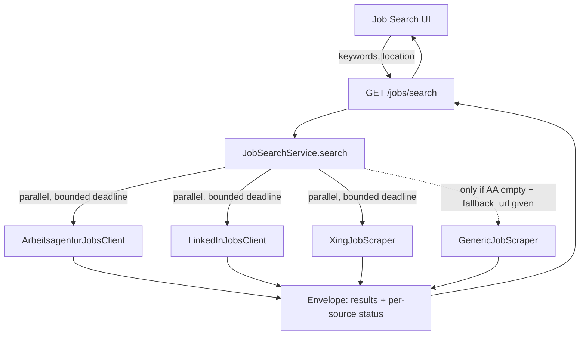

# Job Search LinkedIn and Xing Coverage - Plan

## Goal Capsule

- **Objective:** Expand the application's job search so it automatically covers LinkedIn and Xing job postings alongside the existing Arbeitsagentur source, in one unified search, returning direct links to the real postings.
- **Product authority:** No `STRATEGY.md` exists for this repo; the `ce-brainstorm` dialogue with the user (2026-08-12) is the product authority for this scope.
- **Execution profile:** Code. Backend: Python/FastAPI (`backend/`). Frontend: Angular standalone components (`frontend/`).
- **Stop conditions:** Stop and ask if Xing's anonymous access turns out to be fully CAPTCHA-walled rather than just geo-limited (the plan's "unavailable" labeling assumes ordinary blocking/timeouts, not an interactive challenge). Stop and ask if any existing consumer of `GET /jobs/search`'s current bare-list response is found beyond this repo's own frontend (none is expected).
- **Open blockers:** None.

## Product Contract

### Summary

Job search automatically pulls matching openings from LinkedIn and Xing alongside the existing Arbeitsagentur results, in the same search the user already uses — so a search returns a direct link to the real posting instead of the user digging through each platform's own redirects by hand.

### Problem Frame

The application's job search today only covers the Bundesagentur für Arbeit API as an automatic source. The existing `GenericJobScraper` can already extract structured postings from an arbitrary job-board page, but only as a manual fallback the user has to trigger by pasting a specific results URL — and only when Arbeitsagentur returns zero hits. To check LinkedIn or Xing today, the user visits those platforms directly, runs the search there, and clicks through each result's own chain of intermediate pages before reaching the actual application page. That manual, repetitive detour is the friction this plan removes.

### Key Decisions

- KD1. **Auto-query LinkedIn and Xing as first-class sources, not a manual paste-a-URL fallback** (session-settled: user-directed — chosen over a generalized "paste a search URL" flow and over skipping these platforms in favor of only-API-based boards: the user wants one search box to cover everything and accepts the ToS/blocking risk that comes with querying platforms that expose no public search API). Governs R1.
- KD2. **Anonymous access only — no LinkedIn/Xing login or session** (session-settled: user-directed — chosen over using the user's own logged-in session for fuller results: protects the personal account from being flagged or restricted for automated access). Governs R2.
- KD3. **Partial, per-source-labeled results rather than wait-for-all or silent merge** (session-settled: user-directed — chosen over blocking the whole search until every source responds, or merging silently with no indication of failures: keeps the search responsive and transparent when a source is slow or blocked). Governs R5.
- KD4. **Build Xing anyway, despite its anonymous access being Germany-only and this deployment's egress not being in Germany** (session-settled: user-directed — chosen over descoping Xing this round or adding a German proxy: the user wants it ready to work if hosting or network conditions change, accepting that Xing will likely show as unavailable most or all of the time in the current deployment). Governs R1.

### Requirements

**Search Coverage**
- R1. Job search automatically queries LinkedIn and Xing search results, in addition to the existing Arbeitsagentur source, for every search (keyword plus optional location) — no manual URL paste required.
- R2. LinkedIn and Xing access is anonymous — queries use only publicly reachable, logged-out search pages, with no stored credentials or session.
- R3. Each result links directly to the actual job posting or application page on its source platform, not to a search-results stub or an intermediate redirect page.

**Result Delivery & Reliability**
- R4. Results from all three sources merge into a single result list, tagged by source platform (consistent with the existing `source_platform` field).
- R5. Results from a source appear as soon as that source responds rather than waiting for the slowest source; when a source errors, times out, or returns zero results, that source is labeled as unavailable/empty rather than silently omitted.

### Key Flows

- F1. Unified multi-source search
  - **Trigger:** User submits a keyword (and optional location) in the job search form.
  - **Steps:** App queries Arbeitsagentur, LinkedIn, and Xing; each source's results populate the list as that source responds; a source that errors, times out, or returns nothing is labeled rather than omitted.
  - **Outcome:** User sees one merged, source-tagged result list where every entry links to the real posting.
  - **Covers:** R1, R2, R3, R4, R5.

### Acceptance Examples

- AE1. **Covers R5.** Given a search for "Angular" in Berlin, when Arbeitsagentur and Xing return results but the LinkedIn request times out, then the response includes the Arbeitsagentur and Xing results plus a label that LinkedIn was unavailable — the search does not block on LinkedIn nor omit the note.
- AE2. **Covers R3.** Given a posting found via LinkedIn, when the user opens its link, then it opens the actual job/application page — not a LinkedIn search-results page or an intermediate redirect page.
- AE3. **Covers R2.** Given no LinkedIn/Xing credentials are configured anywhere in the app, when the app queries those sources, then it reaches only publicly reachable, logged-out search pages.

### Scope Boundaries

Deferred for later:
- Cross-platform duplicate detection (the same posting surfaced by more than one source) — results are not de-duplicated across sources in this scope.
- Coverage beyond LinkedIn and Xing — the architecture should not preclude adding more sources later, but none beyond these two are built now.
- A source-toggle UI letting the user choose which sources to query per search.
- Background or cached refresh of results (queued/streamed search rather than a synchronous per-search fetch, or persisting past results between searches). This does not cover per-client resilience such as a rate-limit cooldown (see KTD5) — that is outbound-request backoff, not result caching.
- Any data-quality signal on scraped (as opposed to Arbeitsagentur API) results before saving — a thin `description_text` from LinkedIn/Xing saves the same as today.

### Dependencies / Assumptions

- Neither LinkedIn nor Xing publishes an official public search API; both integrations rely on undocumented or DOM-scraped surfaces that can change without notice (see Planning Contract Sources for the specific endpoints/behavior confirmed during planning).
- Xing's anonymous access is confirmed Germany-only; this deployment's egress is confirmed not in Germany (per KD4), so Xing is expected to show as unavailable most of the time in practice until that changes.

### Sources / Research

- Existing multi-source orchestration: `backend/app/services/job_search_service.py` (`ArbeitsagenturJobsClient`, `GenericJobScraper`, `JobSearchService`).
- Existing generic extraction approach (JSON-LD `schema.org/JobPosting` plus heuristic HTML), already used as the manual fallback path: `backend/app/services/job_search_service.py:139-324`.
- Search API route: `backend/app/api/jobs.py:13-30`.
- Frontend search form/UI: `frontend/src/app/pages/job-search/job-search.component.ts`, `frontend/src/app/pages/job-search/job-search.component.html`, `frontend/src/app/core/services/job.service.ts`.
- Precedent for external-source instability: the Arbeitsagentur client already needed a schema/version update (`v4` → `v6`, see the currently uncommitted change to `backend/app/services/job_search_service.py`) when the API's response shape changed — expect comparable or greater maintenance need for LinkedIn/Xing, since neither exposes a documented API.

---

## Planning Contract

Product Contract preservation: unchanged, plus one added Key Decision (KD4) — no R-ID scope change.

### Key Technical Decisions

- KTD1. **Concurrent fan-out with a bounded per-search deadline, not streaming.** `JobSearchService.search()` fans out to Arbeitsagentur, LinkedIn, and Xing concurrently via a `ThreadPoolExecutor` created fresh for that one `.search()` call (`max_workers=3`, one per primary client) — route handlers stay synchronous `def`, matching the rest of the FastAPI app; no `async def`/`asyncio` precedent exists anywhere in this backend to build on instead. The call waits up to a fixed ceiling; any client not finished by the deadline is marked `unavailable` (timed out) in that same response. Because FastAPI already runs each sync `def` route handler in its own worker thread, this executor is a *second*, nested pool: one search briefly holds 1 (FastAPI's own worker) + up to 3 (this executor's workers) threads for the deadline's duration. Accepted as reasonable at this app's single-user scale; not bounded further, since a shared/module-level executor would add lifecycle complexity this scale doesn't need. Executor teardown must not block the request thread on an already-timed-out future — `Future.result(timeout=...)` raises without cancelling the underlying call, so the executor is closed without a blocking `shutdown(wait=True)` in the request path (e.g. `shutdown(wait=False)`), otherwise a slow Xing render would silently re-introduce the "block on the slowest source" behavior this KTD exists to avoid. (session-settled: user-approved — chosen over adding SSE/streaming infrastructure: no streaming precedent exists anywhere in this codebase, and a bounded wait already satisfies "never block indefinitely on a slow source.") Governs R1, R4, R5.
- KTD2. **New search response envelope.** `GET /jobs/search` returns a `{ results, sources }` shape — a list of offers plus a per-source status list — instead of a bare `list[JobOfferCreate]`. Accepted as a breaking change to the endpoint's response shape; the only known consumer is this repo's own frontend (Stop condition above covers the case that assumption is wrong). Governs R4, R5.
- KTD3. **New source-client modules alongside the existing pattern.** `LinkedInJobsClient` and `XingJobScraper` are added as new classes in a new `backend/app/services/job_sources/` package, following the constructor/`.search()` shape already established by `ArbeitsagenturJobsClient`/`GenericJobScraper` in `backend/app/services/job_search_service.py`. The existing classes and file are left as they are — an accepted, deliberate inconsistency (new sources live in `job_sources/`, pre-existing ones stay put) to avoid touching stable, working code; not a pattern to repeat for a 5th source without revisiting it. `JobSearchService` imports and orchestrates all four. **Dependency direction is one-way: `job_sources/` never imports from `job_search_service.py`.** Anything both need (the outbound user-agent string, Playwright launch logic) is duplicated in `job_sources/` rather than imported from the existing file — see KTD6 for the Playwright case. This avoids a circular import between the orchestrator module and the new package. Governs R1, R2, R3.
- KTD4. **LinkedIn client: guest search endpoint, no per-job detail fetch.** `LinkedInJobsClient` calls LinkedIn's public `jobs-guest/jobs/api/seeMoreJobPostings/search` endpoint (keyword/location query parameters; HTML-fragment response), and links each result to the `linkedin.com/jobs/view/{id}` URL already present in that fragment. (session-settled: user-approved — chosen over resolving each result through LinkedIn's separate JSON-LD detail page: an extra fetch per result would burn through LinkedIn's documented ~10-page anonymous rate-limit budget for no requirement this plan needs — R3 only requires a correct direct link, not a fuller description.) Governs R1, R3.
- KTD5. **LinkedIn result cap and rate-limit cooldown.** `LinkedInJobsClient` caps how many results it requests per search, and after a 429 response, skips calling LinkedIn for a short in-memory cooldown window, reporting status `unavailable (rate-limited)` during that window. **The cooldown timestamp is class-level (or module-level) state, not an instance attribute** — `get_job_search_service()` constructs a fresh `JobSearchService` (and, per KTD3, fresh source clients) on every request, with no caching like `get_settings()` uses, so instance-attribute state would silently reset every request and never actually cool down. This design also depends on the backend running as a single process (`Dockerfile`'s `uvicorn` has no `--workers` flag today) — multiple worker processes would each keep independent cooldown state and multiply LinkedIn's exposure; if that ever changes, this cooldown needs to move to shared storage. (session-settled: user-approved — chosen over no client-side resilience: LinkedIn's anonymous IP budget is documented at roughly 10 pages before a 429; without a cooldown, a single search session degrades LinkedIn for every subsequent search until the process restarts. This is outbound-request resilience, distinct from the deferred "background or cached refresh of results" scope boundary, which covers caching search results rather than backing off a rate-limited client.) Governs R5.
- KTD6. **Xing client: Playwright DOM scraping, self-contained.** `XingJobScraper` renders `xing.com/jobs/search` via a Playwright launch implemented directly in `job_sources/xing.py` — mirroring the structure of `GenericJobScraper._fetch_with_playwright` (`backend/app/services/job_search_service.py:196-219`) rather than importing it, per KTD3's one-way dependency rule — and extracts results by CSS selector against the rendered page (no JSON-LD or guest API exists for Xing). The Playwright call carries its own inner timeout, derived from (and never exceeding) KTD8's per-search deadline setting: `ThreadPoolExecutor`'s outer timeout only stops *waiting* on a slow render (KTD1), it does not cancel the browser process, so without an inner timeout a hung Xing render keeps a worker thread and a live Chromium process running past the point the response was already sent. A process-wide semaphore (small, e.g. 1-2 permits) guards concurrent Xing/Playwright launches specifically, so a double-tab or double-click burst queues briefly on the one expensive resource instead of spawning unbounded Chromium instances — Arbeitsagentur and LinkedIn (plain HTTP calls) are not limited by this semaphore. Governs R1, R3.
- KTD7. **Minimal backend test infrastructure added.** No pytest, test dependencies, or CI exist in this repo today (`backend/requirements.txt` has none, no `.github/workflows/`). Add `pytest`, `pytest-mock`, `requests-mock`, and `httpx` (required by FastAPI's `TestClient`) to `backend/requirements.txt`, plus a `backend/tests/` tree with a shared `conftest.py`. Sized to this plan's own test scenarios, not a general test-suite backfill. Governs test scenarios in U2-U5.
- KTD8. **Per-source config follows the existing `Settings` pattern, with named fields rather than inline magic numbers.** Add to `backend/app/core/config.py`'s `Settings` class and `backend/.env.example`, matching the existing `ARBEITSAGENTUR_*` grouping: a per-search deadline (KTD1), a LinkedIn per-search result cap and cooldown duration (KTD5) — default the cooldown to a conservative several minutes given LinkedIn's ~10-request anonymous budget — and LinkedIn/Xing enable flags. (Note for the implementer: the existing `ArbeitsagenturJobsClient` declares settings in `Settings` but doesn't actually read them — new clients should read their own config rather than repeating that gap.) Governs R1, R2.
- KTD9. **`fallback_url` on `GET /jobs/search` kept unchanged.** It remains available for job boards outside LinkedIn/Xing/Arbeitsagentur; this feature doesn't supersede or remove it.

### High-Level Technical Design



Each of the three primary clients (AA, LinkedIn, Xing) runs concurrently under KTD1's bounded deadline; a client that errors, times out, or hits LinkedIn's cooldown (KTD5) contributes a `status: unavailable` entry instead of failing the whole request. The existing `GenericJobScraper` fallback path is untouched and still fires only when Arbeitsagentur returns zero results and a `fallback_url` is supplied.

### Sources / Research (Planning)

- LinkedIn's public guest search surface, query parameters, HTML-fragment shape, and documented ~10-page/429 anonymous rate limit; Xing's lack of a guest API/JSON-LD and reliance on rendered-DOM scraping; Xing's Germany-only anonymous access and ~200-result cap — gathered via web research during planning (scrapfly.io's 2026 LinkedIn scraping guide; `spinlud/linkedin-jobs-scraper` and `obetzlitkinp/xing-jobs-scraper` READMEs on GitHub; LinkedIn's 2025 Proxycurl lawsuit as a live legal-risk signal).
- Confirmed via repo research: zero concurrency primitives (`asyncio`/`threading`) anywhere in the backend; zero backend tests/CI; `backend/Dockerfile` already runs `playwright install --with-deps chromium`; `source_platform` is free-text (no migration needed for new values); `ArbeitsagenturJobsClient` doesn't read the `Settings` it's declared alongside; `get_job_search_service()` constructs a fresh `JobSearchService` per request with no caching; the backend's `uvicorn` runs single-process (no `--workers` flag).

### System-Wide Impact

- **First concurrency-bearing code in this backend.** Every other route and service in `backend/app` is fully synchronous with no threading/asyncio. `ThreadPoolExecutor` (KTD1) and a semaphore (KTD6) are the first concurrency primitives introduced; they set precedent for how the next concurrent workflow gets built here, not just this feature's own footprint.
- **Breaking change to `GET /jobs/search`'s response shape** (KTD2): callers must read `{results, sources}` instead of a bare list. The only known consumer is this repo's own `JobService`/`job-search.component.ts` (updated together in U5-U7); see the Goal Capsule's stop condition if another consumer is ever found.
- **New package precedent.** `job_sources/` (KTD3) is the first subpackage under `backend/app/services/`; its one-way dependency rule (never import from `job_search_service.py`) is a boundary future source additions should keep following.
- **Deployment-shape dependency.** KTD5's rate-limit cooldown and the executor sizing in KTD1 both assume the current single-process, single-worker deployment (`docker-compose.yml`'s `backend` service, no `--workers`). Scaling the backend horizontally later would need both revisited.

### Risks & Dependencies

- **External page-structure drift (LinkedIn, Xing).** Both integrations rely on undocumented/unofficial surfaces (LinkedIn's guest endpoint, Xing's rendered DOM) that can change without notice — mitigation: the existing defensive per-record `try`/`except` pattern (already used by `ArbeitsagenturJobsClient`) isolates a single bad record; a structural change to either site degrades that source to `unavailable` (R5) rather than breaking the whole search, but will need a manual fix when it happens, same as the Arbeitsagentur `v4`→`v6` precedent.
- **Legal/ToS exposure.** LinkedIn actively enforces against scraping at commercial scale (2025 Proxycurl lawsuit and shutdown) — accepted at this app's personal, low-volume, anonymous scale per KD1/KD2, but not a risk that disappears; no additional mitigation planned beyond staying anonymous and rate-limit-respecting (KTD5).
- **Rate-limit/blocking risk (LinkedIn).** Mitigated by KTD5's cap and cooldown; residual risk is the cooldown resetting if the deployment ever moves to multiple worker processes (see System-Wide Impact).
- **Resource risk (Xing/Playwright under concurrent requests).** Mitigated by KTD6's per-launch semaphore; residual risk is a hung Playwright render outliving its inner timeout under a Playwright-library defect — no further mitigation planned at this scale.
- **Xing's practical availability.** Accepted per KD4 — likely `unavailable` most of the time from this deployment's non-German egress; not a build risk, a known-accepted outcome.

---

## Implementation Units

### U1. Backend test infrastructure

- **Goal:** Add minimal pytest-based tooling so every unit below has a place to put runnable tests — none exists in this repo today.
- **Requirements:** Supports test scenarios for R1-R5 across U2-U5.
- **Dependencies:** None.
- **Files:**
  - `backend/requirements.txt` (add `pytest`, `pytest-mock`, `requests-mock`, `httpx`)
  - `backend/pytest.ini` (new — test discovery config)
  - `backend/tests/__init__.py`, `backend/tests/conftest.py` (new)
- **Approach:**
  1. Add the four packages to `backend/requirements.txt` under a new `# --- Testing ---` section, mirroring the file's existing category-comment style.
  2. Add a minimal `pytest.ini` pointing test discovery at `tests/`.
  3. Add `conftest.py` with any shared fixtures the clients below need (e.g., a `requests_mock` fixture is provided by the `requests-mock` pytest plugin itself, so `conftest.py` may stay minimal).
- **Patterns to follow:** `backend/requirements.txt`'s existing category-comment grouping (KTD7).
- **Test scenarios:** Test expectation: none -- pure tooling/config addition, no behavior to test.
- **Verification:** `cd backend && pip install -r requirements.txt && pytest --collect-only` succeeds with zero errors (even with zero tests collected yet).

### U2. LinkedIn source client

- **Goal:** A `LinkedInJobsClient` that searches LinkedIn's public guest endpoint and returns harmonized `JobOfferCreate` results, per KTD3-KTD5.
- **Requirements:** R1, R2, R3, R5.
- **Dependencies:** U1.
- **Files:**
  - `backend/app/services/job_sources/__init__.py` (new)
  - `backend/app/services/job_sources/linkedin.py` (new)
  - `backend/tests/services/job_sources/test_linkedin.py` (new)
- **Approach:**
  1. Constructor/`.search(keywords, location=None)` shape mirrors `ArbeitsagenturJobsClient` (see `backend/app/services/job_search_service.py:66-110`).
  2. Request LinkedIn's guest endpoint with keyword/location query params; parse the HTML-fragment response with BeautifulSoup (same library already in `requirements.txt`).
  3. Build each `JobOfferCreate` with `source_url` taken directly from the fragment's own job link (KTD4) and `source_platform="linkedin"`.
  4. Cap requested results per search and track a cooldown timestamp at class or module scope (not `self`) — a fresh `LinkedInJobsClient` is constructed per request (KTD3), so instance-attribute state would never persist a cooldown. On HTTP 429, set the cooldown and return an empty list; on a subsequent call inside the cooldown window (even from a newly constructed instance), skip the request entirely (KTD5).
  5. Catch `requests.RequestException` the same defensive way `ArbeitsagenturJobsClient.search` does — a single bad record or request failure never raises past `.search()`.
- **Patterns to follow:** `ArbeitsagenturJobsClient`'s defensive `.get()`-with-fallback parsing and `try`/`except requests.RequestException` shape (`backend/app/services/job_search_service.py:85-110`).
- **Test scenarios:**
  - Happy path: a mocked guest-endpoint HTML fragment with two job cards returns two `JobOfferCreate` items tagged `source_platform="linkedin"`.
  - Edge: a fragment with zero job cards returns an empty list, not an error.
  - Covers AE2. Integration: each returned `source_url` is the `linkedin.com/jobs/view/{id}` link taken from the fragment, not a second network call.
  - Error path: the request raises `requests.RequestException` → returns an empty list without raising.
  - Error path: the request returns HTTP 429 → returns an empty list and records the cooldown.
  - Cooldown: a second `.search()` call made while the cooldown is active skips the HTTP request and returns an empty list immediately (assert the mocked request was not called a second time).
  - Cooldown persists across instances: construct a *second, separate* `LinkedInJobsClient` instance after a 429 on the first, and assert the cooldown still applies (proves the state is class/module-level, not per-instance — this is the scenario a naive `self._cooldown_until` implementation would fail).
- **Verification:** `pytest backend/tests/services/job_sources/test_linkedin.py` passes.

### U3. Xing source client

- **Goal:** A `XingJobScraper` that renders Xing's job search page via Playwright and returns harmonized `JobOfferCreate` results, per KTD6.
- **Requirements:** R1, R2, R3, R5.
- **Dependencies:** U1.
- **Files:**
  - `backend/app/services/job_sources/xing.py` (new)
  - `backend/tests/services/job_sources/test_xing.py` (new)
- **Approach:**
  1. Constructor/`.search(keywords, location=None)` shape matches U2 and the existing clients.
  2. Implement Playwright launch/render logic directly in `xing.py`, mirroring the structure of `GenericJobScraper._fetch_with_playwright` (`backend/app/services/job_search_service.py:196-219`) rather than importing it — `job_sources/` never imports from `job_search_service.py` (KTD3), so this is a small, deliberate duplication, not a shared helper.
  3. Pass an explicit inner timeout to the Playwright call, sourced from the same per-search-deadline setting `JobSearchService` uses (KTD8) so the render can never run meaningfully longer than the orchestrator is willing to wait for it (KTD6).
  4. Acquire the process-wide Xing semaphore (KTD6) before launching the browser, release it after; this bounds concurrent Chromium instances under a double-tab/double-click burst without limiting the cheap HTTP-based clients.
  5. Extract job cards from the rendered DOM by CSS selector (no JSON-LD available for Xing, per KTD6); build `JobOfferCreate` with `source_platform="xing"` and `source_url` from each card's own link to the Xing job detail page.
  6. Same defensive error handling as U2: a Playwright launch/navigation failure or inner timeout returns an empty list rather than raising.
- **Patterns to follow:** `GenericJobScraper`'s two-tier extraction shape and defensive Playwright error handling (`backend/app/services/job_search_service.py:196-324`).
- **Test scenarios:**
  - Happy path: a mocked rendered-DOM HTML with job cards returns matching `JobOfferCreate` items tagged `source_platform="xing"`.
  - Edge: a page with zero job cards returns an empty list.
  - Covers AE2. Integration: each returned `source_url` is the job's own Xing detail-page link from the DOM, not the search-results page URL.
  - Error path: a simulated Playwright navigation/launch failure (e.g., raised exception, standing in for a geo-block or network failure) returns an empty list without raising.
  - Error path: a simulated Playwright call that exceeds the inner timeout is treated the same as a launch failure — empty list, no unhandled exception, no hang.
  - Concurrency: two concurrent `.search()` calls (e.g. via threads in the test) serialize on the Xing semaphore rather than both launching a browser at once — assert the semaphore is held/released around the launch, not the whole method.
- **Verification:** `pytest backend/tests/services/job_sources/test_xing.py` passes.

### U4. Concurrent orchestration and response envelope

- **Goal:** Rework `JobSearchService.search()` to fan out to Arbeitsagentur, LinkedIn, and Xing concurrently with a bounded deadline, and return the new `{ results, sources }` envelope, per KTD1-KTD2.
- **Requirements:** R1, R2, R4, R5.
- **Dependencies:** U2, U3.
- **Files:**
  - `backend/app/schemas/job_offer.py` (add the new envelope schema, e.g. a `JobSearchResponse` model with `results: list[JobOfferCreate]` and `sources: list[SourceStatus]`)
  - `backend/app/services/job_search_service.py` (rework `JobSearchService.search`)
  - `backend/tests/services/test_job_search_service.py` (new)
- **Approach:**
  1. Add the envelope schema(s) to `job_offer.py` alongside the existing `JobOfferCreate`/`JobOfferRead` (KTD2).
  2. Rework `JobSearchService.__init__` to also accept/construct `LinkedInJobsClient` and `XingJobScraper` (KTD3), keeping `ArbeitsagenturJobsClient`/`GenericJobScraper` construction unchanged.
  3. Rework `.search()` to submit all three primary clients to a `ThreadPoolExecutor` created fresh for that call (`max_workers=3`), collect results up to the configured deadline (KTD8's setting), and build the envelope: a client that raises, times out, or returns empty contributes `status: unavailable` (with a short reason where known — timeout vs. rate-limited vs. error); a client with results contributes `status: ok`. Close the executor without a blocking `shutdown(wait=True)` in the request path (KTD1) — a timed-out future must not make the response wait for it to actually finish.
  4. Preserve the existing `GenericJobScraper` fallback trigger (only when Arbeitsagentur returns zero and `fallback_url` is given) as an addition to the envelope, not a replacement path.
  5. Never construct or pass a credential/session object to any of the three new-or-existing outbound clients (R2/AE3).
- **Technical design:** Directional only — not implementation-specified.
  ```
  # NOT `with ThreadPoolExecutor(...) as executor:` — that context manager's
  # own __exit__ calls shutdown(wait=True), which would block on exactly the
  # timed-out future this design exists to not wait for.
  executor = ThreadPoolExecutor(max_workers=3)
  deadline = monotonic() + configured_deadline_seconds  # captured once, per KTD8's setting
  futures = { source_name: executor.submit(client.search, keywords, location)
              for source_name, client in primary_clients }
  results, sources = [], []
  for source_name, future in futures:
      try:
          offers = future.result(timeout=max(0, deadline - monotonic()))
          results += offers
          sources.append(status_ok_or_unavailable(source_name, offers))
      except TimeoutError:
          sources.append(status_unavailable(source_name, reason="timeout"))
      except Exception:
          sources.append(status_unavailable(source_name, reason="error"))
  executor.shutdown(wait=False)
  ```
- **Patterns to follow:** The existing per-record defensive try/except in `ArbeitsagenturJobsClient.search` (`backend/app/services/job_search_service.py:105-109`) — the same isolation principle applies per-source now, not just per-record.
- **Test scenarios:**
  - Happy path: all three primary clients return results within the deadline → envelope has combined `results` and every source `status: ok`.
  - Covers AE1. Timeout: the LinkedIn client is simulated to exceed the deadline → its status is `unavailable` (timeout reason) and the envelope still returns promptly with the other two sources' results.
  - Timeout returns promptly: assert wall-clock time for the above scenario is close to the configured deadline, not the (longer) simulated client duration — proves teardown doesn't block on the abandoned future.
  - Error isolation: one client raises an unexpected exception → that source's status is `unavailable`; the other sources' results are unaffected.
  - Covers AE3. Anonymous-only: assert no client is ever constructed with or passed a credential, cookie, or session argument.
  - Regression: the existing `GenericJobScraper` fallback still only triggers when Arbeitsagentur returns zero results and `fallback_url` is supplied, and is unaffected by the new sources' presence.
- **Verification:** `pytest backend/tests/services/test_job_search_service.py` passes.

### U5. API route: new response envelope

- **Goal:** `GET /jobs/search` returns the new envelope shape; `POST /jobs/save` and `GET /jobs/{id}` stay behaviorally unchanged.
- **Requirements:** R4, R5.
- **Dependencies:** U4.
- **Files:**
  - `backend/app/api/jobs.py` (update `search_jobs`'s `response_model` and return value)
  - `backend/tests/api/test_jobs.py` (new)
- **Approach:**
  1. Change `search_jobs`'s `response_model` to the new envelope schema from U4 and return `service.search(...)` as-is (the service now returns the envelope).
  2. `save_job` and `get_job` are untouched — they operate on `JobOfferCreate`/`JobOffer`, which don't change shape.
- **Patterns to follow:** Existing route structure in `backend/app/api/jobs.py:13-57`.
- **Test scenarios:**
  - `GET /jobs/search?keywords=Angular` returns HTTP 200 with both `results` and `sources` present in the body, using FastAPI's `TestClient`.
  - Regression: `POST /jobs/save` and `GET /jobs/{id}` behavior is unchanged (existing 201/409/404 cases still hold).
- **Verification:** `pytest backend/tests/api/test_jobs.py` passes.

### U6. Frontend: envelope-aware model and service

- **Goal:** `JobService.searchJobs()` and the job-offer model understand the new `{ results, sources }` envelope.
- **Requirements:** R4, R5.
- **Dependencies:** U4 (envelope shape finalized).
- **Files:**
  - `frontend/src/app/core/models/job-offer.model.ts` (add a source-status type and search-response type)
  - `frontend/src/app/core/services/job.service.ts` (update `searchJobs()`'s return type and mapping)
  - `frontend/src/app/core/services/job.service.spec.ts` (new, if not already present)
- **Approach:**
  1. Add a `SourceStatus` type (`platform`, `status`, optional `message`) and a `JobSearchResponse` type (`results`, `sources`) to `job-offer.model.ts`.
  2. Update `JobService.searchJobs()`'s return type from `Observable<JobOffer[]>` to `Observable<JobSearchResponse>`; callers (U7) adapt.
- **Patterns to follow:** `JobService`'s existing `HttpClient`-based methods and `HttpClientTestingModule` test setup used elsewhere in the frontend (per repo research: applications-area spec files use the same `TestBed`/`HttpClientTestingModule` pattern).
- **Test scenarios:**
  - `searchJobs()` correctly passes through a mocked HTTP response matching the new envelope shape, using `HttpClientTestingModule`.
- **Verification:** `ng test` (via `npm test`) passes for the updated/new spec file.

### U7. Frontend: partial-result rendering

- **Goal:** The job search page shows merged results plus per-source availability, without wiping existing results when one source fails.
- **Requirements:** R1, R3, R4, R5.
- **Dependencies:** U6.
- **Files:**
  - `frontend/src/app/pages/job-search/job-search.component.ts`
  - `frontend/src/app/pages/job-search/job-search.component.html`
  - `frontend/src/app/pages/job-search/job-search.component.spec.ts`
- **Approach:**
  1. Replace the current binary `results`/`errorMessage` signal pair with state that can hold both partial `results` and a per-source status list from `JobSearchResponse` (KTD2).
  2. `onSearch()`'s error branch no longer wipes `results` unconditionally — a request-level failure (the whole HTTP call failing) still shows the existing error message; a normal response with some sources `unavailable` renders those sources' results as absent plus a small status indicator, not an error state. `onSearch()` resets the source-status signal to empty at the start of each new search, the same way it already resets `errorMessage` — otherwise a prior search's "unavailable" label could still be showing while the next search is in flight.
  3. Render each `unavailable` source as a small labeled note near the results (e.g., alongside the existing `mat-chip-set` source tagging already used per result).
  4. `onSaveJob`/`onGenerateApplication` behavior is unchanged — they operate on individual `JobOffer` objects regardless of source.
- **Patterns to follow:** The existing `job-search.component.ts` signal-based state shape and `job-search.component.html`'s `mat-chip-set` source tagging (`frontend/src/app/pages/job-search/job-search.component.html:64-66`).
- **Test scenarios:**
  - Happy path: a mocked response with all sources `ok` renders every result, matching current behavior.
  - Covers AE1. Partial failure: a mocked response where one source is `unavailable` still renders the other sources' results and shows a visible indicator for the unavailable one — `results` is not wiped.
  - Regression: `onSaveJob`/`onGenerateApplication` still work unchanged for a result from any of the three sources.
- **Verification:** `ng test` (via `npm test`) passes for `job-search.component.spec.ts`.

---

## Verification Contract

| Command | Applies to | Gate |
|---|---|---|
| `cd backend && pip install -r requirements.txt` | U1 | Test dependencies install cleanly |
| `cd backend && pytest` | U1-U5 | All backend tests pass |
| `cd frontend && npm test -- --watch=false` | U6-U7 | All frontend tests pass |
| Manual smoke: `docker-compose up`, search a common keyword (e.g. "Angular") in the job search page | U1-U7 | Response shows Arbeitsagentur, LinkedIn, and Xing each as either results or a visible "unavailable" label (Xing "unavailable" is expected per KD4); LinkedIn/Xing result links open real job/application pages, not search or redirect pages |
| Manual smoke: fire two searches in quick succession (two tabs, or double-click submit) | U3, U4 (Xing semaphore, KTD6) | Both searches complete; no crash, hang, or unhandled error from concurrent Xing/Playwright launches — unit tests mock Playwright and can't catch real thread/process concurrency issues |

## Definition of Done

- All Implementation Units (U1-U7) complete; each unit's own Verification passed.
- `GET /jobs/search` always returns the `{ results, sources }` envelope — never a bare list — and `POST /jobs/save`/`GET /jobs/{id}` are unchanged.
- The job search UI never wipes existing results because a different source failed (AE1's partial-failure behavior holds in the running app, not just in tests).
- Manual smoke check above passes.
- No credential, cookie, or session object is ever constructed or passed for LinkedIn or Xing anywhere in the diff (R2/AE3 holds by inspection, not just by test).
- No dead or experimental code remains from approaches that didn't pan out (e.g., no partial streaming/SSE scaffolding left behind from exploring KTD1's alternative).
