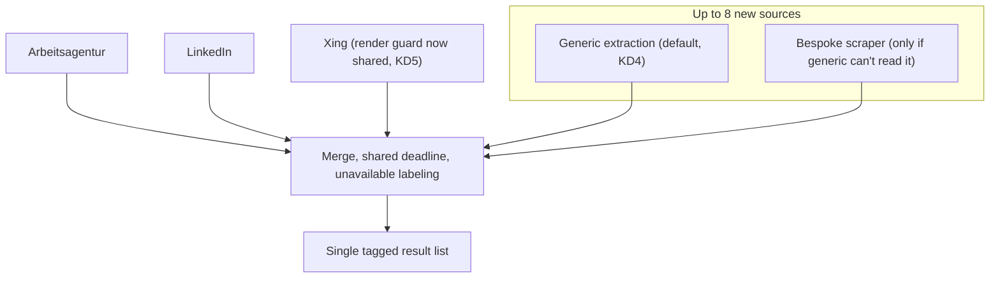

# Job Search Broader German Job-Board Coverage - Plan

## Goal Capsule

- **Objective:** Extend job search's automatic multi-source coverage beyond today's Arbeitsagentur/LinkedIn/Xing toward a broader, ongoing set of German tech/dev job boards, starting with up to 8 named sites: devjobs.de, Kimeta, Stepstone, GermanTechJobs, Indeed, Jobware, Programmiererjobboerse.de, and IT-Entwickler-Jobs.de.
- **Product authority:** No `STRATEGY.md` exists for this repo; the `ce-brainstorm` dialogue with the user (2026-08-24) is the product authority for this scope. Builds directly on the precedent set by `docs/plans/2026-08-12-001-feat-job-search-external-platforms-plan.md`, the prior brainstorm+plan that added LinkedIn and Xing.
- **Execution profile:** Code. Backend: Python/FastAPI (`backend/`). Frontend: Angular standalone components (`frontend/`) — label additions only.
- **Stop conditions:** Stop and ask if any of the 8 named sources turns out to have no anonymous, logged-out search surface at all (R2 requires anonymous access across every source, existing and new). Stop and ask if a source can't be read by either the shared generic-extraction path or a reasonable bespoke scraper within normal effort — that source is a candidate for deferral (KD1), not a reason to block the rest.
- **Open blockers:** None. Which of the 8 sources need bespoke scraping versus generic extraction is unresolved and intentionally deferred to planning (see Outstanding Questions).

---

## Product Contract

### Summary

Job search's automatic multi-source coverage grows from today's 3 sources to a broader set of German tech/dev job boards, starting with up to 8 named sites — each queried on every search and labeled unavailable rather than blocking the search or disappearing silently when unreachable. New sources default to a shared, generic extraction path instead of one-off scrapers, and the cross-cutting machinery every source relies on is consolidated instead of duplicated per source, closing debt the prior plan's own code explicitly flagged before it compounds further.

### Problem Frame

The existing multi-source job search (Arbeitsagentur, LinkedIn, Xing) already replaced most manual per-platform checking, but stops short of much of the German tech/dev job-board landscape — devjobs.de, Kimeta, Stepstone, GermanTechJobs, Indeed, Jobware, Programmiererjobboerse.de, and IT-Entwickler-Jobs.de are all still checked by hand today, if at all. Meanwhile, the code that added LinkedIn and Xing explicitly recorded that its per-source-client pattern — one bespoke class per platform, sharing nothing but duplicated boilerplate — was "not a pattern to repeat for a 5th source without revisiting it" (`docs/plans/2026-08-12-001-feat-job-search-external-platforms-plan.md`, KTD3). Growing from 3 sources to potentially 11+ is exactly the scale that warning anticipated.

### Key Decisions

- KD1. **Treat the named list as a representative starting set, not a fixed exact-8 requirement** (session-settled: user-directed — chosen over requiring all 8 to ship in this scope: the real goal is broader German tech/dev job coverage; a source proving infeasible can be deferred or swapped without blocking the rest, and more can be added later). Governs R1.
- KD2. **Attempt every named source with the same best-effort precedent Xing already set, regardless of scraping difficulty** (session-settled: user-directed — chosen over deprioritizing the highest-risk commercial platforms, Stepstone and Indeed, this round: consistency and future-readiness outweigh the near-certainty that some sources will show "unavailable" often, the same acceptance already made for Xing's Germany-only anonymous access). Governs R1, R5.
- KD3. **Keep the shared per-search deadline about what it is today rather than extending it as sources grow** (session-settled: user-directed — chosen over letting a search take noticeably longer to give new sources a fair shot: search responsiveness matters more than maximizing how many sources respond within any single search). Governs R5.
- KD4. **New sources default to shared generic extraction, with a bespoke scraper only where that path can't read a given site** (session-settled: user-directed — chosen over cloning today's one-bespoke-client-per-source pattern, and over generic-first without further change: minimizes new one-off scraper code across up to 8 sites). Governs R6.
- KD5. **Consolidate the cross-cutting machinery every source relies on into one shared layer instead of duplicating it per source** (session-settled: user-directed — directly answers KTD3's "not a pattern to repeat... without revisiting it," paying the duplication debt down once instead of compounding it across up to 8 more files; extends to folding Xing's existing render guard into the same shared layer). Governs R7.

### Requirements

**Search Coverage**
- R1. Job search automatically queries up to 8 additional named German tech/dev job boards (devjobs.de, Kimeta, Stepstone, GermanTechJobs, Indeed, Jobware, Programmiererjobboerse.de, IT-Entwickler-Jobs.de) alongside the existing Arbeitsagentur/LinkedIn/Xing sources, for every search. A source that proves infeasible to query anonymously and reliably may be deferred without blocking the rest (KD1).
- R2. Access to every new source is anonymous — no stored credentials, login, or session for any of them, matching the existing LinkedIn/Xing precedent.
- R3. Each result links directly to the actual job posting or application page on its source platform, not to a search-results stub or an intermediate redirect page.

**Result Delivery & Reliability**
- R4. Results from all sources, existing and new, merge into the single existing result list, tagged by source platform.
- R5. A source's results appear as soon as that source responds; a source that errors, times out, or returns nothing is labeled unavailable (with a reason where known) rather than silently omitted, and the overall search does not wait meaningfully longer than it does today to accommodate the additional sources (KD2, KD3).

**Extraction Approach**
- R6. Each new source is first attempted through the shared generic-extraction path; a source gets dedicated scraping logic only once the generic path is confirmed unable to read it (KD4).
- R7. The outbound-request identity, render/resource guarding (including Xing's existing browser-launch guard), deadline participation, and per-source enable/disable flag are implemented once and shared across every source rather than redeclared per source (KD5).

### Key Flows

- F1. Unified multi-source search, extended
  - **Trigger:** User submits a keyword (and optional location) in the job search form.
  - **Steps:** App queries Arbeitsagentur, LinkedIn, Xing, and every enabled new source concurrently within the shared deadline; each source's results populate the list as that source responds; a source that errors, times out, or returns nothing is labeled unavailable rather than omitted.
  - **Outcome:** User sees one merged, source-tagged result list spanning up to 11 sources, where every entry links to the real posting.
  - **Covers:** R1, R2, R3, R4, R5.

### Acceptance Examples

- AE1. **Covers R5.** Given a search for "Angular" in Berlin, when Arbeitsagentur, LinkedIn, and 3 of the new sources return results but Stepstone and 2 other new sources time out or error, then the response includes every source that responded plus an unavailable label for each that didn't — the search does not block on the slow/failed sources nor wait meaningfully longer than an equivalent search today.
- AE2. **Covers R6.** Given a new source whose postings are readable via the shared generic-extraction path, when that source is queried, then no dedicated scraper is written for it — it participates purely through the shared path.
- AE3. **Covers R2.** Given no credentials are configured anywhere in the app for any of the new sources, when the app queries them, then it reaches only publicly reachable, logged-out pages.
- AE4. **Covers R1.** Given one of the 8 named sources turns out to have no reliable anonymous search surface at all, when that is discovered, then that source is deferred out of this scope rather than blocking delivery of the others.

### Scope Boundaries

Deferred for later:
- Source-toggle UI letting the user choose which sources to query per search — carried forward from the prior plan's deferral, now covering the additional sources too.
- Cross-source duplicate detection — carried forward from the prior plan's deferral. Worth revisiting once this ships: Kimeta is itself a job meta-search engine that aggregates other boards, so duplicate postings across sources are materially more likely at this source count than at 3.
- Extending the shared per-search deadline to give new sources more time to respond (KD3) — search responsiveness is prioritized over maximizing per-search source coverage.
- Any data-quality signal on scraped (as opposed to Arbeitsagentur API) results before saving — a thin `description_text` from a generically-extracted or scraped source saves the same as it does for LinkedIn/Xing today.
- Risk-based deprioritization of any named source based on scraping difficulty or platform size (KD2) — every named source gets the same best-effort attempt.

### Dependencies / Assumptions

- None of the 8 named sources are known to publish an official public search API; all integrations are expected to rely on undocumented endpoints or DOM/HTML extraction that can change without notice, the same as the existing LinkedIn/Xing precedent.
- Large commercial platforms among the 8 (Stepstone, Indeed) carry a similar scraping-enforcement risk profile to the one already accepted for LinkedIn (the 2025 Proxycurl lawsuit noted in the prior plan's research) — accepted at this app's personal, low-volume, anonymous scale, consistent with KD2.
- Which of the 8 named sources the shared generic-extraction path can read versus which need dedicated scraping logic is not yet known — determining this per source is planning/implementation-time research, not resolved here.
- Any of the 8 sources that turn out to need JS-rendered/headless-browser access are assumed to share the same consolidated render/resource guard this plan introduces (R7), rather than each maintaining an independent one.

### Outstanding Questions

Deferred to Planning:
- Which of the 8 named sources can be served by the shared generic-extraction path (R6) versus needing dedicated scraping logic, and whether any turn out to have no reliable anonymous search surface at all (R1, AE4) — requires checking each site's actual markup/behavior.
- How Xing's existing browser-launch guard folds into the shared resource-guarding layer (R7) without changing Xing's own search behavior.

### Sources / Research

- `docs/plans/2026-08-12-001-feat-job-search-external-platforms-plan.md` — prior brainstorm+plan that added LinkedIn/Xing; source of KD2's Xing precedent, KD3/KD5's KTD3 "not a pattern to repeat" flag, the deferred source-toggle-UI and duplicate-detection scope boundaries, and the LinkedIn/Proxycurl legal-risk research this plan's Dependencies/Assumptions extends to Stepstone/Indeed.
- `backend/app/services/job_search_service.py` — existing orchestration (shared deadline, per-source status labeling) and `GenericJobScraper`'s two-tier extraction (`schema.org/JobPosting` JSON-LD, then heuristic HTML) that R6 builds on.
- `backend/app/services/job_sources/` — existing per-source client pattern (`linkedin.py`, `xing.py`) and its explicit one-way-dependency/duplication convention that R7 revisits.
