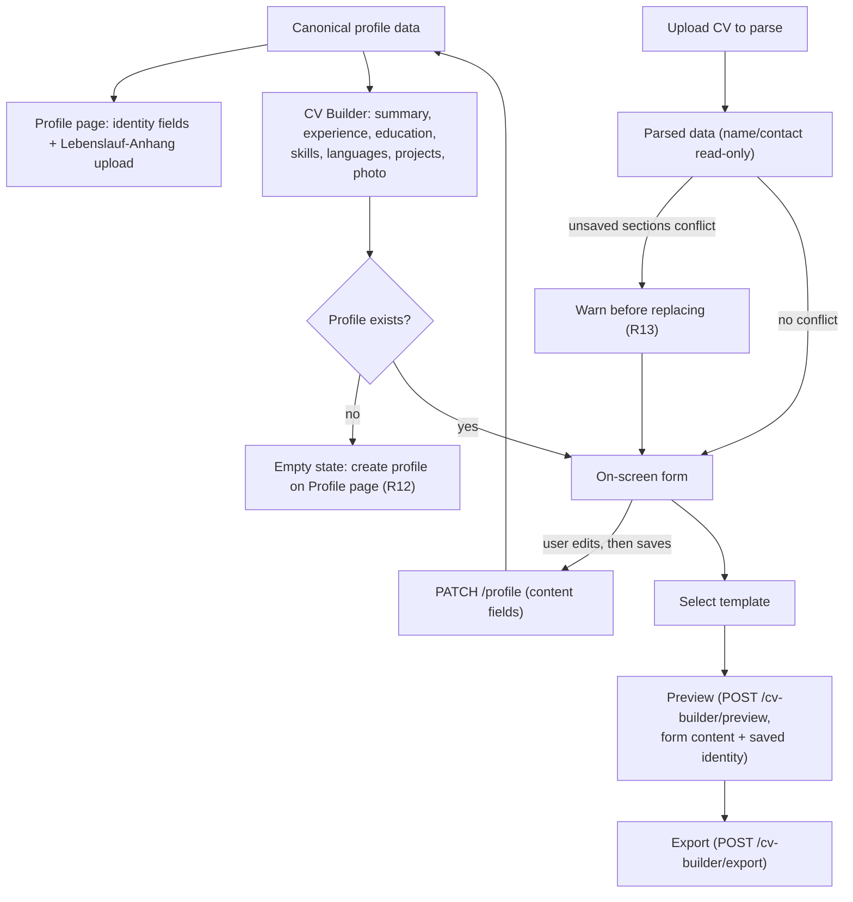
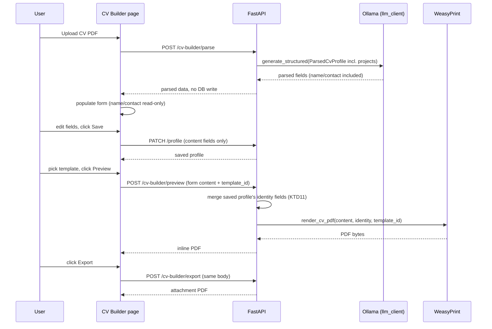

# CV Builder & Editor - Plan

## Goal Capsule

- **Objective:** Add a new top-level "CV Builder" section where the user edits their full CV content (summary, experience, education, skills with proficiency, languages with proficiency, projects, photo), imports a CV via AI-assisted parsing with a review step before anything saves, picks from a small set of visual templates, previews on demand, and exports a PDF.
- **Product authority:** The Product Contract below is authoritative for behavior. **Product Contract preservation: extended, no scope change to prior decisions** — R1-R11 and all seven labeled Key Decisions carry forward unchanged; R5 is unchanged in wording but is now actually deliverable (U3 extends the parse schema to cover projects, closing a gap doc-review found); R12-R14 are new requirements filling gaps planning found (bootstrap state, re-import safety, unsaved-navigation safety) that directly serve the already-settled review-before-save intent. See KTD1, KTD2, KTD9, KTD14 for the planning-time reasoning.
- **Stop conditions:** Stop and ask before overriding a labeled Key Decision or KTD below if implementation shows it is technically infeasible. Stop if a unit's scope would need to grow into product-behavior territory not covered by a Requirement.
- **Execution profile:** `execution: code`. Backend: FastAPI, SQLAlchemy, Alembic, pytest. Frontend: Angular 17 (standalone components, signals, reactive forms), Karma/Jasmine. Docker Compose for local integration testing.
- **Tail ownership:** Implementer runs `pytest` (backend) and `ng test` (frontend), plus a manual Docker Compose rebuild-and-click-through pass (see Verification Contract). This plan prescribes no PR/branch/deploy sequencing.
- **Open blockers:** None.

## Product Contract

### Summary

Add a "CV Builder" section that becomes the single place to edit CV content and turn it into a polished, exportable PDF via a small set of visual templates. It replaces the Profile page's content-editing tabs (experience, education, skills, and the old AI CV-Import tab) and extends the profile's data with a photo, proficiency levels, and a projects list. It is independent of the existing application-send email flow, which keeps using the raw uploaded CV file as its attachment.

### Problem Frame

The app already lets the user upload a CV PDF and have it AI-parsed into their profile (`POST /profile/upload-cv`), and already lets them manually edit experience/education/skills on the Profile page. What's missing is any way to turn that structured data into a polished, exportable document — the app's one prior attempt at this (AI-tailored CV content rendered via a Jinja2/WeasyPrint template into a PDF, built 2026-08-19) was removed the same day. That removal followed dissatisfaction with the AI *generating/tailoring* CV content per job application, not with having a templated, exportable CV. The current state instead asks the user to upload their own already-finished CV file, unmodified, for use as an email attachment — sidestepping the trust problem but giving up on the ability to produce a nicely formatted CV from your own reviewed data at all.

Separately, the reference template designs the user supplied show CV content this app doesn't yet capture — a photo, per-skill and per-language proficiency levels, and a projects section — which this feature's data model needs to account for.

### Key Decisions

- **CV Builder's CV-upload flow lands parsed data in the on-screen form only; nothing saves until the user explicitly confirms** (session-settled: user-directed — chosen over keeping today's auto-merge-on-upload behavior, to let the user catch AI misreads before they touch the profile, directly answering why the prior AI-CV feature was dropped). Governs R5, R6.
- **One canonical CV extending the existing profile record, not separate saved CV variants** (session-settled: user-directed — chosen over supporting multiple distinct CV documents). Governs R4.
- **Templates are visual-only variations of one fixed content structure, not structurally different layouts** (session-settled: user-approved — confirmed against four reference designs that share identical sections and differ only in color/header treatment). Governs R9.
- **CV content editing (experience, education, skills, languages, projects, photo) moves fully into the Builder; Profile keeps only identity fields and the existing raw-file upload** (session-settled: user-directed — chosen over leaving editing on Profile and having the Builder only add templates/preview/export on top). Governs R2, R3.
- **The Builder is independent of the application-send email flow; the existing raw Lebenslauf-Anhang upload stays the email attachment, untouched** (session-settled: user-directed — chosen over making the Builder's exported PDF the new email attachment, and over a per-use choice between the two). Governs the Scope Boundaries below.
- **CV import stays PDF-only; DOCX is out of scope** (session-settled: user-directed — chosen over adding DOCX parsing now, matching what the parser already supports). Governs R8.
- **AI-parse targets text-derivable fields only; photo and proficiency levels are set manually, never inferred from parsing** (session-settled: user-approved — surfaced as a call-out during synthesis, confirmed: CVs rarely state skill/language proficiency as text the AI could reliably extract). Governs R7.

### Requirements

**Navigation**

- R1. A new top-level navigation section ("CV Builder" / "Lebenslauf") sits alongside Job Search, Applications, and Profile.

**Profile page scope**

- R2. Profile retains only identity fields (full name, email, phone, address) and the existing raw-file upload ("Lebenslauf-Anhang") and extra PDF attachments; it no longer edits experience, education, or skills, and drops the current AI CV-Import tab.

**CV Builder content**

- R3. The CV Builder is the sole surface for editing: professional summary, work experience entries, education entries, skills (each with a proficiency level), languages (each with a proficiency level), projects (each with at least a title and description), and a profile photo.
- R4. All Builder edits apply to the same canonical profile record used elsewhere in the app — there is no separate CV-document or multi-variant concept.

**Import and parsing**

- R5. The Builder offers uploading a CV as a PDF to parse via AI into editable form fields for summary, experience, education, skills, and projects. Parsed name and contact fields display read-only, for reference only — they are never editable or saved from the Builder, since identity stays Profile's exclusive scope per R2.
- R6. Parsed data populates the on-screen form only; nothing is written to the saved profile until the user explicitly saves, and any field can be edited or discarded first.
- R7. The parse step does not attempt to derive a photo or proficiency levels (skill or language); those are always set or edited directly in the form.
- R8. Only PDF is accepted for CV import; DOCX is out of scope.

**Templates, preview, export**

- R9. The Builder offers a small set (2-3) of selectable visual templates that render the same CV content in different visual styles (layout, typography, color) — not different content or sections.
- R10. The Builder renders a preview of the CV in the selected template on demand (an explicit action), not automatically as the user edits. The preview reflects the form's current content, including unsaved edits.
- R11. The Builder exports the CV as a downloadable PDF in the selected template, from the form's current content (unsaved edits included, same as preview).

**Continuity & data integrity**

- R12. If no profile record exists yet, the Builder shows an empty state directing the user to create one on the Profile page first, rather than offering content editing with no save target.
- R13. Re-uploading a CV to re-parse while the form already holds unsaved hand-edited experience, education, skills, or project entries warns the user that the affected sections will be replaced, before applying the new parsed data.
- R14. Navigating away from the Builder with unsaved changes prompts a confirmation before the navigation proceeds.

### Key Flows

- F1. Import and review a CV.
  - **Trigger:** User uploads a CV PDF in the Builder.
  - **Steps:** Backend extracts text and returns AI-structured data (now including projects) → form fields populate (name/contact read-only) → user reviews, edits, or discards fields → user saves → canonical profile updates.
  - **Covers:** R5, R6, R7, R13.
- F2. Preview and export a CV.
  - **Trigger:** User has profile content filled in (saved or not) and a template selected.
  - **Steps:** User clicks preview → backend merges the form's content with the saved profile's identity fields and renders → Builder shows the result in the chosen template → user may switch templates and re-preview → user clicks export → PDF downloads.
  - **Covers:** R9, R10, R11.



### Acceptance Examples

- AE1. **Covers R5, R6.** Given no saved profile data yet, when the user uploads a CV PDF in the Builder, then summary/experience/education/skills/projects populate the on-screen form without being saved, parsed name/contact display read-only, and the user can edit any editable field before saving.
- AE2. **Covers R6, R7.** Given a saved profile that already has a photo and skill proficiency levels set, when the user re-uploads a CV PDF to re-parse, then the newly parsed text fields populate the form but the existing photo and proficiency levels are left untouched until the user changes them manually.
- AE3. **Covers R9, R10, R11.** Given the user has filled in CV content and chosen a template, when they click preview, the Builder renders the CV in that template (including the profile's name and contact details, per KTD11); when they then click export, they receive a PDF matching the previewed template.
- AE4. **Covers R2, R3.** Given the user opens Profile after this feature ships, then they see only identity fields and the raw-file upload/attachments controls — no experience/education/skills editing and no AI CV-Import tab.
- AE5. **Covers R12.** Given no `MasterProfile` row exists yet, when the user opens the CV Builder, then it shows an empty state directing them to the Profile page, and no content-save action is offered.
- AE6. **Covers R13.** Given the user has hand-edited an unsaved experience entry in the Builder form, when they re-upload a CV to re-parse, then the Builder warns that re-importing will replace the Experience section's unsaved entries before applying the new data; photo and proficiency levels are never affected by this warning (per R7).
- AE7. **Covers R14.** Given the user has unsaved changes in the Builder form, when they navigate to another route or close the tab, then they see a confirmation prompt before the navigation completes.

### Scope Boundaries

- No DOCX upload or parsing.
- No multiple saved CV variants — one canonical CV.
- No change to the application-send email flow or the existing Lebenslauf-Anhang raw-file attachment mechanism.
- No revival of per-application AI content tailoring — that capability stays retired per the 2026-08-19 decision.
- No live/auto-updating preview — preview is on-demand only.
- AI-parse does not attempt to extract a photo or proficiency levels.
- No photo cropping or aspect-ratio editing — the uploaded image is stored and rendered as-is.

### Dependencies / Assumptions

- The existing PDF-text-extraction-plus-Ollama-structuring approach (`backend/app/services/pdf_parser.py`, `backend/app/services/llm_client.py`) is reused for the Builder's parse step; the caller's persistence behavior changes (KTD1, KTD2) and the parse schema gains a `projects` field (see U3).
- The prior WeasyPrint + Jinja2 CV-rendering pattern (removed in commit `97ac0b1` on 2026-08-19, fully recoverable via `git show 97ac0b1~1:<path>`) is the reference pattern for the new render/export capability (KTD6), with autoescaping and remote-fetch restrictions added since the revived template now renders user-supplied free text (see KTD6, U5).
- The Builder's preview/export has no relation to the application-send email attachment; they remain fully independent, per the Key Decision above.
- `POST /profile/upload-cv`'s removal (U3) and the Profile page's AI CV-Import tab removal (U7) land in the same change — landing them separately would leave a dead-endpoint tab reachable in between.

### Sources / Research

- `backend/app/models/master_profile.py:19-79`, `backend/app/schemas/master_profile.py` — current `MasterProfile` structured fields and Pydantic shapes.
- `backend/app/api/profile.py:126-190` — current `POST /profile/upload-cv` auto-merge-on-commit behavior (no review step exists today); this route is retired by U3.
- `backend/app/services/pdf_parser.py`, `backend/app/services/llm_client.py:289-366` — PDF-only text extraction plus Ollama `generate_structured()` (schema-constrained, retried, with a flatten/reconstruct fallback for Ollama's nested-list-schema bug) and a process-wide lock preventing two Ollama models being resident at once.
- `frontend/src/app/pages/profile/profile.component.ts:85-248`, `.html:14-402` — existing `MatTabsModule` tabbed editor, `FormArray` add/remove for experience/education, signal + `MatChipsModule` editing for skills, and the repeated drag-and-drop upload pattern (`onDragOver`/`onDrop`/hidden `<input type="file">`) — direct precedent for the Builder's own sections and upload UI.
- `frontend/src/app/app.routes.ts`, `frontend/src/app/layout/nav-layout/nav-layout.component.ts` — lazy-loaded route + flat `NavItem[]` array pattern for adding the new top-level route and nav entry.
- Commit `97ac0b1` (2026-08-19) and its parent `97ac0b1~1` — removed `render_cv_pdf`/`pdf_service.py`/`application.html` (WeasyPrint + Jinja2, recovered in full: single `render_cv_pdf(cv) -> bytes` function, one A4 template with header/summary/experience/education/skill-tag sections, `PdfRenderError` on failure) and the `weasyprint`/`jinja2` lines from `backend/requirements.txt`. The same commit also removed `application-editor.component.ts`'s PDF preview/download handling (`loadPdfPreview`, `onDownloadPdf`) entirely — that plumbing does **not** exist in the current codebase; `git show 97ac0b1~1:frontend/src/app/pages/application-editor/application-editor.component.ts` is the only recoverable reference for it (doc-review correction — an earlier draft of this plan cited it as still-live).
- `backend/Dockerfile:10-21` — WeasyPrint's system dependencies (`libcairo2`, `libpango-1.0-0`, `libpangocairo-1.0-0`, `libpangoft2-1.0-0`, `libgdk-pixbuf-2.0-0`, fonts) were **never removed** when the Python packages were dropped — reviving `weasyprint`/`jinja2` in `requirements.txt` needs no Dockerfile change.
- `backend/app/schemas/master_profile.py:45` / `backend/app/schemas/__init__.py:19,42` — `MasterProfileUpdate` is defined and exported but has no route using it (verified via repo-wide grep) — dead code this plan revives for the Builder's save path (KTD2).
- `backend/app/api/profile.py:107-125` (`upsert_profile`) — `PUT /profile` performs a full field-by-field overwrite from the payload (`data = payload.model_dump(); for field, value in data.items(): setattr(profile, field, value)`), not a partial merge. This is load-bearing for KTD14 (doc-review correction — an earlier draft assumed `PUT` and `PATCH` couldn't collide because they "own different fields," which is only true if the `PUT` caller round-trips the fields it doesn't render).
- `backend/alembic/versions/` — three-revision chain: `c073e73561c1` (baseline) → `4e9f0a320779` (drop orphaned CV columns) → `3cf25349329e` (add profile attachments table, **current head**). New migration's `down_revision` is `3cf25349329e` (doc-review correction — an earlier draft misread the chain and pointed at the non-head `4e9f0a320779`, which would have forked it).
- `backend/app/core/config.py:98` — `PROFILE_FILES_DIR` (default `generated/profile`) is the live storage-root setting; `GENERATED_FILES_DIR` referenced in `backend/.env.example:46` and a `backend/Dockerfile:37` comment is dead (not read anywhere in `config.py`) — not touched by this plan, flagged only so it isn't mistaken for a live setting.
- `docs/solutions/integration-issues/ollama-structured-output-nested-list-schema-validation-failure.md` — Ollama's constrained decoder can hit a **Structural failure** (per `CONCEPTS.md`) on any `list[SubModel]` schema field; `generate_structured()`'s **Flattened-schema fallback** already handles this generically. The parse schema's new `projects: list[ProjectEntry]` field (U3) and the profile schema's `languages_json`/`skills_json`/`projects_json` fields (U1) must go through `generate_structured()` unchanged where AI-derived, never a raw Ollama call.
- `docs/solutions/performance-issues/ollama-concurrent-model-residency-memory-pressure.md` — the shared `_ollama_lock` in `llm_client.py` already prevents two locally-hosted models being resident at once; the Builder's parse call gets this for free as long as it calls `generate_structured()`/`analyze_cv_text()` and never constructs a separate `ollama.Client()`.
- `docs/solutions/test-failures/fastapi-testclient-sqlite-memory-pool-and-lifespan-isolation.md` — new backend test files must use `poolclass=StaticPool` and construct `TestClient(app)` without a `with` block, per `backend/tests/api/test_profile.py`'s existing `client` fixture.
- `docs/solutions/developer-experience/stale-docker-image-and-squatted-dev-port-mimic-code-bugs.md` — the backend container has no source volume/`--reload`; manual verification against the local stack requires `docker compose up --build -d backend` after backend changes, not a bare restart.

---

## Planning Contract

### Key Technical Decisions

- KTD1. **Parsed name/contact fields render read-only in the Builder's import-review form and are never included in the Builder's save payload.** Resolves the interaction between R5 (parse extracts name/contact for the user's reference) and R2/R3 (identity editing is Profile's exclusive scope) without reopening either as a product decision. Governs R5.
- KTD2. **A new `PATCH /profile` endpoint, built on the already-defined-but-unused `MasterProfileUpdate` schema, is the Builder's save path — restricted to content fields (`summary`, `experiences_json`, `education_json`, `skills_json`, `languages_json`, `projects_json`, `photo_filename`, `template_id`).** `photo_path` is intentionally excluded from this list — it is written only by U2's dedicated photo endpoints, never via `PATCH`, so there is exactly one writer for the on-disk path. `PUT /profile` keeps owning identity + raw-file fields; KTD14 makes its continued full-overwrite behavior safe against the Builder's content. Governs R2, R3, R4, R12.
- KTD3. **Skill proficiency uses a 4-level scale (`Grundkenntnisse`, `Gut`, `Sehr gut`, `Experte`); language proficiency uses CEFR (`A1`-`C2`).** CEFR is an existing external standard needing no bespoke design; the skill scale matches the German-language convention already used throughout this app's UI. Represented as a `str` field constrained to the fixed set (implementer's choice of Python `Enum` or `Literal`). Governs R3.
- KTD4. **Photo storage mirrors the existing `cv_file_path`/`_cv_file_path_for` convention exactly**: new `photo_path`/`photo_filename` columns on `MasterProfile`, file written to `photo_{profile_id}.{ext}` under `settings.PROFILE_FILES_DIR`, served via the same chunked `StreamingResponse` pattern used for `cv-file`. Content-type allowlist `image/jpeg`, `image/png`, additionally verified against each format's magic bytes (not the client-supplied `Content-Type` header alone, which a client can misrepresent); 5 MB size cap (no existing precedent to inherit — first size cap in this codebase). Governs R3.
- KTD5. **Existing flat `skills_json: list[str]` rows migrate via Alembic to `list[{"name": <string>, "level": "Grundkenntnisse"}]`** (lowest tier default) rather than dropping or blanking data. Because this silently assigns every existing skill the lowest proficiency tier, the skills section shows a brief hint ("Auto-migrated at the lowest level — review before exporting") next to any skill whose level still equals the migration default, so the user notices before an early export understates their actual skills. Governs R3.
- KTD6. **CV render/export revives the removed WeasyPrint + Jinja2 pattern** (`git show 97ac0b1~1:backend/app/services/pdf_service.py`, `...backend/app/templates/application.html`) rather than adopting a new rendering technology. The Docker image already retains WeasyPrint's system dependencies (KTD source: `backend/Dockerfile:10-21`), so this needs only `requirements.txt` changes. Because the revived template now renders free text the user (or an AI parse of an arbitrary uploaded PDF) supplies — summary, experience/project descriptions — the Jinja2 `Environment` must enable autoescaping (`select_autoescape(["html"])`, as the original already used) and WeasyPrint's HTML-to-PDF call must restrict or disable remote resource fetching, so CV content cannot trigger the backend to issue outbound requests during a Preview click. Governs R9, R11.
- KTD7. **Preview renders the same PDF bytes the export would produce** (one WeasyPrint pipeline, displayed via a browser-native PDF embed) rather than a separate live HTML/CSS preview template. Avoids maintaining two rendering paths for one visual result. Governs R10. See Alternative Approaches Considered below.
- KTD8. **The selected template is persisted on the canonical profile record** (`template_id` column), defaulting to the first available template when unset — consistent with R4's one-canonical-CV framing. Governs R9.
- KTD9. **The Builder requires an existing profile row before content can be saved.** If `GET /profile` 404s, the Builder shows an empty state and blocks saving, mirroring the existing 404-as-"no profile yet" handling already in `profile.component.ts`. No new "Builder creates the profile" path is built. Governs R12.
- KTD10. **The Builder's editing UI splits into one child component per CV section** (photo, summary, experience, education, skills, languages, projects), each with its own `FormGroup`/`FormArray` composed into a parent form, rather than one large page component. Avoids repeating the Profile page's single-file scale (500+/400+ lines) at a larger content surface. No governed R (a structural choice, not a product behavior).
- KTD11. **Preview and export both accept the CV's editable content as a request body** (`POST /cv-builder/preview`, `POST /cv-builder/export`), not read from the saved profile's content fields — so the user can preview or export unsaved in-progress edits without saving first. Identity fields (full name, email, phone, address) are not part of that body, since KTD1/R2 keep them Profile's exclusive, read-only-in-the-Builder scope; the backend reads them server-side from the saved `MasterProfile` row (which KTD9 guarantees exists whenever the Builder can render at all) and merges them into the render context alongside the request body's content. Governs R10, R11.
- KTD12. **Re-import conflict detection (R13) and the unsaved-navigation guard (R14, KTD13) both compare the form's current per-section value against the last-saved profile value using structural equality**: field-by-field comparison, `null` and `""` treated as equal, array element order ignored (a reordered-but-unchanged FormArray is not a conflict). A section counts as having unsaved edits when this comparison finds a difference. Simpler than tracking a separate dirty flag per field, and the one comparison rule serves both R13 and R14 identically. Governs R13.
- KTD13. **The unsaved-navigation guard (R14) is a `CanDeactivate` route guard using KTD12's comparison**, paired with a `beforeunload` listener for tab close/refresh. No existing guard precedent in this codebase (verified via repo-wide search) — this introduces the pattern. Governs R14.
- KTD14. **Profile's identity-only save (`onSubmit()` in `profile.component.ts`) builds its `PUT /profile` payload by starting from the full last-loaded profile object and overwriting only the identity fields it edits, rather than constructing a payload from its own trimmed form alone.** `PUT /profile` (`upsert_profile`) does a full field-by-field overwrite from whatever payload it receives — verified in `backend/app/api/profile.py:107-125` — so a payload that omits Builder-owned content fields would silently reset them to empty defaults on every identity save. Round-tripping the untouched fields preserves `PUT`'s existing backend behavior (no backend change, lower risk) while making KTD2's "two separate save paths prevent clobbering" claim actually true. Governs R2, R4.

### High-Level Technical Design

The Builder introduces one new backend router (`cv_builder.py`) alongside the existing `profile.py`, and one new frontend page composed of per-section child components (KTD10; see U7 and U10). Two request shapes matter most: the import/review round-trip (parse without persisting) and the preview/export round-trip (render without requiring persistence first, but with identity merged in server-side per KTD11).



### Output Structure

```text
backend/app/api/
  cv_builder.py                     # new: parse, templates, preview, export
backend/app/templates/cv/
  classic.html                      # new: template 1 (visual skin)
  modern.html                       # new: template 2
  compact.html                      # new: template 3 (optional third)
backend/app/services/
  pdf_service.py                    # new: revived render_cv_pdf(content, identity, template_id)
frontend/src/app/pages/cv-builder/
  cv-builder.component.ts           # new: page shell, tab container (U6)
  cv-builder.guard.ts               # new: CanDeactivate (KTD13)
  sections/
    experience-section.component.ts # new (U7)
    education-section.component.ts  # new (U7)
    skills-section.component.ts     # new (U7)
    photo-section.component.ts      # new (U10)
    summary-section.component.ts    # new (U10)
    languages-section.component.ts  # new (U10)
    projects-section.component.ts   # new (U10)
  import/
    cv-import.component.ts          # new: upload/parse/review (F1, U8)
  export/
    cv-preview-export.component.ts  # new: template select/preview/export (F2, U9)
```

---

## Implementation Units

### Phase A: Backend foundation

### U1. Extend MasterProfile schema and migrate existing data

- **Goal:** Add the new profile columns and Pydantic shapes; migrate existing `skills_json` rows to the proficiency-carrying shape.
- **Requirements:** R3, R4. Cites KTD3, KTD4, KTD5.
- **Dependencies:** None.
- **Files:**
  - `backend/app/models/master_profile.py` (edit)
  - `backend/app/schemas/master_profile.py` (edit)
  - `backend/alembic/versions/<new>_add_cv_builder_fields.py` (new, `down_revision = '3cf25349329e'` — `3cf25349329e` is the current chain head; see Sources/Research)
  - `backend/tests/services/test_master_profile_schema.py` (new, or extend an existing schema test file if one exists)
- **Approach:**
  1. Add `photo_path`, `photo_filename` (`String | None`), `languages_json` (`JSON`, default `list`), `projects_json` (`JSON`, default `list`), `template_id` (`String | None`) columns to `MasterProfile`.
  2. Add `SkillEntry` (`name: str`, `level` constrained to KTD3's 4 values), `LanguageEntry` (`name: str`, `level` constrained to CEFR `A1`-`C2`), `ProjectEntry` (`title: str`, `description: str`, `start_date: str | None`, `end_date: str | None`, `link: str | None`) to `master_profile.py`. Change `skills_json` typing from `list[str]` to `list[SkillEntry]` across `MasterProfileBase`/`Create`/`Update`/`Read`.
  3. Add `languages_json: list[LanguageEntry]`, `projects_json: list[ProjectEntry]`, `photo_filename: str | None`, `template_id: str | None` to the same schema classes (`photo_path` is intentionally **not** added to `MasterProfileUpdate` — see KTD2).
  4. Write the Alembic migration: add the new columns, then backfill existing `master_profiles.skills_json` rows — for each row, transform each string entry into `{"name": <string>, "level": "Grundkenntnisse"}` (KTD5) via `op.get_bind()` + a row-by-row read/update (JSON columns aren't safely bulk-transformable with plain SQL across SQLite and Postgres).
- **Patterns to follow:** `backend/app/models/master_profile.py:36-42` for JSON-column declaration; `backend/app/schemas/master_profile.py:7-24` for sub-entry `BaseModel` shape; `backend/alembic/versions/3cf25349329e_*.py` for migration structure (inspect existing columns before altering, matching this repo's defensive style).
- **Test scenarios:**
  - `SkillEntry`/`LanguageEntry`/`ProjectEntry` reject an out-of-range `level`/missing required field.
  - `MasterProfileBase` round-trips `skills_json` as `list[SkillEntry]`, not `list[str]`.
  - Migration: seed a `master_profiles` row with `skills_json = ["Python", "SQL"]`, run `upgrade()`, assert each entry became `{"name": ..., "level": "Grundkenntnisse"}`.
  - Migration: seed a row with `skills_json = []` (or a row created before this feature with no photo/language/project data), run `upgrade()`, assert no error and new columns default sanely (`null`/`[]`).
- **Verification:** `cd backend && alembic upgrade head && pytest tests/` passes; `alembic downgrade -1 && alembic upgrade head` round-trips cleanly.

### U2. Photo upload, serve, delete endpoints

- **Goal:** Let the Builder store, retrieve, and remove a profile photo.
- **Requirements:** R3. Cites KTD4.
- **Dependencies:** U1.
- **Files:**
  - `backend/app/api/profile.py` (edit — add `POST/GET/DELETE /profile/photo`)
  - `backend/tests/api/test_profile.py` (extend)
- **Approach:**
  1. Add a `_require_image()` validator mirroring `_require_pdf()` (`backend/app/api/profile.py:46-62`): content-type in `{"image/jpeg", "image/png"}`, magic-byte sniff of the first bytes (JPEG `FFD8FF`, PNG `89504E47`) to catch a mislabeled `Content-Type`, non-empty bytes, size ≤ 5 MB (KTD4) — return `422` on any check failure.
  2. `POST /profile/photo`: if `photo_path` is already set and its extension differs from the incoming upload's, unlink the old file first (a same-extension re-upload simply overwrites, matching `cv-file`'s behavior). Write to `photo_{profile_id}.{ext}` under `settings.PROFILE_FILES_DIR` (same `mkdir(parents=True, exist_ok=True)` + `write_bytes` pattern as `backend/app/api/profile.py:217-218`), set `photo_path`/`photo_filename`, commit.
  3. `GET /profile/photo`: `StreamingResponse` over `_iter_file()` with the correct `media_type` for the stored extension, `404` if unset.
  4. `DELETE /profile/photo`: unlink if exists, null the two columns, commit (mirror `backend/app/api/profile.py:261-269`).
- **Patterns to follow:** `backend/app/api/profile.py:193-269` (`cv-file` endpoints) — same structure, image content-type/size instead of PDF.
- **Test scenarios:**
  - Upload a valid JPEG → `200`, `photo_filename` set, file exists on disk (with `monkeypatch.setattr("app.core.config.settings.PROFILE_FILES_DIR", ...)` per the existing test convention).
  - Upload a non-image file, and a file whose bytes don't match its claimed `Content-Type` → `422` in both cases, no DB/file changes.
  - Upload an oversized file (> 5 MB) → `422`.
  - Re-upload a photo in a different format (e.g. `.jpg` then `.png`) → the old file is removed, only the new file remains on disk.
  - `GET` with no photo set → `404`.
  - `DELETE` removes the file and nulls the columns; a second `DELETE` is idempotent (no error) or returns a clear `404` — match whichever behavior `cv-file`'s `DELETE` already uses.
- **Verification:** `cd backend && pytest tests/api/test_profile.py` passes.

### U3. Review-before-save CV parse endpoint; retire auto-merge upload

- **Goal:** A parse-only endpoint for the Builder's import flow, extended to cover projects; remove the now-orphaned auto-merge route.
- **Requirements:** R5, R6, R7, R8. Cites KTD1.
- **Dependencies:** U1.
- **Files:**
  - `backend/app/schemas/master_profile.py` (edit — add `projects: list[ProjectEntry]` to `ParsedCvProfile`, reusing U1's `ProjectEntry`)
  - `backend/app/services/pdf_parser.py` (edit — extend `_SYSTEM_PROMPT`'s expected JSON shape and `_missing_field_warnings()` to include `projects`)
  - `backend/app/api/cv_builder.py` (new)
  - `backend/app/main.py` (edit — register the new router)
  - `backend/app/api/profile.py` (edit — remove `POST /profile/upload-cv`)
  - `backend/tests/services/test_pdf_parser.py` (extend — projects parsing/flattened-fallback coverage)
  - `backend/tests/api/test_cv_builder.py` (new)
  - `backend/tests/api/test_profile.py` (edit — remove the now-obsolete `upload-cv` tests)
- **Approach:**
  1. Add `projects: list[ProjectEntry] = Field(default_factory=list)` to `ParsedCvProfile`. Update `_SYSTEM_PROMPT` to ask for a `projects` array (title/description/dates/link) and extend `_missing_field_warnings()` so an empty parse result names `projects` alongside the existing fields.
  2. `POST /cv-builder/parse` in the new router: validate PDF via the existing `_require_pdf()` (import from `profile.py` or extract to a shared module if that reads cleaner), call `parse_cv_pdf()` (now projects-aware via step 1, unchanged in its own signature), return the raw `ParsedCvProfile` plus the existing `_missing_field_warnings()` output — no DB write.
  3. Remove `POST /profile/upload-cv` and its now-unused imports from `profile.py`; the only caller was the Profile page's AI CV-Import tab, which R2 retires (land together with U7 per Dependencies/Assumptions).
  4. Register `cv_builder_router` in `main.py` alongside the existing four routers, same `prefix=settings.API_V1_PREFIX` convention.
- **Patterns to follow:** `backend/app/api/profile.py:126-190` for the parse-and-respond shape, minus the DB-mutation block (lines 168-189); `docs/solutions/integration-issues/ollama-structured-output-nested-list-schema-validation-failure.md`'s flattened-schema fallback, since `projects` is a new `list[SubModel]` field on the same schema class that already has two (`experiences`, `education`).
- **Test scenarios:**
  - Valid CV PDF whose text names a project → `200`, response's `projects` array reflects it.
  - Structural-failure regression test for the new nested list field, mirroring `test_nested_submodel_list_field_also_detected_as_structural` at both top-level and one-level-nested-through-a-submodel, per the cited learning.
  - Valid CV PDF with no identifiable project → `200`, `projects: []`, and `projects` appears in `_missing_field_warnings()`.
  - Non-PDF upload → `422` (same as `_require_pdf()`'s existing behavior).
  - AI unavailable / validation failure → `502` (mirrors `CvAnalysisError` handling already in `upload_cv`).
  - Regression: `grep -rn "upload-cv" backend/app frontend/src` returns no matches after this unit and U7.
- **Verification:** `cd backend && pytest tests/api/test_cv_builder.py tests/api/test_profile.py tests/services/test_pdf_parser.py` passes.

### U4. Content-only save endpoint

- **Goal:** `PATCH /profile` for the Builder's save action, without disturbing identity or raw-file fields.
- **Requirements:** R2, R3, R4, R12. Cites KTD2, KTD9.
- **Dependencies:** U1.
- **Files:**
  - `backend/app/api/profile.py` (edit)
  - `backend/tests/api/test_profile.py` (extend)
- **Approach:**
  1. Add `PATCH /profile` accepting `MasterProfileUpdate` (already defined, currently unused — KTD2), restricted server-side to content fields: reject (`422`) if the payload sets `full_name`, `email`, `phone`, or `address` — those stay `PUT`'s exclusive scope. `photo_path` is not part of `MasterProfileUpdate` (KTD2), so there is nothing to reject there beyond the schema already excluding it.
  2. `404` if no profile row exists (KTD9) — the frontend uses this to drive R12's empty state, not a generic error.
  3. Apply only the fields present in the payload (partial update semantics, matching `MasterProfileUpdate`'s all-optional shape), commit, return `MasterProfileRead`.
- **Patterns to follow:** `backend/app/api/profile.py:107-125` (`upsert_profile`) for the commit/refresh shape; diverges by being partial, not upsert.
- **Test scenarios:**
  - Valid content-only payload against an existing profile → `200`, only the sent fields change, identity fields untouched.
  - Payload including `full_name` or `email` → `422`.
  - No existing profile row → `404`.
  - Partial payload (only `skills_json`) leaves `experiences_json`/`education_json`/etc. unchanged.
- **Verification:** `cd backend && pytest tests/api/test_profile.py` passes.

### U5. Revive CV template render/export capability

- **Goal:** Render the canonical CV content, merged with the profile's identity fields, into a chosen visual template as PDF bytes, for both preview and export.
- **Requirements:** R9, R10, R11. Cites KTD6, KTD7, KTD8, KTD11.
- **Dependencies:** U1 (needs the extended schema to render photo/languages/projects/proficiency).
- **Files:**
  - `backend/requirements.txt` (edit — re-add `weasyprint`, `jinja2`)
  - `backend/app/services/pdf_service.py` (new — revived from `git show 97ac0b1~1:backend/app/services/pdf_service.py`)
  - `backend/app/templates/cv/classic.html`, `modern.html` (new; a third `compact.html` optional — R9 asks for "2-3")
  - `backend/app/api/cv_builder.py` (edit — add `GET /cv-builder/templates`, `POST /cv-builder/preview`, `POST /cv-builder/export`)
  - `backend/tests/services/test_pdf_service.py` (new, adapted from the recovered `git show 97ac0b1~1:backend/tests/services/test_pdf_service.py`)
  - `backend/tests/api/test_cv_builder.py` (extend)
- **Approach:**
  1. Recreate `pdf_service.py`'s Jinja2 `Environment` + `render_cv_pdf(content, identity, template_id) -> bytes` from the recovered prior version, with autoescaping enabled (`select_autoescape(["html"])`, per KTD6) and extended to accept `template_id` (select which of `templates/cv/*.html` to load) and `identity` (name/contact, merged server-side per KTD11) alongside the new content fields (photo, languages, proficiency levels, projects). Configure the WeasyPrint `HTML(...)` call to restrict or disable remote URL fetching (KTD6), so injected content can't trigger outbound requests. Keep `PdfRenderError` on WeasyPrint failure or empty output.
  2. Build `classic.html` and `modern.html` as visual-only variants (per the Product Contract's Key Decision) of the recovered `application.html`'s CV section, extended with a photo slot (with a defined no-photo fallback — omit the slot, don't render a broken image), a languages block, a projects block, and proficiency bars/dots for skills and languages.
  3. `GET /cv-builder/templates`: static list of `{id, label}` matching the template files present.
  4. `POST /cv-builder/preview` and `POST /cv-builder/export` (KTD11): accept the CV's editable content (same shape as `MasterProfileUpdate`'s content fields) plus `template_id` in the body; `404` if no saved profile exists (KTD9 — there is no identity to merge otherwise); read the saved profile's identity fields server-side and merge with the request body; call `render_cv_pdf`; return `StreamingResponse` — `Content-Disposition: inline` for preview, `attachment; filename="lebenslauf_{full_name}.pdf"` for export (name sanitized to a safe filename).
- **Patterns to follow:** The recovered `pdf_service.py`/`application.html` (KTD6) for the WeasyPrint/Jinja2 wiring and `PdfRenderError` contract; `backend/app/api/profile.py:243-247` for the `StreamingResponse`/`Content-Disposition` pattern.
- **Test scenarios:**
  - Renders full content (all sections populated) for each template → non-empty PDF bytes, no error.
  - Renders content with no photo → no error, no broken-image artifact in the intermediate HTML (assert on the Jinja-rendered HTML string, per the recovered test's mocking pattern).
  - Renders content with empty experiences/education/skills/languages/projects → no error.
  - A free-text field (e.g. summary) containing HTML-like content (`<script>`/``) renders as literal escaped text in the intermediate HTML, not as markup (autoescape regression test).
  - Unknown `template_id` → `422`.
  - WeasyPrint raising during conversion → `PdfRenderError` surfaces as `500`/`502` from the endpoint (match existing error-handling convention).
  - `POST /cv-builder/preview`/`export` with no saved profile → `404`.
  - `POST /cv-builder/preview` returns `Content-Disposition: inline` and includes the saved profile's name/contact even though the request body didn't send them; `POST /cv-builder/export` returns `Content-Disposition: attachment` with a sanitized filename.
- **Verification:** `cd backend && pytest tests/services/test_pdf_service.py tests/api/test_cv_builder.py` passes; manual check per the Verification Contract's Docker-rebuild note (WeasyPrint's native deps only run inside the container).

### Phase B: Frontend

### U6. CV Builder route, nav entry, and page shell

- **Goal:** A reachable, empty "CV Builder" page with a decided section layout.
- **Requirements:** R1, R12. Cites KTD9.
- **Dependencies:** None (can proceed in parallel with Phase A).
- **Files:**
  - `frontend/src/app/app.routes.ts` (edit)
  - `frontend/src/app/layout/nav-layout/nav-layout.component.ts` (edit)
  - `frontend/src/app/pages/cv-builder/cv-builder.component.ts` (new)
  - `frontend/src/app/pages/cv-builder/cv-builder.component.spec.ts` (new)
- **Approach:**
  1. Add a lazy-loaded route (`path: 'cv-builder'`) following `frontend/src/app/app.routes.ts`'s existing `loadComponent` pattern.
  2. Add a `NavItem` entry (`{ path: '/cv-builder', label: 'CV Builder', icon: 'description' }` or similar) to `nav-layout.component.ts`'s array.
  3. `CvBuilderComponent`: on init, show a loading indicator, then `GET /profile`; on `404`, render R12's empty state (link to Profile); on another error status, render a distinct error state with a retry action (not R12's empty state); on success, render the shell.
  4. The shell uses `MatTabsModule` tabs (matching Profile's existing convention, per Sources/Research) as the section container: one tab per content section (U7, U10), plus an "Import" tab (U8) and a "Preview & Export" tab (U9).
- **Patterns to follow:** `frontend/src/app/app.routes.ts` (route shape), `frontend/src/app/layout/nav-layout/nav-layout.component.html:9-19` (nav rendering), `profile.component.ts`'s `MatTabsModule` usage and its existing 404-as-empty-state handling for the `GET /profile` call.
- **Test scenarios:**
  - Route resolves and lazy-loads `CvBuilderComponent`.
  - Nav shows a "CV Builder" entry that navigates to `/cv-builder`.
  - While `GET /profile` is pending, a loading indicator renders.
  - `GET /profile` returning `404` renders the empty state, not a form.
  - `GET /profile` returning a non-404 error renders a distinct error state with retry, not the empty state.
  - `GET /profile` returning `200` renders the tabbed shell (content asserted in later units as child components land).
- **Verification:** `cd frontend && ng test` passes for `cv-builder.component.spec.ts`.

### U7. Move experience/education/skills editing into the Builder; make Profile's identity save non-destructive

- **Goal:** Content editing for experience/education/skills lives only in the Builder; Profile keeps identity + raw-file upload only, and its save no longer clobbers Builder-owned content.
- **Requirements:** R2, R3. Cites KTD10, KTD14.
- **Dependencies:** U1, U6.
- **Files:**
  - `frontend/src/app/pages/profile/profile.component.ts` / `.html` / `.spec.ts` (edit — remove experience/education/skills/summary tabs and the AI CV-Import tab; fix `onSubmit()` per KTD14)
  - `frontend/src/app/pages/cv-builder/sections/experience-section.component.ts`, `education-section.component.ts`, `skills-section.component.ts` (new)
  - `frontend/src/app/pages/cv-builder/sections/*.spec.ts` (new)
  - `frontend/src/app/core/models/master-profile.model.ts` (edit — `skills_json: string[]` → `SkillEntry[]`)
- **Approach:**
  1. Extract `profile.component.ts`'s `experiencesArray`/`educationArray` `FormArray` logic into `experience-section.component.ts`/`education-section.component.ts`, each exposing its `FormArray` to the parent `CvBuilderComponent`.
  2. Rebuild skills editing as `skills-section.component.ts`: a `FormArray` of `{name, level}` groups (KTD3) — the existing chip-based signal editor can't carry a level, so this is a new control shape, not a lift-and-shift; keep the chip-style add/remove interaction where it still fits (name entry) and add a level selector per entry. When a skill's level still equals the Alembic migration's default (`Grundkenntnisse`) and the profile predates this feature, show the migration hint from KTD5 next to that entry.
  3. Remove the corresponding tabs, `FormArray`s, and the AI CV-Import tab (dropzone, `parse_cv_pdf` call site) from `profile.component.ts`/`.html`, leaving only identity fields and the existing `cv-file`/attachments tabs.
  4. Fix `onSubmit()` per KTD14: before building the `PUT /profile` payload, start from the object last returned by `GET /profile` (already held in the component's state) and overwrite only the identity fields the trimmed form edits, so the request body still carries every Builder-owned content field verbatim.
  5. Update `master-profile.model.ts`'s `skills_json` type and add `LanguageEntry`/`ProjectEntry` interfaces (mirroring U1's Pydantic shapes) for later units to consume.
- **Patterns to follow:** `profile.component.ts:99-105, 182-216` for `FormArray` add/remove; `profile.component.ts:220-248` for the chip-editing interaction to adapt for skill names.
- **Test scenarios:**
  - `profile.component.spec.ts`: experience/education/skills tabs and the AI CV-Import tab no longer render; identity fields and `cv-file`/attachments tabs still do.
  - `profile.component.spec.ts`: submitting the identity form sends a `PUT /profile` payload whose `experiences_json`/`education_json`/`skills_json`/`languages_json`/`projects_json`/`photo_filename` match the last-loaded profile exactly (KTD14 regression test) — not empty defaults.
  - `experience-section.component.spec.ts` / `education-section.component.spec.ts`: add/remove entry updates the exposed `FormArray`.
  - `skills-section.component.spec.ts`: add a skill with a level, remove a skill, level selector offers exactly KTD3's four values; a migration-default-level skill shows the review hint.
  - Regression: `httpMock.verify()` still passes after removing the CV-Import tab's `upload-cv` call site (no orphaned HTTP expectations).
- **Verification:** `cd frontend && ng test` passes for `profile.component.spec.ts` and the three new section specs.

### U10. Photo, summary, languages, and projects section components

- **Goal:** Build the remaining four of the Builder's seven required content sections (R3) and wire the photo endpoints, so the Output Structure's full component set actually exists.
- **Requirements:** R3, R7. Cites KTD4, KTD10.
- **Dependencies:** U1, U2, U6.
- **Files:**
  - `frontend/src/app/pages/cv-builder/sections/photo-section.component.ts` (new)
  - `frontend/src/app/pages/cv-builder/sections/summary-section.component.ts` (new)
  - `frontend/src/app/pages/cv-builder/sections/languages-section.component.ts` (new)
  - `frontend/src/app/pages/cv-builder/sections/projects-section.component.ts` (new)
  - `frontend/src/app/pages/cv-builder/sections/*.spec.ts` (new, one per component)
  - `frontend/src/app/core/services/profile.service.ts` (edit — add photo upload/delete methods)
- **Approach:**
  1. `summary-section.component.ts`: a single `FormControl<string>` textarea, exposed to the parent form — the summary field the Profile page previously edited moves here.
  2. `languages-section.component.ts`: a `FormArray` of `{name, level}` groups mirroring `skills-section.component.ts`'s pattern (U7), with the level selector offering KTD3's CEFR values (`A1`-`C2`) instead of the skill scale.
  3. `projects-section.component.ts`: a `FormArray` of groups for title, description, and the optional start/end date and link fields, following the same add/remove pattern as experience/education (U7).
  4. `photo-section.component.ts`: reuse the drag-and-drop dropzone pattern (`profile.component.ts`'s existing dropzone) for upload, call `POST /profile/photo` on drop, `GET /profile/photo` to display the current photo, and a remove action calling `DELETE /profile/photo`. Not part of the parent `FormGroup`'s save payload — photo writes go through these dedicated endpoints (KTD2), not `PATCH /profile`.
- **Patterns to follow:** U7's `skills-section.component.ts` for the FormArray-with-level pattern (languages); `profile.component.ts`'s dropzone pattern (photo); `profile.component.ts:99-105, 182-216`'s FormArray add/remove (projects).
- **Test scenarios:**
  - `summary-section.component.spec.ts`: textarea value round-trips through the exposed `FormControl`.
  - `languages-section.component.spec.ts`: add a language with a CEFR level, remove one, level selector offers exactly the 6 CEFR values.
  - `projects-section.component.spec.ts`: add/remove a project entry; title and description are required, dates/link are optional.
  - `photo-section.component.spec.ts`: dropping a valid image calls `POST /profile/photo` and updates the displayed preview; a non-image drop is rejected client-side without an HTTP call; remove action calls `DELETE /profile/photo` and clears the preview.
- **Verification:** `cd frontend && ng test` passes for the four new section specs.

### U8. Import/review flow UI

- **Goal:** Upload → parse → review (unsaved) → save, with re-import and unsaved-navigation protection, and a defined error state for a failed parse.
- **Requirements:** R5, R6, R7, R8, R13, R14. Cites KTD1, KTD2, KTD12, KTD13.
- **Dependencies:** U3, U4, U6, U7, U10.
- **Files:**
  - `frontend/src/app/pages/cv-builder/import/cv-import.component.ts` (new)
  - `frontend/src/app/pages/cv-builder/import/cv-import.component.spec.ts` (new)
  - `frontend/src/app/pages/cv-builder/cv-builder.guard.ts` (new)
  - `frontend/src/app/pages/cv-builder/cv-builder.guard.spec.ts` (new)
  - `frontend/src/app/pages/cv-builder/cv-builder.component.ts` (edit — wire the guard, compose child sections from U7 and U10)
  - `frontend/src/app/core/services/profile.service.ts` (edit — add `parseCv`, `patchProfile`)
- **Approach:**
  1. `cv-import.component.ts`: reuse the drag-and-drop dropzone pattern (`profile.component.ts`'s existing dropzone), call `POST /cv-builder/parse`, populate the parent form's editable fields (name/contact shown read-only per KTD1, projects included per U3) without saving. On a `502` (AI unavailable/validation failure), show an inline error near the dropzone with a retry action instead of leaving it in a stuck loading state.
  2. Before applying a re-parse (KTD12): compare each affected section's current form value against the last-saved profile value; if any differ, show a modal listing the affected sections by name with Confirm (replace those sections) / Cancel (keep current unsaved data) actions — no partial per-section accept. Photo and proficiency levels are never touched by this comparison (R7).
  3. `cv-builder.guard.ts`: `CanDeactivate<CvBuilderComponent>` using KTD12's comparison; prompt "Discard unsaved changes?" on mismatch. Pair with a `beforeunload` listener in `CvBuilderComponent` for tab-close/refresh.
  4. Save action calls `profile.service.ts`'s new `patchProfile()` (`PATCH /profile`), then updates the "last-saved" snapshot used by KTD12/KTD13's comparisons.
- **Patterns to follow:** `profile.component.ts`'s dropzone pattern for the upload UI; `profile.service.ts`'s existing method shapes for the new `parseCv`/`patchProfile` methods.
- **Test scenarios:**
  - Upload a PDF → `POST /cv-builder/parse` called, response populates form, no save call made.
  - Parse request returns `502` → inline error shown near the dropzone, retry re-triggers the upload.
  - Save with no prior parse → `PATCH /profile` called with the form's content fields only.
  - Re-parse with no unsaved section conflicts → applies directly, no modal shown.
  - Re-parse with an unsaved hand-edited experience entry → modal shown naming the Experience section before applying; canceling leaves the hand-edited entry untouched; confirming replaces only the named section(s).
  - `CanDeactivate` guard: navigating away with unsaved changes shows a confirmation; confirming allows navigation, canceling stays.
  - `CanDeactivate` guard: navigating away with no unsaved changes (per KTD12's structural-equality comparison, including a reordered-but-unchanged FormArray) proceeds without a prompt.
  - Regression: `httpMock.verify()` passes; no `upload-cv` call sites remain (covered jointly with U3's grep check).
- **Verification:** `cd frontend && ng test` passes for `cv-import.component.spec.ts` and `cv-builder.guard.spec.ts`.

### U9. Template selection, preview, export UI

- **Goal:** Pick a template, preview the current form content, export a PDF, with loading and error states for both round-trips.
- **Requirements:** R9, R10, R11. Cites KTD7, KTD8, KTD11.
- **Dependencies:** U5, U6, U7, U10.
- **Files:**
  - `frontend/src/app/pages/cv-builder/export/cv-preview-export.component.ts` (new)
  - `frontend/src/app/pages/cv-builder/export/cv-preview-export.component.spec.ts` (new)
  - `frontend/src/app/core/services/profile.service.ts` (edit — add `getTemplates`, `previewCv`, `exportCv`)
- **Approach:**
  1. On init, call `GET /cv-builder/templates`, render a picker (radio group or card selector); persist the chosen `template_id` as part of the form's saved content (KTD8).
  2. "Preview" button: show a loading indicator, `POST /cv-builder/preview` with the current form's content + `template_id` (KTD11 — unsaved edits included, identity merged server-side), display the returned PDF via a native `<embed>`/`<iframe>` on success; on `422`/`500`/`502` (U5's defined failure responses), show an error message instead of an empty preview area.
  3. "Export" button: same loading/error handling, `POST /cv-builder/export` with the same body, trigger a browser download of the response on success.
- **Patterns to follow:** U5's own defined response contract for preview/export failure modes.
- **Test scenarios:**
  - Templates load and render as a picker; selecting one updates the form's `template_id`.
  - Preview click sends the current (possibly unsaved) form content to `POST /cv-builder/preview`, shows a loading indicator while pending, and displays the response on success.
  - Preview request returning `422`/`500`/`502` shows an error message, not an empty or stale preview.
  - Export click sends the same body to `POST /cv-builder/export` and triggers a download with a sanitized filename; a failed export shows an error message.
  - Preview/export reflects an unsaved edit made after the last save (proves KTD11's "current form content, not saved profile" contract).
- **Verification:** `cd frontend && ng test` passes for `cv-preview-export.component.spec.ts`.

---

## Alternative Approaches Considered

**Preview architecture (governs KTD7).** Considered a separate live HTML/CSS preview template (rendered client-side or via a lightweight backend HTML endpoint) instead of round-tripping through WeasyPrint on every preview click. Rejected: it would require building and maintaining a second template system that must stay visually identical to the PDF templates, doubling the surface KTD6 already revives from git history. The chosen approach (KTD7) accepts one extra network round-trip per preview click in exchange for a single rendering pipeline — acceptable given R10 already specifies on-demand, not live, preview.

---

## Verification Contract

| Scope | Command | Applicability |
|---|---|---|
| Backend unit/integration tests | `cd backend && pytest` | U1-U5 |
| Backend migration round-trip | `cd backend && alembic upgrade head && alembic downgrade -1 && alembic upgrade head` | U1 |
| Frontend unit tests | `cd frontend && ng test` | U6-U10 |
| Dead-route cleanup | `grep -rn "upload-cv" backend/app frontend/src` | Must return no matches after U3, U7 |
| Manual integration check | `docker compose up --build -d backend` (rebuild, not restart — no source volume/`--reload` on the backend container), then exercise import → review → save and template → preview → export through the running frontend | All units, before considering the feature done |

No `release:validate` gate or behavioral skill evaluation applies to this repo/change.

## Definition of Done

- U1-U10 implemented; `pytest` (backend) and `ng test` (frontend) both pass, including every test scenario listed above.
- `grep -rn "upload-cv" backend/app frontend/src` returns no matches.
- The Alembic migration applies cleanly to a copy of the current dev DB (chained after `3cf25349329e`, the verified current head) and correctly backfills existing `skills_json` rows.
- Profile page no longer offers experience/education/skills/summary editing or the AI CV-Import tab; identity-only saves via `PUT /profile` leave all Builder-owned content unchanged (KTD14).
- CV Builder is reachable from the nav and covers all seven content sections (photo, summary, experience, education, skills, languages, projects), each built by U7 or U10.
- The revived render pipeline autoescapes CV content and restricts WeasyPrint's remote resource fetching (KTD6).
- Manual check per the Verification Contract's integration row: import a real CV PDF, review and edit the parsed data (including a project entry), save, pick each available template, preview, and export — the exported PDF opens, shows the profile's name/contact header, and reflects the edited content.
- No dead-end or experimental code from approaches not taken (e.g., no abandoned live-HTML-preview scaffolding per the rejected alternative) remains in the diff.
