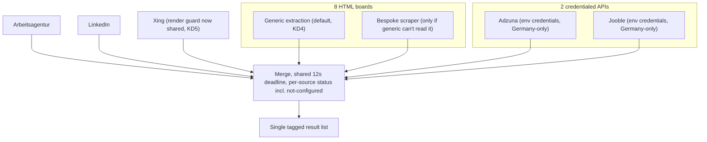
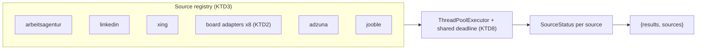
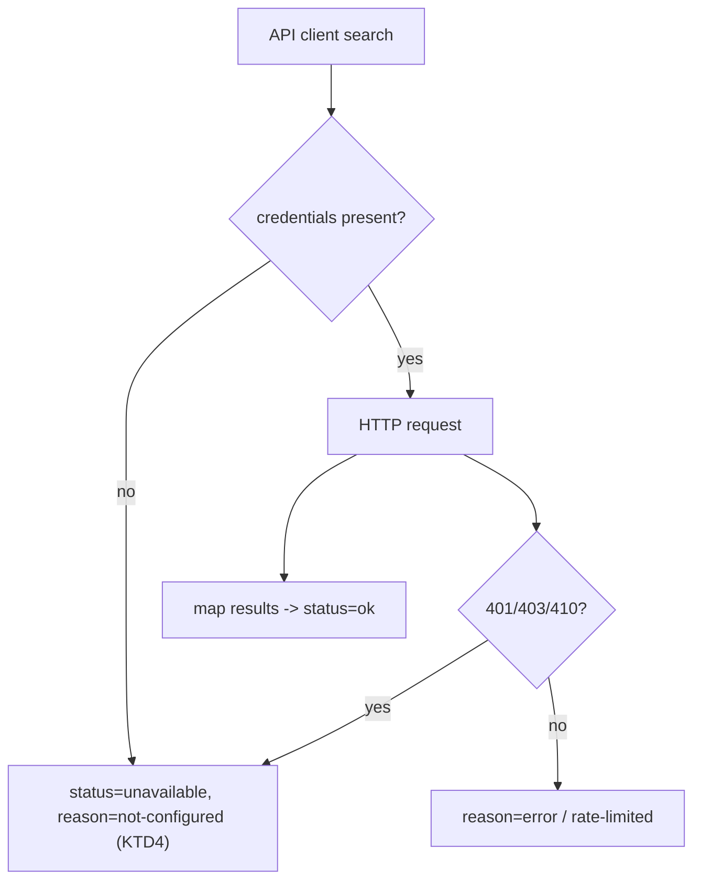

# Job Search Broader Source Coverage (Boards + APIs) - Plan

**Product Contract preservation:** unchanged — this enrichment adds the Planning Contract, Implementation Units, Verification Contract, and Definition of Done without changing any R/A/F/AE ID or scope.

## Goal Capsule

- **Objective:** Extend job search's automatic multi-source coverage from today's 3 sources (Arbeitsagentur, LinkedIn, Xing) to **13**: the 8 named German HTML job boards (devjobs.de, Kimeta, Stepstone, GermanTechJobs, Indeed, Jobware, Programmiererjobboerse.de, IT-Entwickler-Jobs.de) plus 2 credential-based APIs (Adzuna, Jooble). DEVjobs.de is counted once. Every source is queried on every search and labeled unavailable/not-configured rather than blocking the search or disappearing silently.
- **Product authority:** No `STRATEGY.md` exists for this repo. This plan reconciles the 2026-08-24 additional-boards plan and the 2026-08-19 DEVjobs.de/Adzuna/Jooble brainstorm, plus the user's 2026-09-11 decisions.
- **Execution profile:** Code. Backend: Python/FastAPI (`backend/`). Frontend: Angular standalone components (`frontend/`) — labels/status additions only.
- **Tail ownership:** `ce-work` owns implementation and the shipping tail; this plan defines units, tests, and done criteria.
- **Stop conditions:** Stop and ask if a named source turns out to have no anonymous, logged-out search surface at all (R2) — that source is deferred (KD1), not a blocker. Stop and ask if a board can't be read by the shared generic-extraction path or a reasonable bespoke scraper within normal effort (KD4).
- **Open blockers:** None. Per-board URL/markup specifics and Jooble error behavior are deferred implementation research, not launch blockers.

---

## Product Contract

### Summary

Job search grows from 3 to 13 sources in one unified search. HTML job boards are attempted through a shared, generic extraction path and only get bespoke scrapers when that path can't read them. Adzuna and Jooble are dedicated API clients whose credentials live exclusively in `.env`. All sources merge into the single existing result list, tagged by platform, with a per-source status that now also distinguishes "not configured" from ordinary failure. The cross-cutting machinery every source relies on — outbound identity, render/resource guarding, deadline participation, per-source enable flag, status labeling — is consolidated into one shared layer rather than duplicated per source.

### Problem Frame

The existing multi-source job search (Arbeitsagentur, LinkedIn, Xing) already replaced most manual per-platform checking, but stops short of most of the German tech/dev job-board landscape, and covers no credentialed job APIs at all. Two separate efforts described overlapping ways to close that gap: an additional-boards plan covering 8 HTML boards, and a brainstorm covering DEVjobs.de plus the Adzuna and Jooble APIs. Neither was built, they duplicate DEVjobs.de, and their extraction assumptions differ (generic-first vs. dedicated API clients). This plan merges them into one scope, resolves the duplication, and separates HTML-board extraction from credentialed API integration. It also directly answers the prior plan's own warning that the one-bespoke-client-per-source pattern was "not a pattern to repeat for a 5th source without revisiting it" (`docs/plans/2026-08-12-001-feat-job-search-external-platforms-plan.md`, KTD3).

### Key Decisions

- KD1. **Treat the 13-source set as a representative coverage goal, not a fixed exact-13 requirement** (session-settled: user-directed — a source proving infeasible can be deferred or swapped without blocking the rest). Governs R1.
- KD2. **Attempt every named source with the same best-effort precedent Xing already set, regardless of scraping difficulty** (session-settled: user-directed — consistency and future-readiness outweigh the near-certainty that some commercial sources show "unavailable" often). Governs R1, R5.
- KD3. **Keep the shared per-search deadline at its current value (~12s) rather than extending it** (session-settled: user-directed, 2026-09-11 — search responsiveness matters more than maximizing how many sources respond per search; more sources showing "unavailable/timeout" is the accepted trade-off). Governs R5.
- KD4. **HTML boards default to shared generic extraction, with a bespoke scraper only where that path can't read a site** (session-settled: user-directed — minimizes new one-off scraper code). Governs R6.
- KD5. **Consolidate the cross-cutting machinery every source relies on into one shared layer, extended to API clients too** (session-settled: user-directed — directly answers KTD3's warning; includes outbound request identity, render/resource guarding including Xing's existing browser-launch guard, deadline participation, per-source enable flag, and status labeling). Governs R7.
- KD6. **Adzuna and Jooble are dedicated API clients, not generic-extraction targets, and are scoped to the German job market only** (session-settled: user-directed — mirrors how Arbeitsagentur/LinkedIn/Xing are used today). Governs R8, R9.
- KD7. **A missing or rejected Adzuna/Jooble API key surfaces as a distinct "not configured" source status** — not a generic error and not hidden (session-settled: user-directed). Governs R9.
- KD8. **Salary and homeoffice/remote data folds into the existing `description_text` field as prose — no new structured/shared schema fields** (session-settled: user-directed). Governs R10.
- KD9. **No cross-source deduplication** (session-settled: user-directed — explicitly out of scope for now). Governs R4.
- KD10. **No source-toggle UI** — the user does not choose sources per search (carried forward from the prior plan's deferral). Governs R1.

### Requirements

**Search Coverage**
- R1. Job search automatically queries all 13 named sources for every search, subject only to the config-level per-source enable flag (KD10 governs the absent per-search picker). A source that proves infeasible may be deferred without blocking the rest (KD1).
- R2. Access to every source is anonymous — no login or session for the HTML boards/LinkedIn/Xing. Adzuna/Jooble use only application-level API credentials from `.env` (R9), never a user account.
- R3. Each result links directly to the actual job posting or application page on its source platform, not to a search-results stub or an intermediate redirect page.

**Result Delivery & Reliability**
- R4. Results from all sources merge into the single existing result list, tagged by source platform (`source_platform`); no cross-source deduplication (KD9).
- R5. A source's results appear as soon as that source responds; a source that errors, times out, or returns nothing is labeled unavailable (with a reason where known) rather than silently omitted, and the overall search does not wait meaningfully longer than it does today (KD2, KD3).

**Extraction & Integration**
- R6. Each new HTML board is first attempted through the shared generic-extraction path; a board gets dedicated scraping logic only once the generic path is confirmed unable to read it (KD4).
- R7. The outbound-request identity, render/resource guarding (including Xing's existing browser-launch guard), deadline participation, per-source enable/disable flag, and status labeling are implemented once and shared across every source — HTML boards and API clients alike — rather than redeclared per source (KD5).
- R8. Adzuna and Jooble are integrated as dedicated API clients that map their responses onto the internal job schema, scoped to the German market (KD6). Adzuna uses `app_id`/`app_key`/`results_per_page` with search term and location; Jooble uses its POST endpoint with an API key and `keywords`/`location`.
- R9. API keys and credentials are read exclusively from environment variables (`.env`); a missing or rejected key is reported as a distinct `not-configured` reason on that source's `unavailable` status (KD7).
- R10. Salary and homeoffice/remote details captured from any source are folded into `description_text` as descriptive text — no new structured fields, filtering, or sorting (KD8).

### Key Flows

- F1. Unified multi-source search, extended to 13
  - **Trigger:** User submits a keyword (and optional location) in the job search form.
  - **Steps:** App queries all enabled sources concurrently within the shared deadline; HTML boards go through generic extraction (bespoke only if required), Adzuna/Jooble through their API clients; each source's results populate the list as it responds; a source that errors, times out, returns nothing, or lacks credentials is labeled rather than omitted.
  - **Outcome:** User sees one merged, source-tagged result list spanning up to 13 sources, where every entry links to the real posting.
  - **Covers:** R1, R2, R3, R4, R5, R6, R8, R9.

### Acceptance Examples

- AE1. **Covers R5, KD3.** Given a search where several of the 13 sources time out, the response includes every source that responded plus an unavailable label for each that didn't — the search does not block on slow sources nor wait meaningfully longer than an equivalent search today.
- AE2. **Covers R6.** Given a new HTML board readable via the shared generic-extraction path, no dedicated scraper is written for it — it participates purely through the shared path.
- AE3. **Covers R9, KD7.** Given `ADZUNA_APP_KEY` is unset in `.env`, when a search runs, then Adzuna appears with a "not configured" status rather than as a generic error or an omitted source.
- AE4. **Covers R8, KD6.** Given a keyword and location, when Adzuna and Jooble are queried, then their results are restricted to the German market and mapped onto the internal job schema.
- AE5. **Covers R1, KD1.** Given one named source turns out to have no reliable anonymous search surface, it is deferred out of scope rather than blocking delivery of the others.

### Scope Boundaries

Deferred for later:
- Source-toggle UI letting the user choose which sources to query per search (KD10).
- Cross-source duplicate detection — worth revisiting once this ships: Kimeta is itself a meta-search engine aggregating other boards, so duplicates are materially more likely at 13 sources (KD9).
- Extending the shared per-search deadline to give new sources more time (KD3).
- Any data-quality signal or structured salary/remote filtering before saving — captured text only (KD8).
- Risk-based deprioritization of any named source based on scraping difficulty or platform size (KD2).

### Dependencies / Assumptions

- None of the HTML boards are known to publish an official public search API; all rely on undocumented endpoints or DOM/HTML extraction that can change without notice, as with LinkedIn/Xing.
- Adzuna and Jooble do expose documented REST APIs, but both require credentials that must be provisioned in `.env`; without them the "not configured" status (KD7) is the expected steady state.
- Large commercial platforms (Stepstone, Indeed) carry the scraping-enforcement risk already accepted for LinkedIn; accepted at this app's personal, low-volume, anonymous scale (KD2).
- Which HTML boards the shared generic path can read versus which need dedicated scraping is implementation-time research.
- Any source needing JS-rendered/headless-browser access shares the consolidated render/resource guard (R7), rather than maintaining an independent one.

### Outstanding Questions

Deferred to implementation (non-blocking):
- Exact per-board search URL templates and whether each board's results are server-rendered or need Playwright (R6, U6).
- Exact Jooble error codes and rate-limit behavior — undocumented in official captures; verify during implementation (R8, U5).
- Adzuna auth-failure status: the OpenAPI spec declares 410 while a live probe returned 401; treat 401/403/410 as invalid-credential (R9, U4).
- Whether any board turns out to have no reliable anonymous search surface (R1, AE5) — defer that board, not the plan.

### Sources / Research

- `docs/plans/2026-08-24-001-feat-job-search-additional-boards-plan.md` — the 8-HTML-board requirements this plan supersedes.
- `docs/plans/2026-08-12-001-feat-job-search-external-platforms-plan.md` — prior LinkedIn/Xing plan; source of the shared deadline, per-source status, anonymous-access precedent, and KTD3's "not a pattern to repeat" warning.
- `backend/app/services/job_search_service.py` — orchestrator, `ArbeitsagenturJobsClient`, `GenericJobScraper`, fan-out/deadline/status branches.
- `backend/app/services/job_sources/linkedin.py`, `backend/app/services/job_sources/xing.py` — per-source client convention, cooldown, render semaphore.
- `backend/app/schemas/job_offer.py` — `JobOfferBase`, `SourceStatus` (`status`, `reason`), `JobSearchResponse`.
- `backend/app/core/config.py` — `Settings` pattern and existing `JOB_SEARCH_*` keys.
- Adzuna API docs (`https://developer.adzuna.com/docs/search`, OpenAPI spec) and Jooble API docs (`https://jooble.org/api/about`) — endpoint/param/field mapping verified 2026-09-11.

---

## Planning Contract

### Key Technical Decisions

- KTD1. **The shared source layer lives in `job_sources/`, not in `job_search_service.py`.** `job_sources/` may not import from `job_search_service.py` (one-way rule), but `job_search_service.py` already imports from `job_sources/`. A new `backend/app/services/job_sources/shared.py` holds the user-agent constant, the Playwright render helper (with the bounded launch semaphore), the shared HTML card-extraction helpers, and board descriptors. `job_search_service.py` and all clients import from it. Governs R7.
- KTD2. **The generic two-tier extraction logic moves into `job_sources/shared.py` as reusable helpers, parameterized by a board descriptor.** A board adapter in `shared.py` supplies a per-board `SOURCE_PLATFORM` and search-URL builder and exposes the standard `search(keywords, location)` signature. `job_search_service.py`'s `GenericJobScraper` becomes a thin consumer of the same helpers, so no module under `job_sources/` imports `GenericJobScraper` and the one-way rule holds. Without the descriptor, all 8 boards collapse into one `web-scraper` bucket and cannot be labeled per source (R4, R5). Governs R1, R4, R6.
- KTD3. **`JobSearchService` fans out over a source registry instead of a hardcoded client dict and hardcoded status branches.** Each source registers `(client, enabled)`; the registry drives `ThreadPoolExecutor` submission and status labeling. This is the R7 consolidation that removes the per-source duplication. Governs R5, R7.
- KTD4. **Adzuna and Jooble clients short-circuit to a `not-configured` status when credentials are absent or rejected, without making an HTTP call.** A missing credential is detected before the request; an HTTP 401/403/410 is treated as invalid-credential and mapped to the same status. Adzuna uses `GET https://api.adzuna.com/v1/api/jobs/de/search/{page}` with `app_id`/`app_key`/`what`/`where`/`results_per_page`; Jooble uses `POST https://jooble.org/api/<api_key>` with `keywords`/`location`. Both are Germany-scoped (KD6). Governs R8, R9.
- KTD5. **`not-configured` is added to the `SourceStatus.reason` union on both sides and rendered distinctly.** The backend `Literal` and the frontend `SourceStatus.reason` union gain `"not-configured"`; the frontend gets a distinct translation key and a reason-aware chip label instead of the single generic "unavailable" label. Governs R5, R9.
- KTD6. **Salary/homeoffice prose is folded into `description_text` at mapping time by a shared helper.** No schema field is added; the helper appends a short salary/homeoffice line to the source's description when present (R10). Governs R10.
- KTD7. **New per-source enable flags and credentials follow the existing `Settings` pattern and are documented in `backend/.env.example`.** Add `JOB_SEARCH_<SOURCE>_ENABLED` flags and `ADZUNA_APP_ID`/`ADZUNA_APP_KEY`/`JOOBLE_API_KEY`. Clients read the settings passed by `JobSearchService` (the existing pattern), avoiding the `ARBEITSAGENTUR_*` declared-but-unread gap. Governs R7, R8, R9.
- KTD8. **Deadline participation is a bounded per-source inner timeout derived from the shared deadline; the outer ~12s deadline is unchanged (KD3).** API clients get a short HTTP timeout; rendered boards reuse Xing's `inner_timeout = max(1.0, deadline - 1.0)` derivation, centralized in the shared layer. `executor.shutdown(wait=False)` is preserved so a timed-out source never blocks the response. Governs R5, R7.
- KTD9. **Sources expose an outcome contract so `not-configured` can propagate without breaking the `list[JobOfferCreate]` return.** Each API client exposes `is_configured()`; the registry skips an unconfigured source and emits `status="unavailable", reason="not-configured"` without calling `search()`. A credential rejected mid-request raises a typed `SourceNotConfiguredError` that the orchestrator maps to the same reason. Governs R5, R9.
- KTD10. **`shared.py` also owns the salary/homeoffice prose helper, URL validation, credential redaction, and HTML stripping.** Salary/homeoffice text is folded into `description_text` at mapping time (KTD6). `validate_source_url()` permits only `http`/`https` to public hosts and is applied before persisting `source_url` and before any server-side fetch. A redaction helper keeps API keys out of logs, and HTML is stripped with `BeautifulSoup(..., "html.parser").get_text(...)` — never a hand-rolled regex. Governs R3, R7, R10.
- KTD11. **`JobSearchService` accepts an injected source registry, defaulting to the settings-derived one.** Tests inject fake clients/registry instead of mutating the cached `settings` singleton, keeping unit and API tests offline. Governs R7.

### High-Level Technical Design

Source categories and the consolidated path:

Credential-gated API source decision:

### Assumptions

- Adzuna default limits are 25 hits/minute and 250/day; a 429 maps to `reason=rate-limited` and the client may reuse LinkedIn's class-level cooldown pattern if needed.
- Jooble `id` is a large integer; map it as a string to avoid float precision loss. Jooble rate limits are undocumented; no cooldown is assumed.
- Adzuna `description` is truncated to ~500 chars; Jooble `snippet` contains HTML that must be stripped.
- Neither API exposes a homeoffice/remote field; only salary prose is folded in.
- The backend runs as a single `uvicorn` process; class-level/module-level state (cooldowns, semaphores) is acceptable, matching existing precedent.

### Implementation Constraints

- One-way dependency: `job_sources/*` never imports `job_search_service.py`.
- Thread safety: all clients run concurrently in the fan-out; shared helpers must be safe across ~13 worker threads. Playwright launches stay serialized by the shared bounded semaphore.
- No new structured job fields; no dedup; no source-toggle UI.
- Repo-relative paths only.

### Risks & Dependencies

- **Concurrent browser renders can exhaust shared VM memory.** Up to 8 new boards may need Playwright, inside a Docker VM also running Postgres, the backend, and Ollama. Mitigation: every browser launch goes through the shared bounded semaphore (KTD1); HTTP/API sources stay concurrent. Do not replace the bounded semaphore with a process-wide lock over all searches — that would break the KD3 deadline. U1 verifies the bound holds.
- **Board markup or endpoints change without notice, silently dropping a source.** Mitigation: per-source `unavailable`/`empty` status (R5) and isolated per-board adapters (U6); one board's failure never affects another.
- **Adzuna/Jooble credentials absent or rejected in the deployment.** Mitigation: `not-configured` short-circuit before any HTTP call (KTD4) and a distinct frontend label (U7); keys documented in `backend/.env.example` (KTD7).
- **API rate limits** (Adzuna default 25/min, 250/day; Jooble undocumented) return 429s. Mitigation: map 429 to `rate-limited`; Adzuna may reuse the class-level cooldown pattern. This relies on the documented single-process assumption.
- **Credentials leaking into logs or error messages.** Mitigation: never log request URLs containing keys; U4/U5 tests assert no key appears in error output.
- **External API contracts can change.** Mitigation: mapping is isolated in the two clients (U4, U5); a contract change is a localized fix, not a fan-out change.
- **Untrusted scraped descriptions flow into the AI generation prompt.** A malicious posting could steer the generated letter. Mitigation: treat `description_text` as untrusted data in the generator prompt (wrap it in explicit delimiters and instruct the model not to follow its contents); add a test with an instruction-bearing description.
- **Credentials could be baked into the Docker image.** Mitigation: inject via `env_file`/secrets at runtime; `backend/.dockerignore` excludes `.env`; the smoke check confirms key presence without printing values.
- **Adzuna `redirect_url` is an intermediate redirect**, which conflicts with R3's direct-link guarantee. U4 owns the decision: resolve it to the final posting URL (through the shared URL validation) or record the accepted trade-off.

### Sequencing

U1 → U3 → U2 → {U4, U5, U6} → U7 → U8. U4/U5/U6 can proceed in parallel after U2. U3 (config + status-groundwork) lands before U2 so the registry and the `not-configured` schema value exist before any client emits them.

---

## Implementation Units

### U1. Extract the shared source layer and parameterize generic extraction

- **Goal:** Create `job_sources/shared.py` with the consolidated user-agent, Playwright render helper (bounded semaphore), generic two-tier extraction helpers, board descriptor, salary/homeoffice prose helper, `validate_source_url()`, credential-redaction helper, and parser-based HTML stripping.
- **Requirements:** R3, R6, R7, R10; KTD1, KTD2, KTD10.
- **Dependencies:** none.
- **Files:** `backend/app/services/job_sources/shared.py` (new), `backend/app/services/job_search_service.py`, `backend/app/services/job_sources/xing.py`, `backend/app/services/job_sources/linkedin.py`, `backend/tests/services/job_sources/test_shared.py` (new), `backend/tests/services/job_sources/test_xing.py`.
- **Approach:**
  1. Move the duplicated `_DEFAULT_USER_AGENT`, Playwright launch/render logic, CSS class regexes, heading-before-anchor card mapping, and the generic JSON-LD/heuristic extraction into `shared.py`.
  2. Add a bounded Playwright launch semaphore in `shared.py`; route `XingJobScraper` and the generic render path through it.
  3. Add a board descriptor (platform key + search-URL builder) and a board-source adapter exposing `search(keywords, location)`. `GenericJobScraper` becomes a thin consumer of the shared helpers.
  4. Add the salary/homeoffice prose helper, `validate_source_url()`, the redaction helper, and BeautifulSoup-based HTML stripping.
  5. Update `test_xing.py` patches to target the shared module's `sync_playwright`/semaphore (or a thin seam on `XingJobScraper`) so the moved render tests still intercept the executed code.
- **Patterns to follow:** `backend/app/services/job_sources/xing.py` render/semaphore; `backend/app/services/job_search_service.py:213-406` generic extraction; the one-way import rule in `backend/app/services/job_sources/__init__.py`.
- **Test scenarios:**
  - Happy path: a board descriptor produces offers tagged with that board's `SOURCE_PLATFORM`, not `web-scraper`.
  - Edge: a board with no JSON-LD falls back to heuristic extraction; a `javascript:` or private-host `source_url` is rejected by `validate_source_url()`.
  - Error: a render failure closes the browser and raises without leaking a Playwright process.
  - Integration: concurrent render requests are serialized by the shared semaphore (mirror `test_xing.py`'s real-threads test); the salary helper appends prose to `description_text` without adding a field; HTML stripping removes markup.
- **Verification:** shared helpers exist and are imported by both `job_search_service.py` and `xing.py`; no duplicated user-agent or Playwright launch remains; `test_xing.py` still exercises the render path.

### U2. Replace hardcoded fan-out with an injectable source registry

- **Goal:** Drive `JobSearchService.search()` from a registry of registered sources, accept an injected registry for tests, and keep deadline/error/empty/timeout semantics unchanged.
- **Requirements:** R5, R7; KTD3, KTD8, KTD9, KTD11.
- **Dependencies:** U1, U3.
- **Files:** `backend/app/services/job_search_service.py`, `backend/tests/services/test_job_search_service.py`.
- **Approach:**
  1. Build the registry from enabled sources (existing 3 plus new ones) using the standard `SOURCE_PLATFORM` + `search()` interface; add a constructor seam that accepts an injected registry and defaults to the settings-derived one (KTD11).
  2. Consult `is_configured()` before submitting a source; skip it and emit `status="unavailable", reason="not-configured"` without calling `search()` (KTD9). Map a raised `SourceNotConfiguredError` to the same reason.
  3. Preserve `ThreadPoolExecutor(max_workers=len(sources))`, per-future deadline wait, `shutdown(wait=False)`, and the `timeout`/`error`/`empty`/`rate-limited`/`ok` status mapping.
  4. Keep the AA-empty `fallback_url` branch separate from the registry.
- **Patterns to follow:** current `JobSearchService.search` (`backend/app/services/job_search_service.py:445-520`); `_FakeClient` in `test_job_search_service.py`.
- **Test scenarios:**
  - Happy path: all enabled sources' results merge and each gets an `ok` status.
  - Edge: a disabled source flag removes it from the registry and the response; an unconfigured source yields `reason="not-configured"` with no `search()` call.
  - Error: one client raising does not affect others; it gets `reason=error`.
  - Timeout: a slow client is labeled `reason=timeout` and the search returns within the deadline.
  - Integration: tests inject a fake registry rather than mutating the cached `settings` singleton, so no real network/Playwright call fires.
- **Verification:** adding/removing a source requires only a registry entry, not edits to the fan-out or status branches; the injected-registry path works offline.

### U3. Add per-source enable flags, credential settings, and the `not-configured` reason

- **Goal:** Add `JOB_SEARCH_<SOURCE>_ENABLED` flags and `ADZUNA_APP_ID`/`ADZUNA_APP_KEY`/`JOOBLE_API_KEY` settings, document them in `backend/.env.example`, pass them from `JobSearchService`, and extend the backend `SourceStatus.reason` `Literal` with `not-configured`.
- **Requirements:** R7, R8, R9; KTD5, KTD7.
- **Dependencies:** U1.
- **Files:** `backend/app/core/config.py`, `backend/app/schemas/job_offer.py`, `backend/.env.example`, `backend/app/services/job_search_service.py`, `backend/tests/services/test_job_search_service.py`.
- **Approach:** follow the existing `JOB_SEARCH_LINKEDIN_*`/`JOB_SEARCH_XING_*` grouping; default new source flags on; default credentials empty so the not-configured path is exercised. Extend the backend `reason` `Literal` here so clients in U4/U5 can emit `not-configured` without waiting on U7.
- **Patterns to follow:** `backend/app/core/config.py:76-90`; the commented `JOB_SEARCH_*` block in `backend/.env.example`; `backend/app/schemas/job_offer.py:46-58`.
- **Test scenarios:**
  - Happy path: settings resolve to the new flags/credentials; the schema accepts `reason="not-configured"`.
  - Edge: unset credentials resolve to empty and the API client reports `not-configured`.
  - Error: a source with an invalid key surfaces `not-configured`, not a crash.
- **Verification:** new keys appear in `Settings` and `.env.example`; clients receive them via constructor args; the backend `reason` union includes `not-configured`.

### U4. Adzuna API client

- **Goal:** Add `AdzunaJobsClient` mapping Adzuna's Germany search response onto `JobOfferCreate`.
- **Requirements:** R2, R8, R9, R10; KTD4, KTD6, KTD8, KTD9, KTD10.
- **Dependencies:** U1, U2, U3.
- **Files:** `backend/app/services/job_sources/adzuna.py` (new), `backend/app/services/job_search_service.py`, `backend/tests/services/job_sources/test_adzuna.py` (new).
- **Approach:**
  1. `GET https://api.adzuna.com/v1/api/jobs/de/search/1` with `app_id`, `app_key`, `what`, `where`, `results_per_page`.
  2. Expose `is_configured()` from credential presence; raise `SourceNotConfiguredError` on a rejected credential.
  3. Map `title`, `company.display_name`, `location.display_name`, `redirect_url`, `description`; validate `source_url` via the shared helper; fold salary (`salary_min`/`salary_max`/`salary_is_predicted`) into `description_text` via the shared helper; strip HTML with BeautifulSoup.
  4. Absent credentials → `not-configured` without HTTP; 401/403/410 → `not-configured`; 429 → `rate-limited`; other HTTP/JSON errors → `error`; malformed per-record entries are skipped.
  5. Log a redacted request URL only; never pass the raw exception (which contains the key) to the logger.
- **Patterns to follow:** `LinkedInJobsClient` (`job_sources/linkedin.py`) constructor/`search`/cooldown; `requests_mock` tests in `test_linkedin.py`; BeautifulSoup stripping at `job_search_service.py:344`.
- **Test scenarios:**
  - Happy path: a two-result payload maps both offers with `source_platform="adzuna"` and direct `redirect_url`.
  - Edge: missing `where` omits the param; a record missing `title`/`redirect_url` is skipped, others survive; a private-host or non-http `redirect_url` is rejected.
  - Error: no credentials → `not-configured`, no HTTP call; 401 → `not-configured`; 429 → `rate-limited`; with DEBUG logging enabled, no `app_key` appears in captured logs.
  - Integration: salary prose appears in `description_text` and no new field is populated.
- **Verification:** `requests_mock` asserts the Germany path, required params, credential handling, and key redaction.

### U5. Jooble API client

- **Goal:** Add `JoobleJobsClient` mapping Jooble's POST search response onto `JobOfferCreate`.
- **Requirements:** R2, R8, R9, R10; KTD4, KTD6, KTD8, KTD9, KTD10.
- **Dependencies:** U1, U2, U3.
- **Files:** `backend/app/services/job_sources/jooble.py` (new), `backend/app/services/job_search_service.py`, `backend/tests/services/job_sources/test_jooble.py` (new).
- **Approach:**
  1. `POST https://jooble.org/api/<api_key>` with JSON `{keywords, location}` (location defaulted to Germany when absent).
  2. Expose `is_configured()` from key presence; raise `SourceNotConfiguredError` on a rejected key.
  3. Map `title`, `company`, `location`, `link`, and BeautifulSoup-stripped `snippet`; validate `source_url` via the shared helper; fold `salary` prose into `description_text`; treat `id` as a string.
  4. Absent key → `not-configured` without HTTP; 401/403 → `not-configured`; 429 → `rate-limited`; other errors → `error`; malformed records skipped.
  5. Never log the key-bearing URL or the raw exception.
- **Patterns to follow:** `LinkedInJobsClient`; `requests_mock` POST assertions; BeautifulSoup stripping at `job_search_service.py:344`.
- **Test scenarios:**
  - Happy path: a `{totalCount, jobs}` payload maps all jobs with `source_platform="jooble"`.
  - Edge: `snippet` HTML is stripped; a large numeric `id` is preserved as a string; missing `location` defaults to Germany; a non-http `link` is rejected.
  - Error: no key → `not-configured`, no HTTP call; 403 → `not-configured`; malformed JSON → `error`; no key appears in captured DEBUG logs.
- **Verification:** `requests_mock` asserts the POST URL/body, credential handling, and that no key leaks into logs.

### U6. Add the eight HTML board sources

- **Goal:** Register devjobs.de, Kimeta, Stepstone, GermanTechJobs, Indeed, Jobware, Programmiererjobboerse.de, and IT-Entwickler-Jobs.de as generic-extraction board sources with distinct platform keys.
- **Requirements:** R1, R2, R3, R4, R6, R10; KD2, KD4, KTD2, KTD6, KTD10.
- **Dependencies:** U1, U2, U3.
- **Files:** `backend/app/services/job_sources/boards.py` (new), `backend/app/services/job_search_service.py`, `backend/tests/services/job_sources/test_boards.py` (new).
- **Approach:**
  1. Define one descriptor per board (search URL derived during implementation from each site's public search page):
     - `devjobs` — devjobs.de
     - `kimeta` — Kimeta
     - `stepstone` — Stepstone
     - `germantechjobs` — GermanTechJobs
     - `indeed` — Indeed
     - `jobware` — Jobware
     - `programmiererjobboerse` — Programmiererjobboerse.de
     - `it-entwickler-jobs` — IT-Entwickler-Jobs.de
  2. Register each as a primary source through the generic-extraction adapter; no bespoke scraper initially (R6).
  3. Tag offers/status with the board's platform; a board the generic path can't read reports `unavailable`.
  4. If a board proves unreadable, either add a bespoke client or defer it (KD1) — do not block the rest.
- **Patterns to follow:** `GenericJobScraper` two-tier extraction; `job_sources/xing.py` for a bespoke fallback if needed.
- **Test scenarios:**
  - Happy path: each of the 8 descriptors yields offers tagged with its own platform key.
  - Edge: a board returning zero parseable offers reports `empty`; a board needing Playwright renders via the shared helper.
  - Error: one board's fetch failing leaves the other 7 unaffected.
  - Integration: 8 board statuses appear alongside the existing sources in one response; a board card's salary/homeoffice prose lands in `description_text` via the shared helper; a non-http or private-host result URL is rejected.
- **Verification:** all 8 platform keys are distinct and present in the registry; no board is tagged `web-scraper`.

### U7. Add frontend `not-configured` rendering and source labels

- **Goal:** Add `not-configured` to the frontend `SourceStatus.reason` union, render it distinctly, and add labels for all new platforms.
- **Requirements:** R5, R9; KTD5.
- **Dependencies:** U4, U5, U6.
- **Files:** `frontend/src/app/core/models/job-offer.model.ts`, `frontend/src/app/pages/job-search/job-search.component.ts`, `frontend/src/app/pages/job-search/job-search.component.html`, `frontend/src/app/core/i18n/translations.ts`, `frontend/src/app/pages/job-search/job-search.component.spec.ts`.
- **Approach:**
  1. Extend the frontend `SourceStatus.reason` union with `"not-configured"` (the backend union is extended in U3).
  2. Add `SOURCE_LABELS` entries for `adzuna`, `jooble`, and the 8 boards.
  3. Render a reason-aware unavailable label: `not-configured` shows a distinct "not configured" message; other reasons keep the generic unavailable label.
  4. Add DE/EN translation keys.
- **Patterns to follow:** `SOURCE_LABELS`/`sourceLabel` (`job-search.component.ts:73-125`); source-status chip loop (`job-search.component.html:61-75`); `translations.ts` `jobSearch.*` keys.
- **Test scenarios:**
  - Happy path: a source with `reason="not-configured"` renders the distinct label, not the generic one.
  - Edge: existing reasons (`timeout`, `error`, `empty`, `rate-limited`) still render the generic unavailable label.
  - Error: an unknown platform key falls back to the raw key (existing behavior).
  - Integration: a `JobSearchResponse` containing a not-configured source renders both the new label and the platform's friendly name in both languages.
- **Verification:** frontend spec asserts the distinct chip text; the frontend `reason` union includes `not-configured`.

### U8. End-to-end multi-source verification

- **Goal:** Prove the full multi-source search path, deadline behavior, and per-source labeling through the API using the real orchestrator.
- **Requirements:** R1, R4, R5, R9; KTD3, KTD8, KTD11.
- **Dependencies:** U2, U4, U5, U6, U7.
- **Files:** `backend/tests/api/test_jobs.py`.
- **Approach:** override `get_job_search_service` with a real `JobSearchService` wired to a fake 13-source registry through the U2 injection seam (not `_FakeJobSearchService`, which would make the assertion tautological), then assert the merged envelope and per-source statuses. Any source deferred per KD1 reduces the expected count.
- **Patterns to follow:** `backend/tests/api/test_jobs.py` StaticPool fixture; do not use `with TestClient(app)`.
- **Test scenarios:**
  - Happy path: all non-deferred sources return a merged `{results, sources}` with one status per source.
  - Edge: an unconfigured Adzuna/Jooble pair appears as `not-configured` alongside `ok` sources.
  - Error: a timing-out source does not delay the response beyond the shared deadline.
  - Integration: results from every responding source carry a direct `source_url` and their own `source_platform`.
- **Verification:** the API test asserts one status entry per registered source and the merged result count, exercising the real fan-out and status mapping.

---

## Verification Contract

| Gate | Command (run from the noted directory) | Applies to |
|---|---|---|
| Backend tests | `./venv/bin/python -m pytest -q` (from `backend/`) | all units |
| Backend targeted | `./venv/bin/python -m pytest tests/services/test_job_search_service.py tests/services/job_sources tests/api/test_jobs.py -q` (from `backend/`) | U1–U6, U8 |
| Frontend build | `npm run build` (from `frontend/`) | U7 |
| Frontend tests | `CHROME_BIN="/Applications/Brave Browser.app/Contents/MacOS/Brave Browser" npm test -- --watch=false --browsers=ChromeHeadless` (from `frontend/`) | U7 |
| Manual smoke | Rebuild the backend container (`docker compose up -d --build backend`) and confirm `curl http://localhost:8000/openapi.json`; confirm the new env keys are present without printing their values (e.g. `docker compose config`), and that `backend/.dockerignore` excludes `.env` | U3–U7 |

- No new structured job fields, no dedup, no source-toggle UI may appear in the diff.
- A source's status reason is asserted, not just its `status`.
- Adzuna/Jooble credential-absent behavior is proven without real network calls.

---

## Definition of Done

- All 8 units complete; each unit's test scenarios are implemented and pass.
- Backend full suite and frontend suite pass; frontend production build succeeds.
- All 13 named sources are registered with distinct `source_platform` keys, or explicitly deferred per KD1 with the reason recorded; no board is tagged `web-scraper`.
- No source requires a login or session; API credentials come only from `.env`, and API keys never appear in logs or error output.
- Persisted `source_url` values are `http`/`https` public hosts (private/loopback/non-http rejected).
- Adzuna/Jooble with missing or rejected credentials produce `reason="not-configured"` and the frontend renders it distinctly in both languages.
- Salary/homeoffice prose appears in `description_text`; no new structured field exists.
- The shared layer holds the user-agent, render guard, card extraction, deadline participation, salary helper, URL validation, credential redaction, and HTML stripping; no duplicated user-agent/Playwright launch remains.
- The shared outer deadline is unchanged; `shutdown(wait=False)` is preserved.
- New settings and flags are documented in `backend/.env.example`.
- Abandoned or experimental code from any approach that did not pan out is removed from the diff.
