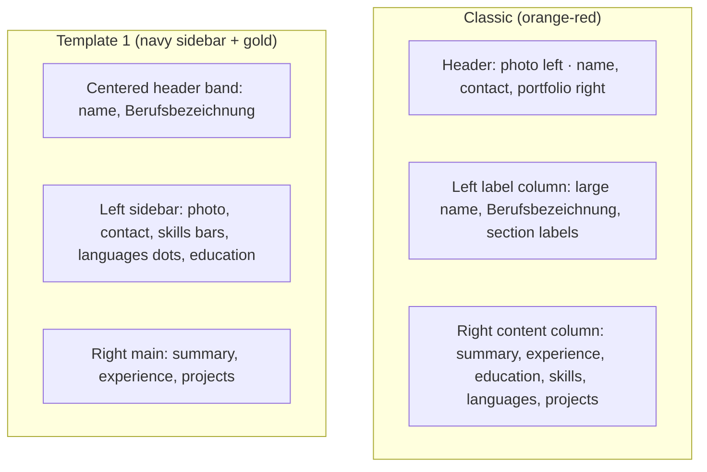
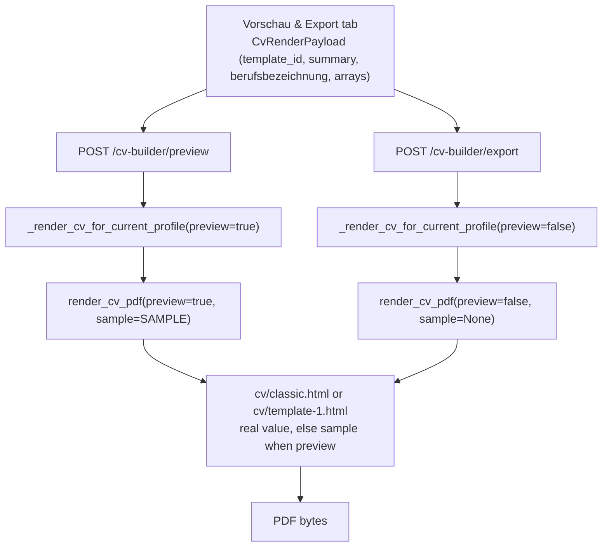

# CV Preview Templates - Plan

## Goal Capsule

- **Objective:** Replace the CV export template set with a reworked Classic and a new Template 1, add an optional Berufsbezeichnung field, and make the in-app preview always render a complete, sample-filled CV skeleton so any template can be judged before the profile data is complete. Template 2–4 and placeholder content in exported PDFs are not active scope.
- **Product authority:** Product Contract unchanged — this plan's R1–R11, Key Decisions, Flows, and Acceptance Examples are preserved; the two Deferred-to-Planning questions are resolved in the Planning Contract (sample strings, German section labels). This plan extends the prior plan's R9–R11 of `docs/plans/2026-09-10-001-feat-cv-builder-editor-plan.md` and supersedes that plan's KTD7 ("preview renders the same PDF bytes the export would produce") for the empty-field case.
- **Stop conditions:** Stop and ask before changing the template set beyond Classic + Template 1, or before letting sample/placeholder content reach the exported PDF.
- **Execution profile:** `execution: code`. Backend: FastAPI, Jinja2, WeasyPrint, Alembic, pytest. Frontend: Angular 17 (standalone components, signals, reactive forms), Karma/Jasmine.
- **Tail ownership:** Implementer runs `pytest` (backend) and `ng test` (frontend), plus a manual preview/export click-through on a rebuilt Docker backend.
- **Open blockers:** None.

## Product Contract

### Summary

Swap the CV export templates to two references — a reworked Classic (orange-red "About Me" layout) and a new Template 1 (navy sidebar + gold) — add an optional Berufsbezeichnung under the name, and make the in-app preview always show a full sample-filled CV skeleton. Exported PDFs stay clean.

### Problem Frame

The Builder can already render a PDF from the profile, but its two templates (`classic`, `modern`) look nothing like the designs the user wants, and every template block is hidden when its data is empty. An incomplete profile therefore previews as a near-blank page: the user cannot tell whether they like a template, or where their content will land, until nearly every field is filled in. The reference designs also show a job title under the name, which the profile data model does not capture.

### Key Decisions

- **Preview and export intentionally diverge** (session-settled: user-directed — chosen over keeping preview byte-identical to export, because the point of the preview is to judge a template before the data is complete). Governs R7, R9.
- **The empty preview is a full skeleton with realistic sample entries, not per-field hint lines** (session-settled: user-directed — chosen over hint-only, so the whole template layout is visible). Governs R7, R8.
- **Sample content is muted and visually distinct from real content** (session-settled: user-approved — confirmed via the empty-state visual probe). Governs R8.
- **Berufsbezeichnung is an optional Builder content field, not derived from the latest experience** (session-settled: user-directed — chosen over deriving from an experience `role` or omitting the title, for independent control). Governs R4, R5, R6.
- **The template set narrows to Classic + Template 1; Template 2–4 are parked** (session-settled: user-directed — chosen over shipping all four at once). Governs R1, R3.
- **Classic is extended to render every canonical section** (session-settled: user-approved — the supplied reference omits languages and projects; extending keeps both templates equivalent per R2). Governs R2.
- **Existing `modern` profiles remap to Template 1** (session-settled: user-approved — the closest new layout, so no saved profile breaks). Governs R11.

### Requirements

**Templates**

- R1. The selectable CV template set is exactly two templates: `classic`, reworked to the orange-red "About Me" reference layout, and `template-1`, the navy sidebar + gold reference layout; `modern` is removed.
- R2. Both templates render the same canonical content — summary, work experience, education, skills, languages, and projects — in their own visual style; neither omits a section the other shows.
- R3. The template picker offers both templates by label ("Classic", "Template 1"), and the selected template continues to persist on the profile through the existing save flow.
- R4. Both templates render the Berufsbezeichnung beneath the profile name when it is set.

**Berufsbezeichnung**

- R5. The Builder offers an optional Berufsbezeichnung text field, carried in the CV content payload and persisted on the profile like the other content fields.
- R6. An empty Berufsbezeichnung is omitted from the exported PDF and shown as muted placeholder text in the preview.

**Preview skeleton**

- R7. The in-app preview renders a complete CV skeleton for the selected template regardless of how much content exists; every canonical section appears.
- R8. Empty fields and empty sections in the preview are filled with fixed German sample content rendered in a muted style visually distinct from real content; fields holding real content render that content unchanged.
- R9. Sample and placeholder content appears only in the in-app preview; the exported PDF contains only real content and omits empty fields and sections as it does today.
- R10. When no profile photo is set, the preview shows a neutral photo placeholder; the export omits the photo slot as today.

**Compatibility**

- R11. A saved profile whose `template_id` is `modern` resolves to `template-1` on preview and export without the user changing anything.

### Template Layouts

### Key Flows

- F1. Preview a template with incomplete content.
  - **Trigger:** User clicks "Vorschau" on the Vorschau & Export tab.
  - **Steps:** Current form content is sent for the selected template → backend renders in preview mode → empty fields and sections are filled with muted sample content → the PDF appears in the embed.
  - **Covers:** R7, R8, R9, R10.
- F2. Export the CV.
  - **Trigger:** User clicks "Als PDF exportieren".
  - **Steps:** The same content is sent for the selected template → backend renders in export mode → empty fields and sections are omitted → a clean PDF downloads.
  - **Covers:** R9.

### Acceptance Examples

- AE1. **Covers R7, R8.** Given a profile with only a name and email, when the user previews Classic, then every canonical section appears and each empty one is filled with muted sample content.
- AE2. **Covers R8.** Given one real experience entry whose description is blank, when the user previews, then the real entry renders unchanged and only the blank description shows placeholder text.
- AE3. **Covers R9.** Given the same incomplete content, when the user exports, then the PDF contains only real content, with no empty sections and no sample entries.
- AE4. **Covers R5, R6.** Given a set Berufsbezeichnung, when the user previews or exports, then it appears beneath the name; given an empty one, the preview shows the placeholder and the export omits it.
- AE5. **Covers R11.** Given a saved profile with `template_id = "modern"`, when the user previews or exports, then Template 1 renders without error.
- AE6. **Covers R1, R3.** When the template picker loads, then it shows exactly "Classic" and "Template 1".

### Scope Boundaries

- Template 2–4 are parked for a later plan.
- The exported PDF never contains sample or placeholder content.
- One shared set of sample content across both templates; per-template sample content is out of scope.
- AI CV import continues to populate only the fields it does today; Berufsbezeichnung is entered manually.
- Template customization beyond the two supplied references (colors, fonts, extra layouts) is out of scope.

### Dependencies / Assumptions

- The existing server-side PDF pipeline (Jinja2 + WeasyPrint) stays; the preview/export divergence is carried as a render mode rather than a separate preview template.
- The two supplied reference PDFs are the visual source of truth; exact CSS is an implementation concern.
- Sample content is German and fixed; exact strings are resolved in the Planning Contract.

### Sources / Research

- Prior plan: `docs/plans/2026-09-10-001-feat-cv-builder-editor-plan.md` (R9–R11, U5/U9, KTD6–KTD8, KTD10–KTD12, KTD14).
- Current templates: `backend/app/templates/cv/classic.html`, `backend/app/templates/cv/modern.html`.
- Template registry and render pipeline: `backend/app/services/pdf_service.py`, `backend/app/api/cv_builder.py`.
- Reference PDFs supplied by the user: Classic = orange-red "About Me" layout; Template 1 = navy sidebar + gold layout.

## Planning Contract

### Key Technical Decisions

- KTD1. Preview mode is a parameter on the existing render pipeline, not a second template or a separate preview path. `render_cv_pdf` gains `preview: bool = False`; the endpoints set it (`/cv-builder/preview` → true, `/export` → false). One WeasyPrint pipeline and one template set remain. Governs R7, R9, R10.
- KTD2. Fixed German sample content lives in `backend/app/services/cv_sample_content.py` as a `SAMPLE` mapping and reaches the templates as a separate `sample` namespace alongside `preview`. The renderer never overwrites a real value, and it selects the sample namespace itself from `preview` rather than trusting callers. Governs R8.
- KTD3. Templates choose the value with a two-level rule. For a scalar or a sub-field: `` renders the real value, `` renders the sample value wrapped in the muted placeholder class. For a list: `` renders the section; when the list is empty in preview it renders whole sample entries, and when it holds real entries each blank sub-field falls back to its sample value while real sub-fields render unchanged. Real values render with no placeholder class. Governs R7, R8.
- KTD4. `berufsbezeichnung` travels in the render request body and the `PATCH /profile` content payload, not merged from the saved profile like identity fields. It is CV content edited in the Builder (R5). Governs R5.
- KTD5. Existing `modern` rows are remapped to `template-1` by one guarded bulk `UPDATE master_profiles SET template_id = 'template-1' WHERE template_id = 'modern'`. The downgrade is a no-op: the remap is not reversed, matching the repo's existing non-reversed data migrations. Governs R11.
- KTD6. Both templates render the same canonical section set; Classic is extended beyond its reference to include languages and projects. Governs R2.
- KTD7. The template set change is one unit: `template-1.html` is created and `modern.html` is removed in the same change as the `CvTemplateId`/`CV_TEMPLATES` update, so the registry never points at a missing file. Governs R1.
- KTD8. Section labels stay German and consistent with the existing templates (`Profil`, `Berufserfahrung`, `Ausbildung`, `Skills`, `Sprachen`, `Projekte`), not the reference's English "About Me". Resolves the deferred label question.
- KTD9. Sample strings follow the existing `_full_content` fixture style (`Max Mustermann`, `Beispiel GmbH`, `Universität Musterstadt`, `Python`, `Deutsch`). Resolves the deferred sample-copy question.
- KTD10. The render request keeps validating `template_id` against the two ids, so an unknown value returns 422. The picker normalizes before it can post: a `NULL`/empty stored id keeps the existing auto-select of the first fetched template, and a non-null id absent from the fetched list is reset to the first template. `canRender()` requires membership in the loaded set and stays disabled while the template load is in error. Write schemas (`MasterProfileBase`/`MasterProfileUpdate`) stay `str | None` in this plan; the migration plus picker normalization cover the only known legacy value. Governs R3, R11.
- KTD11. The placeholder photo is inline CSS or a local file under `templates/cv/`, never a remote URL, so the existing local-only `url_fetcher` stays intact. Governs R10.

### High-Level Technical Design

The two endpoints share one render path. Only the mode flag and the sample namespace differ.

### System-Wide Impact

- `template_id` is persisted and read by the picker, the render request, and the export filename path. The remap migration (U4) and the picker fallback (KTD10) are the two places that keep a legacy value from breaking.
- `PUT /profile` is a full overwrite: every field it serializes must carry the new `berufsbezeichnung`, or an identity save silently clears it (U1/U2).
- The templates are the only render surface. The application-send email path attaches the raw uploaded CV and does not use `CV_TEMPLATES` or `render_cv_pdf`, so it is unaffected.
- Autoescaping and the local-only `url_fetcher` are shared security boundaries. Sample content and the photo placeholder must not introduce remote resources or unescaped markup.

### Risks & Dependencies

- **Migration ordering.** U1's and U4's migrations must land on one linear chain (U4's `down_revision` = U1's revision). If they are authored on parallel branches they produce two Alembic heads; the only correct join is `alembic merge`, never a rebase, which would strand a DB already stamped at the later revision (`docs/solutions/database-issues/alembic-migration-rebase-silently-skips-sibling-branch.md`).
- **The remap target is an already-migrated database.** The gate that matters is a DB stamped at `d98463c22408` that already holds `modern` rows; a fresh SQLite run does not exercise the remap. Add the seeded-row data test in U4 and a Postgres smoke check where available.
- **Deploy ordering.** There is no graceful render fallback for an unknown `template_id` — it returns 422. A code-first deploy leaves saved `modern` rows unrenderable until the remap runs, and old code running after the remap cannot render `template-1`. Deploy the migration and the new code together, migration first, and never run old code against a remapped database.
- **`PUT /profile` field loss.** The full-overwrite upsert clears `berufsbezeichnung` unless `profile.component.ts` round-trips it (U1/U2).
- **Template-id validation gap.** Write schemas accept any `template_id` string; only the render request validates it. KTD10's picker fallback closes the UI path; a non-UI client can still store an unrenderable id.

### Assumptions

- The Berufsbezeichnung input lives on the existing "Zusammenfassung" tab, above the summary textarea, rather than in a new tab.
- Sample values render through the escaped `{{ }}` path and contain no HTML or URLs.
- The sample content module is backend-only and is never exposed through an API response.
- The frontend gets the new template set from `GET /cv-builder/templates`; no frontend template list is hardcoded in production code.
- `render_cv_pdf` receives `sample=None` in export mode; templates guard all sample rendering behind `preview`.

### Open Questions

- Deferred to Implementation: whether the preview PDF needs a visible "Vorschau – Beispieldaten" marker in addition to muted styling. Muted styling is the confirmed behavior; a marker would be additive and is not required to satisfy R8.

### Sequencing

U1 and U2 add the Berufsbezeichnung field end-to-end (U1 backend, U2 frontend). U3 adds preview mode and the sample namespace. U4 adds Template 1 and replaces the registry. U5 reworks Classic. U1's migration is the parent of U4's migration. Each unit leaves the backend and frontend test suites green on its own.

## Implementation Units

### U1. Add Berufsbezeichnung to the profile data model and API

- **Goal:** Persist the optional job title and carry it through the render request into the template context.
- **Requirements:** R5.
- **Dependencies:** None.
- **Files:** `backend/app/schemas/master_profile.py`, `backend/app/models/master_profile.py`, `backend/alembic/versions/` (new migration), `backend/app/api/profile.py`, `backend/app/api/cv_builder.py`, `backend/app/services/pdf_service.py`, `backend/tests/api/test_profile.py`, `backend/tests/api/test_cv_builder.py`, `backend/tests/services/test_pdf_service.py`.
- **Approach:** Add `berufsbezeichnung: str | None = None` to `MasterProfileBase` and `MasterProfileUpdate`, and a nullable `Text` column to the model, mirroring `summary`. Add a guarded `op.add_column` migration whose `down_revision` is the current head `d98463c22408`. Add `berufsbezeichnung` to the `PATCH /profile` content-field handling. Add it to `CvRenderRequest`, add `berufsbezeichnung: str | None = None` to the keyword-only `render_cv_pdf`, and pass it into the Jinja context. Default the render parameter so the existing `_full_content`/`_empty_content` test helpers stay valid.
- **Patterns to follow:** The `summary` field end-to-end; the guarded add-column idiom in `backend/alembic/versions/17c15ce91b4e_add_cv_builder_fields.py`; the `PATCH` content handling in `backend/app/api/profile.py:147-192`.
- **Test scenarios:**
  - Covers R5. `PATCH /profile` with `berufsbezeichnung` set persists it and a later read returns it.
  - `PATCH /profile` without the field leaves an existing value unchanged (`exclude_unset`).
  - `PUT /profile` (full upsert) with the field set persists it and does not clear it.
  - `PATCH /profile` with an identity field still returns 422 (regression guard).
  - `test_migrations.py` metadata comparison passes with the new column.
  - A render request carrying `berufsbezeichnung` reaches the template context (spy on the Jinja `render` kwargs or on `render_cv_pdf`'s kwargs).
- **Verification:** `pytest` in `backend` passes, including the migration metadata test; `alembic upgrade head` and `alembic downgrade d98463c22408` both succeed.

### U2. Add the Berufsbezeichnung input to the Builder and wire the payloads

- **Goal:** Let the user edit the job title and carry it through save, preview, and export without data loss on the Profile page.
- **Requirements:** R5.
- **Dependencies:** U1.
- **Files:** `frontend/src/app/core/models/master-profile.model.ts`, `frontend/src/app/pages/cv-builder/cv-builder.component.ts`, `frontend/src/app/pages/cv-builder/sections/summary-section.component.ts`, `frontend/src/app/pages/cv-builder/export/cv-preview-export.component.ts`, `frontend/src/app/pages/profile/profile.component.ts`, `frontend/src/app/pages/cv-builder/cv-builder.component.spec.ts`, `frontend/src/app/pages/cv-builder/sections/summary-section.component.spec.ts`, `frontend/src/app/pages/cv-builder/export/cv-preview-export.component.spec.ts`, `frontend/src/app/pages/profile/profile.component.spec.ts`, `frontend/src/app/pages/cv-builder/import/cv-import.component.spec.ts`.
- **Approach:** Add `berufsbezeichnung` to `MasterProfile`, `ProfileContentUpdate`, and `CvRenderPayload`. Add a `berufsbezeichnungControl` (`nonNullable.control('')`) to the Builder, pass it into the summary section as a second input, populate it when a profile loads, include it in the save payload and the `hasUnsavedChanges` comparison, and include it in `CvPreviewExportComponent.buildPayload()`. Add the input above the summary textarea on the existing "Zusammenfassung" tab. On the Profile page, carry `base?.berufsbezeichnung ?? null` in the `PUT /profile` payload so the full overwrite does not clear it, and update `MasterProfileRead` fixtures.
- **Patterns to follow:** `summaryControl` wiring in `cv-builder.component.ts:271,304-314,380-394`; the single-control `mat-form-field` pattern in `sections/summary-section.component.ts:20-28`; payload construction in `export/cv-preview-export.component.ts:276-291`; the Profile page's full-overwrite payload builder.
- **Test scenarios:**
  - Loading a profile populates the control; saving sends `berufsbezeichnung` in the PATCH body.
  - The Profile page `PUT` payload includes `berufsbezeichnung` and round-trips it.
  - Editing the field marks the form dirty; a `null`/`''` equivalence does not (KTD12 structural equality).
  - The preview/export request body includes `berufsbezeichnung` from the live control.
  - The summary section renders the new input and reflects its control value.
- **Verification:** `ng test` in `frontend` passes.

### U3. Add preview render mode and the shared sample namespace

- **Goal:** Make the preview render a complete skeleton with sample content while the export stays clean.
- **Requirements:** R6, R9, R10.
- **Dependencies:** U1.
- **Files:** `backend/app/services/pdf_service.py`, `backend/app/services/cv_sample_content.py` (new), `backend/app/api/cv_builder.py`, `backend/tests/services/test_pdf_service.py`, `backend/tests/api/test_cv_builder.py`.
- **Approach:** Add `preview: bool = False` and `sample: Mapping | None = None` to `render_cv_pdf`, and pass `preview` plus the selected sample namespace into the template context without mutating real values. The renderer selects `SAMPLE` itself when `preview` is true and no sample is passed, so a caller cannot leak sample content by omission. `_render_cv_for_current_profile` takes the mode from the calling endpoint. Replace the existing byte-equality test with plumbing assertions. Sample-content-in-HTML and placeholder assertions belong to U4/U5, where the templates are edited; placeholder muting (R8) is delivered there.
- **Patterns to follow:** Context assembly and `_entry_dict` normalization in `pdf_service.py:130-155`; the shared call site in `cv_builder.py:80-109`.
- **Test scenarios:**
  - `render_cv_pdf(preview=True, ...)` passes `preview=True` and the `SAMPLE` namespace into the Jinja context (spy on `template.render`).
  - `render_cv_pdf(preview=False, ...)` passes `preview=False` and no sample namespace.
  - Regression: `render_cv_pdf(preview=False, sample=SAMPLE, ...)` still renders no sample string, proving the template guard suppresses sample content rather than a `None` sample.
  - Both `/cv-builder/preview` and `/export` call `render_cv_pdf`, with `preview` true and false respectively (spy on the call).
  - Sample-content-in-HTML, the per-entry blank sub-field fallback, empty-section rendering, and the no-photo placeholder are asserted in U4/U5 against the real templates.
- **Verification:** `pytest` in `backend` passes.

### U4. Add Template 1 and replace the template registry

- **Goal:** Make `template-1` a real, selectable template and retire `modern` without breaking saved profiles.
- **Requirements:** R1, R2, R4, R6, R7, R8, R11.
- **Dependencies:** U1, U3.
- **Files:** `backend/app/templates/cv/template-1.html` (new), `backend/app/templates/cv/modern.html` (delete), `backend/app/services/pdf_service.py`, `backend/alembic/versions/` (new migration), `backend/tests/services/test_pdf_service.py`, `backend/tests/services/test_master_profile_schema.py`, `backend/tests/api/test_cv_builder.py`, `backend/tests/api/test_profile.py`, `frontend/src/app/pages/cv-builder/export/cv-preview-export.component.ts`, `frontend/src/app/pages/cv-builder/export/cv-preview-export.component.spec.ts`, `frontend/src/app/pages/cv-builder/cv-builder.component.spec.ts`, `frontend/src/app/pages/profile/profile.component.spec.ts`.
- **Approach:** Create `template-1.html` with the navy sidebar + gold layout: a centered header band with name and Berufsbezeichnung, a left sidebar with photo/contact/skills bars/languages dots/education, and a right main column with summary/experience/projects. It renders every canonical section (KTD6), applies the muted placeholder class to sample values (KTD3), and shows the placeholder photo when `preview` is true and no photo exists. Change `CvTemplateId` to `Literal["classic", "template-1"]` and `CV_TEMPLATES` to the two labeled entries, and delete `modern.html` in the same change (KTD7). Add a data migration whose `down_revision` is U1's migration, using the guarded bulk UPDATE (KTD5) with a no-op downgrade. Add the picker fallback that resets an unknown stored id to the first fetched template (KTD10). Update the profile and builder fixtures from `modern` to `template-1`.
- **Patterns to follow:** The sidebar/main structure and `@page` footer in `modern.html`; the photo fallback in `_photo_file_uri`; the guarded migration style in `17c15ce91b4e_add_cv_builder_fields.py`; the migration data-test fixture in `backend/tests/services/test_master_profile_schema.py` (upgrade to `d98463c22408` before inserting the `modern` row).
- **Test scenarios:**
  - Covers AE6. `GET /cv-builder/templates` returns exactly `classic` and `template-1` with labels "Classic" and "Template 1".
  - Covers AE5. A row seeded with `modern` after upgrading to `d98463c22408` becomes `template-1` after `upgrade head`; a `NULL` row is untouched.
  - The no-op downgrade does not rewrite a genuine `template-1` selection back to `modern`.
  - `template_id: "modern"` now returns 422 from the render request.
  - Covers R2. Both `classic` and `template-1` render all six canonical section headings for the same content.
  - `template-1` renders full content and empty content without error, and at least one render runs WeasyPrint unmocked to produce non-empty `%PDF` bytes.
  - Covers R4. A set `berufsbezeichnung` appears under the name.
  - Covers R6. An empty `berufsbezeichnung` shows the placeholder in preview and is absent in export.
  - Covers R10. Preview with no photo shows the placeholder; export with no photo omits the slot.
  - Covers AE1/AE2. Preview of an empty profile fills whole sample entries; a real entry with a blank sub-field keeps its real sub-fields and fills only the blank one.
  - The picker resets an unknown stored id to the first fetched template, and disables rendering while the template load is in error.
  - Frontend template fixtures reflect the new ids.
- **Verification:** `pytest` and `ng test` pass; `alembic upgrade head` and `alembic downgrade d98463c22408` succeed.

### U5. Rework Classic to the orange-red reference layout

- **Goal:** Replace the serif single-column Classic with the orange-red "About Me" reference while keeping every canonical section.
- **Requirements:** R1, R2, R4, R6, R7, R8.
- **Dependencies:** U1, U3.
- **Files:** `backend/app/templates/cv/classic.html`, `backend/tests/services/test_pdf_service.py`.
- **Approach:** Rewrite `classic.html` as a two-column layout: a full-width header with the photo left and name/contact/portfolio right, a narrow left label column with the large name, Berufsbezeichnung, and section labels, and a wide right content column with summary, experience, education, skills, languages, and projects. Apply the orange-red accent, keep the `@page` A4 margin and page footer, keep Jinja autoescaping, apply the muted placeholder class to sample values (KTD3), and render the placeholder photo when `preview` is true and no photo exists.
- **Patterns to follow:** The existing `classic.html` header/section structure and `@page` footer; the autoescape and `url_fetcher` constraints in `pdf_service.py`.
- **Test scenarios:**
  - Covers AE1. Classic with empty content and `preview=True` renders all section headings with sample content.
  - Classic with full content renders every section.
  - Covers AE4. A set `berufsbezeichnung` renders under the name; an empty one is absent in export.
  - Covers AE2. A real entry with a blank description keeps its real role/company and fills only the description.
  - Covers R10. Preview with no photo shows the placeholder; export with no photo renders no ``.
  - At least one render runs WeasyPrint unmocked and returns non-empty `%PDF` bytes.
  - The free-text autoescape regression test still passes against the rewritten template.
- **Verification:** `pytest` in `backend` passes; manual preview/export click-through on a rebuilt Docker backend.

## Verification Contract

| Gate | Command | Applies to | Done signal |
|---|---|---|---|
| Backend tests | `cd backend && pytest` | All backend units | Suite green, including migration metadata and template tests |
| Template render (unmocked) | `cd backend && pytest tests/services/test_pdf_service.py` | U4, U5 | At least one real WeasyPrint render per template for preview and export returns non-empty `%PDF` bytes |
| Migrations | `cd backend && alembic upgrade head` then `alembic downgrade d98463c22408` | U1, U4 | Both directions succeed against an explicit target revision (never `-1`) |
| Remap data check | Seed a `modern` row at `d98463c22408`, then `alembic upgrade head` | U4 | The row becomes `template-1`; `NULL` rows are untouched |
| Postgres smoke | Run the remap against Postgres where available | U4 | Remap succeeds outside SQLite |
| Frontend tests | `cd frontend && ng test` | U2, U4 fixtures | Suite green |
| Manual preview/export | `docker compose up --build -d backend`, then preview and export a CV | All | Preview shows the full sample skeleton; export is clean; both templates selectable |
| Visual check | Compare rendered PDFs against the two reference layouts | U4, U5 | Layout, accent color, and section placement match the references |

## Definition of Done

- R1–R11 are satisfied and traceable to a completed unit.
- Backend `pytest` and frontend `ng test` pass on the final tree.
- Both `classic` and `template-1` render a full CV and an empty CV without error; the preview shows muted sample content and the export never does.
- Every canonical section heading appears in preview for both templates and is absent from export when its content is empty.
- A saved profile with `template_id = "modern"` previews and exports as `template-1` after migration, and a `NULL` or unknown stored id leaves the picker usable.
- The Berufsbezeichnung round-trips from the Builder form through save, preview, and export, and survives a Profile-page `PUT`.
- The migration chain is linear; `alembic upgrade head` and the explicit downgrade target both succeed.
- No abandoned experimental template or sample-content code remains in the diff.
- `modern.html` is deleted and no code references the `modern` template id.
