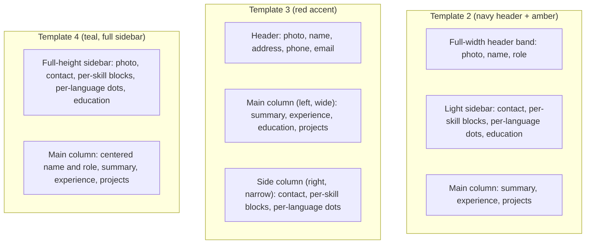
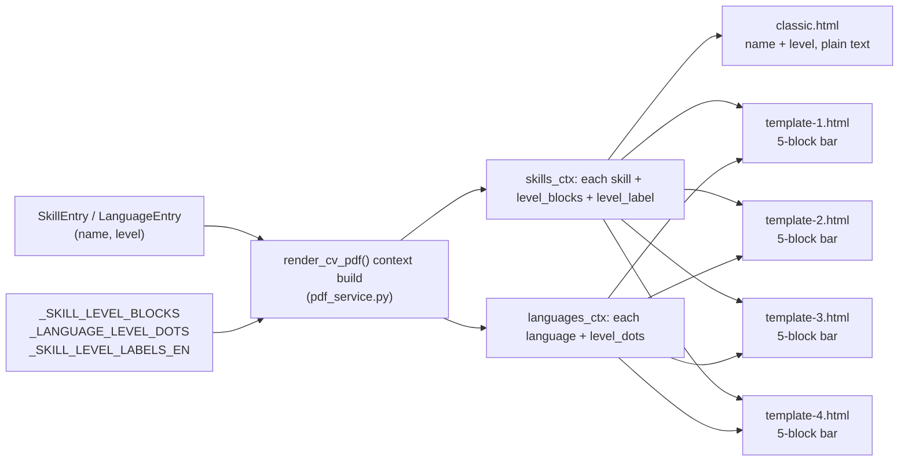

# CV Template Expansion & Skill Blocks - Plan

## Goal Capsule

- **Objective:** Add three new selectable CV templates to the Builder (matching the user's supplied ResumeKraft reference designs), and replace category-grouped skill bars with individual per-skill 5-block level bars across every template except Classic, removing the skill category concept from the product entirely.
- **Product authority:** This plan activates `docs/plans/2026-09-12-001-feat-cv-preview-templates-plan.md`'s parked "Template 2-4" scope boundary, and supersedes the skill-category-grouping behavior introduced in commit `f00f5c1` (`group_skills()`, category-grouped bars) — this plan's Requirements and Key Decisions are the current source of truth for skill and language proficiency rendering.
- **Stop conditions:** Stop and ask before adding a template beyond the three specified, before migrating or stripping already-stored `category` data, or before extending block-bars/dots to Classic's text rendering.
- **Execution profile:** `execution: code`. Backend: FastAPI, Jinja2, WeasyPrint, Alembic, pytest. Frontend: Angular 17 (standalone components, signals, reactive forms), Karma/Jasmine.
- **Tail ownership:** Implementer runs `pytest` (backend) and `ng test` (frontend), plus a manual preview/export click-through on a rebuilt Docker backend.
- **Open blockers:** None.

---

## Product Contract

### Summary

Grow the template picker from two templates to five by adding three new designs, and change how skill and language proficiency renders: every template except Classic shows each skill as its own row with a 5-block level bar and each language with the existing 6-dot CEFR indicator; Classic keeps plain text, now per-skill instead of per-category. The skill category concept is removed from the data model, the Builder form, and AI import.

### Problem Frame

The Builder currently offers two templates: Classic (plain-text skill/language tags) and Template 1 (skills grouped by category, one bar per group showing the group's highest level). The category-grouping mechanism shipped one day before this plan (commit `f00f5c1`). Grouping hides each skill's individual level behind a group average, which the user now wants reversed in favor of showing every skill's own level directly. Separately, the user supplied three additional reference CV designs they want available as selectable templates, each already demonstrating real per-skill/per-language proficiency indicators (blocks and dots) when rendered with sample data.

### Key Decisions

- **Additive template set** (session-settled: user-directed — chosen over replacing Classic or Template 1). The three new designs join the existing two for five templates total. Governs R1.
- **Skill category is removed from the product entirely** — schema, Builder form, and AI import mapping — not merely hidden from rendering (session-settled: user-directed — chosen over keeping the field for unused organization, since nothing will read it once grouping is gone). Governs R7, R8, R9.
- **Skills render individually everywhere except Classic** (session-settled: user-directed). Every template but Classic shows one row per skill with a 5-block bar; Classic keeps a plain-text per-skill list with no bar (session-settled: user-directed — Classic explicitly excluded from the visual upgrade). Governs R3, R4, R5.
- **Languages keep the existing 6-dot CEFR indicator**, extended unchanged to the three new templates (session-settled: user-directed, per the original "blocks and circles" framing; the dot mechanism is already proven in `template-1.html`). Governs R6.
- **The 4-tier skill scale maps onto 5 blocks as Grundkenntnisse=2/5, Gut=3/5, Sehr gut=4/5, Experte=5/5**, so no level ever renders fully empty (session-settled: user-approved via synthesis, over a 1/5-4/5 alternative). Governs R4.
- **Already-stored `category` values are left inert, not migrated** (session-settled: user-directed — no data migration, since the field simply stops being read or written). Governs R9.

### Requirements

**Templates**

- R1. The selectable CV template set grows to five: the existing `classic` and `template-1`, plus three new templates matching the supplied reference designs — a navy-header/amber-sidebar layout, a red-accent layout with skills/languages in a right-hand column, and a full-height teal sidebar layout. All five appear in the template picker with distinct labels, fetched from `GET /cv-builder/templates`.
- R2. A saved profile's `template_id` continues to persist through the existing save flow for all five template ids, and picker behavior for a missing or unknown stored id (auto-select the first template) is unchanged.

**Skill proficiency display**

- R3. Every template except Classic renders each skill as its own row: the skill name plus a bar of 5 discrete blocks, with the filled-block count set by the skill's level. No skill grouping or category label appears in this rendering.
- R4. The block-bar fill mapping is Grundkenntnisse -> 2 of 5 filled, Gut -> 3 of 5, Sehr gut -> 4 of 5, Experte -> 5 of 5.
- R5. Classic renders each skill individually as plain text with its level appended in English (e.g., "Python — Expert", via the existing `_SKILL_LEVEL_LABELS_EN` mapping the CV already uses since the app renders CVs in English), one skill per line, with no category label and no bar.

**Language proficiency display**

- R6. Every template except Classic renders each language as its own row with the existing 6-dot CEFR indicator (1 dot per tier, A1=1 through C2=6). Classic's language rendering (plain text with the level appended, already per-language) is unchanged.

**Category removal**

- R7. The Skills form in the Builder no longer offers a category input; a skill entry is name and level only.
- R8. The AI CV-import path no longer extracts or maps a skill category; parsed skills carry name and level only.
- R9. Existing stored skill entries that already carry a `category` key continue to render correctly; the key is not read, written, or migrated going forward.

### Template Layouts

### Key Flows

- F1. Select and preview a new template.
  - **Trigger:** User picks one of the five templates on the Vorschau & Export tab.
  - **Steps:** Template list loads from `GET /cv-builder/templates` → user selects a template → current profile content renders in that template's layout, with per-skill blocks and per-language dots (or Classic's plain text) reflecting real stored levels.
  - **Covers:** R1, R2, R3, R5, R6.
- F2. Change a skill's level and see it reflected.
  - **Trigger:** User edits a skill's level in the Skills form.
  - **Steps:** Form updates the skill entry → save persists it to the profile → the next preview shows the updated block count (or updated text level on Classic).
  - **Covers:** R3, R4, R5.

### Acceptance Examples

- AE1. **Covers R1, R2.** When the template picker loads, `GET /cv-builder/templates` returns exactly five templates, including the three new ones, each with a distinct label.
- AE2. **Covers R3, R4.** Given a skill at level "Sehr gut", when previewed on any non-Classic template, then its bar shows 4 of 5 blocks filled and no category text appears anywhere near it.
- AE3. **Covers R5.** Given the same skill on Classic, when previewed, then it renders as plain text ("Very good" appended to the skill name) with no bar and no category.
- AE4. **Covers R6.** Given a language at level "B2", when previewed on any non-Classic template, then its indicator shows 4 of 6 dots filled.
- AE5. **Covers R7, R8.** Given the Skills form, when a user adds a skill, no category field is presented; given an AI-imported CV, parsed skills carry no category.
- AE6. **Covers R9.** Given an existing profile whose stored skill entries include a leftover `category` key from before this change, when previewed or exported, rendering succeeds unchanged and the key is ignored.

### Scope Boundaries

- Classic's plain-text style is not upgraded to blocks or dots.
- The proficiency scales are unchanged: skills stay the existing 4-tier German scale, languages stay CEFR A1–C2.
- No migration strips existing stored `category` values (R9).
- Pixel-level fidelity to the reference HTML/screenshots beyond layout, color scheme, and the block/dot mechanism is a planning concern, not fixed here.

### Dependencies / Assumptions

- The three reference HTML files and their rendered screenshots are the visual source of truth for the new templates' layout and color scheme, saved at `docs/plans/assets/cv-template-expansion-skill-blocks/template-2-reference.html` (navy-header/amber), `template-3-reference.html` (red-accent), and `template-4-reference.html` (teal-full-sidebar), each with a matching `*-reference-rendered.jpg`. Translating them into the existing WeasyPrint `table`/`table-cell` pattern (chosen in `template-1.html` for correct page fragmentation) is an implementation concern.
- New templates take ids `template-2`, `template-3`, `template-4` and labels "Template 2", "Template 3", "Template 4", in the same order as the supplied files (settled by KTD7).
- The existing preview/export divergence (muted sample content in preview when a field is empty, established in `docs/plans/2026-09-12-001-feat-cv-preview-templates-plan.md`) applies unchanged to the three new templates.
- Photo placeholders in the new templates use a local asset or inline CSS rather than the reference HTML's remote `placehold.co` URLs, consistent with the existing local-only `url_fetcher` constraint (`backend/app/services/pdf_service.py`).
- Berufsbezeichnung renders beneath the name in all three new templates, consistent with Classic and Template 1.

### Sources / Research

- Prior plan: `docs/plans/2026-09-12-001-feat-cv-preview-templates-plan.md` (established preview/export divergence, sample content, and the "Template 2-4 parked" boundary this plan activates).
- Category-grouping commit: `f00f5c1` ("fix(cv-builder): keep template 1 on page 1, render English, group skills") — introduces the `category`/`group_skills()` mechanism this plan reverses.
- Data model: `backend/app/schemas/master_profile.py` (`SkillEntry`, `LanguageEntry`, `SkillLevel`, `LanguageLevel`, `SkillCategory`).
- Working bar/dot reference implementation: `backend/app/templates/cv/template-1.html` (`level_widths` skill bar, `lang_dots` language dots).
- Template registry and grouping logic: `backend/app/services/pdf_service.py` (`CvTemplateId`, `CV_TEMPLATES`, `group_skills()`).
- Frontend forms: `frontend/src/app/pages/cv-builder/sections/skills-section.component.ts`, `frontend/src/app/pages/cv-builder/sections/languages-section.component.ts`.
- Reference designs: `docs/plans/assets/cv-template-expansion-skill-blocks/template-2-reference.html`, `template-3-reference.html`, `template-4-reference.html`, and their matching `*-reference-rendered.jpg` screenshots — saved from a "ResumeKraft" reference set the user supplied.
- WeasyPrint pagination lesson: `docs/solutions/ui-bugs/weasyprint-flexbox-does-not-fragment-across-pages.md` — a page-spanning two-column `display:flex` layout does not fragment correctly across PDF pages; `template-1.html` already fixed this with `display:table`/`table-cell`.
- AI import prompt and schema: `backend/app/services/pdf_parser.py` (`_SYSTEM_PROMPT`, `ParsedSkill`).
- Frontend category wiring: `frontend/src/app/pages/cv-builder/cv-section-forms.util.ts` (`SKILL_CATEGORIES`, `DEFAULT_SKILL_CATEGORY`, `createSkillGroup`), `frontend/src/app/pages/cv-builder/sections/skills-section.component.ts`, `frontend/src/app/pages/cv-builder/import/cv-import.component.ts`, `frontend/src/app/core/models/master-profile.model.ts`.

---

## Planning Contract

### Product Contract Preservation

Product Contract unchanged. KTD9 below makes explicit that R3/R4 (5-block skill bars) apply to Template 1, not only the three new templates — already covered by the Product Contract's "every template except Classic" wording, so this is a clarification, not a scope change.

### Key Technical Decisions

- KTD1. Per-skill block-fill-count and per-language dot-fill-count are computed once, server-side, in `backend/app/services/pdf_service.py` (`_SKILL_LEVEL_BLOCKS`, `_LANGUAGE_LEVEL_DOTS`) and attached to each entry in the render context, rather than duplicating level-to-visual maps as local `` blocks in each of the four non-Classic templates. The mapping is now shared across four templates instead of being `template-1`-local, so centralizing it avoids four copies drifting independently. Governs R3, R4, R6.
- KTD2. `group_skills()`, `skill_groups`, `sample_skill_groups`, `_SKILL_LEVEL_ORDER`, and `_OTHER_SKILL_CATEGORY` are deleted from `pdf_service.py`; every template iterates `skills`/`sample.skills` directly, one row per skill. Governs R3, R5.
- KTD3. `SkillEntry.category`, `ParsedSkill.category`, and the `SkillCategory` type are deleted from `backend/app/schemas/master_profile.py`, not kept as an unused optional field. A stored skill entry with a stray `category` key from before this change still validates: `SkillEntry` carries no `extra="forbid"` override, so Pydantic's default `extra="ignore"` behavior silently drops the unknown key — no migration needed. Governs R7, R8, R9.
- KTD4. The 4-tier skill scale maps to block-fill-count as Grundkenntnisse=2, Gut=3, Sehr gut=4, Experte=5 (out of 5 blocks) (session-settled: user-approved — chosen over a 1/5–4/5 mapping, keeping a visible minimum fill). Governs R4.
- KTD5. The existing 6-dot CEFR indicator (`template-1.html`'s local `lang_dots` map) becomes the shared `_LANGUAGE_LEVEL_DOTS` map in `pdf_service.py` (KTD1), reused unchanged by Template 1 and the three new templates (session-settled: user-directed). Governs R6.
- KTD6. All three new templates use `display:table`/`display:table-cell` for their page-spanning two-column layout, per `docs/solutions/ui-bugs/weasyprint-flexbox-does-not-fragment-across-pages.md` — never the reference HTML's `display:flex` row layout, which does not fragment correctly once sidebar/column content exceeds one page. Governs R1.
- KTD7. New templates take ids `template-2`, `template-3`, `template-4` and labels "Template 2", "Template 3", "Template 4", mapped to the reference designs in the order supplied (navy-header/amber, red-accent/side-right column, teal-full-sidebar) — resolves the brainstorm's Outstanding Question. Governs R1.
- KTD8. Photo placeholders in the new templates use inline CSS or a local file under `backend/app/templates/cv/`, never the reference HTML's remote `placehold.co` URL, preserving `_LOCAL_ONLY_URL_FETCHER`. Governs R1.
- KTD9. Template 1's skill bar changes from a continuous-width single bar to a 5-segment block bar, matching the visual language of the three new templates, because R3/R4 apply to every template except Classic — including Template 1. Governs R3, R4.
- KTD10. Each skill's block bar and each language's dot row also carries its level as visually hidden text (a `` styled off-canvas, sized to zero, or otherwise not visible in the rendered page) rendered alongside the visible blocks/dots — the skill's English `level_label`, the language's CEFR code (e.g. "B2") — so PDF text extraction (ATS parsers, copy-paste) can still recover the proficiency level even though it is not visually printed. The visible presentation stays blocks/dots only, matching the reference designs; only the underlying PDF text layer gains the label. Governs R3, R6.

### High-Level Technical Design

### System-Wide Impact

- `CV_TEMPLATES`/`CvTemplateId` in `pdf_service.py` stays the single source of truth for valid template ids; the frontend picker is fully data-driven from `GET /cv-builder/templates`, so no frontend template list needs manual updating (same assumption as the prior plan: "no frontend template list is hardcoded in production code").
- The AI CV-import prompt (`pdf_parser.py`'s `_SYSTEM_PROMPT`) currently instructs the model to assign a skill category; removing that instruction changes the parser's JSON contract for future parses. Parsing is synchronous per-request, so no cached response carries the old shape forward.
- Existing stored profiles keep any stray `category` key in `skills_json` harmlessly (KTD3); this plan needs no Alembic migration.
- `docs/solutions/ui-bugs/weasyprint-flexbox-does-not-fragment-across-pages.md` is binding prevention guidance for all three new templates (KTD6).

### Risks & Dependencies

- **Fragmentation regression.** Copying any reference HTML's flex layout verbatim into a new template without applying KTD6 reproduces the exact bug in the WeasyPrint learning doc. Each new template's tests must include a tall-content fragmentation regression test mirroring `TestMultiPageFragmentation` in `backend/tests/services/test_pdf_service.py`.
- **Shared-helper regression.** Centralizing block/dot maps in `pdf_service.py` (KTD1) touches the render context consumed by all five templates. U2's tests must cover Classic and Template 1 alongside the new templates so the refactor cannot silently break already-shipped rendering.
- **Frontend/backend field drift.** `SkillEntry.category` must be removed from both `backend/app/schemas/master_profile.py` and `frontend/src/app/core/models/master-profile.model.ts` in the same change (U1 and U7 land together or in immediate succession) — otherwise the Builder UI keeps soliciting a field the backend schema silently ignores.

### Assumptions

- No text level label is visually printed next to a skill's block bar or a language's dot indicator on the four non-Classic templates, matching the supplied reference designs, which show only name plus visual indicator; KTD10's hidden text is not visible, only present in the underlying PDF text layer.
- The exact accent colors (amber/navy, red, teal) and structural layout (header band, column widths, section order) of the three new templates follow the supplied reference HTML files as closely as WeasyPrint's CSS support allows.

### Sequencing

U1 → {U2, U7} (U2 needs U1's sample-content shape; U7 needs only U1's backend schema shape and lands alongside U2, not last — see the Risks note on frontend/backend field drift) → {U3, U4, U5, U6} (each needs only U2's shared context; all four run independently of each other and of U7).

---

## Implementation Units

### U1. Remove skill category from the backend schema, AI import, and sample content

- **Goal:** Delete the category concept from the backend so nothing produces or requires it going forward.
- **Requirements:** R8, R9.
- **Dependencies:** None.
- **Files:** `backend/app/schemas/master_profile.py`, `backend/app/services/pdf_parser.py`, `backend/app/services/cv_sample_content.py`, `backend/tests/services/test_pdf_parser.py`, `backend/tests/services/test_llm_client.py`, `backend/tests/api/test_cv_builder.py`, `backend/tests/api/test_profile.py`.
- **Approach:**
  1. Delete `SkillEntry.category`, `ParsedSkill.category`, and the `SkillCategory` Literal type from `master_profile.py`.
  2. Remove the `"category"` field and its assignment rule from `pdf_parser.py`'s `_SYSTEM_PROMPT` skills schema.
  3. Remove `"category"` from every skill entry in `cv_sample_content.py`'s `SAMPLE["skills"]`.
- **Patterns to follow:** The existing `SkillLevel`/`LanguageLevel` Literal definitions as the model for a fixed, closed vocabulary field the schema still needs; the docstring convention already used on `SkillEntry`/`ParsedSkill`.
- **Test scenarios:**
  - `SkillEntry(name=..., level=...)` validates without `category`.
  - Covers AE6. `SkillEntry.model_validate({"name": ..., "level": ..., "category": "Frontend"})` (a legacy stored shape) validates successfully and the resulting object has no `category` attribute.
  - `ParsedSkill` validates without `category`; a parser test asserting the old category-bearing JSON no longer expects that key.
  - `_SYSTEM_PROMPT` no longer contains the string `"category"`.
  - `cv_sample_content.SAMPLE["skills"]` entries validate against `SkillEntry` and contain no `category` key.
- **Verification:** `pytest` in `backend` passes.

### U2. Remove category-based skill grouping and add shared block/dot helpers

- **Goal:** Replace grouped-by-category rendering context with per-skill and per-language visual-indicator context shared by every template.
- **Requirements:** R3, R4, R6.
- **Dependencies:** U1.
- **Files:** `backend/app/services/pdf_service.py`, `backend/tests/services/test_pdf_service.py`.
- **Approach:**
  1. Delete `group_skills()`, `_SKILL_LEVEL_ORDER`, and `_OTHER_SKILL_CATEGORY`, and delete the `TestGroupSkills` class in `test_pdf_service.py` (added by `f00f5c1` to exercise the function being removed here — it constructs `SkillEntry(..., category=...)` and calls `group_skills()` directly, so it fails at collection once both are gone).
  2. Add `_SKILL_LEVEL_BLOCKS: dict[str, int]` (KTD4) and `_LANGUAGE_LEVEL_DOTS: dict[str, int]` (KTD5, the values already used by `template-1.html`'s local `lang_dots`).
  3. In `render_cv_pdf`, build `skills_ctx` (each skill's dict plus `level_blocks` and `level_label`, the latter via `_SKILL_LEVEL_LABELS_EN` — Classic needs it for R5's plain text, and KTD10's hidden text reuses it on the other four templates) and `languages_ctx` (each language's dict plus `level_dots`; the language's own `level` field already carries its CEFR code for KTD10's hidden text) for both the real and sample skill/language lists, and pass them into the template context in place of `skill_groups`/`sample_skill_groups`.
- **Patterns to follow:** The existing `_entry_dict()`/`experiences_ctx` normalization pattern already used for experiences/education/projects.
- **Test scenarios:**
  - `_SKILL_LEVEL_BLOCKS` maps Grundkenntnisse→2, Gut→3, Sehr gut→4, Experte→5.
  - `_LANGUAGE_LEVEL_DOTS` maps A1→1 … C2→6.
  - `render_cv_pdf`'s template context includes `skills_ctx`/`languages_ctx` with correct `level_blocks`/`level_label`/`level_dots` per entry (spy on `template.render` kwargs).
  - `group_skills`, `skill_groups`, and `sample_skill_groups` no longer exist/appear in the context, and `TestGroupSkills` no longer exists in `test_pdf_service.py`.
  - Regression: a full-content and an empty-content render still succeed for `classic` and `template-1` (pre-existing behavior not broken by the refactor).
- **Verification:** `pytest` in `backend` passes.

### U3. Update Classic and Template 1 to per-skill rendering

- **Goal:** Classic lists each skill individually as plain text; Template 1's skill bar becomes a 5-block bar instead of a continuous-width bar.
- **Requirements:** R3, R4, R5.
- **Dependencies:** U2.
- **Files:** `backend/app/templates/cv/classic.html`, `backend/app/templates/cv/template-1.html`, `backend/tests/services/test_pdf_service.py`.
- **Approach:**
  - `classic.html`: replace the `group_list`/`` markup with a per-skill loop over `skills_ctx` (falling back to `sample.skills` in preview mode when empty), rendering `{{ skill.name }} — {{ skill.level_label }}` per `<li>` using the `level_label` U2 attaches to each entry, no category text.
  - `template-1.html`: delete the `.skill-row__head` line (currently `group.category` + `group.level_label`) and the `.skill-row__names` line (currently the group's comma-joined skill names) entirely — both reference fields that cease to exist once grouping is removed. The row becomes just the skill name followed by a 5-block bar (5 `` elements, `filled` class on the first `skill.level_blocks` of them), iterating `skills_ctx`/`sample.skills` directly instead of `skill_groups`, plus KTD10's visually hidden `` carrying `skill.level_label`. Leave the existing 6-dot language block structurally as-is, adding only KTD10's hidden `` carrying `language.level` (already compliant with R6 otherwise).
- **Patterns to follow:** The 5-block markup pattern from the supplied reference HTML (`.bar span` with a `filled` modifier class, see `docs/plans/assets/cv-template-expansion-skill-blocks/`); Template 1's existing `.dots i`/`i.off` pattern as the sibling indicator style.
- **Test scenarios:**
  - Covers AE3. Classic renders a skill as plain text with its English level appended, no bar, no category, for both real and sample (preview) skills.
  - Covers AE2. Template 1 renders a 5-`` bar per skill with the correct filled count per level, no category text or grouping, and no leftover `.skill-row__head`/`.skill-row__names` markup.
  - Covers KTD10. Template 1's rendered HTML includes each skill's `level_label` and each language's `level` as hidden text alongside the visible blocks/dots.
  - Both templates still render all six canonical sections for full content.
  - Existing Template 1 fragmentation regression test (`TestMultiPageFragmentation`) still passes after the bar markup change.
- **Verification:** `pytest` in `backend` passes.

### U4. Add Template 2 (navy-header / amber sidebar)

- **Goal:** Add the navy-header/amber reference design as a new selectable template.
- **Requirements:** R1, R2, R3, R4, R6.
- **Dependencies:** U2.
- **Files:** `backend/app/templates/cv/template-2.html` (new), `backend/app/services/pdf_service.py`, `backend/tests/services/test_pdf_service.py`, `backend/tests/api/test_cv_builder.py`. Reference: `docs/plans/assets/cv-template-expansion-skill-blocks/template-2-reference.html` and `template-2-reference-rendered.jpg`.
- **Approach:** Build `template-2.html` from the reference file above: a full-width header band (photo, name, Berufsbezeichnung), a light sidebar (contact, per-skill 5-block bars with KTD10's hidden level text, per-language 6-dot indicators with KTD10's hidden level text, education) built with `display:table`/`table-cell` (KTD6) rather than the reference's flex layout, and a main column (summary, experience, projects). Use a local photo placeholder (KTD8). Add `template-2` to `CvTemplateId`/`CV_TEMPLATES` with label "Template 2" (KTD7).
- **Patterns to follow:** `template-1.html`'s `table`/`table-cell` two-column structure and `@page` footer; U3's 5-block bar markup; `_photo_file_uri`'s no-photo fallback.
- **Test scenarios:**
  - `GET /cv-builder/templates` includes `template-2` labeled "Template 2".
  - Covers R2. Saving a profile with `template_id: "template-2"` persists and reloads correctly, matching the existing persistence behavior for `classic`/`template-1`.
  - `template-2` renders full and empty content without error; at least one unmocked WeasyPrint render returns non-empty `%PDF` bytes.
  - Covers the fragmentation risk (Risks & Dependencies). A sidebar/column taller than one page still keeps the header/name on page 1.
  - Covers AE4. Skill bars and language dots reflect the entered levels (per-level filled counts) — e.g. a language at "B2" shows 4 of 6 dots filled.
  - Covers KTD10. The rendered HTML includes each skill's `level_label` and each language's `level` as hidden text alongside the visible blocks/dots.
  - Berufsbezeichnung renders under the name when set; placeholder in preview when empty, absent in export.
  - No-photo preview shows the placeholder; export omits the image slot.
- **Verification:** `pytest` in `backend` passes.

### U5. Add Template 3 (red accent, skills/languages in a side column)

- **Goal:** Add the red-accent reference design (main content left, contact/skills/languages right) as a new selectable template.
- **Requirements:** R1, R2, R3, R4, R6.
- **Dependencies:** U2.
- **Files:** `backend/app/templates/cv/template-3.html` (new), `backend/app/services/pdf_service.py`, `backend/tests/services/test_pdf_service.py`, `backend/tests/api/test_cv_builder.py`. Reference: `docs/plans/assets/cv-template-expansion-skill-blocks/template-3-reference.html` and `template-3-reference-rendered.jpg`.
- **Approach:** Build `template-3.html` from the reference file above: a header (photo, name, address/phone/email), a wide left column (summary, experience, education, projects) and a narrow right column (contact, per-skill 5-block bars with KTD10's hidden level text, per-language 6-dot indicators with KTD10's hidden level text), using `display:table`/`table-cell` (KTD6) for the two-column body instead of the reference's flex row. Local photo placeholder (KTD8). Add `template-3` to the registry with label "Template 3" (KTD7).
- **Patterns to follow:** Same as U4.
- **Test scenarios:** Same shape as U4's, scoped to `template-3` (registry entry, full/empty render, fragmentation regression, skill/language indicators, Berufsbezeichnung, no-photo placeholder).
- **Verification:** `pytest` in `backend` passes.

### U6. Add Template 4 (teal, full-height sidebar)

- **Goal:** Add the teal full-height-sidebar reference design as a new selectable template.
- **Requirements:** R1, R2, R3, R4, R6.
- **Dependencies:** U2.
- **Files:** `backend/app/templates/cv/template-4.html` (new), `backend/app/services/pdf_service.py`, `backend/tests/services/test_pdf_service.py`, `backend/tests/api/test_cv_builder.py`. Reference: `docs/plans/assets/cv-template-expansion-skill-blocks/template-4-reference.html` and `template-4-reference-rendered.jpg`.
- **Approach:** Build `template-4.html` from the reference file above: a full-height sidebar (photo, contact, per-skill 5-block bars with KTD10's hidden level text, per-language 6-dot indicators with KTD10's hidden level text, education) and a main column (centered name/Berufsbezeichnung, summary, experience, projects), using `display:table`/`table-cell` (KTD6) instead of the reference's flex layout. Local photo placeholder (KTD8). Add `template-4` to the registry with label "Template 4" (KTD7).
- **Patterns to follow:** Same as U4; closest structurally to `template-1.html`'s existing sidebar/main split, differing in accent color and header placement.
- **Test scenarios:** Same shape as U4's, scoped to `template-4`, plus: Covers AE1. With `template-4` added, `GET /cv-builder/templates` returns exactly five templates (`classic`, `template-1`, `template-2`, `template-3`, `template-4`), each with a distinct label.
- **Verification:** `pytest` in `backend` passes.

### U7. Remove the skill category field from the Builder form and AI-import mapping

- **Goal:** Match the frontend to U1's backend schema change so the Skills form and CV import no longer solicit or copy a category.
- **Requirements:** R7, R8.
- **Dependencies:** U1.
- **Files:** `frontend/src/app/core/models/master-profile.model.ts`, `frontend/src/app/pages/cv-builder/cv-section-forms.util.ts`, `frontend/src/app/pages/cv-builder/sections/skills-section.component.ts`, `frontend/src/app/pages/cv-builder/sections/skills-section.component.spec.ts`, `frontend/src/app/pages/cv-builder/import/cv-import.component.ts`, `frontend/src/app/pages/cv-builder/import/cv-import.component.spec.ts`, `frontend/src/app/pages/cv-builder/cv-builder.component.spec.ts`.
- **Approach:** Remove `category` from the `SkillEntry`/parsed-skill interfaces and the `SkillCategory` type in `master-profile.model.ts`. Remove `SKILL_CATEGORIES`/`DEFAULT_SKILL_CATEGORY` and the `category` control from `createSkillGroup()` in `cv-section-forms.util.ts`. Remove the category `mat-select` from `skills-section.component.ts`'s template and its `skillCategories` input. Remove the `category` assignment in `cv-import.component.ts`'s skill-mapping (~line 363). Update fixtures in the listed spec files.
- **Patterns to follow:** The existing `name`/`level` control pair as the resulting shape of a skill `FormGroup`.
- **Test scenarios:**
  - Covers AE5. The Skills form renders name and level controls only, no category select.
  - Adding a skill produces a `{ name, level }` entry with no `category` key.
  - Covers AE5. CV import mapping copies name (and default level) only, no category.
  - Existing fixtures with a `category` value load without error and the loaded form has no category control bound to it (KTD3's ignore-unknown-key behavior mirrored on the frontend by simply not reading the field).
- **Verification:** `ng test` in `frontend` passes.

---

## Verification Contract

| Gate | Command | Applies to | Done signal |
|---|---|---|---|
| Backend tests | `cd backend && pytest` | U1–U6 | Suite green |
| Frontend tests | `cd frontend && ng test` | U7 | Suite green |
| Template render (unmocked) | `cd backend && pytest tests/services/test_pdf_service.py` | U2–U6 | At least one real WeasyPrint render per template (5 total) returns non-empty `%PDF` bytes for full and empty content |
| Multi-page fragmentation | `cd backend && pytest tests/services/test_pdf_service.py -k Fragmentation` | U4, U5, U6 | Each new template keeps the header/name on page 1 when its sidebar/column content exceeds one page |
| Manual preview/export | `docker compose up --build -d backend`, then preview and export each of the 5 templates | All | All 5 templates are selectable and render correctly; skill blocks and language dots match the levels entered |
| Visual check | Compare rendered PDFs against the reference files in `docs/plans/assets/cv-template-expansion-skill-blocks/` | U4, U5, U6 | Layout, accent color, and section placement match the references |

## Definition of Done

- R1–R9 are satisfied and traceable to a completed unit.
- Backend `pytest` and frontend `ng test` pass on the final tree.
- All 5 templates render full and empty content without error; the 4 non-Classic templates show correct per-skill block bars and per-language dot indicators; Classic shows per-skill plain text with the level appended.
- No skill category field remains in the Builder form, the AI-import mapping, or the backend schema; `group_skills()` and `SkillCategory` no longer exist anywhere in the codebase.
- Each new template passes a tall-content fragmentation regression test with the header/name on page 1.
- Each skill's block bar and each language's dot row also carries its level as hidden text (KTD10), even though nothing is visually printed beyond the blocks/dots.
- An existing stored profile with a legacy `category` value on a skill entry previews and exports without error.
- No abandoned experimental template code remains in the diff.
