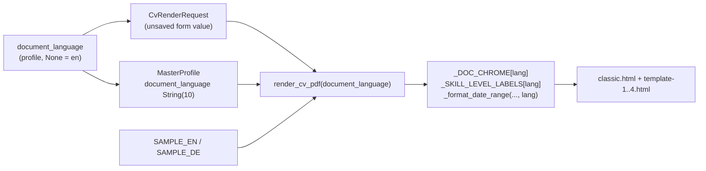

# CV Document Language - Plan

## Goal Capsule

- **Objective:** Add a persisted German/English document-language option to the CV Builder's *Vorschau & Export* tab that localizes the fixed chrome of the generated CV (preview and export), while leaving user-entered and AI-imported content untouched.
- **Product authority:** This plan adds a new persisted profile preference and a render-time localization layer. It does not change the five-template set or the per-skill/per-language rendering mechanisms established in `docs/plans/2026-09-13-001-feat-cv-template-expansion-skill-blocks-plan.md`.
- **Stop conditions:** Stop and ask before translating user or AI-generated content, before changing the app-wide language selector, or before adding per-template language overrides.
- **Execution profile:** `execution: code`. Backend: FastAPI, Jinja2, WeasyPrint, Alembic, pytest. Frontend: Angular 17 (standalone components, signals, reactive forms), Karma/Jasmine.
- **Tail ownership:** Implementer runs `pytest` (backend) and `ng test` (frontend), plus a manual preview/export click-through on a rebuilt Docker backend.
- **Open blockers:** None.

---

## Product Contract

### Summary

Add a "Dokumentsprache" control to the CV Builder's *Vorschau & Export* tab, beside the template picker, that switches the generated CV between German and English. The choice is saved on the profile like the template and defaults to English. It localizes only the document's fixed chrome — section headings, skill-level labels, open-ended date wording, page footer, title, photo placeholder/alt text, and the `html lang` attribute — plus a German variant of the built-in preview sample content.

### Problem Frame

The CV Builder form and the documents it generates are German-first in every respect except the rendered CV: the form labels, tabs, and sample data read German, but every rendered CV is hardcoded English (`<html lang="en">`, `Resume - …`, `Page X of Y`, English section headings, `_SKILL_LEVEL_LABELS_EN`). A German-speaking applicant has no way to produce a German CV, and the one German string that does leak through — `_format_date_range`'s `"seit"` for open-ended roles — makes the English output internally inconsistent. The app-wide language selector in the top nav cannot address this: it drives UI labels, not the generated document, and the CV Builder form does not consume it at all.

### Key Decisions

- **Document language is a persisted profile preference, default English when unset** (session-settled: user-directed — chosen over a transient, export-only choice, so the setting is remembered per profile like the template). Governs R1, R2, R3.
- **Only the fixed document chrome localizes** (session-settled: user-directed — chosen over also localizing AI-generated content). User-entered and AI-imported content is never translated, so a German CV over imported text shows German headings around English body text. Governs R5, R6, R7.
- **The control lives on the Vorschau & Export tab beside the template picker** (session-settled: user-directed — chosen over a form-section field or a page-header toggle, since both are persisted document settings and the preview shows the effect immediately). Governs R1.
- **The preview's sample content gains a German variant selected by the document language** (session-settled: user-directed — chosen over leaving the English sample content, so a German preview reads fully German). Governs R8.
- **German skill-level labels reuse the existing German `SkillLevel` enum values** (Grundkenntnisse/Gut/Sehr gut/Experte), rather than a second German mapping. Governs R5.
- **Open-ended date ranges become language-aware**: German keeps `seit {start}`, English uses `{start} – present`, removing the current German leak into English output. Governs R5.

### Requirements

**Document language option and persistence**

- R1. The CV Builder's Vorschau & Export tab presents a document-language control beside the template picker, offering German and English.
- R2. The selected document language persists on the profile through the existing save flow and is restored when the CV Builder loads; changing it counts as an unsaved change.
- R3. A profile that has never chosen a document language renders in English.

**Localized document rendering**

- R4. Both preview and export render the fixed document chrome in the selected language.
- R5. The localized chrome comprises: section headings (Profile/Experience/Education/Skills/Languages/Projects/Contact), skill-level labels, open-ended date-range wording, page footer, document title, photo placeholder and alt text, and the `html lang` attribute.
- R6. User-entered CV content (summary, descriptions, names, and date values) is never translated; it renders verbatim in either language. The open-ended range connector is chrome and localizes per R5.
- R7. AI-imported content is unaffected by the document language — the importer keeps producing English content and the document language never triggers re-translation.

**Preview sample content**

- R8. The built-in preview sample content has a German variant, and the variant matching the selected document language is shown when fields are empty.

**Profile integration**

- R9. The Profile page's full-overwrite save preserves the stored document language rather than resetting it.

### Key Flows

- F1. Choose a document language and see it in the preview.
  - **Trigger:** User selects German or English on the Vorschau & Export tab.
  - **Steps:** The control updates → the preview re-renders with localized chrome (and German sample content when fields are empty) → the unsaved-changes guard trips until the profile is saved.
  - **Covers:** R1, R2, R4, R5, R8.
- F2. Save and export in the chosen language.
  - **Trigger:** User saves the profile, then exports the CV.
  - **Steps:** The save persists the language → the export renders the fixed chrome in that language.
  - **Covers:** R2, R4, R5.
- F3. Edit personal details without losing the CV language.
  - **Trigger:** User edits personal data on the Profile page and saves.
  - **Steps:** The Profile page's full-overwrite payload carries the stored document language → the CV language is unchanged on the next render.
  - **Covers:** R9.

### Acceptance Examples

- AE1. **Covers R3.** Given a profile that has never chosen a document language, when its CV is previewed or exported, then the chrome renders in English.
- AE2. **Covers R4, R5.** Given German is selected, when the CV is previewed or exported, then the section headings, page footer, title, photo placeholder/alt text, and `html lang` are German, and skill levels read Grundkenntnisse/Gut/Sehr gut/Experte.
- AE3. **Covers R6.** Given a German document whose summary the user typed in English, when rendered, then the summary text is unchanged.
- AE4. **Covers R8.** Given German is selected and the summary is empty, when previewed, then the German sample summary appears.
- AE5. **Covers R9.** Given German is saved, when the user edits personal details on the Profile page and saves, then the CV still renders German.
- AE6. **Covers R5.** Given an experience with a start date and no end date, when rendered in English the date reads with `present`, and when rendered in German it reads `seit {start}`.

### Scope Boundaries

- The CV Builder's own form labels, placeholders, and tabs stay German-hardcoded; the app-wide language selector is unchanged and does not drive the document.
- AI CV import and cover-letter generation stay English-only (per R7).
- The exported PDF filename stays English (`resume_<name>.pdf`).
- Classic and the four non-Classic templates keep their existing layout, typography, and colors; only their text strings localize.

### Dependencies / Assumptions

- `render_cv_pdf` is the only CV render path (called solely from `backend/app/api/cv_builder.py`), so the option applies uniformly to all five templates with no separate per-template handling.
- German chrome wording follows the app's existing German vocabulary where it exists (e.g. "Profil", "Berufserfahrung", "Ausbildung", "Sprachen", "Projekte", "Kontakt"); "Skills" stays "Skills" as in the app's own German UI.
- Adding a persisted profile field means a new Alembic migration for the Postgres/production path; SQLite dev still relies on `create_all()`, which cannot add a column to an existing table — developers with an existing `app.db` must recreate it or run the new revision against it.
- The existing preview/export divergence (sample content fills empty fields in preview only, established in `docs/plans/2026-09-12-001-feat-cv-preview-templates-plan.md`) is unchanged, now with a language-matched sample.

### Sources / Research

- Render path and English-only chrome: `backend/app/services/pdf_service.py` (`_SKILL_LEVEL_LABELS_EN`, `_format_date_range`, `render_cv_pdf`, `CvTemplateId`, `CV_TEMPLATES`).
- Templates: `backend/app/templates/cv/classic.html`, `template-1.html`, `template-2.html`, `template-3.html`, `template-4.html` (hardcoded English headings, title, footer, photo alt/placeholder).
- Preview sample content: `backend/app/services/cv_sample_content.py` (single English `SAMPLE`).
- Render API: `backend/app/api/cv_builder.py` (`CvRenderRequest`, preview/export endpoints).
- Persistence: `backend/app/models/master_profile.py` (`template_id` column precedent), `backend/app/schemas/master_profile.py` (`MasterProfileBase`/`MasterProfileUpdate`).
- Profile full-overwrite save: `frontend/src/app/pages/profile/profile.component.ts` (`submitWithBase`).
- Frontend CV Builder: `frontend/src/app/pages/cv-builder/cv-builder.component.ts` (`templateIdControl`, save payload, `hasUnsavedChanges`), `frontend/src/app/pages/cv-builder/export/cv-preview-export.component.ts` (template picker, `buildPayload`), `frontend/src/app/core/models/master-profile.model.ts`.
- Existing app-wide i18n (UI only, not the document): `frontend/src/app/core/services/translation.service.ts`, `frontend/src/app/core/i18n/translations.ts`.
- Prior plan: `docs/plans/2026-09-13-001-feat-cv-template-expansion-skill-blocks-plan.md`.
- Migration-graph lesson: `docs/solutions/database-issues/alembic-migration-rebase-silently-skips-sibling-branch.md` — never rebase an already-applied revision's `down_revision`; new migrations parent on the current single head.

---

## Planning Contract

### Product Contract Preservation

Product Contract unchanged.

### Key Technical Decisions

- KTD1. All document chrome strings live in one per-language label map in `backend/app/services/pdf_service.py`, passed to every template as a single context value, rather than per-template `` branches. Five templates share the same headings, footer, placeholder, and title noun, so one map prevents five copies drifting. Governs R5.
- KTD2. `document_language` is a nullable profile column (`String(10)`) where `None` means English; the Pydantic field is `DocumentLanguage | None` with `DocumentLanguage = Literal["de", "en"]`. The new Alembic revision parents on the current single head `c3d5e7f9a1b2` and never rewrites an existing revision's `down_revision`. Governs R2, R3.
- KTD3. The render request carries `document_language` from the current form state (like `template_id`), so preview and export reflect unsaved changes; when the request omits it, the API falls back to the loaded profile's stored value, then to `"en"`. `render_cv_pdf` takes a `document_language` parameter and treats `None` as `"en"`. Governs R4, R5.
- KTD4. German skill-level labels are the `SkillLevel` enum values themselves; English keeps `_SKILL_LEVEL_LABELS_EN`. `_format_date_range` takes the language: English open-ended ranges render `{start} – present`, German keeps `seit {start}`. Governs R5.
- KTD5. `backend/app/services/cv_sample_content.py` exposes one sample per language (`SAMPLE_EN`, `SAMPLE_DE`); `render_cv_pdf` selects by document language when previewing without an explicit `sample` argument. Governs R8.
- KTD6. The control is a `mat-button-toggle-group` bound to a new `documentLanguageControl` on `CvBuilderComponent`, passed to `CvPreviewExportComponent` exactly as `templateIdControl` is, and included in the save payload and `hasUnsavedChanges()`. Governs R1, R2.

### High-Level Technical Design

### System-Wide Impact

- The new field flows through `MasterProfile`, `MasterProfileBase`, `MasterProfileUpdate`, `MasterProfileRead`, the frontend `MasterProfile`/`ProfileContentUpdate`/`CvRenderPayload`, and `CvRenderRequest`.
- `frontend/src/app/pages/profile/profile.component.ts` saves with a full-overwrite `PUT /profile`; it must carry `document_language` or a profile-page save resets it (R9).
- `render_cv_pdf` has one production caller (`backend/app/api/cv_builder.py`); no application or cover-letter path renders a CV, so no other consumer needs the field.
- The AI parser stays English-only (R7), so imported content is unaffected by the setting.

### Risks & Dependencies

- **Field drift.** The `document_language` field must land on the backend schema (U1) and the frontend model (U5) in the same change, or the Builder sends a value the backend rejects and the control appears inert.
- **Migration graph.** The new revision must parent on head `c3d5e7f9a1b2`. Rebasing any existing revision's `down_revision` would silently strand already-migrated databases (see the learning in Sources).
- **Template coverage.** Missing any one of the five templates leaves English chrome in that template; U3's tests assert localized chrome for all five.
- **Profile-page reset.** Without U6, editing personal details on the Profile page silently resets the CV language to English.

### Assumptions

- The German section headings use the app's existing German vocabulary; "Skills" stays "Skills" to match the app's German UI rather than a CV-specific synonym.
- `None` (rather than a database default) represents "no choice yet", mirroring `template_id`.

### Sequencing

U1 → U2 → {U3, U4} → U5 → U6. U3 needs U2's render context; U4 needs U1's `DocumentLanguage` type and U2's render seam. U5 needs U1's schema shape and U4's request field; U6 needs U1 and U5.

---

## Implementation Units

### U1. Persist document language on the profile

- **Goal:** Add the `document_language` preference to the profile model, schemas, and database.
- **Requirements:** R2, R3, R9.
- **Dependencies:** None.
- **Files:** `backend/app/models/master_profile.py`, `backend/app/schemas/master_profile.py`, `backend/alembic/versions/<new>_add_document_language.py`, `backend/tests/services/test_master_profile_schema.py`, `backend/tests/api/test_profile.py`.
- **Approach:**
  1. Add `DocumentLanguage = Literal["de", "en"]` and `document_language: DocumentLanguage | None = None` to `MasterProfileBase` and `MasterProfileUpdate`.
  2. Add a nullable `document_language` column (`String(10)`) to `MasterProfile`, next to `template_id`.
  3. Add an Alembic revision with `down_revision = 'c3d5e7f9a1b2'` that adds the nullable column in `upgrade()` and drops it in `downgrade()`.
- **Patterns to follow:** The `template_id` column and schema field; existing add-column migrations under `backend/alembic/versions/`.
- **Test scenarios:**
  - `MasterProfileUpdate(document_language="de")` validates; `document_language="fr"` is rejected.
  - `PATCH /profile` with `document_language: "de"` persists it and `GET /profile` returns it.
  - A profile created without the field returns `document_language: null`.
  - Covers R9. A stored profile with `document_language: "de"` round-trips unchanged through `GET`/`PATCH`.
  - The migration upgrade adds `document_language` and the downgrade drops it (round-trip).
- **Verification:** `pytest` in `backend` passes; `alembic upgrade head` on a fresh database adds the column.

### U2. Localize the render context and sample content

- **Goal:** Build the per-language chrome label map and language-aware helpers, and add a German sample.
- **Requirements:** R4, R5, R8.
- **Dependencies:** U1.
- **Files:** `backend/app/services/pdf_service.py`, `backend/app/services/cv_sample_content.py`, `backend/tests/services/test_pdf_service.py`.
- **Approach:**
  1. Add a `_DOC_CHROME: dict[str, dict[str, str]]` map keyed by `de`/`en`, covering each section heading, the footer page wording, the photo alt text and placeholder, and the document title noun.
  2. Resolve German skill-level labels directly from the `SkillLevel` enum values (no separate German map); keep `_SKILL_LEVEL_LABELS_EN` for English and select by language in `_skills_ctx`.
  3. Give `_format_date_range` a `language` parameter: English open-ended ranges render `{start} – present`, German keeps `seit {start}`.
  4. Rename `SAMPLE` to `SAMPLE_EN`, add `SAMPLE_DE` with German date-range wording (`seit …`), and select by language in `render_cv_pdf` when previewing without an explicit `sample`. Update the existing `pdf_service.SAMPLE` references in the service tests to `SAMPLE_EN`.
  5. Add `document_language: str | None = None` to `render_cv_pdf`, resolve `None` to `"en"`, and pass the resolved language, the chrome map, and the localized `level_label` into the template context.
- **Patterns to follow:** The existing server-side centralization of `_SKILL_LEVEL_LABELS_EN`/`_SKILL_LEVEL_BLOCKS`/`_LANGUAGE_LEVEL_DOTS` (prior plan's KTD1).
- **Test scenarios:**
  - Both `_DOC_CHROME` entries define every key the templates consume.
  - Covers AE2. German skill levels map to Grundkenntnisse/Gut/Sehr gut/Experte; English maps to Basic/Good/Very good/Expert.
  - Covers AE6. `_format_date_range("2021", None, "en")` returns `2021 – present`; `_format_date_range("2021", None, "de")` returns `seit 2021`.
  - Covers AE4. `render_cv_pdf(document_language="de", preview=True, ...)` renders the German sample when fields are empty; an explicit `sample=` still overrides.
  - Covers AE4. The German sample's rendered date ranges use German wording, not the English `present`.
  - An omitted `document_language` produces the English context.
- **Verification:** `pytest` in `backend` passes.

### U3. Localize the five CV templates' chrome

- **Goal:** Replace hardcoded English chrome in all five templates with the context labels.
- **Requirements:** R4, R5, R6.
- **Dependencies:** U2.
- **Files:** `backend/app/templates/cv/classic.html`, `template-1.html`, `template-2.html`, `template-3.html`, `template-4.html`, `backend/tests/services/test_pdf_service.py`.
- **Approach:** In each template, replace `<html lang="en">` with the resolved language, the `<title>` noun, the `@page` footer wording, the photo `alt` and placeholder text, and every section heading with the matching context value. Leave the user-content interpolations unchanged.
- **Patterns to follow:** The existing template structure and `{{ }}` interpolation; the context keys U2 defines.
- **Test scenarios:**
  - Covers AE2. For each of the five templates, a German render contains the German headings and none of the English-only heading literals (Profile/Experience/Education/Languages/Projects/Contact); "Skills" is identical in both languages and is exempt.
  - A German render sets `html lang="de"`, the German title, footer, and photo placeholder/alt text.
  - A default (English) render still contains the English headings and `html lang="en"` (regression).
  - Covers AE3. User-entered summary and descriptions render verbatim under both languages.
  - Full and empty content render without error for all five templates.
- **Verification:** `pytest` in `backend` passes.

### U4. Thread document_language through the render API

- **Goal:** Accept the document language on preview/export and forward it to the renderer.
- **Requirements:** R4, R7.
- **Dependencies:** U1, U2.
- **Files:** `backend/app/api/cv_builder.py`, `backend/tests/api/test_cv_builder.py`.
- **Approach:** Add `document_language: DocumentLanguage | None = None` to `CvRenderRequest` and pass it into the `render_cv_pdf` call in `_render_cv_for_current_profile`, falling back to the loaded profile's stored `document_language` when the request omits it.
- **Patterns to follow:** The existing `template_id` field and its pass-through.
- **Test scenarios:**
  - Covers R4. A preview request with `document_language: "de"` calls `render_cv_pdf` with `document_language="de"` (spy).
  - An export request carries the field through the same way.
  - Covers R7. User content supplied through the render request is rendered verbatim under a German document — the document language never translates content.
  - An omitted field falls back to the stored profile language, then English; an invalid value returns 422.
- **Verification:** `pytest` in `backend` passes.

### U5. Add the document-language control and persistence in the CV Builder

- **Goal:** Expose the control beside the template picker and persist it through the Builder save flow.
- **Requirements:** R1, R2.
- **Dependencies:** U1, U4.
- **Files:** `frontend/src/app/core/models/master-profile.model.ts`, `frontend/src/app/pages/cv-builder/cv-builder.component.ts`, `frontend/src/app/pages/cv-builder/cv-builder.component.spec.ts`, `frontend/src/app/pages/cv-builder/export/cv-preview-export.component.ts`, `frontend/src/app/pages/cv-builder/export/cv-preview-export.component.spec.ts`.
- **Approach:**
  1. Add a `DocumentLanguage` type and `document_language` to `MasterProfile`, `ProfileContentUpdate`, and `CvRenderPayload`.
  2. Add a `documentLanguageControl` to `CvBuilderComponent`, defaulting to `'en'`; include it in `applyProfileToArrays`, the `save()` PATCH payload, and `hasUnsavedChanges()`. Normalize the comparison baseline so a stored `null` compares as `'en'` (extend `normalizeProfileSections`, or set `lastSavedProfile`'s value to `profile.document_language ?? 'en'`); otherwise a fresh load of a null-language profile reports unsaved changes with zero edits.
  3. Add a `documentLanguageControl` input to `CvPreviewExportComponent`, render a labelled `mat-button-toggle-group` (Deutsch/English) with `aria-label="Dokumentsprache wählen"` beside the template picker, and include the value in `buildPayload()`. Render the control outside the templates loading/error conditional so it stays available, and let the row wrap or stack on narrow viewports.
- **Patterns to follow:** The `templateIdControl` wiring end to end (parent control, input, picker, payload, dirty check).
- **Test scenarios:**
  - Covers AE1, R3. Loading a profile with `document_language: null` leaves the control on English and `hasUnsavedChanges()` false with zero edits.
  - Selecting German trips `hasUnsavedChanges()` and puts `document_language: "de"` in the PATCH payload.
  - `buildPayload()` includes the selected `document_language`.
  - The control renders a visible label, an accessible name, and two options next to the template picker.
- **Verification:** `ng test` in `frontend` passes.

### U6. Preserve document language through the Profile page save

- **Goal:** Stop the Profile page's full-overwrite PUT from resetting the CV document language.
- **Requirements:** R9.
- **Dependencies:** U1, U5.
- **Files:** `frontend/src/app/pages/profile/profile.component.ts`, `frontend/src/app/pages/profile/profile.component.spec.ts`.
- **Approach:** Add `document_language: base?.document_language ?? null` to the payload built in `submitWithBase`, next to the existing `template_id` line.
- **Patterns to follow:** The `template_id` preservation line in `submitWithBase`.
- **Test scenarios:**
  - Covers AE5. Saving personal details after German was stored sends `document_language: "de"` in the PUT payload.
  - A profile without the field sends `null` without error.
- **Verification:** `ng test` in `frontend` passes.

---

## Verification Contract

| Gate | Command | Applies to | Done signal |
|---|---|---|---|
| Backend tests | `cd backend && pytest` | U1–U4 | Suite green |
| Frontend tests | `cd frontend && ng test` | U5, U6 | Suite green |
| Migration round-trip | `cd backend && pytest tests/services/test_master_profile_schema.py` | U1 | `document_language` is added by upgrade and dropped by downgrade |
| Template render | `cd backend && pytest tests/services/test_pdf_service.py` | U2–U3 | German and English chrome verified for all five templates |
| Manual preview/export | Rebuild the backend, select German on *Vorschau & Export* | All | Preview and export show German chrome; switching back shows English |
| Field parity | `rg -n "document_language" backend/app frontend/src` | U1, U5, U6 | Backend schema, API request, and frontend model all carry the field |

## Definition of Done

- R1–R9 are satisfied and traceable to a completed unit (R7 is an unchanged-invariant regression, covered by U4's verbatim-content scenario).
- Backend `pytest` and frontend `ng test` pass on the final tree.
- All five templates render German chrome on request; user-entered and AI-imported content is unchanged.
- `document_language` persists through the Builder save and survives a Profile page save.
- The Alembic migration applies cleanly on the current head; no existing revision's `down_revision` was changed.
- No hardcoded English section heading, title, footer, or photo placeholder remains in the five templates.
- No abandoned experimental template or localization code remains in the diff.
