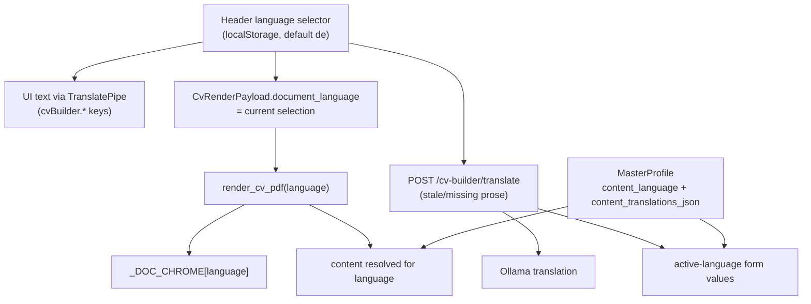

# Global Language Unification - Plan

## Goal Capsule

- **Objective:** Make the header language selector the single language control for the app. It drives all UI text, user CV/profile prose (stored per language with automatic AI translation), the CV document chrome, and the generated CV PDF. The CV Builder's per-profile "Dokumentsprache" control and its persisted profile field are removed.
- **Product authority:** This plan supersedes the per-profile document-language control from `docs/plans/2026-09-13-002-feat-cv-document-language-plan.md`; that plan's server-side chrome localization is reused, only the source of the language changes from a profile field to the global selection.
- **Stop conditions:** Stop and ask before translating externally sourced content, before changing cover-letter generation away from German, or before adding languages beyond German and English.
- **Execution profile:** `execution: code`. Backend: FastAPI, Ollama, Alembic, pytest. Frontend: Angular 17 (standalone components, signals, reactive forms), Karma/Jasmine.
- **Tail ownership:** Implementer runs `pytest` (backend) and `ng test` (frontend), plus a manual click-through of the language switch on a rebuilt Docker backend.
- **Open blockers:** None.

---

## Product Contract

### Summary

The header language selector becomes the app's only language control. Switching it changes every UI label, form, and message; translates the user's CV/profile prose into the other language while preserving both versions; and renders the CV document and PDF in the selected language. The separate "Dokumentsprache" control in the CV Builder and the per-profile document-language field are removed.

### Problem Frame

Language is currently split across two unrelated controls. The header selector drives a runtime UI dictionary that covers some pages but not the CV Builder, which is hardcoded German. The CV document language is a separate per-profile setting in the Vorschau & Export tab, independent of the UI. AI text is hardcoded too: CV import forces English while cover letters force German. The user therefore cannot switch to English once and have the app — UI, forms, their own CV content, and the exported PDF — follow; they must manage two settings and still hand-translate their own content.

### Key Decisions

- **The header selector is the only language control; the per-profile document language is removed** (session-settled: user-directed — chosen over keeping a separate document-language override). Governs R1, R2.
- **Both language versions of user prose are stored, with the inactive version derived** (session-settled: user-directed — chosen over overwriting the stored text or translating only at render time). Governs R5, R7.
- **Editing a field re-translates the other language automatically** (session-settled: user-directed — chosen over keeping the two versions independent). Governs R7.
- **Translation runs automatically on language switch** (session-settled: user-directed — chosen over on-demand or on-save). Governs R6.
- **Only prose is translated; proper nouns are untouched** (session-settled: user-directed — chosen over translating every text field). Governs R8.
- **CV-import extraction follows the selected language, while cover letters always stay German** (session-settled: user-directed). Governs R10, R11.
- **The CV document now defaults to the app's default language (German)** (session-settled: user-directed, confirmed via synthesis — this reverses the prior plan's "default English when unset" now that no per-profile setting exists). Governs R2.

### Requirements

**Single language control**

- R1. The header language selector is the app's only language control; the CV Builder's "Dokumentsprache" control and the persisted per-profile document language are removed.
- R2. The selected language drives the generated CV document (fixed chrome and PDF) as well as all app UI text.

**UI language coverage**

- R3. The CV Builder's own text — tabs, section headings, field labels, placeholders, buttons, and empty, loading, and error states — renders in the selected language; skill-level option labels localize while their stored values stay unchanged.
- R4. Every other page's user-facing text renders in the selected language; no page remains hardcoded German.

**Content language**

- R5. Translatable prose is stored in both languages; the active language is shown and editable while the other version is preserved.
- R6. Switching language automatically translates missing or stale target-language prose in the background, without blocking the switch.
- R7. Editing a prose field in the active language marks the other language's copy stale and re-translates it.
- R8. Translatable prose is the CV summary, Berufsbezeichnung, experience role and descriptions, project titles and descriptions, education degree and field, and language names; proper nouns (person, company, institution, skill names) and contact details are never translated.
- R9. A failed translation keeps the original text and surfaces the failure; content is never lost.

**AI-generated content**

- R10. CV-import extraction produces its text in the selected language.
- R11. Cover-letter generation always produces German, regardless of the selected language.

### Key Flows

- F1. Switch language and see everything follow.
  - **Trigger:** User picks German or English in the header.
  - **Steps:** UI text switches instantly → CV Builder and Profile prose with a missing or stale target-language version start translating in the background → fields update as translations arrive → preview and export render the document in the selected language.
  - **Covers:** R1, R2, R3, R4, R5, R6.
- F2. Edit prose in the active language.
  - **Trigger:** User edits a CV Builder or Profile prose field.
  - **Steps:** The active-language version updates → the other language is marked stale → it re-translates → switching language shows the updated translation.
  - **Covers:** R5, R7, R9.
- F3. Import a CV in the selected language.
  - **Trigger:** User runs CV import.
  - **Steps:** Extraction returns text in the selected language → the user reviews and saves it.
  - **Covers:** R10.
- F4. Generate a cover letter.
  - **Trigger:** User generates an application.
  - **Steps:** The cover letter is produced in German regardless of the selected language.
  - **Covers:** R11.

### Acceptance Examples

- AE1. **Covers R1, R2.** Given the CV Builder is open, when it loads, then no "Dokumentsprache" control is present and the header selector is the only language control.
- AE2. **Covers R3.** Given the header is English, when the CV Builder form renders, then its tabs, labels, placeholders, buttons, and empty states are English, and skill-level options show English labels.
- AE3. **Covers R5, R6.** Given a profile whose prose exists only in German, when the user switches the header to English, then each translatable field's English version is generated and the German original is preserved.
- AE4. **Covers R7.** Given both versions of a field exist, when the user edits the English summary, then the German summary is marked stale and re-translated.
- AE5. **Covers R8.** Given a CV whose experience lists company "Beispiel GmbH", when translated to English, then the company name is unchanged.
- AE6. **Covers R9.** Given translation fails for a field, when the user switches language, then the field shows its original text and the failure is surfaced.
- AE7. **Covers R11.** Given the header is English, when a cover letter is generated, then the letter is German.
- AE8. **Covers R10.** Given the header is English, when a CV is imported, then the extracted text is English.

### Scope Boundaries

- Externally sourced content is not translated: job offers and descriptions, company and institution names, skill names, and contact details.
- Cover letters stay German; backend API `detail` strings stay as they are — the frontend owns user-facing error text.
- Only German and English are supported, and the AI provider/model is unchanged.

### Dependencies / Assumptions

- The Profile page and the CV Builder edit the same master profile content, so per-language prose applies to both surfaces.
- Existing single-language profiles are treated as German (the app default); the English version is generated on first need.
- The local Ollama model is the translation engine; no external translation service is added.
- Translation is best-effort: a failure keeps the original and does not block the language switch.
- The global language stays client-side (localStorage); preview, export, translate, and import send the current selection per request.

### Sources / Research

- Prior plan: `docs/plans/2026-09-13-002-feat-cv-document-language-plan.md` (server-side chrome localization reused; per-profile control superseded).
- UI i18n: `frontend/src/app/core/services/translation.service.ts`, `frontend/src/app/core/i18n/translations.ts`, `frontend/src/app/layout/nav-layout/nav-layout.component.html`.
- CV Builder (hardcoded German, no translation): `frontend/src/app/pages/cv-builder/cv-builder.component.ts`, `sections/*`, `import/cv-import.component.ts`, `export/cv-preview-export.component.ts`.
- Document language plumbing: `frontend/src/app/core/models/master-profile.model.ts`, `backend/app/schemas/master_profile.py`, `backend/app/models/master_profile.py`, `backend/alembic/versions/e2b7c9a41f60_add_document_language.py`, `backend/app/api/cv_builder.py` (`CvRenderRequest`), `backend/app/services/pdf_service.py` (`render_cv_pdf`, `_DOC_CHROME`).
- AI text language: `backend/app/services/pdf_parser.py` (forces English), `backend/app/services/ai_generator.py` (forces German cover letters).
- Shared master-profile content: `frontend/src/app/pages/profile/profile.component.ts`, `frontend/src/app/pages/cv-builder/cv-builder.component.ts`.

---

## Planning Contract

### Product Contract Preservation

Product Contract unchanged.

### Key Technical Decisions

- KTD1. The master profile stores the active language's content in the existing `summary`/`berufsbezeichnung`/`*_json` fields, adds `content_language` (which language those fields hold), and adds `content_translations_json` holding the other language's prose snapshot. On save the frontend sends the active content, `content_language`, and the inactive snapshot, and the server stores all three; a user edit clears the inactive snapshot so it re-translates. Governs R5, R7.
- KTD2. Translation is a server-side service over the existing local Ollama client, exposed as `POST /cv-builder/translate` taking `{source_language, target_language, fields}` and returning per-field translations. A failed field returns an error entry; the caller keeps the original. Governs R6, R9.
- KTD3. The global language is the single source: the frontend sends the current selection on preview/export/translate/import. The per-profile `document_language` column, schema field, and control are removed (migration drops the column). Governs R1, R2.
- KTD4. The render context resolves the active language's content before building the template context; `_DOC_CHROME` is reused unchanged. `render_cv_pdf`'s internal default becomes `de` (the app default). Governs R2.
- KTD5. CV Builder UI text moves into `translations.ts` under a `cvBuilder.*` namespace; every CV Builder component imports `TranslatePipe`; skill-level option labels map the stored German enum values to translated labels. Governs R3, R4.
- KTD6. The frontend edits the active language's content and triggers translation of missing/stale fields on language switch and after an edit, showing a per-field translating state. Governs R5, R6, R7, R9.
- KTD7. CV-import extraction accepts the selected language; the cover-letter prompt is unchanged. Governs R10, R11.
- KTD8. Backend API `detail` strings stay German; the frontend owns user-facing error text (it already maps status codes). Governs the error-text scope boundary.

### High-Level Technical Design

### System-Wide Impact

- The master-profile schema changes: `document_language` is dropped; `content_language` and `content_translations_json` are added. This flows through the Pydantic schemas, the ORM model, an Alembic migration, and the frontend models.
- Both the Profile page and the CV Builder read and write the same content, so both must adopt the same bilingual handling.
- A new translation endpoint adds Ollama load; the app already warns that local AI runs without GPU.
- Every CV Builder component gains `TranslatePipe`, and `translations.ts` grows a `cvBuilder.*` namespace.

### Risks & Dependencies

- **Translation latency.** A full CV translation is several Ollama calls; the UI must stay responsive and show progress, and a failure must not lose content.
- **Schema migration.** Dropping `document_language` and adding the content-language fields must round-trip; existing content is assumed German.
- **i18n completeness.** Any CV Builder string missed leaves German text in an English UI; tests should scan for remaining hardcoded strings.
- **Shared content.** Profile and CV Builder must not diverge in how they store/translate the same fields.

### Assumptions

- Existing profile content is German; `content_language` defaults to `de`.
- The local Ollama model is an adequate de↔en translator; no external service is added.

### Sequencing

U1 → U2 → {U3, U4} → U5 → U6 → U7. U1 establishes the content model and translation endpoint; U2 removes the old language field and switches render/import; U3 and U4 are independent frontend slices; U5 and U6 consume both; U7 hardens coverage.

---

## Implementation Units

### U1. Add per-language content storage and the translation endpoint

- **Goal:** Store the active language's content plus the other language's snapshot, and translate prose on request.
- **Requirements:** R5, R6, R7, R9.
- **Dependencies:** None.
- **Files:** `backend/app/schemas/master_profile.py`, `backend/app/models/master_profile.py`, `backend/alembic/versions/<new>_add_content_language.py`, `backend/app/services/translation_service.py`, `backend/app/api/cv_builder.py`, `backend/tests/services/test_translation_service.py`, `backend/tests/api/test_cv_builder.py`, `backend/tests/api/test_profile.py`.
- **Approach:**
  1. Add `content_language: str` (default `de`) and `content_translations_json: dict` to the profile schema/model.
  2. Add `translation_service.py` translating a map of prose fields from source to target language via the existing Ollama client, returning per-field results and errors.
  3. Add `POST /cv-builder/translate` accepting `{source_language, target_language, fields}` and returning `{translations, errors}`.
  4. One migration parents on head `e2b7c9a41f60`: it adds both columns and drops `document_language`.
  5. On profile save, store `content_language` and `content_translations_json` from the payload as sent.
- **Patterns to follow:** `backend/app/services/ai_generator.py` (Ollama client + structured output); existing schema/field patterns.
- **Test scenarios:**
  - `POST /cv-builder/translate` returns German and English translations for a field map.
  - A field that fails translation appears in `errors` and the caller's original is unchanged.
  - Saving with `content_language: "en"` clears `content_translations_json`.
  - The migration adds both columns and round-trips.
- **Verification:** `pytest` in `backend` passes.

### U2. Remove the per-profile document language; render and import use the request language

- **Goal:** Delete the separate document-language setting and drive the CV document and CV import from the request's language.
- **Requirements:** R1, R2, R10.
- **Dependencies:** U1.
- **Files:** `backend/app/schemas/master_profile.py`, `backend/app/models/master_profile.py`, `backend/alembic/versions/<new>_drop_document_language.py`, `backend/app/api/cv_builder.py`, `backend/app/services/pdf_service.py`, `backend/app/services/pdf_parser.py`, `backend/tests/api/test_cv_builder.py`, `backend/tests/api/test_profile.py`, `backend/tests/services/test_pdf_service.py`.
- **Approach:**
  1. Drop the profile `document_language` field from the schemas and model (the `DocumentLanguage` type stays — the render request and chrome map still use it); the U1 migration drops the column.
  2. Resolve the render language from `CvRenderRequest.document_language` (default `de`); drop the profile fallback. Preview and export render the request payload as-is; `document_language` selects only the chrome and date wording.
  3. Give the parse request a `language` and make the parser prompt target it.
- **Patterns to follow:** existing `CvRenderRequest`/`render_cv_pdf` plumbing; `pdf_parser._SYSTEM_PROMPT`.
- **Test scenarios:**
  - `GET /profile` no longer returns `document_language`.
  - Preview/export render German and English from the request language.
  - Parse uses the requested language.
- **Verification:** `pytest` in `backend` passes.

### U3. Drive the CV PDF from the global selector and remove the document-language control

- **Goal:** The CV preview/export language follows the header selector; the per-profile control and field disappear from the frontend.
- **Requirements:** R1, R2.
- **Dependencies:** U2.
- **Files:** `frontend/src/app/core/models/master-profile.model.ts`, `frontend/src/app/pages/cv-builder/export/cv-preview-export.component.ts` and `.spec.ts`, `frontend/src/app/pages/cv-builder/cv-builder.component.ts` and `.spec.ts`, `frontend/src/app/pages/profile/profile.component.ts` and `.spec.ts`.
- **Approach:** remove `documentLanguageControl` and its input; set `CvRenderPayload.document_language` from `TranslationService.language()`; remove `document_language` from the profile models and the Profile save payload.
- **Patterns to follow:** the existing `templateIdControl` wiring (minus the removed control).
- **Test scenarios:**
  - No "Dokumentsprache" control renders.
  - Preview/export payloads carry the current global language.
  - Profile save no longer sends `document_language`.
- **Verification:** `ng test` in `frontend` passes.

### U4. Translate the CV Builder UI

- **Goal:** All CV Builder text renders in the selected language.
- **Requirements:** R3, R4.
- **Dependencies:** U1.
- **Files:** `frontend/src/app/core/i18n/translations.ts`, `frontend/src/app/pages/cv-builder/cv-builder.component.ts`, `frontend/src/app/pages/cv-builder/sections/*.ts`, `frontend/src/app/pages/cv-builder/import/cv-import.component.ts`, `frontend/src/app/pages/cv-builder/export/cv-preview-export.component.ts`, and their specs.
- **Approach:** add a `cvBuilder.*` key namespace (tabs, headings, labels, placeholders, buttons, empty/loading/error states, option labels); import `TranslatePipe` and pass `i18n.language()` in every component; map the skill-level enum values to translated labels while storing the enum unchanged.
- **Patterns to follow:** `frontend/src/app/pages/profile/profile.component.ts` and `job-search.component.ts` (existing TranslatePipe usage).
- **Test scenarios:**
  - Switching to English changes the CV Builder tab labels, field labels, and buttons.
  - Skill-level options show English labels but store the German enum value.
  - No hardcoded German remains in the CV Builder templates.
- **Verification:** `ng test` in `frontend` passes.

### U5. Bilingual CV Builder content with automatic translation

- **Goal:** The CV Builder keeps both language versions and auto-translates on switch and after edits.
- **Requirements:** R5, R6, R7, R9.
- **Dependencies:** U1, U3, U4.
- **Files:** `frontend/src/app/core/services/translation.service.ts`, `frontend/src/app/core/services/profile.service.ts`, `frontend/src/app/pages/cv-builder/cv-builder.component.ts` and `.spec.ts`, `frontend/src/app/pages/cv-builder/sections/*.ts`.
- **Approach:**
  1. Model the translatable prose fields as per-language values held by the form.
  2. On language change, POST missing/stale prose fields to `/cv-builder/translate` and apply the results; show a translating state per field.
  3. On edit, mark the other language's copy stale and re-translate.
  4. On save, send the active content and language; keep failed fields at their original value.
- **Patterns to follow:** existing form/array handling in `cv-builder.component.ts`; `TranslationService` signal.
- **Test scenarios:**
  - Covers AE3. Switching language generates the other version and keeps the original.
  - Covers AE4. Editing the English summary marks German stale and re-translates.
  - Covers AE6. A failed field keeps its original and surfaces the error.
- **Verification:** `ng test` in `frontend` passes.

### U6. Preserve the content-language fields through the Profile page save

- **Goal:** The Profile page's full-overwrite save preserves `content_language` and `content_translations_json` rather than resetting them. The Profile page edits identity fields only, so it has no prose to translate.
- **Requirements:** R5, R7.
- **Dependencies:** U1, U5.
- **Files:** `frontend/src/app/pages/profile/profile.component.ts` and `.spec.ts`.
- **Approach:** carry `content_language` and `content_translations_json` from the freshly loaded base into the PUT payload, like `template_id`.
- **Patterns to follow:** the `template_id` preservation line in `submitWithBase`.
- **Test scenarios:**
  - Saving personal details preserves the stored content-language fields.
  - A profile without them sends defaults without error.
- **Verification:** `ng test` in `frontend` passes.

### U7. End-to-end language-switch coverage

- **Goal:** Lock the unified behavior with tests across backend and frontend.
- **Requirements:** R1–R11.
- **Dependencies:** U1–U6.
- **Files:** `backend/tests/services/test_pdf_service.py`, `backend/tests/api/test_cv_builder.py`, `frontend/src/app/pages/cv-builder/cv-builder.component.spec.ts`, `frontend/src/app/pages/cv-builder/export/cv-preview-export.component.spec.ts`.
- **Approach:** add scenarios asserting the global selector drives UI, content, and PDF, and that proper nouns survive translation.
- **Test scenarios:**
  - Covers AE1. The Builder has no document-language control.
  - Covers AE5. Company names survive translation.
  - Covers AE7/AE8. Cover letters stay German; CV import follows the selection.
- **Verification:** `pytest` and `ng test` pass.

---

## Verification Contract

| Gate | Command | Applies to | Done signal |
|---|---|---|---|
| Backend tests | `cd backend && pytest` | U1–U2, U7 | Suite green |
| Frontend tests | `cd frontend && ng test` | U3–U7 | Suite green |
| Frontend build | `cd frontend && ng build` | U3–U7 | Build succeeds |
| Migration round-trip | `cd backend && pytest tests/services/test_master_profile_schema.py` | U1, U2 | content-language columns added; `document_language` dropped |
| Manual click-through | Rebuild Docker, switch the header language | All | UI, form values, and the exported PDF all follow the selection |
| Field scan | `rg -n "Dokumentsprache|documentLanguageControl" frontend/src` | U3 | No matches |

## Definition of Done

- R1–R11 are satisfied and traceable to a completed unit.
- Backend `pytest` and frontend `ng test` pass; `ng build` succeeds.
- The header selector is the only language control; the CV Builder has no document-language control and the profile has no `document_language` field.
- Switching language changes UI text, translates missing/stale prose while keeping both versions, and renders the CV PDF in the selected language.
- Proper nouns and externally sourced content are never translated; cover letters stay German.
- No abandoned experimental code remains in the diff.
