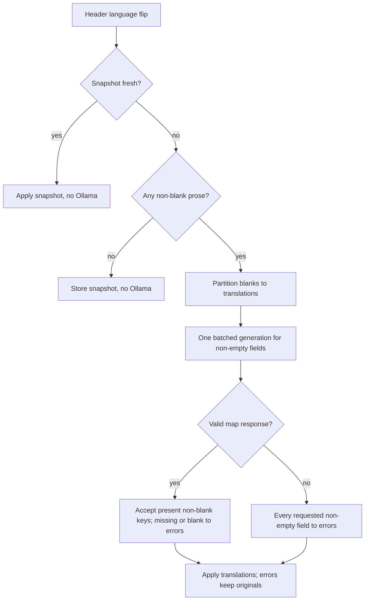

# CV Translation Batching - Plan

## Goal Capsule

- **Objective:** Cut CV-builder translation latency by translating the whole prose field map in one batched generation instead of one per field, then measure the improvement against a 20s end-to-end target.
- **Product authority:** Scopes a performance change to the translation pipeline introduced by `docs/plans/2026-09-13-003-feat-global-language-unification-plan.md`. It does not change the translation model, the endpoint contract, or the language feature's product behavior.
- **Open blockers:** None. The brainstorm's two open questions — the representative CV and the batched response shape — are resolved in the Planning Contract.

---

## Product Contract

### Summary

The CV-builder's language switch pays for one Ollama call per translatable field, and each call reloads the 7b model. This plan replaces the per-field loop with a single batched generation for the whole field map and adds a before/after measurement on a representative CV, targeting under 20s end-to-end while preserving translation quality and per-field error handling.

### Problem Frame

The frontend already sends all fields in one HTTP request, but the service splits that request into one `generate_structured` call per non-empty field, sequentially. Every call passes `keep_alive=0`, so the 7b model is unloaded and reloaded between fields, and every field also re-sends the full system prompt. On CPU-only Ollama measured at roughly 2.2 tokens/s, a full CV translation is dominated by this repeated per-field overhead rather than by useful output. The user reports the wait as too long; no baseline has been measured.

### Requirements

**Batching**

- R1. The whole field map is sent to the model in one batched generation, not one generation per field.
- R2. Empty or whitespace-only values and same-language requests still resolve without an Ollama call.

**Contract and error preservation**

- R3. The translate endpoint keeps its `{translations, errors}` response shape; the frontend needs no change.
- R4. Every requested field resolves to exactly one of `translations` or `errors`. A field missing from, or blank in, the model response is an error and its original text is preserved.

**Measurement**

- R5. A before/after measurement records end-to-end time from the language flip until every field shows its translated text, on a representative CV.
- R6. The measurement compares batched translation output against the current per-field output for quality, not only speed.

### Key Decisions

- KD1. Keep the 7b translation model. (session-settled: user-directed — chosen over switching to the 3b model or a dedicated local MT engine: translation quality is preserved and 20s is accepted as best-effort rather than guaranteed.) Governs R5, R6.
- KD2. Batch the entire field map into one generation. (session-settled: user-directed — chosen over chunked batching with a warm model and per-field edit-delta, and over precompute-on-save: it removes the repeated model-load overhead with the smallest change and keeps the existing contract.) Governs R1, R3, R4.
- KD3. Treat 20s as best-effort with a required measured improvement, not a hard guarantee. (session-settled: user-directed — chosen over a hard 20s bar for every CV: a hard bar would force an engine or quality change that was rejected.) Governs R5.
- KD4. Preserve per-field failure isolation by validating the returned map against the requested keys instead of trusting the model's map wholesale. Governs R4.

### Key Flows

- F1. Batched translation on language switch
  - **Trigger:** The global header language changes while translatable prose exists only in the other language.
  - **Actors:** CV Builder frontend, translate endpoint, Ollama.
  - **Steps:** The frontend flattens the prose and sends one request; the endpoint translates the non-empty fields in one batched generation; the response is split into per-field translations and errors; the frontend applies all results at once.
  - **Outcome:** Fields show the target language; any failed field keeps its original text.
  - **Covered by:** R1, R3, R4.

### Acceptance Examples

- AE1. **Covers R1, R4.** Given a CV with several non-empty prose fields, when translation runs, then a single batched generation covers all of them and every non-empty field appears in either `translations` or `errors`.
- AE2. **Covers R4.** Given the model omits a requested field from its response, when translation runs, then that field appears in `errors` and its original text is unchanged, while the remaining fields translate.
- AE3. **Covers R4.** Given the model returns a blank translation for a field, when translation runs, then that field is an error and its original text is preserved.
- AE4. **Covers R2.** Given a field map whose values are all empty or whitespace, when translation runs, then no Ollama call is made.
- AE5. **Covers R3.** Given the batched implementation, when the frontend calls the endpoint, then it receives the same `{translations, errors}` shape and applies it without frontend changes.

### Success Criteria

- SC1. On a representative CV, end-to-end time from language flip to all fields updated is materially below the current per-field baseline; target under 20s for a normal CV.
- SC2. Batched output is not worse than the current per-field output for the representative CV's prose.
- SC3. Per-field error isolation still holds: a failed field never loses its content, and one field's failure does not fail the request.
- SC4. The endpoint contract tests pass unchanged; call-count tests are updated to assert the batched request.

### Scope Boundaries

- **Deferred for later:** chunked batching, a bounded warm-model `keep_alive`, and per-field edit-delta translation. Precompute-on-save is the documented fallback if measurement shows a normal CV still exceeds 20s.
- **Outside this work:** changing the translation engine (3b or a dedicated local MT model), GPU or hardware changes, streaming or per-field incremental UI updates, and any change to which content is translatable or which languages are supported.

### Dependencies / Assumptions

- Ollama is CPU-only; the 7b model is measured at roughly 2.2 tokens/s, so 20s is best-effort and must be verified by measurement, not assumed.
- Translation resolves to `OLLAMA_MODEL` (`qwen2.5:7b-instruct`); no dedicated translation model exists.
- Batching is expected to preserve translation quality; SC2 verifies this rather than assuming it.
- Existing tests assert one call per field and will be updated to the batched behavior.

### Sources / Research

- Translation service: `backend/app/services/translation_service.py` (per-field loop).
- Shared Ollama client: `backend/app/services/llm_client.py` (`keep_alive=0`; retry and flattened-schema fallback).
- Endpoint: `backend/app/api/cv_builder.py` (`POST /cv-builder/translate`).
- Frontend flatten/apply: `frontend/src/app/core/services/content-translation.service.ts`, `frontend/src/app/pages/cv-builder/cv-builder.component.ts`.
- Ollama settings and throughput note: `backend/app/core/config.py` (roughly 2.2 tokens/s; `OLLAMA_TIMEOUT_SECONDS = 600.0`).
- Prior feature plan: `docs/plans/2026-09-13-003-feat-global-language-unification-plan.md`.
- Prior learnings: `docs/solutions/performance-issues/ollama-concurrent-model-residency-memory-pressure.md`, `docs/solutions/integration-issues/ollama-structured-output-nested-list-schema-validation-failure.md`.

---

## Planning Contract

Product Contract preservation: restructured, no scope change — the brainstorm's two open questions (representative CV, batched response shape) are resolved into the KTDs and Assumptions below; all R/KD/F/AE/SC IDs and their meaning are preserved.

### Key Technical Decisions

- KTD1. Model the batched response as one `dict[str, str]` map, not a list of per-field result objects. Rationale: a `dict[str, str]` compiles to `additionalProperties: {type: string}` with no `$defs`/`$ref`, so it avoids Ollama's nested-list schema bug that any `list[PerFieldResult]` would trigger. Governs R1, R4.
- KTD2. Reconstruct per-field results at the service layer by diffing the returned keys against the requested keys. Rationale: `generate_structured` validates the whole response at once and raises on failure, so per-field tolerance cannot come from the client. Blank requested values pass through; a returned key that is absent or blank becomes an error; unknown keys are dropped. A non-string value fails whole-response validation and falls under KTD3. Governs R4.
- KTD3. Treat a whole-batch failure as per-field errors for every requested non-empty field, keeping each original. Rationale: the batch is one generation and `generate_structured` yields no partial content; the request still returns 200 with `errors`. This is the accepted blast-radius trade-off of KD2. Governs R4, SC3.
- KTD4. Give the batched call an explicit context and output budget through the shared client: `num_ctx: 8192`, `num_predict: 2048`. Rationale: `_call_chat` passes no `options`, and the batch is the largest prompt in the app, so a large map can silently truncate. `num_ctx` holds the system prompt, a realistic field map, and the retry echo (KTD5). The budget is set for the batch only; other callers keep today's behavior. Governs R1.
- KTD5. Keep `generate_structured`'s existing retry; the flattened-schema fallback is a no-op for a map. Rationale: `_is_structural_failure` only detects nested `list[BaseModel]` paths, so the worst case is two `client.chat` calls, not three. Governs R1.
- KTD6. Capture the per-field baseline before changing the service. Rationale: R5/SC1 require a measured improvement, and the current duration is unmeasured. Governs R5, SC1.

### High-Level Technical Design

### Assumptions

- Representative CV: a profile with a summary, a Berufsbezeichnung, three experience entries, two education entries, two projects, and three languages. If no such profile is saved, seed one from the CV Builder test fixtures.
- Ollama's constrained decoding can emit a free-form string map. If the map proves unreliable in practice, the documented fallback is a generated schema with one required string property per requested key.
- The `{translations, errors}` endpoint signature is unchanged, so `backend/tests/api/test_cv_builder.py` needs no edits.

### Risks

- Map-schema reliability: key-diff validation (KTD2) contains it per field; missing keys degrade to errors rather than losing content.
- Context truncation on large maps: the explicit budget (KTD4) contains it; maps beyond realistic size remain best-effort and are out of scope for chunking.
- Longer single-request lock hold: one batch holds the process-wide Ollama lock for the whole generation, blocking CV parsing and cover-letter generation longer than a single field call. Accepted for this scope.
- Memory pressure: a larger context window increases the 7b KV cache on the shared Docker Desktop VM (about 7.75GB). U4 verifies Ollama memory after the batched run and `num_ctx` drops if headroom is insufficient.
- Free-form key fidelity: constrained decoding does not force the model to reproduce every requested path key, so missing keys degrade to per-field errors. If fidelity is poor on the representative CV, fall back to a generated schema with one required string property per requested key.
- 20s may not be reachable on CPU-only 7b: KD3 accepts best-effort; precompute-on-save remains the documented fallback.
- Rapid language switches still serialize two full generations through the existing frontend `switching` guard; unchanged by this plan.

### Sequencing

U1 (baseline) → U2 (client budget) → U3 (service batching) → U4 (post-change measurement). U3 depends on U2; U4 depends on U1, U2, U3.

---

## Implementation Units

### U1. Capture the per-field translation baseline

- **Goal:** Record the current end-to-end translation time and output on the representative CV before any code changes.
- **Requirements:** R5, R6, SC1 (per KTD6).
- **Dependencies:** none.
- **Files:** none (measurement record captured for U4 and the PR).
- **Approach:**
  - Run the current backend on `feat/global-language-unification`.
  - On the representative CV, flip the header language and time from the flip until every field shows its translated text.
  - Record the per-field output for later quality comparison.
  - Run at least three times and discard the first run (cold model) to reduce variance.
- **Execution note:** Capture the baseline before touching the service; the comparison in U4 is only valid against a pre-change measurement.
- **Patterns to follow:** manual wall-clock measurement is this repo's existing convention (see `docs/solutions/performance-issues/ollama-concurrent-model-residency-memory-pressure.md`).
- **Test expectation:** none — measurement, not code.
- **Verification:** a recorded baseline duration and the per-field output for the representative CV.

### U2. Add a context and output budget to the shared Ollama client

- **Goal:** Let a caller set explicit context and output limits for one generation without changing other callers.
- **Requirements:** R1 (per KTD4).
- **Dependencies:** none.
- **Files:** `backend/app/services/llm_client.py`, `backend/tests/services/test_llm_client.py`.
- **Approach:**
  - Add an optional options argument to `generate_structured` and thread it to `_call_chat`.
  - Forward the options into the `client.chat` call; omit them when not provided so existing callers are unchanged.
  - The translation batch passes `num_ctx: 8192` and `num_predict: 2048`.
  - Keep `keep_alive=0` and the process-wide lock behavior.
- **Patterns to follow:** the existing optional `model` parameter on `generate_structured`.
- **Test scenarios:**
  - Given options are passed, when the chat call runs, then the options reach `client.chat`.
  - Given options are omitted, when the chat call runs, then `client.chat` receives no options key (existing behavior preserved).
  - Given any call, then `keep_alive` stays `0`.
- **Verification:** `cd backend && pytest tests/services/test_llm_client.py` passes.

### U3. Translate the whole field map in one batched generation

- **Goal:** Replace the per-field loop in `translate_fields` with one batched generation and reconstruct per-field results.
- **Requirements:** R1, R2, R3, R4, SC3, SC4 (per KD2, KD4, KTD1, KTD2, KTD3, KTD5).
- **Dependencies:** U2.
- **Files:** `backend/app/services/translation_service.py`, `backend/tests/services/test_translation_service.py`.
- **Approach:**
  - Add a batch response model with a single `translations: dict[str, str]` field.
  - Partition the requested map: same-language short-circuit; blank or whitespace values pass through unchanged; non-empty values form the batch.
  - Send one `generate_structured` call for the batch, with the requested keys and their texts JSON-encoded in the prompt, and the batch context/output budget from U2.
  - Build `translations` from returned keys that are present and non-blank; drop unknown keys; route every other requested non-empty key to `errors` with the original preserved.
  - On `LlmUnavailableError` or `LlmValidationError`, route every requested non-empty key to `errors`.
  - Keep the unsupported-language-pair `ValueError`.
- **Patterns to follow:** the existing `_TranslatedText` structured-output pattern and the per-field error handling in `translate_fields`.
- **Test scenarios:**
  - Covers AE1. Given several non-empty fields, when translation runs, then exactly one generate call is made and every field appears in `translations` or `errors`.
  - Covers AE2. Given the model omits a requested key, when translation runs, then that key is in `errors` and the others translate.
  - Covers AE3. Given the model returns a blank or whitespace value for a key, then that key is in `errors`.
  - Given the model returns an unknown extra key, then it is ignored and no error is produced for it.
  - Given a non-string value in the response, then whole-response validation fails and every requested non-empty key is in `errors` (KTD3).
  - Given the whole batch fails validation or Ollama is unavailable, then every requested non-empty key is in `errors` and the call still returns a result.
  - Covers AE4. Given all values are blank, then no generate call is made.
  - Given source equals target, then fields are returned unchanged and no generate call is made.
  - Given a `de` to `fr` pair, then `ValueError` is raised.
  - Given the batch prompt, then it names the target language and the proper-noun rule.
- **Verification:** `cd backend && pytest tests/services/test_translation_service.py tests/api/test_cv_builder.py` passes; `backend/tests/api/test_cv_builder.py` needs no edits.

### U4. Re-measure and compare

- **Goal:** Measure the batched implementation and compare it to the U1 baseline for speed and quality.
- **Requirements:** R5, R6, SC1, SC2 (per KD1, KD3, KTD6).
- **Dependencies:** U1, U2, U3.
- **Files:** none (measurement record captured for the PR).
- **Approach:**
  - Repeat the U1 procedure on the same representative CV with the batched implementation.
  - Use the same run count and discard-first rule as U1.
  - Compare duration and per-field output side by side.
  - Check Ollama memory (`docker stats` or `ollama ps`) against the documented ~7.75GB VM budget; lower `num_ctx` if headroom is insufficient.
  - Record whether a normal CV meets the 20s target, and whether precompute-on-save is needed.
- **Test expectation:** none — measurement, not code.
- **Verification:** recorded before/after durations and a quality comparison for the representative CV.

---

## Verification Contract

| Gate | Command | Applies to |
|---|---|---|
| Translation service + endpoint tests | `cd backend && pytest tests/services/test_translation_service.py tests/api/test_cv_builder.py` | U3 |
| Ollama client tests | `cd backend && pytest tests/services/test_llm_client.py` | U2 |
| Full backend suite | `cd backend && pytest` | all units |
| Baseline measurement | manual flip-to-applied timing on the representative CV, at least 3 runs, first discarded | U1 |
| Post-change measurement | same procedure as U1 on the batched build | U4 |
| Quality comparison | side-by-side prose output, baseline vs batched | U4 |

Measurement exit criterion: the batched end-to-end time is materially below the U1 baseline; a normal CV targets under 20s (SC1). Because CPU-only 7b throughput is roughly 2.2 tokens/s, 20s is best-effort (KD3); if a normal CV still exceeds it, record precompute-on-save as the next step.

---

## Definition of Done

- All units U1–U4 are complete and their Verification gates pass.
- `cd backend && pytest` is green.
- The `{translations, errors}` endpoint contract and all Product Contract R/KD/F/AE/SC IDs are preserved.
- A single batched generation replaces the per-field loop, and per-field results are reconstructed by key diffing.
- A before/after measurement and a quality comparison are recorded for the representative CV.
- No abandoned spike or experimental code remains in the diff.
