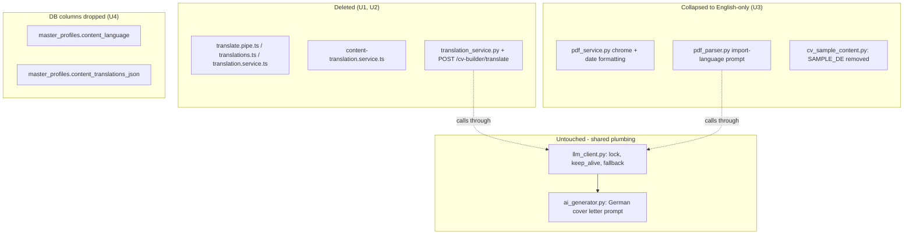

# Remove Translation Functionality - Plan

## Goal Capsule

- **Objective:** Remove the app's translation and language-switching machinery — the header UI language switcher and the CV-builder content translator — so the app runs English-only, while cover letter generation keeps its existing German output unchanged.
- **Product authority:** This plan, from brainstorm dialogue confirmed 2026-09-13.
- **Open blockers:** None.

## Product Contract

### Summary

Remove the UI language switcher and the CV-builder content translator entirely, fixing the app's UI, CV-builder input content, and CV rendering to English. Cover letter generation stays German, unchanged.

### Problem Frame

Three plans merged today (`docs/plans/2026-09-13-002-feat-cv-document-language-plan.md`, `-003-feat-global-language-unification-plan.md`, `-004-perf-cv-translation-batching-plan.md`) built a global language selector, per-field CV content translation, and document-language-aware CV rendering. That machinery — buttons, a translation backend endpoint, and DB columns — serves a bilingual use case the app doesn't need: there is one user, writing one CV in English, applying to German-market jobs where only the generated cover letter is expected in German.

### Key Decisions

- **Full teardown over a dormant English-only stub.** Remove the UI language switcher, the i18n dictionary/pipe, and the CV-builder content translator entirely rather than reducing them to unused scaffolding for a possible future relaunch. (session-settled: user-directed — chosen over keeping a dormant switcher: matches "remove everything," no leftover i18n scaffolding.) Governs R1, R2.
- **Drop the content-language DB columns.** Remove `content_language` and `content_translations_json` from the profile schema via migration rather than leaving them in place unused. (session-settled: user-directed — chosen over leaving the columns: the feature merged today, so there's no real translated data worth preserving.) Governs R5.
- **English is the fixed language everywhere except the generated cover letter.** CV-builder input content, CV rendering/export chrome, and the app's own UI text all default to fixed English; only the AI-generated cover letter — already hardcoded to German in the backend prompt — keeps its current language. Governs R3, R4, R6.

### Requirements

**Removal — UI language switching**

- R1. The header language switcher is removed: no language selector, and no runtime UI-string translation lookup. All UI text (nav, labels, buttons, messages) is fixed English everywhere in the app.

**Removal — CV-builder content translator**

- R2. The CV-builder's per-field content translator is removed: no "translate" buttons or translation UI in any CV-builder section (summary, experience, education, projects, skills, languages), and no backend translation endpoint or service behind it.
- R5. The profile schema no longer stores per-language CV content: `content_language` and `content_translations_json` are dropped from the data model via migration, not left dormant.

**English-only content and rendering**

- R3. CV-builder input content (summary, job titles, descriptions, degree/field of study, project titles/descriptions, spoken-language names) is authored and stored in English going forward. The app does not track, validate, or convert content language — this is a convention for what the user types, not enforced machinery.
- R4. CV rendering (preview, PDF export, PDF import/parse) uses fixed English chrome and sample/placeholder content. No per-document language selection remains anywhere in the CV-builder flow.

**Unchanged: cover letter generation**

- R6. Cover letter generation (application editor → backend AI generator) is unaffected by this removal: it keeps producing German-language cover letters via its existing hardcoded prompt, regardless of the rest of the app becoming English-only.

### Acceptance Examples

- AE1. **Covers R6.** Given the removal is complete, when a user generates a cover letter for a job application, then the cover letter text is still German, unchanged from current behavior — even though the rest of the UI and CV content are English.
- AE2. **Covers R3, R4.** Given a CV-builder profile with English-authored content, when the user previews or exports the CV as a PDF, then all chrome (section headers, sample/placeholder skeleton content) reads in English and no language toggle is presented anywhere in the flow.
- AE3. **Covers R1, R2.** Given the app is loaded, when a user navigates any page (nav, job search, profile, cv-builder, applications, application editor), then no language selector and no translate button appears anywhere, and all UI text renders in English.
- AE4. **Covers R5.** Given the migration has run, when `alembic upgrade head` completes, then `master_profiles` no longer has `content_language`/`content_translations_json` columns and the app starts and serves profile requests normally.

### Scope Boundaries

- Cover letter generation logic and its prompt are untouched — already German, out of scope for this change.
- No stub, hook, or config flag is kept for re-adding locale support later — this is a full teardown, not a reduction to English-only scaffolding.
- No migration or rewriting of already-entered CV content to English — this sets English as the going-forward convention for new input, not a data cleanup pass over existing profile text.

### Dependencies / Assumptions

- Assumes no other feature reads `content_language` or `content_translations_json` outside the CV-builder/translation code paths being removed; planning should confirm before dropping the columns.
- Assumes any CV content already stored in German is left as-is per Scope Boundaries — its chrome will render in English around it after this change.

### Sources / Research

- Plans that built the feature being removed: `docs/plans/2026-09-13-002-feat-cv-document-language-plan.md`, `docs/plans/2026-09-13-003-feat-global-language-unification-plan.md`, `docs/plans/2026-09-13-004-perf-cv-translation-batching-plan.md`.
- Cover letter's hardcoded German system prompt: `backend/app/services/ai_generator.py`.
- UI i18n system to remove: `frontend/src/app/core/i18n/translations.ts`, `frontend/src/app/core/i18n/translate.pipe.ts`, `frontend/src/app/core/services/translation.service.ts`, language selector in `frontend/src/app/layout/nav-layout/nav-layout.component.ts`.
- CV content translator to remove: `frontend/src/app/core/services/content-translation.service.ts`, `backend/app/services/translation_service.py`, `POST /cv-builder/translate` in `backend/app/api/cv_builder.py`.
- Bilingual sample/placeholder content: `backend/app/services/cv_sample_content.py` (`SAMPLE_EN`/`SAMPLE_DE`).
- Schema fields to drop: `frontend/src/app/core/models/master-profile.model.ts`, `backend/app/models/master_profile.py`, `backend/app/schemas/master_profile.py`, migration `backend/alembic/versions/9a7b6c5d4e3f_add_content_language.py`.
- Removal precedent in this repo: commits `4fa1ae6` (backend removal) and `f99559f` (frontend removal) for a prior schema-field teardown — separate commits per surface, each listing what was deleted and citing the covered R-IDs.
- Migration precedent: `backend/alembic/versions/4e9f0a320779_drop_orphaned_cv_generation_columns_.py` — the existing column-drop pattern to mirror.
- Regression guard: `backend/tests/test_migrations.py` fails on any ORM/migration mismatch — the cheapest correctness check after the schema change.
- WeasyPrint pagination gotcha: `docs/solutions/ui-bugs/weasyprint-flexbox-does-not-fragment-across-pages.md` — the CV template's `display: table`/`table-cell` layout must survive the chrome cleanup.
- Shared LLM plumbing boundary: `docs/solutions/integration-issues/ollama-structured-output-nested-list-schema-validation-failure.md`, `docs/solutions/performance-issues/ollama-concurrent-model-residency-memory-pressure.md` — `backend/app/services/llm_client.py`'s lock/fallback logic is shared with `ai_generator.py` (R6) and must not be touched.
- Alembic branch-safety learning: `docs/solutions/database-issues/alembic-migration-rebase-silently-skips-sibling-branch.md` — never rewrite a pushed migration's `down_revision`; add the drop as a new forward leaf.

---

## Planning Contract

**Product Contract preservation:** Requirements, Key Decisions, and Scope Boundaries carry forward with their original R1-R6 IDs unchanged. Acceptance Examples gained one addition — AE4, closing the one requirement (R5) that had no acceptance example — during the confidence/doc-review pass; AE1-AE3 are unchanged. This enrichment otherwise only adds the Planning Contract and Implementation Units below.

### Key Technical Decisions

- KTD1. **Source the fixed English UI strings from the existing `en` entries in `translations.ts` before deleting it**, rather than re-writing copy from scratch — the dictionary already carries reviewed English strings for every key. Governs R1.
- KTD2. **Collapse `pdf_service.py`/`pdf_parser.py`'s document-language branching to a single fixed-English code path** (delete the `de` chrome/date-format branch and the language-aware import-prompt variant) rather than keeping a parameterized function with only one caller value — with no language selection left anywhere in the app (R4), a surviving parameter would be dead flexibility. Governs R4.
- KTD3. **Leave `backend/app/templates/cv/template-1.html` structurally untouched.** The template has no language-conditional markup of its own — it only renders already-resolved `doc.*` values — so the chrome-language collapse is confined to deleting the `de` entry from `pdf_service.py`'s `_DOC_CHROME` dict. Preserve the template's `display: table`/`table-cell` layout regardless (do not refactor to flexbox): this repo has a documented WeasyPrint regression where flexbox breaks multi-page PDF fragmentation. Re-run `TestMultiPageFragmentation` after the `pdf_service.py` edit as a precaution. Governs R4.
- KTD4. **Add the column-drop migration as a new forward leaf on top of `9a7b6c5d4e3f_add_content_language.py`**, following this repo's idempotent `existing_columns`-inspect guard convention, rather than editing that migration file. Confirm via `alembic heads` that it is the sole head before adding. Governs R5.
- KTD5. **Leave `backend/app/services/llm_client.py`'s shared Ollama plumbing untouched** (`_ollama_lock`, `keep_alive=0`, structural-failure/flattened-schema fallback) when removing `translation_service.py`'s call site — `ai_generator.py`'s German cover letter (R6) and `pdf_parser.py`'s CV import both depend on that shared helper. Governs R6.
- KTD6. **Remove the "Document language" and "Content translation" entries from `CONCEPTS.md`** as part of this work — both describe machinery this plan deletes, and leaving them would document features that no longer exist.

### High-Level Technical Design

The removed and collapsed surfaces (left/top) never shared machinery with the cover letter path (bottom right) except the generic LLM client, which stays as-is.

### Risks & Dependencies

- **Destructive migration.** Dropping `content_language`/`content_translations_json` discards any already-stored translated content. Accepted per the Product Contract's settled decision (feature merged same day, no data worth preserving).
- **Real branching logic, not a passthrough.** `pdf_service.py`/`pdf_parser.py`'s document-language handling is live conditional logic with a dedicated test class (`TestDocumentLanguageLocalization`, ~30 cases) — mitigated by KTD2/KTD3 and the explicit test-trim scenario in U3.
- **Migration-graph safety.** Must add the drop as a new leaf, never rewrite `9a7b6c5d4e3f` — mitigated by KTD4 and the `alembic heads` check.
- **`backend/tests/test_migrations.py`** will fail immediately if the ORM model and migration drift out of sync — run it right after U4 as the cheapest correctness signal.

### Assumptions

- No other backend feature reads `content_language`/`content_translations_json` beyond the stale comment in `backend/app/api/profile.py` (confirmed by research; no functional dependency found) — the Product Contract's open assumption on this point is now resolved.
- `translation_service.py`'s Ollama calls route through the shared `llm_client.py` helper rather than a forked client, so removing the call site does not require touching shared plumbing (confirmed by research).

### Sequencing

1. U1 and U2 both edit `frontend/src/app/pages/cv-builder/cv-builder.component.ts`. Land them together: U2's removal of the translation state machine (the constructor `effect()` and everything it drives) must go in the same pass as U1's removal of the `TranslationService`/`TranslatePipe` import from that one file, because the effect reads `i18n.language()` — stripping the injection independently of the effect that depends on it leaves a broken reference.
2. U2 and U3 both edit `backend/app/api/cv_builder.py` — sequence them as separate edits/commits to avoid merge conflicts in that file.
3. U1 hardcodes every non-template `this.i18n.language()` call site — not just template pipe expressions — to the literal `'en'` string, including `cv-preview-export.component.ts`'s `buildPayload()` and `cv-import.component.ts`'s `parseCv()` call. This keeps those call sites compiling once `TranslationService` is deleted, without yet touching the parameters/fields they feed. U3 then deletes the now-always-`'en'` `document_language`/`language` parameter entirely, on both the frontend call sites and the backend fields it feeds.
4. U4 depends on U1-U3: the fields and types it removes must have no remaining consumers first.
5. U5 (`CONCEPTS.md`) runs last, once the described machinery is actually gone.
6. Mirror this repo's removal precedent (commits `4fa1ae6`, `f99559f`): land frontend-surface and backend-surface removal as separate commits, each with a body listing what was deleted and a `Covers R#, R#` trailer.

## Implementation Units

### U1. Remove the header UI i18n system (frontend)

- **Goal:** Delete the runtime UI-string translation system and its language selector so all UI text is fixed English everywhere.
- **Requirements:** R1
- **Dependencies:** None
- **Files:**
  - Delete: `frontend/src/app/core/i18n/translate.pipe.ts`, `frontend/src/app/core/i18n/translate.pipe.spec.ts`, `frontend/src/app/core/i18n/translations.ts`, `frontend/src/app/core/i18n/translations.spec.ts`, `frontend/src/app/core/services/translation.service.ts`
  - Edit: `frontend/src/app/layout/nav-layout/nav-layout.component.ts` + template + `frontend/src/app/layout/nav-layout/nav-layout.component.scss` (remove the now-unused `&__language` rule and drop `&__language` from the shared `&__language, &__theme` selector; also remove the `LANGUAGE_OPTIONS`/language selector control)
  - Edit (`.ts` + its `.html` template — these use `templateUrl`): `frontend/src/app/pages/application-editor/application-editor.component.ts`, `frontend/src/app/pages/application-editor/send-application-dialog/send-application-dialog.component.ts`, `frontend/src/app/pages/applications/applications.component.ts`, `frontend/src/app/pages/job-search/job-search.component.ts` (+ `.spec.ts`), `frontend/src/app/pages/profile/profile.component.ts`
  - Edit: `frontend/src/app/pages/cv-builder/cv-builder.component.ts` (+ `.spec.ts`) — only its `translate`-pipe usage and `i18n` injection; the translation state machine itself is U2's, landed together per Sequencing point 1
  - Edit: `frontend/src/app/pages/cv-builder/export/cv-preview-export.component.ts` (+ `.spec.ts`) — template translate-pipe usage, plus hardcode `buildPayload()`'s `document_language: this.i18n.language()` to `document_language: 'en'` (Sequencing point 3; U3 removes the field entirely later)
  - Edit: `frontend/src/app/pages/cv-builder/import/cv-import.component.ts` (+ `.spec.ts`) — template translate-pipe usage, plus hardcode the `this.profileService.parseCv(file, this.i18n.language())` call to `this.profileService.parseCv(file, 'en')` (Sequencing point 3)
  - Edit: `frontend/src/app/pages/cv-builder/sections/{education,experience,languages,photo,projects,skills,summary}-section.component.ts` (+ `skills-section.component.spec.ts`, `photo-section.component.spec.ts`)
- **Approach:**
  1. Per consumer, remove the `TranslatePipe`/`TranslationService` imports, the `protected readonly i18n = inject(TranslationService);` line, and `TranslatePipe` from the component's `imports: [...]` array.
  2. Replace each `{{ 'key' | translate: i18n.language() }}` template expression (and any `this.i18n.translate('key', {...})` call) with the literal string from that key's `en` entry in `translations.ts` (per KTD1). Cover computed keys the same way: where the key is a data-bound field (e.g. nav-layout's `item.labelKey`, sourced from a nav-items array), replace the key field itself with the literal English label in that array; where the key is chosen by a ternary or function call (e.g. job-search's `source.reason === 'not-configured' ? 'jobSearch.notConfigured' : 'jobSearch.unavailable'`, skills-section's `skillLevelLabelKey(level)`), resolve each branch individually to its literal English string.
  3. Remove the language selector control from `nav-layout`.
  4. Hardcode the non-template `this.i18n.language()` call sites named in the Files list above to the literal `'en'` string (Sequencing point 3) — do not delete their parameters/fields yet; that's U3.
- **Patterns to follow:** Removal-commit precedent — commits `4fa1ae6`/`f99559f`.
- **Test scenarios:**
  - Happy path: app loads; nav, labels, and buttons render fixed English text with no console errors.
  - Covers AE3. Edge case: a key with a `{name}`-style placeholder, and each computed-key site (nav-layout's `item.labelKey`, job-search's ternary, skills-section's `skillLevelLabelKey`), still renders the correct literal English text.
  - Existing specs asserting `translate` pipe behavior or non-English text are updated to assert the static English string; specs already asserting English text pass unmodified.
- **Verification:** `ng test` passes; `grep -r "TranslatePipe\|TranslationService" frontend/src` returns no matches.

### U2. Remove the CV-builder content translator (frontend + backend)

- **Goal:** Remove the per-field CV content translation feature end-to-end, including the auto-retranslation state machine backing it.
- **Requirements:** R2
- **Dependencies:** None (touches `cv_builder.py` alongside U3, and `cv-builder.component.ts` alongside U1 - sequence per Sequencing above)
- **Files:**
  - Delete: `frontend/src/app/core/services/content-translation.service.ts` (+ `.spec.ts`), `backend/app/services/translation_service.py`, `backend/tests/services/test_translation_service.py`
  - Edit: `frontend/src/app/pages/cv-builder/cv-builder.component.ts` (+ `.spec.ts`) — remove the constructor `effect()` that reacts to `i18n.language()` and drives auto-retranslation, plus `initializeContentLanguage`, `switchContentLanguage`, `setTranslatableControlsDisabled`, the `activeContentLanguage`/`otherSnapshot`/`translating`/`translationError` fields, the language-tracking lines in `onImportContentReplaced`, and `ContentTranslationService` usage; simplify the Save button's `[disabled]="saving() || translating()"` binding to `[disabled]="saving()"`
  - Edit: `frontend/src/app/core/services/profile.service.ts` — remove `translateContent()` and its now-unused `CvTranslateRequest`/`CvTranslateResponse` imports
  - Edit: `backend/app/api/cv_builder.py` — remove the `POST /cv-builder/translate` handler, `CvTranslateRequest`/`CvTranslateResponse` schemas, and the `translation_service` import
  - Edit: `backend/tests/api/test_cv_builder.py` — remove the translate-endpoint test cases
- **Approach:** Per KTD5, confirm the removal only deletes `translation_service.py`'s call site into `llm_client.py` - the shared lock/fallback logic stays untouched.
- **Patterns to follow:** Same removal-commit precedent as U1.
- **Test scenarios:**
  - Covers AE3. Happy path: CV-builder sections render with no translate affordance anywhere; no dead spinner or error banner remains from the removed `translating`/`translationError` signals.
  - Error path: `POST /cv-builder/translate` returns 404 (route no longer registered).
  - Covers AE1. Integration: cover letter generation still returns German text end-to-end, unaffected by this removal.
- **Verification:** `pytest backend/tests/api/test_cv_builder.py` passes with the translate tests removed; `grep -rE "translating\(\)|translationError|activeContentLanguage|otherSnapshot|switchContentLanguage|setTranslatableControlsDisabled" frontend/src` returns no matches.

### U3. Collapse CV document-language chrome and import to fixed English (backend + remaining frontend call sites)

- **Goal:** Remove the `DocumentLanguage`-driven branching in CV rendering and PDF import so chrome and import are fixed English, and delete the now-always-`'en'` parameter/field U1 hardcoded.
- **Requirements:** R4
- **Dependencies:** U1 (the frontend call sites this unit deletes were hardcoded to `'en'` by U1 first); touches `cv_builder.py` alongside U2 - sequence per Sequencing above
- **Files:**
  - Edit: `backend/app/services/pdf_service.py` (remove the `de` entry from the `_DOC_CHROME` dict and language-conditional date-range formatting; hardcode English chrome strings), `backend/app/services/pdf_parser.py` (remove the language-aware AI-import prompt/defaults; hardcode English), `backend/app/services/cv_sample_content.py` (remove `SAMPLE_DE`; `SAMPLE_EN` becomes the only sample set), `backend/app/api/cv_builder.py` (remove `document_language` from `CvRenderRequest`/render context; remove `language: DocumentLanguage = Form("de")` from `parse_cv`)
  - Edit: `frontend/src/app/core/services/profile.service.ts` (drop the now-always-`'en'` `language` parameter from `parseCv()`), `frontend/src/app/pages/cv-builder/export/cv-preview-export.component.ts` (drop the now-always-`'en'` `document_language` field from `buildPayload()`), `frontend/src/app/pages/cv-builder/import/cv-import.component.ts` (drop the now-always-`'en'` second argument from the `parseCv()` call)
  - No edit needed to `backend/app/templates/cv/template-1.html` — per KTD3, it has no language-conditional markup to remove.
  - Test files: `backend/tests/services/test_pdf_service.py` (trim/rewrite `TestDocumentLanguageLocalization`, drop `de` cases), `backend/tests/services/test_pdf_parser.py`, `backend/tests/api/test_cv_builder.py` (remove `document_language`/`language` form-field cases), `frontend/src/app/pages/cv-builder/export/cv-preview-export.component.spec.ts` (remove the 3 assertions on `document_language`)
- **Approach:** Apply KTD2 (collapse to one fixed-English path) and KTD3 (template needs no edit; preserve its `display: table`/`table-cell` layout regardless).
- **Patterns to follow:** `docs/solutions/ui-bugs/weasyprint-flexbox-does-not-fragment-across-pages.md`.
- **Test scenarios:**
  - Covers AE2. Happy path: CV preview/export renders English chrome unconditionally.
  - Regression: `TestMultiPageFragmentation` (multi-page CV content) still passes after the `pdf_service.py` edit.
  - Edge case: PDF import (`parse_cv`) with no language input still returns correctly parsed, English-labeled content.
- **Verification:** `pytest backend/tests/services/test_pdf_service.py backend/tests/services/test_pdf_parser.py backend/tests/api/test_cv_builder.py` passes; `ng test` passes for the touched frontend specs.

### U4. Remove content-language/content-translations profile fields and drop the DB columns

- **Goal:** Remove `content_language`/`content_translations_json` and the `DocumentLanguage`/`CvRenderPayload.document_language`/`CvTranslateRequest`/`CvTranslateResponse` type surface from the profile schema across frontend/backend, and drop the columns via migration.
- **Requirements:** R5
- **Dependencies:** U1, U2, U3
- **Files:**
  - Edit: `frontend/src/app/core/models/master-profile.model.ts` (remove the `DocumentLanguage` type, `content_language`, `content_translations_json`, the `document_language` field on `CvRenderPayload`, and the `CvTranslateRequest`/`CvTranslateResponse` interfaces), `backend/app/models/master_profile.py` (remove the two columns), `backend/app/schemas/master_profile.py` (remove the corresponding fields and `DocumentLanguage` if now unused), `backend/app/api/profile.py` (remove the stale comment referencing `content_translations_json`/`content_language`), `frontend/src/app/core/services/profile.service.ts` (remove any now-dangling `DocumentLanguage` import left after U2/U3)
  - New file: `backend/alembic/versions/<new-revision>_drop_content_language_columns.py` - new forward migration on `9a7b6c5d4e3f_add_content_language.py`, following the `existing_columns` inspect-guard convention from `4e9f0a320779_drop_orphaned_cv_generation_columns_.py`; symmetric `downgrade()` re-adding both columns; docstring cites this plan's path.
  - Test files: `backend/tests/api/test_profile.py`, `backend/tests/services/test_master_profile_schema.py`, `frontend/src/app/pages/cv-builder/cv-builder.component.spec.ts`, `frontend/src/app/pages/cv-builder/import/cv-import.component.spec.ts`, `frontend/src/app/pages/cv-builder/sections/photo-section.component.spec.ts`, `frontend/src/app/pages/profile/profile.component.spec.ts`
- **Approach:** Apply KTD4 - run `alembic heads` first to confirm `9a7b6c5d4e3f` is the sole head; add the drop as a new leaf.
- **Patterns to follow:** `backend/alembic/versions/4e9f0a320779_drop_orphaned_cv_generation_columns_.py`.
- **Test scenarios:**
  - Happy path: `alembic upgrade head` applies cleanly on a fresh DB and on a DB already stamped at `9a7b6c5d4e3f`.
  - Covers AE4. Happy path: `alembic downgrade -1` from the new head re-adds both columns with their original shape.
  - Regression: `backend/tests/test_migrations.py` (ORM/migration parity) passes with no drift.
- **Verification:** `pytest backend/tests/test_migrations.py backend/tests/api/test_profile.py backend/tests/services/test_master_profile_schema.py` passes; `ng test` passes for the touched frontend specs.

### U5. Remove stale translation concepts from CONCEPTS.md

- **Goal:** Keep the project glossary accurate by removing entries that describe machinery this plan deletes.
- **Requirements:** Supports R1-R5 accuracy; driven by KTD6
- **Dependencies:** U1, U2, U3, U4
- **Files:** `CONCEPTS.md` (remove the "Document language" and "Content translation" entries under `## CV Builder`; leave "Berufsbezeichnung" and "Skill category" intact - unrelated)
- **Approach:** Delete the two entries; leave the section header and remaining entries intact.
- **Test scenarios:** Test expectation: none - documentation-only change.
- **Verification:** Manual read-through confirms no remaining reference to app-wide language switching or content translation in `CONCEPTS.md`.

---

## Verification Contract

| Unit | Command | Done signal |
|---|---|---|
| U1 | `ng test` | All frontend specs pass; no `TranslatePipe`/`TranslationService` references remain in `frontend/src` |
| U2 | `pytest backend/tests/api/test_cv_builder.py`; `grep -rE "translating\(\)\|translationError\|activeContentLanguage\|otherSnapshot\|switchContentLanguage\|setTranslatableControlsDisabled" frontend/src` | Translate-endpoint tests removed, remaining tests pass; route returns 404; grep returns no matches |
| U3 | `pytest backend/tests/services/test_pdf_service.py backend/tests/services/test_pdf_parser.py backend/tests/api/test_cv_builder.py`; `ng test` | Chrome/import tests pass in English-only form; `TestMultiPageFragmentation` still passes; frontend call-site specs pass |
| U4 | `pytest backend/tests/test_migrations.py backend/tests/api/test_profile.py backend/tests/services/test_master_profile_schema.py`, `ng test` | Migration parity holds; profile schema tests pass with fields removed |
| U5 | Manual review | `CONCEPTS.md` has no stale entries |
| All | `pytest` (backend), `ng test` (frontend) | Full suites green |

## Definition of Done

- [ ] R1-R6 and AE1-AE4 hold: cover letter still German; everything else fixed English; no language selector or translate buttons anywhere; migration applies and reverses cleanly.
- [ ] `grep -rE "TranslatePipe|TranslationService|ContentTranslationService|translation_service|DocumentLanguage|content_language|content_translations_json|translating\(\)|translationError|activeContentLanguage|otherSnapshot|switchContentLanguage|setTranslatableControlsDisabled" frontend/src backend/app` returns no matches.
- [ ] `alembic heads` shows a single head after the new migration; `alembic upgrade head` and `alembic downgrade -1` both succeed.
- [ ] Full backend (`pytest`) and frontend (`ng test`) suites pass.
- [ ] `CONCEPTS.md` no longer documents "Document language" or "Content translation".
