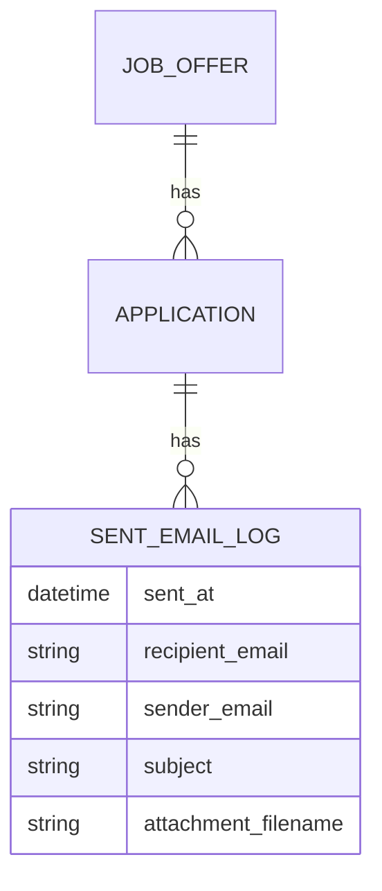

# Application Email Log - Plan

## Goal Capsule

- **Objective:** Give the user a single page listing every application email actually sent — recipient, timestamp, sender account, subject, and attachment — filterable and exportable to PDF.
- **Product authority:** The Product Contract below, originated via `ce-brainstorm` and enriched here. Single-user personal app; no multi-tenant concerns.
- **Execution profile:** `code`, Standard depth, one feature branch, 6 implementation units (`U1`-`U6`): `U1` first, then `U2` and `U3` (both depend only on `U1`), then `U4`, then `U5`, then `U6`.
- **Product Contract preservation:** Unchanged — no product-scope edits during planning. `KTD2`'s `mail_service` return-value change is an implementation detail, not a scope change.
- **Open blockers:** None.

## Product Contract

### Summary

A new "Sent Emails" page lists every application email actually sent — recipient, timestamp, sender account, subject line, and attached CV — one row per send, filterable by company, sender account, and date range, linking each row to its application, with PDF export of either the current filtered view or the full log.

### Problem Frame

Today the app sends application emails synchronously and keeps only the latest send per application: `Application.sent_at` and `Application.sent_to_email` are overwritten on every send, and the subject, body, attachment, and sender account used are discarded immediately after (`backend/app/services/mail_service.py:68-125`, `backend/app/api/applications.py:195-249`). Nothing anywhere shows this data across applications, and resending an email silently erases the previous send's details. The user wants a durable, browsable record of what was actually sent, to whom, and from which account, without digging through mailbox Sent folders.

### Key Decisions

- **Per-send log entity tied to each application, not a freestanding mailbox log.** Reuses the existing job-offer/company relation so filtering by company needs no new lookup. *(session-settled: user-approved — chosen over a decoupled raw-email log; matches the "application email" framing.)* Governs R1, R7.
- **Log entries capture metadata only — no full email body is stored or viewable.** *(session-settled: user-directed — chosen over storing/viewing full body content.)* Governs R1, R6.
- **Only successful sends are logged**, matching the current fire-and-forget send flow, which persists nothing on failure today. *(session-settled: user-approved.)* Governs R1, R3.
- **Pre-feature applications already marked sent are backfilled as one entry each** from their existing `sent_at`/`sent_to_email`, with subject, sender account, and attachment shown as unknown. *(session-settled: user-directed — chosen over starting the log empty.)* Governs R10.

### Requirements

**Data capture**

- R1. Every successful application-email send creates one durable log entry capturing: recipient email, sent timestamp, sender account/email used, subject line, attached CV/attachment filename, and the application it was sent for.
- R2. A resend creates a new log entry; it never overwrites a prior entry for the same application.
- R3. Failed send attempts are not logged, consistent with today's send flow persisting nothing on failure.

**Sent Emails page**

- R4. A new page lists every logged sent email, most recent first, independent of any single application's own view.
- R5. Each row links through to its application's detail/editor page, when that application still exists (a log entry outlives its application if the application is later deleted, per KTD7).
- R6. The page offers no resend, edit, or delete action on a listed entry — it is read-only.

**Filtering**

- R7. The list can be filtered by company/application, by sender account, and by date range, usable in combination.

**Export**

- R8. A PDF export downloads the entries currently visible under the applied filters.
- R9. A separate PDF export downloads the entire log regardless of any applied filters.

**Backfill**

- R10. On first deploy, one log entry is created per application already marked `SENT`, populated from its existing `sent_at` and `sent_to_email`; subject, sender account, and attachment show as unknown for these entries.

### Key Flows

- F1. View and filter the sent-email log
  - **Trigger:** User opens the Sent Emails page.
  - **Steps:** Page loads all log entries, most recent first; user optionally filters by company, sender account, and/or date range; list updates to the filtered set.
  - **Covers:** R4, R7
- F2. Export the log to PDF
  - **Trigger:** User clicks an export action on the Sent Emails page.
  - **Steps:** User chooses "export current view" or "export full log"; app generates a PDF of the corresponding rows and offers it for download.
  - **Covers:** R8, R9
- F3. Application email send is logged
  - **Trigger:** An application email successfully sends via the existing send flow.
  - **Steps:** Send completes; a new log entry is created capturing recipient, timestamp, account, subject, attachment, and the source application; the entry becomes visible on the Sent Emails page.
  - **Covers:** R1, R2, R3

### Acceptance Examples

- AE1. **Covers R1, R2.** Given an application was already sent once, when the user resends it (e.g. after editing), then the log shows two separate entries for that application, each with its own timestamp/recipient/account, and neither overwrites the other.
- AE2. **Covers R3.** Given an SMTP send fails, when the failure occurs, then no new log entry is created and no existing entry is modified.
- AE3. **Covers R7.** Given entries exist across multiple companies, accounts, and dates, when the user filters by one company and one date range together, then only entries matching both conditions are shown.
- AE4. **Covers R8, R9.** Given the user has filtered the list to one company, when they use "export current view," then the PDF contains only that company's entries; when they instead use "export full log," the PDF contains every entry regardless of the active filter.
- AE5. **Covers R10.** Given an application was marked `SENT` before this feature shipped, when the Sent Emails page loads after backfill, then it shows exactly one entry for that application with recipient and timestamp from the existing record, and a placeholder (em dash on the page, the literal text "unknown" in a PDF export) for subject, sender account, and attachment.

### Scope Boundaries

- Resending an email from the log page — out of scope; the page is view-only and links to the application, which already supports resending.
- Full email body storage or viewing — out of scope; metadata only.
- Frequency/stats dashboards (counts, charts) — deferred; the date-sorted list shows recency, and explicit frequency stats were declined.
- Multi-account/sender management (adding, editing SMTP accounts) — out of scope; this feature only reads whichever account the existing send flow used.
- Logging failed send attempts — out of scope for this version.

### Dependencies / Assumptions

- Assumes the current two-account SMTP setup and single-`MasterProfile` model stay as they are (`backend/app/core/config.py:67-87`, `backend/app/models/master_profile.py:38`) — the log records whichever account the existing send flow actually used, it does not add account management.
- Assumes application volume stays small (personal single-user app) — no pagination or performance requirement is implied beyond a plain filtered list.

---

## Planning Contract

### Key Technical Decisions

- KTD1. **New `sent_emails` table, FK'd to `applications`, created and backfilled in one Alembic migration.** *(session-settled: user-approved — instantiates the Product Contract's per-application log entity and backfill decisions.)* Governs R1, R10.
- KTD2. **`mail_service.send_application_email` returns the resolved account's `from_email` on success**, instead of `None`, so the log records the SMTP account actually used rather than only the requested `profile.sender_email` (`_account_for` can fall back to the primary account — `backend/app/services/mail_service.py:33-63`). Governs R1.
- KTD3. **The log entry is created inline in the existing `POST /applications/{id}/send` endpoint**, in the same `db` session and transaction as the existing `status`/`sent_at` update, immediately after `send_application_email` succeeds and before `db.commit()` (`backend/app/api/applications.py:232-249`) — no separate endpoint, event, or callback. A `MailSendError` short-circuits before this point, so no row is ever created for a failed send. Governs R1, R2, R3.
- KTD4. **The list and both PDF-export endpoints share one server-side filter contract** (`company`, `sender_email`, `date_from`, `date_to` as query params), a deliberate deviation from `applications.component.ts`'s client-side-filter convention — "export current view" must reproduce exactly what's filtered without round-tripping an ID list. Governs R7, R8, R9.
- KTD5. **PDF export reuses the existing Jinja2 -> WeasyPrint -> `StreamingResponse` pipeline** (`backend/app/services/pdf_service.py`, pattern from `backend/app/api/cv_builder.py:175-181`) with a new template, rather than introducing a new PDF-generation approach or library. Governs R8, R9.
- KTD6. **The frontend page uses Angular Material's `MatTableModule`** for the log rows, new to this codebase (`applications.component.ts` uses a card list) — the six-column tabular content fits a table better than the card-list pattern. Governs R4.
- KTD7. **`sent_emails.application_id` is nullable with `ondelete=SET NULL`, and `company`/`job_title` are snapshotted onto the row at write time** (both on send and on backfill), instead of `CASCADE` with a live join to `job_offer`. Deleting an application (an existing, reachable flow) must not silently erase its send history — that would contradict the feature's own durability goal. The snapshot also removes the list/export/PDF endpoints' dependency on a `job_offer` join. Governs R1, R5, R7, R10.

### Assumptions

- `send_application_email` has one production caller (`backend/app/api/applications.py:233`); its return-value change (KTD2) needs no other production call site updated. The existing mocks of it in `backend/tests/api/test_applications.py` stub `return_value=None` and must each be updated to a `from_email` string so those tests keep asserting real behavior.
- The backfill (KTD1) runs once, inside the create-table migration's `upgrade()`, over existing `applications` rows with `status = 'sent'`; it is guarded to skip any `application_id` already present in `sent_emails`, so re-running `upgrade` never duplicates rows.
- No auth/permission boundary changes are needed for the new endpoints — matches the existing unauthenticated single-user API surface.
- This migration must branch from the actual current Alembic head at implementation time (`alembic heads`), not a hardcoded revision id — per `docs/solutions/database-issues/alembic-migration-rebase-silently-skips-sibling-branch.md`, if a second head has appeared in the meantime, join it with `alembic merge`, never by rebasing `down_revision`.
- Local dev against the default `sqlite:///./app.db` uses `create_all()` at startup, not Alembic (`backend/app/db/init_db.py`), so the backfill logic in U1's migration `upgrade()` never runs on that path. Verifying backfill (AE5) requires running `alembic upgrade head` explicitly against the target database — SQLite file or the docker-compose Postgres — rather than relying on app startup.
- The list/export endpoints and frontend page are unauthenticated, matching the app's existing single-user API surface; this is an accepted pre-existing baseline, not a gap this plan introduces. Unlike today's single-recipient-per-application exposure, `GET /sent-emails/export/all` is a new one-request, full-history PII export (recipient/sender emails, subjects, attachment names) — acceptable under this app's current localhost/trusted-network deployment, but the first surface to gate behind access control if the app is ever exposed beyond that. Log entries are retained indefinitely; no retention/purge policy is in scope for this version.

### Resolved planning-time questions

- **PDF layout/columns:** one row per entry — company/job title, recipient, sent date, sender account, subject, attachment filename (U4).
- **Backfill mechanism:** a one-time data backfill inside the create-table migration's `upgrade()`, not a lazy on-load path (KTD1, U1).
- **Display of unknown backfilled fields:** `NULL` in the API response (U3); an em dash in the frontend table (U6); the literal text "unknown" in the PDF (U4). Backfilled by U1.

---

## Implementation Units

### U1. `sent_emails` table, model, and backfill migration

- **Goal:** Add the `SentEmail` model/table and backfill one row per already-`SENT` application.
- **Requirements:** R1, R10
- **Dependencies:** none
- **Files:**
  - `backend/app/models/sent_email.py` (new)
  - `backend/app/models/__init__.py` (edit)
  - `backend/alembic/versions/<rev>_add_sent_emails_table.py` (new)
  - `backend/tests/services/test_sent_emails_migration.py` (new)
- **Approach:**
  1. `SentEmail` model (KTD7): `id`, `application_id` (FK `applications.id`, nullable, `ondelete=SET NULL`), `company`, `job_title` (both snapshotted at write time, not joined), `recipient_email`, `sent_at`, `sender_email` (nullable), `subject` (nullable), `attachment_filename` (nullable), `created_at` (server-default now). Mirror typing conventions from `backend/app/models/application.py:15-59`.
  2. Register the model in `backend/app/models/__init__.py` per the existing import/`__all__` pattern.
  3. New migration, `down_revision` set to the actual current head: `op.create_table("sent_emails", ...)`. In the same `upgrade()`, select `applications` (joined to `job_offer` for `company`/`title`) where `status = 'sent'` and insert one `sent_emails` row per application id not already present, with `sender_email`/`subject`/`attachment_filename` left `NULL` and `recipient_email`/`sent_at`/`company`/`job_title` copied from the application/job offer.
  4. `downgrade()` drops the table.
- **Patterns to follow:** idempotent-guard idiom from `backend/alembic/versions/b3a9c1d2e4f5_add_sender_email_to_profile.py:56-70`; merge-not-rebase caution from `docs/solutions/database-issues/alembic-migration-rebase-silently-skips-sibling-branch.md`.
- **Test scenarios:**
  - Upgrade creates the `sent_emails` table with the expected columns.
  - Upgrade against a database with 2 `SENT` applications and 1 `DRAFT` application backfills exactly 2 rows, each with `sender_email`/`subject`/`attachment_filename` `NULL` and `recipient_email`/`sent_at`/`company`/`job_title` matching the source application/job offer.
  - Upgrade against a database with zero `SENT` applications backfills zero rows without error.
  - Re-running `upgrade` does not duplicate already-backfilled rows.
  - Downgrade drops the table.
- **Verification:** `alembic upgrade head` and `alembic downgrade -1` both run clean against a disposable test database; the new test file passes.

### U2. Capture the resolved sender account and log the entry on send

- **Goal:** `send_application_email` reports the actual SMTP account used; a successful send creates one `SentEmail` row in the same transaction as the existing status update.
- **Requirements:** R1, R2, R3
- **Dependencies:** U1
- **Files:**
  - `backend/app/services/mail_service.py` (edit)
  - `backend/app/api/applications.py` (edit)
  - `backend/tests/api/test_applications.py` (edit — update the existing `send_application_email` mocks' `return_value=None` to a `from_email` string, at each of their call sites)
  - `backend/tests/services/test_mail_service.py` (edit or new, matching the existing test-file convention for `mail_service`)
- **Approach:**
  1. `send_application_email` returns `account.from_email` on success instead of `None` (KTD2); the raise-on-failure contract is unchanged.
  2. In `applications.py`'s send endpoint (`backend/app/api/applications.py:232-249`), capture the returned value and, right before the existing `db.commit()`, construct and `db.add()` a `SentEmail` row: `application_id=application.id`, `company=application.job_offer.company`, `job_title=application.job_offer.title`, `recipient_email=payload.to_email`, `sent_at=application.sent_at`, `sender_email=<returned from_email>`, `subject=<the subject used>`, `attachment_filename=profile.cv_filename or "lebenslauf.pdf"`.
  3. No log row is created inside the existing `except MailSendError` branch (KTD3), matching R3.
- **Patterns to follow:** existing try/except `MailSendError` shape at `backend/app/api/applications.py:232-249`.
- **Test scenarios:**
  - Sending an application creates exactly one `SentEmail` row with the correct `application_id`, recipient, sender account, subject, and attachment filename.
  - **Covers AE1.** Resending the same application creates a second, independent `SentEmail` row; the first row is untouched.
  - **Covers AE2.** A send that raises `MailSendError` creates no `SentEmail` row and leaves the application's status unchanged.
  - `send_application_email` returns the resolved account's `from_email`, which may differ from the requested `sender_email` when it falls back to the primary account.
- **Verification:** `pytest backend/tests/api/test_applications.py backend/tests/services/test_mail_service.py` passes.

### U3. Sent-emails list API with filters

- **Goal:** Expose a filterable list endpoint over `sent_emails`.
- **Requirements:** R4, R5, R7
- **Dependencies:** U1
- **Files:**
  - `backend/app/api/sent_emails.py` (new)
  - `backend/app/schemas/sent_email.py` (new)
  - `backend/app/main.py` (edit — register router)
  - `backend/tests/api/test_sent_emails.py` (new)
- **Approach:**
  1. `router = APIRouter(prefix="/sent-emails", tags=["Sent Emails"])`, registered in `main.py` next to `applications_router` (`backend/app/main.py:9-13,52-56`).
  2. `GET /sent-emails` accepts optional query params `company: str | None` (matched against the snapshotted `sent_emails.company`, per KTD7), `sender_email: str | None`, `date_from: date | None`, `date_to: date | None`; supplied filters combine with AND. Response includes `application_id` (nullable), `company`, `job_title` directly from the row — no join required.
  3. Order by `sent_at` descending.
- **Patterns to follow:** `backend/app/api/applications.py:12-28` router/import shape.
- **Test scenarios:**
  - Listing with no filters returns all entries, most-recent-first.
  - Filtering by `company` returns only matching entries.
  - Filtering by `sender_email` returns only matching entries.
  - Filtering by `date_from`/`date_to` returns only entries in range.
  - **Covers AE3.** Combining `company` + a date range returns only entries matching all conditions.
  - **Covers AE5.** A backfilled entry with `NULL` `sender_email`/`subject`/`attachment_filename` is returned with those fields `null`, not omitted or erroring.
  - **Covers KTD7.** An entry whose application was since deleted (`application_id` is `null`) is still returned, with `company`/`job_title` intact from the snapshot.
- **Verification:** `pytest backend/tests/api/test_sent_emails.py` passes.

### U4. PDF export endpoints (current view and full log)

- **Goal:** Export the filtered or full sent-emails list as a PDF.
- **Requirements:** R8, R9
- **Dependencies:** U3
- **Files:**
  - `backend/app/services/pdf_service.py` (edit — add `render_sent_emails_pdf`)
  - `backend/app/templates/sent_emails/log.html` (new)
  - `backend/app/api/sent_emails.py` (edit — add export endpoints)
  - `backend/tests/services/test_pdf_service.py` (edit — extend)
- **Approach:**
  1. `GET /sent-emails/export` accepts the same filter query params as U3's list endpoint and returns a PDF of the matching entries.
  2. `GET /sent-emails/export/all` ignores any filter params and returns a PDF of every entry.
  3. Both call `render_sent_emails_pdf(entries)`: Jinja2-renders `sent_emails/log.html` (one row per entry — company, recipient, sent date, sender account, subject, attachment filename; `null` fields render as "unknown"), then WeasyPrint converts to bytes, returned via `StreamingResponse` with a `Content-Disposition` filename.
- **Patterns to follow:** `backend/app/services/pdf_service.py` + `backend/app/api/cv_builder.py:175-181` (Jinja2 -> WeasyPrint -> `StreamingResponse`); if `log.html` needs multi-column layout beyond a plain table, use `display: table`/`table-cell`, not a row flexbox, per `docs/solutions/ui-bugs/weasyprint-flexbox-does-not-fragment-across-pages.md`.
- **Test scenarios:**
  - Exporting with no filters produces a PDF containing every entry.
  - **Covers AE4.** Exporting with a `company` filter produces a PDF containing only that company's entries; `/export/all` with the same filter param still returns every entry.
  - A backfilled entry's unknown fields render as "unknown" in the PDF text, not blank or "None".
- **Verification:** `pytest backend/tests/services/test_pdf_service.py` passes; generated PDF byte count is non-zero and page text is extractable.

### U5. Frontend sent-email service and model

- **Goal:** Typed HTTP client for the new endpoints.
- **Requirements:** R4, R7, R8, R9
- **Dependencies:** U3, U4
- **Files:**
  - `frontend/src/app/core/models/sent-email.model.ts` (new)
  - `frontend/src/app/core/services/sent-email.service.ts` (new)
  - `frontend/src/app/core/services/sent-email.service.spec.ts` (new)
- **Approach:**
  1. `SentEmail` model mirrors the U3 response shape (`applicationId`, `company`, `jobTitle`, `recipientEmail`, `sentAt`, `senderEmail: string | null`, `subject: string | null`, `attachmentFilename: string | null`).
  2. `SentEmailService` (`providedIn: 'root'`, `inject(HttpClient)`) exposes `list(filter): Observable<SentEmail[]>` (GET with query params) and two blob methods, `exportCurrent(filter)` and `exportAll()`, using `responseType: 'blob', observe: 'response'`.
- **Patterns to follow:** `frontend/src/app/core/services/application.service.ts:1-24` (service shape); `frontend/src/app/core/services/profile.service.ts:138-143` (blob-download method shape).
- **Test scenarios:**
  - `list()` calls the correct URL with the supplied filter as query params, omitting unset params.
  - `exportCurrent()` requests the export URL with the same filter params and `blob` response type.
  - `exportAll()` requests the export-all URL with no filter params.
- **Verification:** the frontend test command passes for this spec.

### U6. Sent Emails page and route

- **Goal:** A filterable, linked, exportable Sent Emails page.
- **Requirements:** R4, R5, R6, R7, R8, R9
- **Dependencies:** U5
- **Files:**
  - `frontend/src/app/pages/sent-emails/sent-emails.component.ts` (new)
  - `frontend/src/app/pages/sent-emails/sent-emails.component.html` (new)
  - `frontend/src/app/pages/sent-emails/sent-emails.component.spec.ts` (new)
  - `frontend/src/app/app.routes.ts` (edit)
- **Approach:**
  1. Standalone component, `loadComponent`-routed at `path: 'sent-emails'` (added before the `**` catch-all), `title: 'Sent Emails'`.
  2. Signals for the active filter and the loaded entries; a filter change re-calls `sentEmailService.list(filter)` — server-side filtering per KTD4. Sender-account filter is a `mat-select` populated from the two known sender accounts (matches profile's existing `senderEmailOptions`); company filter is an autocomplete/`mat-select` sourced from distinct companies already in the log; date range uses Angular Material's `matStartDate`/`matEndDate` range input.
  3. `MatTableModule` renders columns: company/job title (links to the application via the existing editor route when `application_id` is not null, R5/KTD7 — plain text, no link, when it is null), recipient, sent date, sender account, subject, attachment. `null` fields display as an em dash. Wrap the table in an `overflow-x: auto` container rather than reflowing six columns on narrow viewports.
  4. Distinct empty-state copy for zero total entries ("No sent emails yet") vs. zero entries after filtering ("No entries match these filters"), mirroring `applications.component.html`'s equivalent distinction.
  5. Two export buttons call `exportCurrent(filter)` and `exportAll()`, mirroring `cv-preview-export.component.ts`'s `export()` shape: an `exporting` signal disables the clicked button and shows a spinner while in flight, and an `exportError` signal surfaces a failure message; a zero-row filtered view still exports a header-only PDF rather than disabling the button. On success, trigger a browser download from the returned blob.
  6. No resend/edit/delete action renders on any row (R6).
- **Patterns to follow:** `frontend/src/app/pages/applications/applications.component.ts:37-88` (signal/inject/loading-error shape, empty-state copy); `frontend/src/app/pages/cv-builder/export/cv-preview-export.component.ts` (export-in-flight/error signal shape); `frontend/src/app/app.routes.ts` (route entry shape).
- **Test scenarios:**
  - Page renders the list returned by the service.
  - Changing a filter control re-requests the list with the new filter.
  - A row's company/title links to its application when `application_id` is present; renders as plain text with no link when `null`.
  - No resend/edit/delete control renders on any row.
  - **Covers AE5.** A backfilled entry (null subject/sender/attachment) renders those cells as an em dash, not blank or "null".
  - Zero total entries renders "No sent emails yet"; a filter matching nothing renders "No entries match these filters".
  - Clicking "export current view" / "export full log" calls the corresponding service method, disables the clicked button while in flight, and surfaces an error message on a failed request.
- **Verification:** the frontend test command passes for this spec; manual smoke check that the route loads under `/sent-emails`.

---

## Verification Contract

- Backend: `cd backend && pytest` (full suite), plus the targeted runs named in each unit's Verification during development.
- Migration check: `cd backend && alembic upgrade head && alembic downgrade -1 && alembic upgrade head` against a disposable database.
- Frontend: the repo's configured frontend test command, scoped to the new spec files under `frontend/src/app/core/services/sent-email.service.spec.ts` and `frontend/src/app/pages/sent-emails/sent-emails.component.spec.ts`.
- Manual smoke: open `/sent-emails`, confirm backfilled and newly-sent entries appear, filters narrow the list, both export buttons download a non-empty PDF, and a row links to its application.

## Definition of Done

- U1-U6 implemented; the `sent_emails` table exists and is backfilled on a fresh migrate.
- AE1-AE5 each have a passing automated test.
- Backend `pytest` and the frontend test command both pass.
- No resend/edit/delete affordance exists on the Sent Emails page (R6).
- No dead-end or experimental code remains from approaches that didn't pan out.
