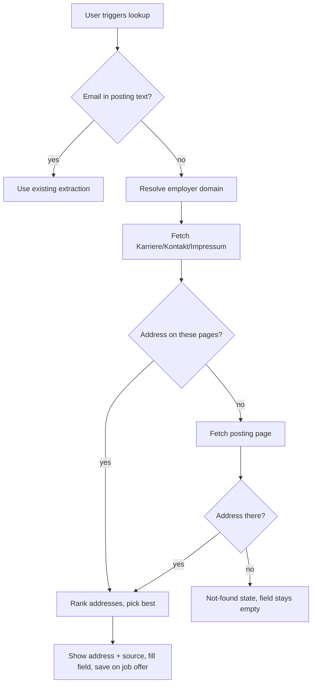
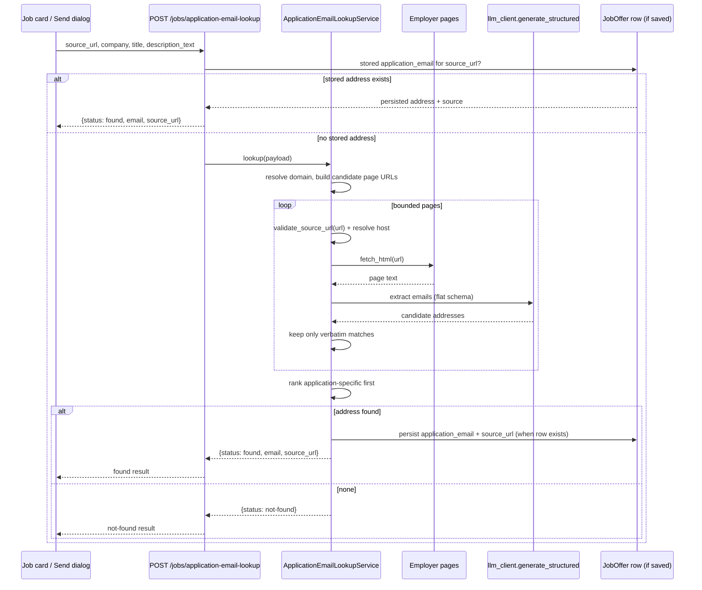

# Job-Search Application Email Lookup - Plan

## Goal Capsule

- **Objective:** Let the user find a valid application email for a job posting that carries none in its text, by resolving the employer's domain and scraping its public pages, then pre-filling the send dialog's recipient field and saving the address for reuse.
- **Product authority:** The Product Contract below, originated via `ce-brainstorm` and enriched here. Single-user personal app; no multi-tenant concerns.
- **Execution profile:** `code`, Standard depth, one feature branch, 6 implementation units (`U1`-`U6`): `U1`, `U2`, and `U4` can proceed in parallel (each is independent); `U3` depends on `U2` (and transitively `U1`); `U5` and `U6` depend on `U3` and `U4`.
- **Product Contract preservation:** Unchanged — no product-scope edits during planning.
- **Open blockers:** None.

---

## Product Contract

### Summary

An on-demand "find application email" action for a job posting whose text yields no address. The backend resolves the employer's domain, scrapes its Karriere/Kontakt/Impressum pages, and extracts an address that appears verbatim on a fetched page — ranked application-specific first. The chosen address is shown with its source, pre-filled into the send-application dialog, and saved on the job offer for reuse.

### Problem Frame

Today the only recipient-email source is `extractEmail(job.description_text)` (`frontend/src/app/core/utils/email-extraction.util.ts`). `JobOffer` has no email or contact field in the frontend model, the SQLAlchemy model, or the Pydantic schema, so a posting that does not print an address on its own text shows a `—` placeholder on the result card and opens the send dialog with an empty recipient. The user then has to leave the app, find the employer's site, hunt for a Karriere or Impressum address, and paste it back. A prior plan parked this exact gap as a separate outcome (`docs/plans/2026-09-15-001-feat-job-search-source-consolidation-plan.md`).

### Key Decisions

- **Company-domain-first discovery.** Resolve and crawl the employer's domain (Karriere/Jobs, Kontakt, Impressum) before the posting page, falling back to the posting page — that is where German employers publish application addresses. *(session-settled: user-directed — chosen over job-page-first: the Impressum/Karriere pages are the canonical source.)* Governs R3.
- **On-demand, user-initiated lookup.** The lookup runs only when the user invokes it, never during job search or on dialog open. *(session-settled: user-directed — chosen over eager lookup during search: avoids bulk scraping and rate limits.)* Governs R1, R2.
- **Verifiable-only, ranked auto-pick.** Only addresses that appear verbatim on a fetched page are eligible; the top-ranked one is auto-filled with its source shown. *(session-settled: user-directed — chosen over listing every candidate or guessing a pattern: a real address must be verifiable before it is sent to.)* Governs R4, R5, R7, R9.
- **Persist the found address on the job offer.** A found address and its source are saved so later visits reuse them instead of re-scraping. *(session-settled: user-directed — chosen over session-only or always-re-lookup: avoids repeat network work.)* Governs R10.
- **One shared behavior across both surfaces.** The job-search card and the application editor's send dialog use the same lookup and the same persisted result. Governs R1.

### Requirements

**Trigger and scope**

- R1. When the existing posting-text extraction yields no email, the user can trigger an application-email lookup for that job on demand, from the job-search result card and from the application editor's send-application dialog; both surfaces perform the same lookup and share its result.
- R2. The lookup never runs automatically during job search or when a dialog opens; it runs only on explicit user invocation.

**Discovery and extraction**

- R3. The lookup resolves the employer's web domain first — from links on the posting page, then from the company name — and fetches its Karriere/Jobs, Kontakt, and Impressum pages, falling back to the job posting's own page.
- R4. Only email addresses that appear verbatim in fetched page text are eligible; the lookup never proposes an address that was not found on a fetched page.
- R5. When several eligible addresses are found, they are ranked application-specific first (for example `bewerbung@`, `jobs@`, `karriere@`, `hr@`), then named contacts, then generic addresses (for example `info@`, `kontakt@`); the top-ranked address is the one offered.
- R6. The lookup ends in exactly one of two outcomes: one chosen address, or an explicit "no application email found" result.

**Presentation and hand-off**

- R7. A found address is shown together with the page it came from, so the user can verify it before sending.
- R8. In the send-application dialog, a found address is placed in the recipient email field, which stays editable.
- R9. When no eligible address is found, the recipient field is left empty and a clear not-found state is shown; no guessed or pattern-derived address is ever entered.

**Persistence**

- R10. A found address and its source page are saved on the job offer and reused on later visits without re-running the lookup.
- R11. The user can re-run the lookup for a job and can always override the address by editing the field.

**Existing behavior**

- R12. The existing extraction of an email from the posting text is unchanged; the lookup applies only when that extraction yields nothing.

### Key Flows

- F1. Application-email lookup and hand-off
  - **Trigger:** The user invokes "find application email" on a job whose posting text yielded no address.
  - **Actors:** User; backend lookup service; employer web pages; local LLM extractor.
  - **Steps:** Resolve the employer's domain, fetch Karriere/Kontakt/Impressum pages (posting page as fallback), extract verbatim addresses, rank them, and return the top address with its source page — or a not-found result.
  - **Outcome:** The address is shown with its source, saved on the job offer, and placed in the dialog's recipient field; or the not-found state is shown and the field stays empty.
  - **Covers:** R1–R11.

### Acceptance Examples

- AE1. **Covers R1, R3, R5, R7, R10.** Given a job posting with no email in its text and an employer with a reachable Karriere page listing both `bewerbung@acme.de` and `info@acme.de`; When the user triggers the lookup; Then `bewerbung@acme.de` is chosen, shown with the Karriere page as its source, saved on the job offer, and pre-filled in the recipient field.
- AE2. **Covers R4, R6, R9.** Given the fetched pages contain no email address; When the user triggers the lookup; Then the not-found state is shown and the recipient field stays empty.
- AE3. **Covers R5.** Given a fetched page lists a named contact address and a generic `info@` address; When ranking; Then the named contact address is offered ahead of the generic one.
- AE4. **Covers R2, R10.** Given a job whose address was previously found and saved; When the user opens the send dialog again; Then the saved address is used without re-running the lookup.
- AE5. **Covers R8, R11.** Given a found address is pre-filled; When the user edits the recipient field and sends; Then the edited address is used for that send.

### Scope Boundaries

- Hardening the existing posting-text extraction (for example domain cross-checking of a text-extracted address) — deferred for later.
- External web-search APIs (paid or keyed) for stronger domain disambiguation — deferred; this plan stays key-free.
- Eager or bulk email enrichment during job search — deferred; lookups are single-job and user-initiated.
- Non-email contact discovery (phone numbers, web forms, ATS portals) — not this feature.

### Dependencies / Assumptions

- The backend's existing HTTP stack (`requests`, Playwright, BeautifulSoup) and the schema-constrained Ollama `llm_client` are available; no new external search API is added.
- Employer-domain resolution is best-effort from posting-page links and the company name; ambiguous company names may resolve to nothing.
- The lookup is a live network scrape and can be slow or fail; failure surfaces as the not-found state, never as a guessed address.

### Sources / Research

- `frontend/src/app/core/utils/email-extraction.util.ts` — current recipient-email extraction.
- `frontend/src/app/pages/job-search/job-search.component.ts`, `frontend/src/app/pages/job-search/job-search.component.html` — result-card recipient display and placeholder.
- `frontend/src/app/pages/application-editor/application-editor.component.ts`, `frontend/src/app/pages/application-editor/send-application-dialog/` — dialog pre-fill and editable recipient field.
- `backend/app/models/job_offer.py`, `backend/app/schemas/job_offer.py`, `frontend/src/app/core/models/job-offer.model.ts` — `JobOffer` shape (no email/contact field).
- `backend/app/services/job_search_service.py` (`enrich_description`), `backend/app/services/job_sources/shared.py` (`fetch_html`), `backend/app/services/llm_client.py` — reusable fetch and LLM primitives.
- `docs/plans/2026-09-15-001-feat-job-search-source-consolidation-plan.md` — defers recipient-email discovery to a separate plan.

<!-- ce-section: work-relationships -->
### How This Work Fits Together

This plan owns the recipient-email discovery fallback for job postings that carry no extractable address. The broader job-search breakdown below is the current understanding, not a committed roadmap.

- Job-source consolidation (`docs/plans/2026-09-15-001-feat-job-search-source-consolidation-plan.md`)
  - Can proceed independently of this plan.
- Application email log (`docs/plans/2026-09-14-001-feat-application-email-log-plan.md`)
  - Shares the send flow; this plan changes only the recipient address, not the log.
- Domain cross-check hardening of posting-text extraction
  - Still to decide; deferred (see Scope Boundaries).

---

## Planning Contract

### Key Technical Decisions

- KTD1. **Lookup endpoint takes a job payload and reads or persists opportunistically.** `POST /jobs/application-email-lookup` accepts the job's `source_url`, `company`, `title`, and `description_text`. When a `JobOffer` with that `source_url` already has a stored `application_email`, the endpoint returns the stored address and source without fetching anything. Otherwise it runs the lookup and persists `application_email` and `application_email_source_url` onto the matching `JobOffer` when one exists, returning the result without persisting when none does. Job-search result cards hold unsaved `JobOffer` payloads (no `id`), while `source_url` is unique on the persisted model, so keying on the payload serves both the unsaved card and the saved editor job through one endpoint. Governs R1, R10.
- KTD2. **Extraction is verifiable by construction.** The extractor calls the shared `llm_client.generate_structured` with a flat response schema (`emails: list[str]`) and then drops every returned address that is not a case-insensitive substring of the fetched page text. Routing through the shared helper keeps the process-wide Ollama lock and `keep_alive=0` unload; the flat schema avoids the known `$defs`/`$ref` nested-list failure. Governs R4, R5.
- KTD3. **Reuse the shared fetch stack under hardened SSRF validation.** Page fetches use `fetch_html` from `backend/app/services/job_sources/shared.py`. Every URL — the posting page, every resolved employer URL, and every redirect hop — is validated before it is fetched: the host is resolved and private, loopback, link-local, and reserved addresses are rejected, and redirects are either disabled or each hop is re-validated. The literal-host check in `validate_source_url` alone is not sufficient because redirects and DNS can move a validated host onto an internal address. Governs R3.
- KTD4. **The lookup is bounded by a deadline and never guesses.** Page count, per-fetch timeout, fetched-body byte size, per-page text passed to the LLM, and a total lookup deadline are config-bounded, and the extraction model is pinned to the small CV-parsing model rather than the default chat model. The deadline sits well under the frontend proxy's request timeout so a request always resolves. A deadline exceedance, a fetch error, or an LLM error yields a failure outcome rendered distinctly from a completed search that found nothing; neither ever produces a pattern-derived address. Governs R6, R9.
- KTD5. **The persisted address is a discovery cache.** `JobOffer.application_email` stores the last discovered address for reuse; the send dialog's recipient field remains authoritative at send time, and `Application.sent_to_email` / the sent-email log are unchanged. Governs R8, R10, R11.
- KTD6. **The dialog receives the lookup as an injected callback and owns its interaction states.** `SendApplicationDialogData` gains an optional lookup callback supplied by the application editor, so the dialog stays free of a direct HTTP dependency and remains testable. The dialog renders an in-flight state (action disabled, spinner) and distinct found, failed, and no-address states, and keeps a re-run affordance available after an address is present so R11's re-run clause is reachable. Governs R1, R8, R11.
- KTD7. **Frontend caches unsaved results in `JobSearchStateService`.** Because an unsaved card job has no persisted row, its lookup result is cached in the shared signal service keyed by `source_url`; the save payload carries the cached address so it is persisted when the job is saved. Governs R1, R10.

### High-Level Technical Design

The lookup is one synchronous request; the frontend shows a per-row spinner and renders the returned outcome.

### Assumptions

- A1. Unsaved card jobs cannot persist, so their lookup result is ephemeral and shared in-session; it is persisted when the job is saved. This is the resolved default for the unsaved-job gap.
- A2. Employer-domain resolution is best-effort. Links on the posting page are tried first; when none yields an employer host, the company name is slugified into candidate hosts against a fixed `.de`/`.com` TLD list, each validated and probed within the page budget. When nothing resolves, only the posting page is fetched.
- A3. The lookup is synchronous in one request; the UI owns the loading state. A config-bounded lookup deadline guarantees the request resolves.
- A4. No new dependency or external service is introduced.
- A5. The lookup result is `{status, email?, source_url?}` with `status` one of `found`, `not-found`, or `failed`; the frontend renders `not-found` and `failed` distinctly.

---

## Implementation Units

### U1. Add the persisted application-email fields to JobOffer

- **Goal:** Persist a discovered application email and its source page on the job offer.
- **Requirements:** R10.
- **Dependencies:** None.
- **Files:** `backend/app/models/job_offer.py`, `backend/app/schemas/job_offer.py`, `backend/alembic/versions/<rev>_add_application_email_to_job_offers.py`, `backend/tests/test_migrations.py` (existing sync test).
- **Approach:** Add nullable `application_email` and `application_email_source_url` columns to the `JobOffer` model, mirroring the nullable `location` column style. Surface both on `JobOfferBase`/`JobOfferRead`. Create the Alembic revision with `down_revision = '5b1e9f7a2c3d'` (the current single head); never rebase an existing revision. Use `alembic revision --autogenerate` then review.
- **Patterns to follow:** `backend/app/models/job_offer.py` nullable columns; `backend/alembic/versions/7b2f5c9d1a34_add_sent_to_email_to_applications.py` for a simple nullable add-column.
- **Test scenarios:**
  - `Covers R10.` A saved `JobOffer` round-trips `application_email` and `application_email_source_url` through the read schema.
  - Migration/model sync: `backend/tests/test_migrations.py` passes after `alembic upgrade head` (metadata comparison).
  - New fields default to `None` for an existing job offer.
- **Verification:** `pytest` from `backend/` passes, including the migration sync test.

### U2. Build the application-email lookup service

- **Goal:** Given a job payload, resolve the employer domain, fetch bounded pages, extract verbatim addresses, and return the best-ranked result or a not-found/failed outcome.
- **Requirements:** R3, R4, R5, R6.
- **Dependencies:** None.
- **Files:** `backend/app/services/application_email_lookup.py` (new), `backend/app/schemas/application_email_lookup.py` (new, request/result and LLM extraction models), `backend/app/core/config.py`, `backend/tests/services/test_application_email_lookup.py` (new).
- **Approach:**
  1. Resolve candidate page URLs: links on the posting page first; when none yields an employer host, slugify the company name into candidate hosts against a fixed `.de`/`.com` TLD list, bounded by the page budget. Target Karriere/Jobs, Kontakt, and Impressum paths, with the posting page as fallback.
  2. Validate every candidate URL before `fetch_html`: resolve the host and reject private, loopback, link-local, and reserved addresses, and either disable redirects or re-validate each redirect hop. Bound page count, per-fetch timeout, and response byte size by config.
  3. Strip HTML with `strip_html`, cap the text passed to the model (mirroring `ai_generator`'s job-description cap), and extract candidates via `llm_client.generate_structured` with a flat `emails: list[str]` schema on the small CV-parsing model. Wrap the page text as untrusted data and instruct the model to ignore any instructions embedded in it. Keep only addresses that appear case-insensitively in the capped page text.
  4. Rank application-specific (`bewerbung@`, `jobs@`, `karriere@`, `hr@`) above named contacts above generic (`info@`, `kontakt@`).
  5. Return `{status, email, source_url}` with `status` in `found` / `not-found` / `failed`; map every fetch, LLM, timeout, and deadline failure to `failed`.
- **Technical design (directional):** Follow the injectable-seam service shape used by `JobSearchService` (constructor-injected fetcher and LLM callables, `get_*_service()` provider) so tests inject fakes rather than patch globals.
- **Patterns to follow:** `backend/app/services/job_search_service.py` (`enrich_description`, injectable seams, provider), `backend/app/services/ai_generator.py` (text cap and domain-error translation), `backend/app/services/llm_client.py` (`generate_structured`), `backend/app/services/job_sources/shared.py` (`fetch_html`, `validate_source_url`, `strip_html`, `urljoin`).
- **Test scenarios:**
  - `Covers R3, R5.` A Karriere page listing `bewerbung@acme.de` and `info@acme.de` returns `bewerbung@acme.de` with the Karriere URL as source.
  - `Covers R5.` Ranking prefers an application-specific address over a named contact over a generic address.
  - `Covers R4.` An LLM response containing an address not present in the fetched page text is discarded.
  - `Covers R6.` No address on any fetched page returns the not-found result.
  - `Covers R3.` A candidate URL failing validation is never fetched, and a public URL that redirects to a loopback/link-local address is not followed.
  - Error path: a fetch timeout, an LLM error, and a lookup-deadline exceedance each return `failed` rather than raising.
  - Input bound: a page whose body exceeds the configured byte cap is truncated, not passed whole to the model.
  - Injection: a page containing an embedded instruction to prefer a non-application address does not change the ranking of verbatim addresses.
- **Verification:** Unit tests pass with fakes injected; no real network or Ollama calls occur.

### U3. Add the lookup endpoint and save-time persistence

- **Goal:** Expose the lookup over HTTP, serve a stored address without re-fetching, and persist the result when a matching saved job exists.
- **Requirements:** R1, R6, R10.
- **Dependencies:** U2.
- **Files:** `backend/app/api/jobs.py`, `backend/app/schemas/application_email_lookup.py`, `backend/tests/api/test_jobs.py`.
- **Approach:** Add `POST /jobs/application-email-lookup` taking the job payload and returning `{status, email, source_url}`. When a `JobOffer` with the payload's `source_url` already has `application_email`, return it without fetching (KTD1); otherwise run the lookup and persist `application_email` and `application_email_source_url` onto the matching row when one exists. `POST /jobs/save` already accepts both fields via `JobOfferBase` (U1); the handler copies them onto the created row, validating `application_email_source_url` with the same host validation as the lookup and a basic email-format check, and ignoring invalid values. Register nothing new in `backend/app/main.py` — extend the existing jobs router. Translate lookup failures into the `failed`/`not-found` result, not a 5xx.
- **Patterns to follow:** `backend/app/api/jobs.py` router and `get_job_search_service` dependency override in tests; `backend/tests/api/test_jobs.py` client fixture (`StaticPool`, `get_db` override, bare `TestClient`).
- **Test scenarios:**
  - `Covers R1, R10.` Lookup for a saved job's `source_url` persists both fields and returns the found address.
  - `Covers R1, R10.` A lookup for a `source_url` whose job already stores an address returns the stored value without invoking the lookup service.
  - `Covers R1.` Lookup for an unsaved `source_url` returns the found address without creating a `JobOffer` row.
  - `Covers R6.` A not-found lookup returns the not-found status and leaves any persisted fields unchanged.
  - Save path: `POST /jobs/save` with an `application_email` persists it on the created job offer, and an invalid `application_email_source_url` is rejected or ignored.
- **Verification:** API tests pass against the in-memory SQLite fixture; no real network calls.

### U4. Frontend model, service, and shared state

- **Goal:** Let the frontend request a lookup and hold its result across card and editor.
- **Requirements:** R1, R10.
- **Dependencies:** U1.
- **Files:** `frontend/src/app/core/models/job-offer.model.ts`, `frontend/src/app/core/services/job.service.ts`, `frontend/src/app/core/services/job-search-state.service.ts`, `frontend/src/app/core/services/job.service.spec.ts`, `frontend/src/app/core/services/job-search-state.service.spec.ts` (new or existing).
- **Approach:** Add `application_email` and `application_email_source_url` to the `JobOffer` model. Add a `findApplicationEmail(payload)` method to `JobService` returning an `Observable` of the lookup result. Cache unsaved results in `JobSearchStateService` keyed by `source_url` so the card and the editor's dialog share one result. Include the cached address when saving a job.
- **Patterns to follow:** `frontend/src/app/core/services/job.service.ts` (base URL, `Observable`), `frontend/src/app/core/services/job-search-state.service.ts` (root-provided signal store).
- **Test scenarios:**
  - `Covers R1.` `findApplicationEmail` issues one request to the lookup endpoint and maps the response.
  - State: a cached result for a `source_url` is returned without a second request.
  - Model: `application_email` and source round-trip on the `JobOffer` type.
- **Verification:** `npm test` frontend service specs pass with `HttpTestingController`.

### U5. Job-search result card lookup action

- **Goal:** Trigger the lookup from a result card and show the found address, its source, and the not-found/failed states.
- **Requirements:** R1, R2, R7, R9, R11, R12.
- **Dependencies:** U3, U4.
- **Files:** `frontend/src/app/pages/job-search/job-search.component.ts`, `frontend/src/app/pages/job-search/job-search.component.html`, `frontend/src/app/pages/job-search/job-search.component.spec.ts`.
- **Approach:** Add a "Find email" action to the card's action block as a low-emphasis button placed after the primary Generate action, shown when the posting text yields no address (R2, R12) and kept available as a re-run affordance once a looked-up address is present (R11). While running, disable the action and show a per-row spinner keyed by `source_url`. On success, render the address inside the existing recipient row (replacing the `—` placeholder) with an external source link (`target="_blank"`, `rel="noopener noreferrer"`, descriptive label) and announce the result in an aria-live region. On `not-found`, render "No application email found"; on `failed`, render a distinct "Couldn't reach the employer's site — try again" state. Both keep the recipient placeholder. Keep the existing `recipientEmail()` display for the posting-text case.
- **Patterns to follow:** `frontend/src/app/pages/job-search/job-search.component.ts` per-row loading keyed by `source_url`; spinner-in-button markup in `job-search.component.html`.
- **Test scenarios:**
  - `Covers R1, R7.` Triggering the lookup renders the returned address and a source link.
  - `Covers R2, R12.` The action is absent when the posting text already yields an address.
  - `Covers R9.` A not-found result renders the not-found state and keeps the placeholder.
  - `Covers R9.` A failed result renders the distinct failure state, not the not-found copy.
  - `Covers R11.` A re-run can be triggered after an address is already displayed.
  - Loading: the action is disabled and a spinner shows while the request is in flight.
- **Verification:** `npm test` job-search component specs pass.

### U6. Application editor and send dialog lookup

- **Goal:** Trigger the lookup from the send dialog and pre-fill the recipient field.
- **Requirements:** R1, R7, R8, R9, R10, R11.
- **Dependencies:** U3, U4.
- **Files:** `frontend/src/app/pages/application-editor/application-editor.component.ts`, `frontend/src/app/pages/application-editor/application-editor.component.spec.ts`, `frontend/src/app/pages/application-editor/send-application-dialog/send-application-dialog.component.ts`, `frontend/src/app/pages/application-editor/send-application-dialog/send-application-dialog.component.html`, `frontend/src/app/pages/application-editor/send-application-dialog/send-application-dialog.component.spec.ts` (if present).
- **Approach:** Add an optional lookup callback to `SendApplicationDialogData`, supplied by the editor (KTD6). The dialog shows a "Find email" action when the recipient field is empty and keeps a "Find email again" affordance once an address is present (R11). While in flight, disable the action and show an inline spinner. On success, set `to_email` and show the source link; on `not-found` show "No application email found"; on `failed` show a distinct "Couldn't reach the employer's site — try again". Update the field placeholder to point at the action. Prefer the persisted `application_email` over the posting-text extraction when opening the dialog (R10, AE4). The field stays editable (R8, R11).
- **Patterns to follow:** `frontend/src/app/pages/application-editor/application-editor.component.ts` `onOpenSendDialog` pre-fill; `send-application-dialog.component.ts` reactive form and `MAT_DIALOG_DATA`.
- **Test scenarios:**
  - `Covers R8.` A found address is written into `to_email` and the field remains editable.
  - `Covers R10, AE4.` A persisted `application_email` is used to pre-fill without a lookup call.
  - `Covers R9.` A not-found result leaves `to_email` empty and shows the not-found state.
  - `Covers R9.` A failed result shows the distinct failure copy.
  - `Covers R11.` A re-run can be triggered after an address is present.
  - Loading: the action is disabled and an inline spinner shows while the request is in flight.
  - `Covers R11.` An edited `to_email` is returned in the dialog result.
- **Verification:** `npm test` application-editor and dialog specs pass.

---

## Verification Contract

- **Backend tests:** `pytest` from `backend/` (config `backend/pytest.ini`, `testpaths = tests`). Includes the migration/model sync test and the new lookup service and API tests.
- **Frontend tests:** `npm test` from `frontend/` (Karma/Jasmine via `ng test`).
- **Migration:** `alembic upgrade head` applies the new revision on the current single head; `backend/tests/test_migrations.py` passes.
- **Behavioral proof for this feature:** the lookup service unit tests prove ranking, verbatim-only eligibility, SSRF rejection (including a redirect to an internal address), the config bounds, and the not-found/failed paths without real network or Ollama calls; the API tests prove persisted-first reads, persistence for a saved job, and non-persistence for an unsaved one.
- **Browser smoke (affected pages):** job-search result card lookup action and the application editor send dialog, on a running stack.

## Definition of Done

- All six units complete; `pytest` (backend) and `npm test` (frontend) pass.
- The Alembic migration applies cleanly and the migration/model sync test passes.
- Lookup returns a verbatim-sourced address or an explicit not-found/failed outcome; no guessed address can reach the recipient field.
- Every lookup resolves within the configured deadline, and no URL that resolves or redirects to a private, loopback, link-local, or reserved address is fetched.
- A found address persists on a saved job offer and is reused on later visits without a second lookup; an unsaved card result is shared in-session and persisted on save.
- No new dependency or external search API was introduced; Ollama calls route only through `llm_client.generate_structured`.
- Abandoned or experimental code from implementation attempts is removed before declaring done.
