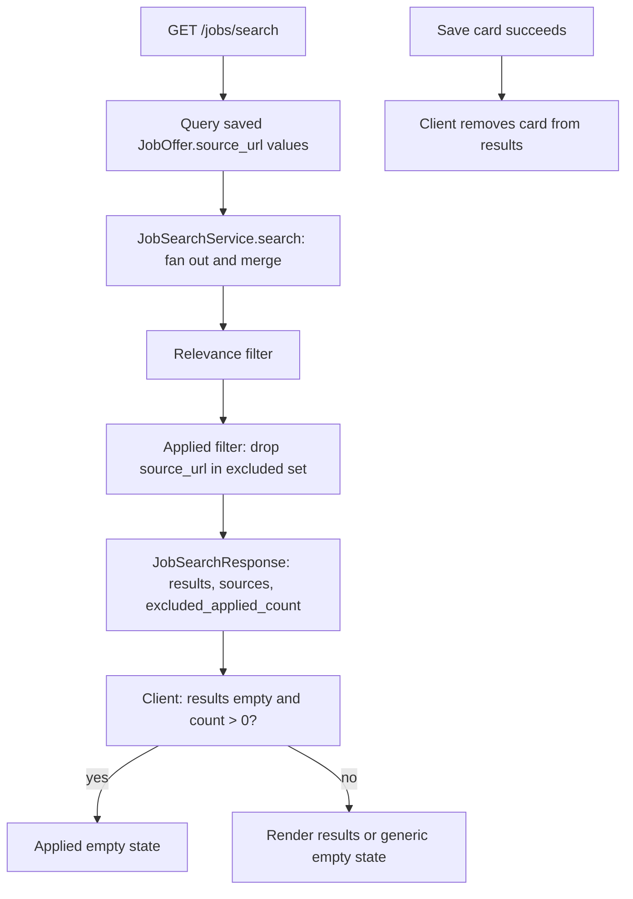

# Hide Applied Jobs in Job Search - Plan

## Goal Capsule

- **Objective:** Hide postings that already have an application from the job search results, so the list contains only jobs the user has not applied to yet.
- **Product authority:** Scope confirmed with the user via `ce-brainstorm` dialogue on 2026-09-15.
- **Product Contract preservation:** clarified, no scope change — R5 now also names the already-saved conflict response (same intent: an applied job leaves the list), and the two Deferred-to-Planning questions are resolved into KTD1 and KTD2. R1–R8, F1–F2, AE1–AE4, and the Key Decisions are otherwise preserved.
- **Open blockers:** None.

---

## Product Contract

### Summary

The job search will return only postings that do not already have an application.
The backend excludes already-saved jobs from the merged results, saving a result removes its card immediately, and a search whose results were all excluded shows an explanatory empty state instead of "no offers found".

### Problem Frame

Search results are transient, and the client only knows about jobs saved during the current session.
A posting saved in an earlier session therefore reappears in later searches even though it is already on the Applications page.
Those repeats waste attention and invite duplicate saves and applications.
The Applications list is the source of truth for what has already been applied to.

### Requirements

**Filtering**

- R1. The job search excludes any result whose `source_url` matches an existing saved job offer, since every saved job offer has an application.
- R2. The exclusion runs once over the merged results, so it applies uniformly to every source, including the generic fallback scraper.
- R3. Matching is exact `source_url` only — no fuzzy title/company matching and no cross-source deduplication.
- R4. The search response tells the client when results were suppressed by this filter, so the page can distinguish "everything was already applied" from "the sources returned nothing".

**Search page behavior**

- R5. When a save from the results succeeds — or returns the already-saved conflict — via Save job or Generate application, that card leaves the current result list immediately.
- R6. When every result was suppressed as already applied, the page shows a message distinct from the generic empty state and from the all-sources-unavailable state.
- R7. Applied postings are never shown in search results; there is no reveal toggle and no "already applied" marker.
- R8. A source whose offers were all suppressed still reports as reachable in the source-status chips, and source filtering keeps working.

### Key Decisions

- **Filter in the backend, not the client.** (session-settled: user-directed — chosen over client-side filtering or a dedicated saved-URLs endpoint: one server-side truth that covers earlier sessions and open tabs.) Governs R1, R2, R4.
- **Any saved job counts as applied, drafts included.** (session-settled: user-directed — chosen over only-sent or only-progressed applications: saving creates the application, so "saved" and "on the Applications page" are the same set.) Governs R1.
- **Hide applied results completely and drop a saved card immediately.** (session-settled: user-directed — chosen over a reveal toggle and over keeping a saved card visible: the list stays strictly unapplied-only.) Governs R5, R6, R7.
- **Exact `source_url` matching only.** (session-settled: user-approved — chosen over fuzzy title/company matching: the URL is the canonical unique identity save already dedupes on, and fuzzy matching would hide genuinely new postings.) Governs R3.
- **Keep the existing Save/Saved button and its 409 conflict handling.** Still needed for in-session saves and races; stripping them is not part of this work.

### Key Flows

- F1. Search and filter
  - **Trigger:** The user submits a search.
  - **Steps:** The backend fans out to the sources, merges the results, drops every result whose `source_url` matches a saved job, and returns the results plus per-source statuses and the suppression signal.
  - **Outcome:** The page renders only unapplied results, or the already-applied empty state.
  - **Covers:** R1, R2, R4, R6, R7, R8
- F2. Save from results
  - **Trigger:** The user saves a card (Save job or Generate application).
  - **Steps:** The save succeeds, creating the job offer and its draft application; the client removes the card from the current list.
  - **Outcome:** The saved posting no longer appears in the current results.
  - **Covers:** R5

### Acceptance Examples

- AE1. **Covers R1, R4, R6.** Given a search whose every relevance-passing result matches an already-saved job, when the search runs, then the response carries zero results and the page shows the already-applied empty state, not "No job offers found".
- AE2. **Covers R5.** Given a result card in the current list, when the user saves it and the save succeeds, then the card leaves the list immediately and no "Saved" state remains visible.
- AE3. **Covers R1.** Given an application the user deletes, when the user searches again, then that posting can appear in the results again.
- AE4. **Covers R2, R8.** Given one source whose offers are all already applied and another source with fresh offers, when the search runs, then only the fresh offers show and the filtered source still reports as reachable.

### Scope Boundaries

- Cross-source deduplication remains deferred, continuing `docs/plans/2026-09-15-001-feat-job-search-source-consolidation-plan.md` and `docs/plans/2026-09-15-003-feat-job-search-source-and-relevance-plan.md`.
- No fuzzy or partial matching beyond exact `source_url`.
- No reveal toggle, hidden-results list, or "already applied" marker.
- Removing the Save/Saved UI or the 409 conflict handling (see the Key Decision above) is not part of this work.

<!-- ce-section: work-relationships -->
### How This Work Fits Together

This plan owns hiding already-applied postings from job search. It is one part of the job-search work; the breakdown is the current understanding, not a committed roadmap:

- Search result quality (`docs/plans/2026-09-15-003-feat-job-search-source-and-relevance-plan.md`) — shares the merged-results filter point. Its relevance filter would also drop results, which is why this plan asks for an explicit suppression signal rather than inferring it from source statuses.
- Cross-source deduplication — still to decide; deferred by both prior plans.
- Job-search UI/UX leanness — can proceed independently.

### Dependencies / Assumptions

- Assumption: saved job offers and applications are 1:1 after backfill — `POST /jobs/save` creates both atomically and `DELETE /applications/{id}` removes the job offer. A legacy `JobOffer` saved before commit `98d31c0` may lack an `Application` until re-saved; it is still treated as applied and hidden, consistent with "any saved job counts as applied".
- The search path has no database access today; giving it one is a planning decision.

### Sources / Research

- `backend/app/api/jobs.py:28-46` — `GET /jobs/search` takes no database session and performs no saved-job filtering.
- `backend/app/services/job_search_service.py:424-569` — the fan-out and merge point; the existing `_apply_relevance_filter` runs once at `:557` over the fully merged results and leaves `source_statuses` untouched.
- `backend/app/services/job_search_service.py:571-593` — `_apply_relevance_filter`, the helper the new exclusion sits beside.
- `backend/app/api/jobs.py:49-100` — `POST /jobs/save` creates the `JobOffer` plus a draft `Application` atomically, keyed on the unique `source_url`.
- `backend/app/api/applications.py:175-193` — `DELETE /applications/{id}` deletes the associated `JobOffer`, so a deleted application's posting is fully removed.
- `backend/app/models/job_offer.py:24,37-40` and `backend/app/models/application.py:31-33` — unique `source_url`, `job_offer_id` FK, cascade delete.
- `frontend/src/app/pages/job-search/job-search.component.ts:76-82,161-171` — current result filtering is by `source_platform` only; `savedJobIds` drives the Save button state.
- `frontend/src/app/pages/job-search/job-search.component.html:90-102` — current empty-state branches (generic vs all-sources-unavailable).
- `backend/app/schemas/job_offer.py:64-70` — `JobSearchResponse` currently has only `results` and `sources`.

---

## Planning Contract

### Key Technical Decisions

- KTD1. The API layer supplies the excluded source URLs to `search()`; `JobSearchService` keeps no database access. Every service in `backend/app/services/` is DB-free and endpoints own the session via `Depends(get_db)`, so passing the set in preserves that seam and keeps the service unit-testable without a database. Governs R1, R2.
- KTD2. `JobSearchResponse` gains `excluded_applied_count: int`, computed after the relevance filter. An explicit count lets the client distinguish the applied empty state from a genuinely empty search; inferring it from source statuses fails once the relevance filter also drops results. Governs R4.
- KTD3. The applied filter runs after the existing relevance filter, over the merged results, and removes offers whose `source_url` is in the excluded set. Running it second makes `excluded_applied_count` mean "relevance-passing results that were already applied". Governs R1, R2, R4.
- KTD4. The frontend removes a card on every save path that leaves the job applied, including the 409 conflict path. A 409 means the job is already saved server-side, so it is applied and must not remain in the list. Governs R5.
- KTD5. The applied empty state renders when the result list is empty and the hidden-as-applied count is greater than zero, counting both server-suppressed results and cards removed in-session after a save. That is the only case where every matching result was already applied. Governs R6.

### High-Level Technical Design

### Assumptions

- The relevance filter from `docs/plans/2026-09-15-003-feat-job-search-source-and-relevance-plan.md` stays in place and runs before the applied filter.
- The number of saved job offers stays small enough to load all `source_url` values per search (personal-use app).
- A `JobOffer` and its `Application` are 1:1 after backfill, so querying `JobOffer.source_url` is equivalent to querying applied jobs (see Product Contract Dependencies).

### Sequencing

U1 lands first because it defines the response shape. U2 depends on U1; U3 is independent.

---

## Implementation Units

### U1. Exclude saved jobs from merged search results

- **Goal:** The search endpoint omits results that match a saved job offer and reports how many it excluded.
- **Requirements:** R1, R2, R3, R4, R8
- **Dependencies:** None
- **Files:**
  - `backend/app/services/job_search_service.py`
  - `backend/app/schemas/job_offer.py`
  - `backend/app/api/jobs.py`
  - `backend/tests/services/test_job_search_service.py`
  - `backend/tests/api/test_jobs.py`
- **Approach:** Add an optional `excluded_source_urls: Collection[str] | None = None` parameter to `JobSearchService.search()`. After the existing `_apply_relevance_filter` call, drop offers whose `source_url` is in the set and count the removed offers. Add `excluded_applied_count: int = 0` to `JobSearchResponse`. In `search_jobs`, add `db: Session = Depends(get_db)`, query `JobOffer.source_url`, and pass the set to `search()`. Leave `source_statuses` unchanged. Update `_FakeJobSearchService.search` in `backend/tests/api/test_jobs.py` to accept the new keyword argument, otherwise the existing search-envelope test raises `TypeError`.
- **Patterns to follow:** the `_apply_relevance_filter` helper and its single post-merge call site (`job_search_service.py:557-593`); the `db: Session = Depends(get_db)` pattern in `save_job` (`jobs.py:50`).
- **Test scenarios:**
  - Happy path: a merged result whose `source_url` is excluded is absent from `results` and counted in `excluded_applied_count`.
  - Happy path: a merged result not in the excluded set is returned unchanged.
  - Edge case: an omitted or empty excluded set returns all results and `excluded_applied_count == 0`.
  - Edge case: all of one source's results are excluded; that source still reports `status="ok"`.
  - Edge case: `excluded_applied_count` counts only relevance-passing results, so a result dropped by the relevance filter is not counted.
  - Integration: `GET /jobs/search` excludes a job created through `POST /jobs/save`, and the response count reflects it.
  - Integration: a job whose application was deleted is returned by a later search (Covers AE3).
- **Verification:** Backend tests pass, and the response schema exposes `excluded_applied_count`.

### U2. Show the already-applied empty state

- **Goal:** When a search returns nothing because every matching result was already applied, the page says so instead of "No job offers found."
- **Requirements:** R4, R6, R7
- **Dependencies:** U1
- **Files:**
  - `frontend/src/app/core/models/job-offer.model.ts`
  - `frontend/src/app/core/services/job-search-state.service.ts`
  - `frontend/src/app/core/services/job-search-state.service.spec.ts`
  - `frontend/src/app/pages/job-search/job-search.component.ts`
  - `frontend/src/app/pages/job-search/job-search.component.html`
  - `frontend/src/app/pages/job-search/job-search.component.spec.ts`
- **Approach:** Add `excluded_applied_count?: number` (optional, so existing test fixtures compile) to the frontend `JobSearchResponse` type. Add an `appliedHiddenCount` signal to `JobSearchStateService`, set it from `response.excluded_applied_count ?? 0` on search success, and reset it to 0 at search start, in `clearResults()`, and on search error. Add a computed in the component and a new empty-state branch in the template, placed before the generic empty state.
- **Patterns to follow:** the `sourceStatuses` signal flow and the `allSourcesUnavailable` empty-state branch (`job-search.component.ts:60,87-89`, `.html:90-98`).
- **Test scenarios:**
  - Happy path: empty `results` with `excluded_applied_count > 0` renders the applied empty message.
  - Edge case: empty `results` with `excluded_applied_count === 0` still renders the generic empty message.
  - Edge case: `allSourcesUnavailable()` still renders the unreachable message.
  - Edge case: a new search and `onClearResults()` both reset the count.
- **Verification:** The component and state-service specs pass.

### U3. Remove a card immediately after a successful save

- **Goal:** A result card disappears from the current list as soon as it is saved, including when the save reports it was already saved.
- **Requirements:** R5
- **Dependencies:** None
- **Files:**
  - `frontend/src/app/core/services/job-search-state.service.ts`
  - `frontend/src/app/core/services/job-search-state.service.spec.ts`
  - `frontend/src/app/pages/job-search/job-search.component.ts`
  - `frontend/src/app/pages/job-search/job-search.component.spec.ts`
- **Approach:** Add `removeResult(sourceUrl: string)` to `JobSearchStateService` that filters `results`, drops the matching `applicationEmailResults` entry, and increments `appliedHiddenCount`. Call it on the `onSaveJob` success and 409 paths, and on the `onGenerateApplication` cached-id, success, and 409 paths.
- **Patterns to follow:** the `cacheSavedJob` mutation style (`job-search-state.service.ts:48-52`) and the `conflictJobOfferId` handling (`job-search.component.ts:326-332`).
- **Test scenarios:**
  - Happy path: a successful save removes the card from the list.
  - Happy path: `onGenerateApplication` removes the card.
  - Edge case: a 409 conflict also removes the card.
  - Edge case: removing a card whose `source_url` is not present leaves the list unchanged.
  - Edge case: `onClearResults()` still empties the list.
- **Verification:** The component and state-service specs pass.

---

## Verification Contract

| Check | Command | Applies to |
|---|---|---|
| Backend tests | `cd backend && python -m pytest -q` | U1 |
| Frontend tests | `cd frontend && npx ng test --watch=false --browsers=ChromeHeadless` | U2, U3 |
| Frontend build | `cd frontend && npm run build` | U2, U3 |

There is no frontend lint script in `frontend/package.json`; the build and test targets are the available gates.

---

## Definition of Done

- U1, U2, and U3 are complete.
- The backend test suite, the frontend test suite, and the frontend build all pass.
- `GET /jobs/search` never returns an offer whose `source_url` matches a saved job offer.
- The applied empty state appears exactly when the result list is empty and the hidden-as-applied count is greater than zero (server-suppressed plus in-session removals).
- A saved card leaves the list immediately on a successful save or a 409 already-saved response.
- No abandoned-attempt or dead code remains in the diff.
