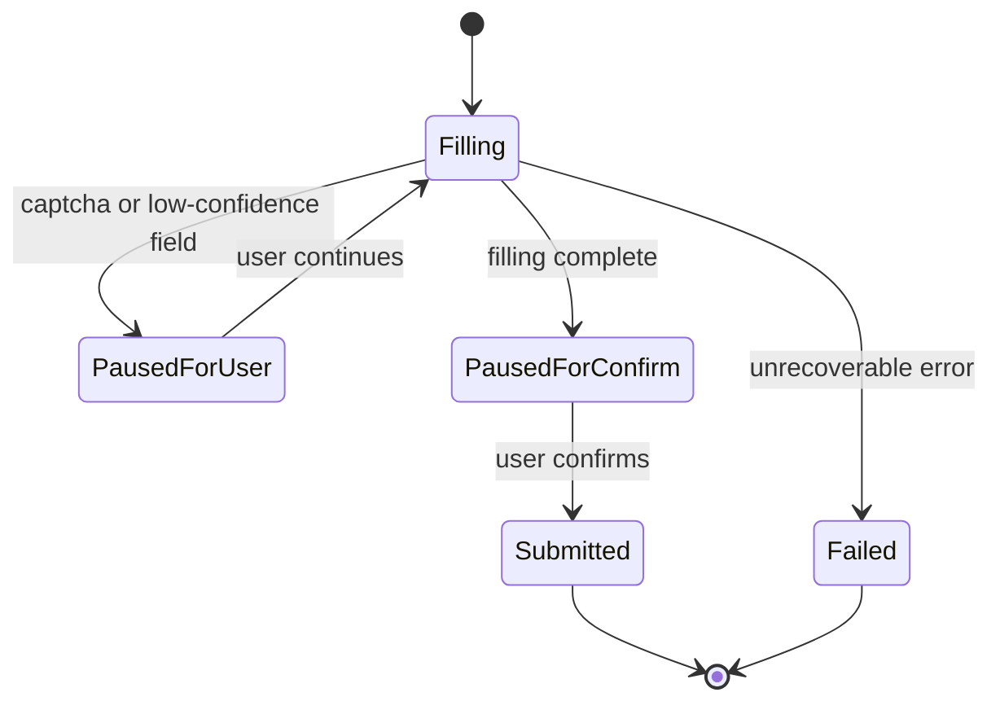
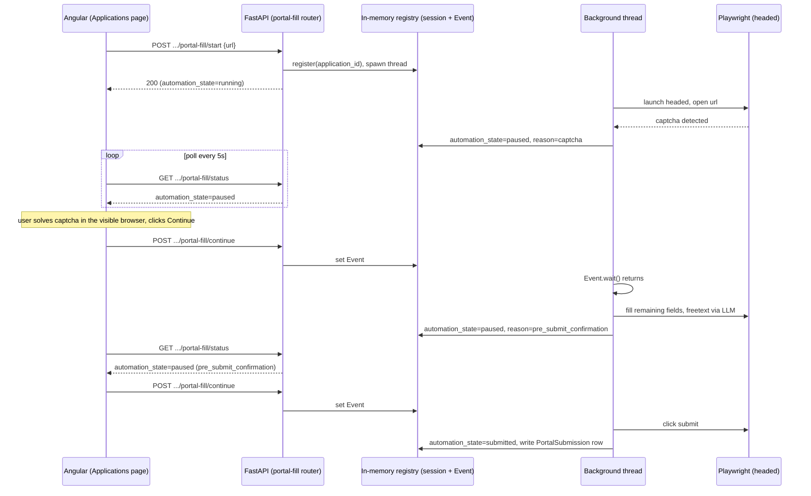

# Portal Application Auto-Fill Agent - Plan

## Goal Capsule

- **Objective:** Add a portal auto-fill capability to Application-Manager that fills, and — with mandatory human confirmation — submits a draft Application's data into an external career-portal form, starting with Personio, using the app's existing profile, document, and cover-letter data plus its LLM service for freetext questions.
- **Product authority:** This plan owns the auto-fill run itself — trigger, field-filling, freetext answers, human-in-the-loop pauses, and status tracking. Multi-platform parser coverage, bot-detection evasion, an auto-submit toggle, and portal-URL auto-discovery are not active scope (see Scope Boundaries).
- **Open blockers:** None. All major forks raised during brainstorming were resolved; see Key Decisions.

## Product Contract

*Product Contract unchanged — this enrichment adds a Planning Contract, Implementation Units, Verification Contract, and Definition of Done below; a "Deferred to Follow-Up Work" note is appended to Scope Boundaries per Phase 3.7.*

### Summary

Add a new auto-fill action on a draft Application: a headed Playwright agent opens the career-portal application form (Personio for v1), fills it from the Application's existing profile, document, and cover-letter data, answers freetext questions via the app's existing LLM service, and pauses via an in-app banner at captchas and always before the final submit.

### Problem Frame

Job seekers using Application-Manager still re-enter the same profile fields — name, contact details, links, salary expectations — by hand on every company's career portal, and write ad-hoc answers to portal-specific freetext questions the app doesn't otherwise generate. The app already automates the parts it controls (document generation, cover letters, email sends); portal-hosted application forms are the remaining manual step.

### Requirements

**Trigger & data reuse**

- R1. From the Applications page, the user starts a portal auto-fill run on a draft Application by providing the career-portal application-form URL.
- R2. The run uses the Application's existing `MasterProfile`, `ProfileAttachment` documents, and generated `cover_letter_text` as its only data source; it introduces no separate profile or document storage.

**Form filling**

- R3. The agent identifies and fills standard form fields (text, email, tel, file upload, select) using field name/id, placeholder, ARIA label, and `autocomplete` attributes.
- R4. For v1, platform-specific field mapping targets Personio-hosted application forms, built on top of the generic detection in R3 so later platforms can add their own mapping without rebuilding detection.
- R5. Dropdown/select values are matched to profile data with fuzzy matching (e.g. "Deutschland" → "Germany"/"DE").
- R6. Document uploads (CV, cover letter, references) use the Application's existing attached documents.

**Freetext questions (LLM)**

- R7. When the form includes a freetext question not covered by a standard field, the agent sends the question, the profile, the job description, and the Application's existing cover letter text to the app's existing LLM service, and fills the returned answer into the field.
- R8. Freetext answers follow a tone and length limit consistent with the existing cover-letter generation prompt.

**Human-in-the-loop & safety**

- R9. The browser runs headed so the user can see, and when needed act on, the page directly.
- R10. When the agent detects a captcha (reCAPTCHA, Cloudflare, hCaptcha) or a required field it cannot map with confidence, it pauses the run and raises an "Action needed" state on the Application in the Applications page; the user resolves it in the visible browser, then resumes from the app.
- R11. Before the real submit action, the run always pauses for explicit user confirmation through the same in-app mechanism — no setting skips this.
- R12. A field the agent cannot fill or match confidently is left visibly flagged for the user, never silently skipped or guessed.

**Tracking**

- R13. A completed or failed portal-submission run updates the Application's existing status/history so the Applications page distinguishes it from an email-sent application.

### Key Decisions

- **Integrate into the existing app, not a standalone script.** The run reuses `MasterProfile`, `ProfileAttachment`, `Application`, and the existing Ollama-based LLM service instead of separate `profile.json`/`documents/`/CSV storage. *(session-settled: user-directed — chosen over a fully standalone tool and an API-reading standalone script: avoids duplicating data already owned by this project.)* Governs R1, R2, R6, R7, R13.
- **Resume control is an in-app banner, not a console prompt or on-page overlay.** *(session-settled: user-directed — chosen over a terminal prompt and an injected on-page button: keeps control inside the app the user already works in.)* Governs R10, R11.
- **Final submit is always a mandatory pause; no auto-submit setting exists in v1.** *(session-settled: user-directed — chosen over a togglable `AUTO_SUBMIT` flag: removes a footgun and matches the human-control framing of the feature.)* Governs R11.
- **V1 targets a single platform, Personio**, with the generic field-detection layer (R3) built so further platforms can extend it later. *(session-settled: user-directed — chosen over shipping all four named platforms or a generic-fallback-only approach: proves the parser pattern before broadening coverage.)* Governs R4.
- **Bot-detection evasion (`playwright-stealth`, artificial typing delays) is dropped for v1.** *(session-settled: user-directed — a human-paced, low-volume personal workflow is unlikely to trigger detection; revisit only if a specific portal actually blocks the agent.)*
- **The portal application-form URL is supplied by the user, not auto-discovered.** *(session-settled: user-directed — chosen over mirroring the existing `application_email` auto-discovery: simpler for v1, and the user already has the URL from the job posting.)* Governs R1.
- **Freetext answers are grounded in the application's already-generated cover letter**, in addition to profile and job description. *(session-settled: user-directed — keeps portal answers consistent in tone/content with the cover letter already produced for the same application.)* Governs R7.

### Actors

- A1. **User** — the job seeker driving the run and resolving pauses.
- A2. **Auto-fill agent** — the Playwright-driven process filling the form.
- A3. **LLM service** — the app's existing Ollama-based service answering freetext questions.
- A4. **Career portal** — the external, Personio-hosted application form.

### Key Flows

- F1. Portal auto-fill run
  - **Trigger:** User opens a draft Application, supplies the application-form URL, and starts the run.
  - **Actors:** A1, A2, A3, A4
  - **Steps:** A2 opens the URL headed; fills standard fields from the Application's profile/document data (R3–R6); for each freetext question, asks A3 for an answer grounded in profile, job description, and cover letter (R7, R8) and fills it; pauses and raises "Action needed" on any captcha or low-confidence required field (R10, R12) until A1 continues; once filling is complete, pauses again for mandatory confirmation before the real submit (R11); on confirmation, submits and updates the Application's status (R13).
  - **Outcome:** The Application reflects a completed portal submission, or a clearly flagged incomplete/failed state if the user abandons the run.

### Acceptance Examples

- AE1. **Covers R10.** Given the agent hits a Cloudflare captcha while filling the form, when the captcha appears, then the run pauses, the Application shows "Action needed," and it resumes only after the user continues from the app.
- AE2. **Covers R11.** Given the form is fully filled including freetext answers, when the agent reaches the real submit button, then it always pauses for explicit confirmation before clicking it, on every run, with no way to skip.
- AE3. **Covers R12.** Given a required field the agent cannot map to any profile data with confidence, when filling reaches that field, then the agent flags it visibly for the user instead of leaving it blank or guessing a value.
- AE4. **Covers R7.** Given the form asks "Why do you want to work here?" and the Application already has a generated cover letter, when the agent answers it, then the answer is generated using the profile, the job description, and the existing cover letter text as context.

### Success Criteria

- SC1. A user completes one real Personio application end-to-end without retyping or correcting any standard field the agent could fill — the only manual actions are captcha handling, freetext review, and the final confirm.
- SC2. Generated freetext answers are usable as submitted, or after light editing, without needing a rewrite.

### Scope Boundaries

Deferred for later:

- Workday, Greenhouse, and Lever parsers — only Personio ships in v1 (R4).
- Bot-detection evasion / stealth measures.
- An auto-submit toggle or config flag.
- Auto-discovering the portal application-form URL from the job offer.

### Deferred to Follow-Up Work

- A `docs/solutions/` entry documenting the local (non-Docker) dev-mode split introduced by this feature, once it has actually been used — this repo has no existing solution doc for running the backend both ways side by side.

### Dependencies / Assumptions

- Headed Playwright needs a display, so this feature only works with the backend running in local/non-Docker dev mode (already a supported mode per the README); the Docker Compose deployment cannot run it as-is.
- Running local/non-Docker also changes which database and LLM instance the backend talks to, not just the display: the repo's default `DATABASE_URL` points at a local SQLite file (empty of the user's real Applications) and the default `OLLAMA_BASE_URL` resolves only inside the Docker network. A local run of this feature must override both to point at the same Postgres instance and Ollama instance the user's normal Docker Compose session uses (Postgres's port is already published to the host; Ollama's is not, so a local run needs either a native Ollama install with the same models pulled, or a published port), or it will see no draft Applications and no reachable LLM.
- The run executes as an asynchronous/background process so the Applications page can show the "Action needed" state while the browser sits paused, independent of any single open request or browser tab.
- Relies on the app's existing Ollama-based LLM service; no new LLM provider is introduced (the app has already migrated off OpenAI).

### Sources / Research

- `backend/app/models/application.py`, `master_profile.py`, `profile_attachment.py`, `job_offer.py` — existing data model this run reuses instead of duplicating.
- `backend/app/services/llm_client.py` — existing Ollama-based LLM service to reuse for freetext answers.
- `backend/app/services/job_search_service.py` and `backend/app/services/job_sources/` — existing Playwright usage pattern (currently scraping, not form submission) to follow.
- `docs/plans/2026-08-17-001-refactor-openai-to-ollama-migration-plan.md` — why the app runs LLM calls through Ollama only.
- `README.md` — Docker Compose vs. local (non-Docker) dev mode, relevant to the headed-browser display constraint.
- `backend/app/api/applications.py` (`_generating_job_offer_ids`/`_generating_lock`, `send_application`) — the closest existing precedent for dedup-locking a slow user-triggered action and for mutate-plus-log-on-success.
- `frontend/src/app/pages/application-editor/application-editor.component.ts` (`pollForRunningGeneration`) — the one existing frontend polling implementation in this app.
- `docs/solutions/performance-issues/ollama-concurrent-model-residency-memory-pressure.md`, `docs/solutions/integration-issues/ollama-structured-output-nested-list-schema-validation-failure.md` — constraints on any new `llm_client` call site.
- `docs/solutions/test-failures/fastapi-testclient-sqlite-memory-pool-and-lifespan-isolation.md`, `docs/solutions/database-issues/alembic-migration-rebase-silently-skips-sibling-branch.md` — test-fixture and migration conventions to follow.
- [Personio: Integration via Iframe](https://developer.personio.de/docs/integration-via-iframe) — confirms Personio's embed is cross-origin, motivating `frame_locator()` (KTD4).
- [RapidFuzz](https://github.com/rapidfuzz/RapidFuzz) — MIT-licensed fuzzy-matching library chosen over GPL-licensed TheFuzz/FuzzyWuzzy (KTD5).
- `backend/app/models/sent_email.py` — `SentEmail`'s actual FK behavior (`ondelete=SET NULL` plus a snapshot, not cascade delete), the precedent `PortalSubmission` (U1, KTD3) follows.
- `frontend/src/app/core/services/tab-title.service.ts` — existing backgrounded-tab completion signal, extended for the paused-run notification in U7.
- Playwright's sync API pins objects to their creating OS thread (greenlet-based dispatcher) — motivates routing cancel through a flag the owning thread checks, never a cross-thread `browser.close()` call (KTD2).

## Planning Contract

### Key Technical Decisions

- KTD1. **Background run as a dedicated thread plus an in-memory registry.** A `threading.Thread` per active run, tracked in a process-wide `{application_id: session}` dict guarded by a `threading.Lock`, mirrors the existing `_generating_job_offer_ids`/`_generating_lock` dedup pattern in `backend/app/api/applications.py`. No task queue (Celery/RQ/arq) exists in this codebase, and the app runs single-worker, so in-memory state is an accepted convention here, not a shortcut. A second start for the same `application_id` returns 409, matching the existing convention. The thread's entire run loop runs inside a try/except: any unhandled exception (a locator timeout, a Playwright crash, an LLM failure) closes the browser, removes the registry entry, and sets `automation_state="failed"` with `action_needed_reason="unhandled_error"` — the same cleanup the explicit cancel path performs — so a crash can never leave an `Application` stuck at `"running"` with no banner and no way to start a new run short of a backend restart.
- KTD2. **Pause/resume via a `threading.Event`, not Playwright's `page.pause()`; cancel is a flag, not a direct browser call.** `page.pause()` is a local-Inspector debugging tool: it can auto-close the browser after roughly 30 seconds idle and expects a human driving DevTools directly, not a backend-driven pause signaled by a separate HTTP request. The run loop waits on a `threading.Event` per session; a `continue` endpoint sets it. Cancel works the same way — the API layer only sets a `cancel_requested` flag; it never touches the Playwright browser/page objects directly, because Playwright's sync API pins every object to the OS thread that created it (its greenlet-based dispatcher), so calling `browser.close()` from the FastAPI request thread instead of the background thread that launched Chromium would error or hang rather than close cleanly. The background thread checks the flag itself (after `event.wait()` returns, and between fill steps) and performs the actual `browser.close()` from its own thread. The pause-wait's timeout is a concrete configurable duration (not left as "generous"); if it elapses with no resume, the run fails with `action_needed_reason="timeout"` — a value distinct from whatever pause reason (`captcha`/`low_confidence_field`/`pre_submit_confirmation`) was active, so the user can tell a stalled run from one that hit an unrelated error. Governs R10, R11.
- KTD3. **New nullable `Application` columns, not a new `ApplicationStatus` value.** Add `automation_state` (`running`/`paused`/`submitted`/`failed`), `action_needed_reason`, and `automation_started_at`. `ApplicationStatus` represents the final human-facing outcome, and the frontend's status filter/badges already treat it that way — overloading it would break that contract. `action_needed_reason` does double duty: while `automation_state="paused"` it names why the run is waiting (`captcha`/`low_confidence_field`/`pre_submit_confirmation`); when a run transitions straight to `automation_state="failed"` it names why the run stopped (`timeout`/`iframe_not_found`/`unhandled_error`/`cancelled_by_user`) — one field, two life-cycle phases, instead of a second column. A new `PortalSubmission` table logs a successful submission: `application_id` FK with `ondelete=SET NULL` plus a `company`/`job_title`/`platform` snapshot, exactly mirroring `SentEmail`'s audit-survives-deletion shape (`backend/app/models/sent_email.py`) — written in the same commit as the `Application` mutation, only on success. Governs R13.
- KTD4. **Cross Personio's iframe with `page.frame_locator()`, matched by a domain-fragment pattern; abort cleanly if no such iframe exists.** Personio's embed is cross-origin (confirmed via Personio's own iframe-integration docs); a `page`-scoped selector or `page.frame(name=...)` cannot reach into it. Match the iframe generically (`iframe[src*="personio"]`), never a hardcoded employer subdomain. The user supplies the URL (per the Product Contract's Key Decision), so a bounded check for zero matching iframes after page load fails the run with `action_needed_reason="iframe_not_found"` instead of letting a bare Playwright locator timeout propagate as an unhandled error or silently falling back to filling arbitrary top-level-page fields on an unrelated site. Governs R3, R4.
- KTD5. **RapidFuzz for dropdown fuzzy matching, not TheFuzz/FuzzyWuzzy.** RapidFuzz is MIT-licensed (TheFuzz/FuzzyWuzzy are GPL) and is the actively maintained option. Score the input against both an option's visible label and its `value` attribute — Personio options often carry an ISO/internal code as `value` and the human string as the label — and take the max, after normalizing (lowercase, strip diacritics). Below roughly an 80 match score, treat the field as unmapped (R12) rather than guessing. Governs R5, R12.
- KTD6. **Freetext answers go through the existing `llm_client.generate_structured()`, never a parallel Ollama client.** A new small Pydantic response schema carries the answer; the call inherits the existing process-wide lock and `keep_alive=0` behavior (`backend/app/services/llm_client.py`) and its structural-failure/flattened-schema fallback — no new retry logic. This also means freetext generation can queue behind unrelated concurrent LLM work (e.g. a cover-letter regeneration elsewhere); factor that into expected run duration, not into new LLM infrastructure. Governs R7, R8.
- KTD7. **Frontend polling reuses the existing `pollForRunningGeneration` RxJS idiom**, not new push/websocket infrastructure (none exists in this app): `timer` + `switchMap` + per-tick `catchError` + `takeUntilDestroyed`, polling a new lightweight status endpoint. That component's fixed 30-minute `takeUntil(timeout)` was sized for a bounded LLM call and does not carry over unmodified: it still bounds the `running` phase, but polling while `automation_state === "paused"` has no fixed timeout, since a human-driven pause is open-ended by design (U7). Governs R10, R11, R13.
- KTD8. **Cap concurrent headed sessions per `application_id` via the KTD1 registry**; a global one-session-at-a-time cap is a should-have if it turns out to matter in practice, not a hard requirement for v1, since the primary risk (double-driving the same page) is already prevented by per-`application_id` dedup. Starting runs against two different Applications is therefore possible in v1 and opens two headed browser windows plus two independent banners on the Applications page — an accepted v1 limitation for a personal, one-user-at-a-time tool, not a scenario this plan builds explicit window-to-banner correspondence UI for. Governs R9.
- KTD9. **On backend startup, reset any `Application` left in `automation_state` `running` or `paused` to `failed`; on graceful shutdown, close any still-open browsers first.** The in-memory registry and browser thread are process-local (KTD1) and don't survive a restart — including a dev `uvicorn --reload` reload — so a stale in-progress state can never actually resume; the startup hook resets the DB state. A FastAPI shutdown-lifespan hook closes every registry entry's browser before the process exits, so a clean shutdown (unlike a `SIGKILL`) never leaves an orphaned headed Chromium window on the user's desktop after its `Application` is already marked `failed`. Cheap correctness fix; no persistence/recovery is built for v1.
- KTD10. **The local-dev-mode requirement is enforced by outcome, not a pre-flight display check.** Attempting to launch the browser headed and surfacing the resulting Playwright launch error clearly is sufficient; building OS-level display detection is unwarranted complexity for a single-developer tool.
- KTD11. **Reject non-`https://` application-form URLs before launching the browser.** The user-supplied URL (per the Product Contract's Key Decision) drives the agent straight into filling real PII and uploading real documents, so `POST .../portal-fill/start` validates the scheme is `https://` — never `http://`, `file://`, or any other scheme — and returns a validation error otherwise, before any browser opens. This is a cheap floor, not full host-allowlisting: it doesn't confirm the URL actually resolves to a Personio-hosted form (KTD4's iframe-not-found abort handles that once the page loads).

### Assumptions

- The paused session's resume/cancel UX has the user interacting with the real, visible browser window directly for captcha-solving and reviewing the filled form (per the Product Contract's decision that the visible browser is the review surface); the in-app Continue button only signals resumption, it never remote-controls the page.
- A Cancel action is needed for a stuck or abandoned run (e.g. the user closed the browser window manually); it closes the browser, clears the registry entry, and sets `automation_state="failed"`. The Product Contract doesn't specify this explicitly — it's a minimal operational necessity for the run lifecycle, not a new product capability, so it's captured here rather than as a new Requirement.
- Running the backend outside Docker for this feature is a documented operational constraint (KTD10), not a code-enforced one — no settings flag gates the feature by deployment mode.

### High-Level Technical Design

The pause/resume mechanic is the non-obvious part of this design: a background thread drives Playwright while separate, later HTTP requests signal it to continue.

### System-Wide Impact

- **Shared LLM lock.** Freetext-answer calls (U5) share `llm_client`'s process-wide lock with cover-letter generation and any other AI feature; a portal-fill run can be delayed by unrelated concurrent LLM work, and vice versa. No new lock is introduced.
- **Schema changes touch backend and frontend in lockstep.** New `Application` fields need matching updates to `ApplicationRead` (Pydantic) and the Angular `Application` model, exactly as `sent_at`/`sent_to_email` were added.
- **Dev-workflow split.** This feature is the first thing in the repo that requires running the backend outside Docker; anyone testing it needs to be sure a stale dockerized backend isn't also listening on the same port (see `docs/solutions/developer-experience/stale-docker-image-and-squatted-dev-port-mimic-code-bugs.md`).

### Risks & Dependencies

- **Risk:** Personio's DOM/iframe structure can vary per employer's embed configuration. **Mitigation:** generic role/label-based detection (U3) plus visible flagging (R12) rather than brittle hardcoded selectors.
- **Risk:** a migration developed concurrently with other in-flight schema work on `develop` could split the Alembic revision graph. **Mitigation:** verify the actual current head at implementation time; if a split occurs, resolve with `alembic merge`, never a `down_revision` rebase (`docs/solutions/database-issues/alembic-migration-rebase-silently-skips-sibling-branch.md`).
- **Risk:** a dev backend restart (`uvicorn --reload`) orphans an in-progress run's browser thread. **Mitigation:** KTD9's startup reset; no recovery/resume across restarts is built for v1.
- **Dependency:** new pip package `rapidfuzz` (MIT-licensed; no deprecation notices found as of this research).
- **Dependency:** the `playwright` Python package is already a repo dependency; headed Chromium must be installed locally (`playwright install chromium`) — an operational step, not a code change.

## Implementation Units

### U1. Data model for automation state and submission log

- **Goal:** Add automation-state tracking to `Application` and a `PortalSubmission` log table.
- **Requirements:** R13; KTD3
- **Dependencies:** none
- **Files:**
  - `backend/app/models/application.py` (add `automation_state`, `action_needed_reason`, `automation_started_at`)
  - `backend/app/models/portal_submission.py` (new)
  - `backend/app/models/__init__.py` (register `PortalSubmission`)
  - `backend/app/schemas/application.py` (expose new fields on `ApplicationRead`)
  - `backend/alembic/versions/` (new migration, chained on the current head — verify with `ls -t backend/alembic/versions/*.py` at implementation time)
  - `frontend/src/app/core/models/application.model.ts` (mirror new fields)
  - `backend/tests/api/test_applications.py` (extend)
- **Approach:**
  1. `automation_state`: nullable string, one of `running`/`paused`/`submitted`/`failed`, following the existing `native_enum=False` convention used on `ApplicationStatus`.
  2. `action_needed_reason`: nullable string. While `automation_state == "paused"`: `captcha`/`low_confidence_field`/`pre_submit_confirmation`. When a run ends at `automation_state == "failed"`: `timeout`/`iframe_not_found`/`unhandled_error`/`cancelled_by_user` (KTD1-KTD4, KTD9).
  3. `automation_started_at`: nullable timezone-aware datetime.
  4. `PortalSubmission` logs a successful submission: `application_id` FK with `ondelete="SET NULL"` (not cascade), plus a `company`/`job_title`/`platform` snapshot taken at submit time — mirroring `SentEmail`'s actual shape (`backend/app/models/sent_email.py`), so the submission record survives if the `Application` is later deleted, the same audit guarantee `SentEmail` gives email sends. Written only on a successful submit, per KTD3.
- **Patterns to follow:** `Application.sent_at`/`sent_to_email` addition; `SentEmail` model shape (`ondelete=SET NULL` plus a snapshot, not cascade delete).
- **Test scenarios:**
  - Happy path: a new `Application` defaults all three new columns to null.
  - Happy path: a `PortalSubmission` row can be created for an `Application` and read back via its relationship.
  - Edge case: deleting an `Application` sets its `PortalSubmission` rows' `application_id` to null rather than deleting them; the snapshot fields keep the row readable.
  - Integration: `ApplicationRead` serializes the new fields; the Angular `Application` interface has matching optional fields.
- **Verification:** `alembic upgrade head` runs cleanly from the pre-existing head; a fresh `Application` round-trips through the API with the new fields present and null.

### U2. Portal-fill session manager

- **Goal:** Own the headed-Playwright browser lifecycle — start, pause-and-wait, resume, cancel — independent of field-mapping logic.
- **Requirements:** R1 (background part), R9, R10 (pause mechanics), R11, R13 (partial); KTD1, KTD2, KTD8, KTD9, KTD10
- **Dependencies:** U1
- **Files:**
  - `backend/app/services/portal_agents/__init__.py` (new package)
  - `backend/app/services/portal_agents/session.py` (new: `PortalFillSession`, registry, threading primitives)
  - `backend/app/main.py` (startup hook for KTD9's stale-state reset; shutdown-lifespan hook for KTD9's orphan-browser cleanup)
  - `backend/tests/services/portal_agents/test_session.py` (new)
- **Approach:**
  1. A process-wide `{application_id: PortalFillSession}` dict guarded by a `threading.Lock`, mirroring `_generating_job_offer_ids`/`_generating_lock`.
  2. `PortalFillSession` owns the Playwright browser/context/page, a `threading.Event` for resume signaling, a `cancel_requested` flag, and the current `automation_state`/`action_needed_reason` (persisted to the `Application` row on each transition). Only the thread that launched the browser ever calls a Playwright method on it — Playwright's sync API pins objects to their creating thread (KTD2) — so no other code path (API handlers, the startup/shutdown hooks) touches the browser/page directly; they only set flags/events the run loop reads.
  3. Starting launches Chromium headed inside a dedicated `threading.Thread`; a launch failure surfaces as a clear error on the start call (KTD10), not a hung thread. The thread's run loop body runs inside a try/except: any unhandled exception closes the browser (from the same thread), removes the registry entry, and sets `automation_state="failed"` with `action_needed_reason="unhandled_error"` (KTD1).
  4. Pausing persists `automation_state="paused"` plus the reason, then blocks on `event.wait(timeout=PAUSE_TIMEOUT_SECONDS)` (a module-level constant, not left as "generous"). If the wait returns because the timeout elapsed rather than the event being set, the thread closes the browser and sets `automation_state="failed"`, `action_needed_reason="timeout"` (KTD2) — distinguishable from whatever pause reason was active.
  5. After each `event.wait()` return and between fill steps, the run loop checks `cancel_requested`; when set, it closes the browser from its own thread, removes the registry entry, and sets `automation_state="failed"`, `action_needed_reason="cancelled_by_user"`. The `cancel` API call (U6) only sets this flag — it never calls a Playwright method itself.
  6. The startup hook resets any `Application` with `automation_state in ("running", "paused")` to `"failed"` (KTD9). The shutdown-lifespan hook iterates any live registry entries and closes their browsers (from a call into each session, not a cross-thread Playwright call — see step 2) before the process exits, so a graceful shutdown never orphans a headed Chromium window; an abrupt `SIGKILL` still can, and is an accepted v1 limitation (KTD9).
- **Patterns to follow:** `_generating_job_offer_ids`/`_generating_lock` in `backend/app/api/applications.py`; `sync_playwright` imported at module level in `backend/app/services/job_sources/shared.py` so tests can monkeypatch it (the lifecycle here is long-lived and headed, so this is a new module, not an extension of `shared.py`).
- **Test scenarios:**
  - Happy path: starting a session sets `automation_state="running"`; a second start for the same `application_id` while one is active is rejected.
  - Happy path: pausing sets `automation_state="paused"` and the given reason; resuming unblocks the waiting thread.
  - Edge case: cancelling a running or paused session sets `cancel_requested`, and the run loop (not the caller) closes the browser and sets `automation_state="failed"`, `action_needed_reason="cancelled_by_user"`.
  - Error path: a mocked headed-launch failure surfaces as a clear error from start, not a hang.
  - Error path: an exception raised mid-fill inside the run loop leaves the Application at `automation_state="failed"`, `action_needed_reason="unhandled_error"`, not stuck at `"running"`.
  - Error path: a pause whose `event.wait()` times out (no resume) sets `automation_state="failed"`, `action_needed_reason="timeout"`.
  - Integration: an `Application` pre-seeded at `automation_state="running"` with no registry entry (simulating a restart) is reset to `"failed"` by the startup hook.
  - Integration: the shutdown hook closes a live session's browser without calling any Playwright method from the calling (non-owning) thread.
- **Verification:** start, pause (including timeout expiry), resume, cancel, and an unhandled mid-run exception are each exercisable through the session manager with Playwright mocked, following `test_shared.py`'s `_fake_playwright` style — and in every path, the mocked `browser.close()` is only ever invoked from the session's own thread.

### U3. Generic field-detection base and fuzzy dropdown matching

- **Goal:** Provide a platform-agnostic layer for identifying and filling standard fields and matching profile values to `<select>` options.
- **Requirements:** R3, R5, R6, R12; KTD5
- **Dependencies:** U1
- **Files:**
  - `backend/app/services/portal_agents/base.py` (new: `BaseParser`, field detection, fuzzy matching, file upload)
  - `backend/requirements.txt` (add `rapidfuzz`)
  - `backend/tests/services/portal_agents/test_base.py` (new)
- **Approach:**
  1. Locate fields role/label-first (`get_by_label`, `get_by_role`, `get_by_placeholder`), falling back to attribute selectors (`input[type=email]`/`tel`/`file`) only when no accessible label exists.
  2. Match dropdown values with `rapidfuzz.process.extractOne(profile_value, options, processor=rapidfuzz.utils.default_process)`, scoring against both an option's label and `value` and taking the max; below roughly 80, report the field as unmapped rather than picking the closest option.
  3. Upload files via `locator.set_input_files(Path(attachment.file_path))` for each relevant `ProfileAttachment`, checking `Path(attachment.file_path).exists()` first — mirroring `send_application`'s guard — and reporting the field as unmapped (same path as R12) rather than raising when the file is missing.
- **Patterns to follow:** `ProfileAttachment.file_path` is already used as a plain filesystem path in `send_application`'s mail-attachment logic, including its existence check before use.
- **Test scenarios:**
  - Happy path: a labeled text input is located and filled.
  - Happy path: a `<select>` is matched using a profile value that isn't an exact option match (e.g. "Deutschland" against an option labeled "Germany" with `value="DE"`).
  - Edge case: a profile value with no close match is reported unmapped, not force-picked.
  - Edge case: matching is accent- and case-insensitive.
  - Happy path: a file input receives the correct `ProfileAttachment` file.
  - Error path: a `ProfileAttachment` whose `file_path` no longer exists on disk is reported unmapped instead of raising.
- **Verification:** field-locator and fuzzy-match helpers are exercised against static HTML fixtures (a minimal headless Playwright page suffices for the locator tests, per `test_shared.py`'s style).

### U4. Personio parser

- **Goal:** Drive Personio's application-form embed end to end: enter its (commonly cross-origin) iframe, map fields via U3, and detect captchas to trigger a pause.
- **Requirements:** R3 (Personio-specific), R4, R10 (captcha-detection part), R12 (Personio-specific triggering); KTD4
- **Dependencies:** U2, U3
- **Files:**
  - `backend/app/services/portal_agents/personio.py` (new: `PersonioParser`)
  - `backend/tests/services/portal_agents/test_personio.py` (new)
- **Approach:**
  1. Detect the Personio iframe by a domain-fragment pattern (`iframe[src*="personio"]`), never a hardcoded employer subdomain, and obtain a `page.frame_locator(...)` scoped to it. If no matching iframe appears within a bounded wait after page load, fail the run via U2 with `action_needed_reason="iframe_not_found"` (KTD4) rather than letting a bare locator timeout propagate, and never fall back to filling fields on the top-level page.
  2. Run U3's field detection against the frame-scoped locator, not the top-level page.
  3. Before and during filling, check the main frame and the Personio frame for known captcha presence signatures (reCAPTCHA, hCaptcha, Cloudflare Turnstile iframe/DOM markers) and, on a hit, request a pause from U2 with `action_needed_reason="captcha"`. Presence detection only — never attempt to solve or bypass a detected challenge.
  4. A field U3 reports as unmapped requests a pause with `action_needed_reason="low_confidence_field"`.
- **Patterns to follow:** keep this unit thin — it composes U2's pause primitive and U3's detection/matching, rather than re-implementing either.
- **Test scenarios:**
  - Happy path: fields inside a mocked Personio iframe are located and filled via the frame-scoped locator.
  - Edge case: the iframe is detected via the domain-fragment pattern regardless of the employer's subdomain.
  - Error path: a page with no matching iframe fails the run with `action_needed_reason="iframe_not_found"` instead of hanging or filling the wrong page.
  - Pause path: a captcha-signature hit triggers a pause with `action_needed_reason="captcha"` before further fields are filled.
  - Pause path: an unmapped field triggers a pause with `action_needed_reason="low_confidence_field"`, never a silent skip or guess.
  - Integration: detect → fill → pause-on-captcha → resume (session event set) → continue filling round-trips through U2 and U3.
- **Verification:** a mocked-Playwright integration test exercises the full detect/fill/pause/resume sequence against a fixture page approximating Personio's iframe structure.

### U5. Freetext LLM answering

- **Goal:** Generate an answer for a portal freetext question, grounded in the profile, job description, and the Application's existing cover letter.
- **Requirements:** R7, R8; KTD6
- **Dependencies:** U1
- **Files:**
  - `backend/app/schemas/portal_fill.py` (new: `PortalAnswerResult` Pydantic response schema)
  - `backend/app/services/portal_agents/answering.py` (new: prompt construction + `llm_client.generate_structured()` call)
  - `backend/tests/services/portal_agents/test_answering.py` (new)
- **Approach:**
  1. Build a system+user prompt analogous to `ai_generator.generate_application_content`'s style, scoped to one freetext question: question text, `MasterProfile` summary/experience, `JobOffer` description, and `Application.cover_letter_text`, plus a tone/length instruction consistent with the cover-letter prompt (R8).
  2. Call `llm_client.generate_structured(PortalAnswerResult, messages)` — no new Ollama client, no new retry logic. If it raises after its own retry/fallback logic is exhausted, the caller (U4) treats that single field as unmapped and requests a pause with `action_needed_reason="low_confidence_field"` (R12) rather than failing the whole run.
- **Patterns to follow:** `backend/app/services/ai_generator.py::generate_application_content` (prompt construction; its `previous_cover_letter_text` parameter is the precedent for grounding a new generation in prior generated content).
- **Test scenarios:**
  - Happy path: given a question, profile, job description, and cover letter text, the function returns a non-empty answer within the configured length limit.
  - Edge case: an Application with no `cover_letter_text` yet still produces an answer, grounded in profile and job description alone.
  - Error path: `llm_client.generate_structured` raising propagates to the caller rather than being swallowed, so U4 can route it to the R12 unmapped-field pause.
  - Integration: the call goes through `llm_client.generate_structured` (mocked in tests, per `ai_generator`'s test convention), not a new Ollama client.
- **Verification:** a unit test with `llm_client.generate_structured` mocked confirms the prompt includes the question, profile data, job description, and cover letter, and that the returned answer passes through unmodified.

### U6. Backend API: start / status / continue / cancel

- **Goal:** Expose the portal-fill run's lifecycle over HTTP so the frontend (U7) can trigger, poll, and control it.
- **Requirements:** R1, R2, R13; KTD1, KTD3, KTD9
- **Dependencies:** U1, U2, U3, U4, U5
- **Files:**
  - `backend/app/api/portal_fill.py` (new router, registered in `backend/app/main.py`)
  - `backend/app/schemas/portal_fill.py` (extend: start/status request/response schemas)
  - `backend/app/main.py` (register router)
  - `backend/tests/api/test_portal_fill.py` (new)
- **Approach:**
  1. `POST /applications/{application_id}/portal-fill/start` — body `{application_form_url}`; validates the URL scheme is `https://` (KTD11), rejecting otherwise before starting anything; 409 if a session is already active for this `application_id` (mirrors `POST /applications/generate`'s dedup pattern).
  2. `GET /applications/{application_id}/portal-fill/status` — returns `{automation_state, action_needed_reason}`; the endpoint U7 polls.
  3. `POST /applications/{application_id}/portal-fill/continue` — signals resume; 404 if no session is paused.
  4. `POST /applications/{application_id}/portal-fill/cancel` — sets the session's cancel flag (U2 owns the actual browser close); 404 if no session is active.
  5. On a successful submit, write the `PortalSubmission` row and set `automation_state="submitted"` in one commit, mirroring `send_application`'s success-only logging. The startup/shutdown lifecycle hooks (KTD9) are wired in U2, not duplicated here.
- **Patterns to follow:** `send_application`'s request/response shape and single-commit success logging; `_generating_lock`'s 409 dedup convention.
- **Test scenarios:**
  - Happy path: `start` → `status` shows `running`, then (mocked captcha) `paused`/`captcha`, then `continue` → eventually `submitted`, with a `PortalSubmission` row created.
  - Edge case: a second `start` for the same `application_id` while one is active returns 409.
  - Edge case: `start` with an `http://` (or other non-`https`) URL is rejected before any browser opens.
  - Error path: `continue` or `cancel` against an `application_id` with no active session returns 404.
  - Integration: after a successful run, `GET /applications/{application_id}` reflects `automation_state="submitted"` and the `PortalSubmission` row is visible via its relationship.
- **Verification:** `pytest backend/tests/api/test_portal_fill.py` passes using the `StaticPool` + non-context-manager `TestClient` fixture from `backend/tests/api/test_jobs.py`, with `sync_playwright` and `llm_client.generate_structured` mocked.

### U7. Frontend: trigger action and "Action needed" banner

- **Goal:** Let the user start a portal-fill run from a draft Application and see/respond to its paused state on the Applications page.
- **Requirements:** R1, R10, R11, R13; KTD7
- **Dependencies:** U6
- **Files:**
  - `frontend/src/app/core/services/application.service.ts` (extend: start/status/continue/cancel calls)
  - `frontend/src/app/pages/applications/applications.component.ts` (extend: trigger action, polling signal, banner state; disable Delete/Outcome-toggle while a run is active; tab-title signal on pause)
  - `frontend/src/app/pages/applications/applications.component.html` (extend: URL-entry control, "Action needed" banner with per-reason copy, Continue/Cancel buttons, terminal-state presentation)
  - `frontend/src/app/pages/applications/applications.component.spec.ts` (extend)
- **Approach:**
  1. Add a trigger control on a draft Application card (on the Applications page, per R1) to enter the application-form URL and call `start`.
  2. Reuse `pollForRunningGeneration`'s exact RxJS shape (`timer` + `switchMap` calling `status` + per-tick `catchError` + `takeUntilDestroyed`) from `application-editor.component.ts`, adapted to poll per-application. The fixed 30-minute timeout that shape uses for a bounded LLM call does not carry over as-is: bound polling only while `automation_state === 'running'` (a bounded phase, like the original use); while `automation_state === 'paused'`, keep polling with no fixed timeout, since a human-driven pause is open-ended by design — polling still ends via `takeUntilDestroyed` if the user navigates away.
  3. Render an "Action needed" banner when `automation_state === 'paused'`, with copy specific to `action_needed_reason` (e.g. captcha: "A captcha appeared — solve it in the browser window, then Continue."; low_confidence_field: "A field needs your review — check the browser window, then Continue."; pre_submit_confirmation: "Form is filled — review it in the browser window, then Continue to submit."), plus Continue and Cancel buttons.
  4. On `submitted`, replace the trigger control with a persistent "Submitted via portal on `<date>`" indicator (mirroring the existing `sent_to_email` display) and hide the banner. On `failed`, show a dismissible failure notice naming `action_needed_reason` and re-enable the trigger control so the user can start a new run.
  5. While `automation_state` is `running` or `paused` for a card, disable that card's Delete button and Outcome accept/reject toggle (mirroring the existing `isDeleting`/`isUpdatingStatus` per-row gating), so deleting or changing status can't orphan an active background run.
  6. When a poll tick observes `automation_state` transitioning to `paused` while the tab is backgrounded, signal it the same way `TabTitleService` already signals a completed generation (extend or reuse that service), so a paused run isn't missed by a user who isn't looking at the Applications tab.
- **Patterns to follow:** `pollForRunningGeneration` in `application-editor.component.ts`; the existing per-row "busy id" signal pattern (`deletingId`/`updatingStatusId`) in `applications.component.ts`; `TabTitleService` (`frontend/src/app/core/services/tab-title.service.ts`) for backgrounded-tab signaling; the existing `sent_to_email` persistent-indicator display for the submitted-state presentation.
- **Test scenarios:**
  - Happy path: starting a run calls `start` and begins polling `status`.
  - Happy path: a `paused` status renders the banner with reason-specific copy; Continue calls `continue` and polling resumes.
  - Edge case: a poll tick that errors doesn't stop the overall poll.
  - Edge case: the `running` phase's poll stops after its bounded timeout; the `paused` phase's poll does not time out and only stops on a terminal state or `takeUntilDestroyed`.
  - Happy path: Cancel calls `cancel` and the banner clears.
  - Happy path: on `submitted`, the trigger is replaced by a persistent indicator; on `failed`, a dismissible notice appears and the trigger reappears.
  - Edge case: Delete and the Outcome toggle are disabled on a card while its `automation_state` is `running` or `paused`.
  - Integration: a transition to `paused` while the tab is backgrounded triggers the same tab-title signal `TabTitleService` uses for generation completion.
- **Verification:** component spec exercises trigger → polling → paused-banner (with correct copy) → continue → terminal-state transitions, the Delete/Outcome-toggle disablement, and the backgrounded-tab signal, with HTTP calls mocked.

## Verification Contract

- Backend: `cd backend && pytest` (`backend/pytest.ini` sets `testpaths = tests`). New/extended: `tests/api/test_applications.py`, `tests/services/portal_agents/test_session.py`, `tests/services/portal_agents/test_base.py`, `tests/services/portal_agents/test_personio.py`, `tests/services/portal_agents/test_answering.py`, `tests/api/test_portal_fill.py`.
- Frontend: `cd frontend && npx vitest run` — this repo has no `karma.conf.js`, so `ng test` is not configured; `test:vitest` in `frontend/package.json` is the canonical runner. Extended: `applications.component.spec.ts`.
- Migration: `cd backend && alembic upgrade head` runs cleanly from the actual pre-existing head (verify via `ls -t backend/alembic/versions/*.py` at implementation time) with no manual fixups.
- Manual smoke (not automated — needs a real display and a real Personio-hosted posting): with the backend running outside Docker, complete one real run against a real Personio job posting through a captcha (if present) and the mandatory pre-submit pause, confirming SC1 and SC2.

## Definition of Done

- Implementation Units U1-U7 complete, with their test scenarios passing.
- `alembic upgrade head` succeeds from the actual pre-existing head.
- `cd backend && pytest` and `cd frontend && npx vitest run` both pass.
- No dead-end/experimental code remains from approaches that didn't pan out (e.g. an abandoned `page.pause()`-based prototype, per KTD2's rejected approach).
- SC1 and SC2 hold on a manual smoke run against one real Personio job posting.
- `rapidfuzz` is the only new runtime dependency added.
- `CONCEPTS.md`'s "Action needed" entry still matches the implemented `action_needed_reason` values; update it if the implemented reasons diverge from `captcha`/`low_confidence_field`/`pre_submit_confirmation`.
