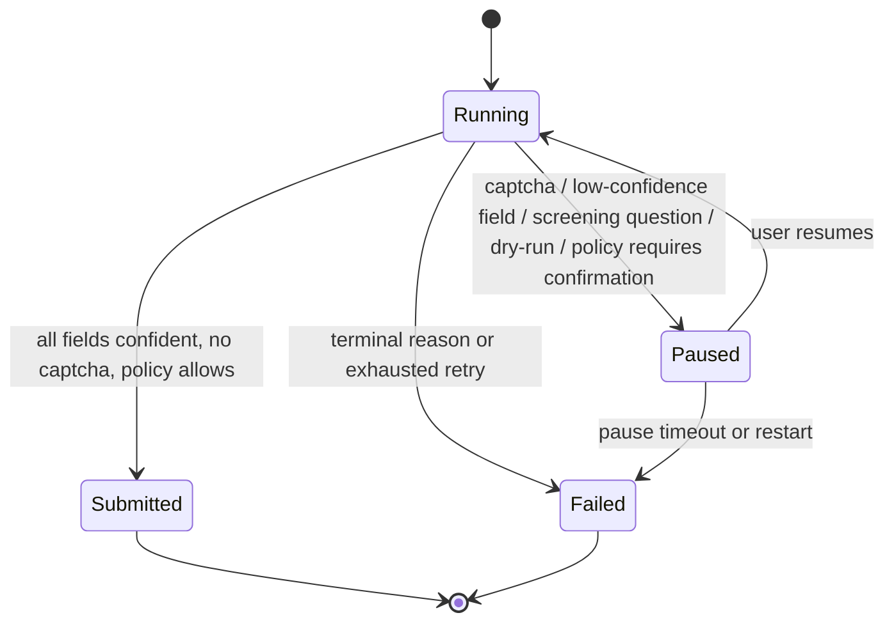
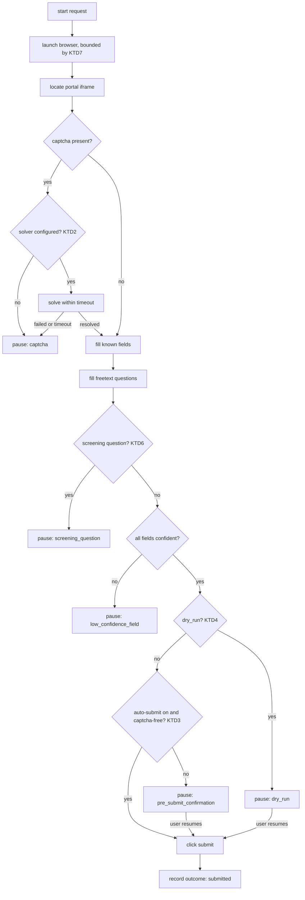

# Auto-Apply Hardening - Plan

## Goal Capsule

- **Objective:** Make portal auto-fill runs on the existing Personio agent end in one explicit outcome and require human takeover only when genuinely blocked, behind a run-outcome contract that later portal agents plug into.
- **Product authority:** This plan owns auto-apply hardening only. The other candidate areas from the ApplyPilot comparison (job fit-scoring, document generation quality, discovery breadth, LLM provider flexibility, reporting/export) are not active scope.
- **Open blockers:** None. The captcha solver approach and the default auto-submit policy are resolved (see Key Decisions).

## Product Contract

### Summary

Give the portal auto-fill agent a run-outcome contract and a resilience layer. Every run ends in one explicit outcome — submitted, needs-you, or blocked-with-reason — captchas are solved when a solver is configured and otherwise escalated cleanly, and the unconditional pre-submit pause becomes policy-driven. Personio is the first consumer; later German-market portal agents plug into the same contract.

### Problem Frame

The Personio agent shipped in `docs/plans/2026-09-19-002-feat-portal-application-auto-fill-agent-plan.md` pauses on every captcha (detect-only, never solved — `backend/app/services/portal_agents/personio.py:67-78`), on every unmapped field (`personio.py:244-245`), and unconditionally before submit (`personio.py:361`). Each pause blocks the background thread until the user resumes it; an unanswered pause fails the run after an hour (`backend/app/services/portal_agents/session.py:64`), and a process restart marks any running or paused run failed (`session.py:366-383`). Run state is ad-hoc — a free-form `automation_state` plus a dual-purpose `action_needed_reason` (`backend/app/models/application.py:53-66`) — with no distinction between a transient failure worth retrying and a terminal one, and no dry-run. The cost is not that the agent fills forms badly; it is that a run stops and waits for a human even when nothing is actually wrong.

### Key Decisions

- **Scope this plan to auto-apply hardening.** (session-settled: user-directed — chosen over job fit-scoring, document generation quality, discovery breadth, LLM provider flexibility, and reporting/export: the user selected it as the one focus from the ApplyPilot comparison.)
- **Keep deterministic per-portal agents rather than a generic LLM form-filler.** Runs stay testable and work on the current Ollama-only model; the agentic alternative depends on the deferred multi-provider work.
- **Introduce one shared run-outcome contract.** Later portal agents inherit it without touching the session machinery. Governs R1, R2, R3.
- **Keep Personio as this plan's only portal.** German-market portal agents are deferred and consume the contract later.
- **Ship a pluggable captcha solver interface with no concrete solver.** (session-settled: user-directed — chosen over CapSolver and 2Captcha: avoids paid-service and portal-ToS exposure now; a solver can be added later without reworking the contract.) Governs R4, R5, R6.
- **Default auto-submit to off.** (session-settled: user-directed — chosen over auto-submit-when-confident and unlock-after-clean-dry-runs: preserves trust and today's behavior while the contract proves itself.) Governs R7, R8.

### How This Work Fits Together

<!-- ce-section: work-relationships -->

This plan owns auto-apply hardening. The broader request — what to adopt from ApplyPilot-Enhanced — was split into six candidate areas; the breakdown below is the current understanding, not a committed roadmap.

- Auto-apply hardening (this plan) — the run-outcome contract and resilience layer.
  - Enables every later portal agent: a new portal consumes the contract instead of reimplementing session and outcome handling.
- Job fit-scoring — can proceed independently; would rank what reaches the applications list.
- Document generation quality (validation and per-job CV tailoring) — depends on fit-scoring for a per-job tailoring trigger; independent of this plan.
- Discovery breadth (Workday/Greenhouse-equivalents, pagination, cross-source dedup) — can proceed independently.
- LLM provider flexibility — enables a portal-agnostic agentic form-filler, the alternative to per-portal agents; can proceed independently.
- Reporting and export — depends on fit-scoring for ranked "ready jobs"; independent of this plan.

### Actors

- A1. User — the single operator of this personal application; resolves pauses and sets policy.
- A2. Portal auto-fill session — the background thread that owns the browser and runs the agent.
- A3. Captcha solver — optional external service used when configured.
- A4. Target portal form — the application form being filled; Personio is the first.

### Requirements

**Run-outcome contract**
- R1. Every run ends in exactly one explicit outcome: submitted, needs-you (paused), or blocked (failed with a reason). No run ends without a recorded outcome.
- R2. All portal agents produce outcomes through one shared contract, so a portal agent cannot invent its own states or reasons.
- R3. Failure reasons distinguish retryable from terminal, so a transient failure can be retried and a terminal one is not auto-retried.

**Blocker handling**
- R4. When a captcha is detected, the run attempts resolution through a configured solver; if none is configured or resolution fails, it escalates as needs-you with the captcha reason.
- R5. Captcha resolution is a pluggable, opt-in capability that ships with no solver configured, so a detected captcha escalates and today's detect-and-escalate behavior is preserved.
- R6. Solver attempts are time-bounded; an unresolved captcha escalates rather than blocking.

**Takeover policy**
- R7. The pre-submit pause becomes policy-driven: a run submits without human confirmation only when every field mapped confidently, no captcha remains, and the auto-submit policy permits it; otherwise it pauses.
- R8. The user can require confirmation for every submit, preserving today's unconditional pause.
- R9. Every pause states what is needed and where, and resuming continues from the paused step without repeating completed work.

**Operability and safety**
- R10. A paused run that times out or is interrupted by a restart is recorded as a failed outcome the user can see and retry, never silently lost.
- R11. A dry-run mode fills the form without submitting, so a new portal agent or mapping change can be validated safely.
- R12. The agent never answers a screening question with a fabricated fact (for example citizenship, work authorization, or criminal history); it escalates instead.

**Run outcome states**

### Key Flows

- F1. Autonomous submit
  - **Trigger:** a run whose fields all mapped confidently and with no captcha present.
  - **Steps:** the run fills known fields and freetext questions; the auto-submit policy permits; the run submits and records submitted.
  - **Covers:** R1, R2, R7.
- F2. Captcha resolved
  - **Trigger:** a captcha signature is detected.
  - **Steps:** the run invokes the configured solver within a time bound; on success it continues; on failure or absence it pauses with the captcha reason.
  - **Covers:** R4, R5, R6.
- F3. Pause and resume
  - **Trigger:** a low-confidence field, an unresolved captcha, or a confirmation-required policy.
  - **Steps:** the run records needs-you with the reason; the user fixes the field or resumes; the run continues from the paused step and submits.
  - **Covers:** R1, R7, R8, R9.
- F4. Failure
  - **Trigger:** a retryable or terminal reason, or an exhausted retry.
  - **Steps:** the run records blocked with a retryable or terminal reason; a retryable one can be retried, a terminal one is not auto-retried.
  - **Covers:** R1, R3, R10.

### Acceptance Examples

- AE1. **Covers R4, R6.** Given a captcha is present and a solver is configured, when the solver returns a token within the time bound, then the run continues and submits under the auto-submit policy.
- AE2. **Covers R4, R5.** Given a captcha is present and no solver is configured, when detection fires, then the run pauses with the captcha reason and does not hang.
- AE3. **Covers R7.** Given the auto-submit policy is on, when a field cannot be mapped confidently, then the run pauses instead of submitting.
- AE4. **Covers R8.** Given the user requires confirmation for every submit, when all fields mapped confidently and no captcha is present, then the run still pauses before submit.
- AE5. **Covers R3.** Given a run failed for a transient reason, when the user retries, then the run is retryable; given a terminal reason, then it is not auto-retried.
- AE6. **Covers R12.** Given a screening question asks for work authorization and the profile does not state it, when the agent reaches it, then the run pauses rather than answering.

### Success Criteria

- With auto-submit enabled, a run with no captcha and all fields mapped confidently submits without any human intervention.
- No run ends without an explicit recorded outcome.
- Adding a second portal agent requires no change to the run-outcome contract or the session machinery.

### Scope Boundaries

Deferred for later:
- German-market portal agents: softgarden, JOIN, SAP SuccessFactors, Oracle Taleo, rexx systems, d.vinci, Haufe umantis, Prescreen — they consume this plan's contract.
- Parallel workers — single-user volume does not justify concurrency and per-worker browser complexity.
- Live progress dashboard.

Outside this product's identity:
- Unattended bulk application at ApplyPilot's scale (hundreds of submissions per run) — this product stays a supervised personal assistant.

Deferred to Follow-Up Work:
- Post-submit verification: a click is still treated as proof of submission (`backend/app/services/portal_agents/personio.py:308-313`); detecting a confirmation page, a validation error, or a required screening field left unfilled is follow-up work.
- A distinct dry-run-complete outcome, so a validated-but-not-submitted run is not recorded as cancelled.
- Persisting the application form URL and offering a one-click retry from the failure notice.
- Replacing underscore-internal cross-module access (`_active_sessions`, `_StopRun`, `_abort`) with a public contract API.
- Replacing the duck-typed `SimpleNamespace` attachment with an explicit Protocol.
- A `docs/solutions/` entry recording the portal auto-fill session/outcome pattern.

### Dependencies / Assumptions

- The driving pain is runs stalling on blockers, not a lack of portal coverage. If coverage is the real pain, the German-market portals move into scope.
- No captcha solver ships in this plan, so there is no solver cost or portal-ToS exposure to settle now; a solver added later is evaluated against those constraints then.
- The current Ollama-only LLM remains sufficient for freetext answering; no provider change is required by this scope.
- The existing session machinery (background thread, pause/resume/cancel, registry) stays as-is; this plan layers outcome and policy on top of it.

### Outstanding Questions

None blocking. The two items deferred to planning are resolved: the retryable/terminal taxonomy in KTD5, and dry-run exposure in KTD4. Non-blocking follow-ups appear under Scope Boundaries → Deferred to Follow-Up Work.

### Sources / Research

- ApplyPilot-Enhanced (AGPL-3.0-only) — `https://github.com/jbegarek/ApplyPilot-Enhanced`. Its structured apply-result protocol (`RESULT:APPLIED|CAPTCHA|LOGIN_ISSUE|FAILED:<reason>`), permanent-vs-retryable failure classification, CapSolver-style captcha flow with manual fallback, and hard "never lie" screening rules inform R3, R4, R6, R12. Its license forbids copying code into this unlicensed repo; only the techniques are reimplemented.
- Current implementation: `backend/app/services/portal_agents/personio.py`, `backend/app/services/portal_agents/session.py`, `backend/app/services/portal_agents/base.py`, `backend/app/services/portal_agents/answering.py`, `backend/app/api/portal_fill.py`, `backend/app/models/application.py`.
- Prior plan: `docs/plans/2026-09-19-002-feat-portal-application-auto-fill-agent-plan.md`.

---

## Planning Contract

**Product Contract preservation:** restructured, no scope change — R/A/F/AE IDs and Key Decisions are preserved. Clarifications: R10 says `failed` outcome, not `terminal` outcome; F4 is retitled `Failure` and its trigger names retryable reasons; the run-outcome state diagram lists all five pause causes; the two Outstanding-Questions items are resolved by KTD4 and KTD5.

### Key Technical Decisions

- KTD1. **One outcome vocabulary module maps onto the existing columns.** `backend/app/services/portal_agents/outcome.py` owns `RunState`, `PauseReason`, `FailureReason`, and `FailureClass`; the agent, session, and API read their values from it. Session methods take the enum types, so an invented state or reason fails at the call site instead of persisting. `Application.automation_state` and `action_needed_reason` stay as they are; one new nullable column, `action_needed_detail`, carries the pause's field or question label (U7). `failure_class` is derived, not stored, and is populated only when `automation_state == "failed"` — it is null for running, paused, and submitted runs, so a paused reason is never misread as a terminal failure. Governs R1, R2, R3, R9.
- KTD2. **The captcha solver is a seam that ships unconfigured.** `backend/app/services/portal_agents/captcha.py` defines a `CaptchaSolver` protocol and a `get_captcha_solver()` factory that reads `settings.CAPTCHA_SOLVER_PROVIDER`; the default `"none"` returns no solver, so detection escalates as today. The solver returns an explicit result (`resolved` / `failed` / `unsupported`) rather than a boolean, because a solved captcha's widget iframe stays in the DOM and presence is not a resolution signal. `solve()` receives a minimal context — the page URL and the detected captcha's sitekey and frame locator — not unrestricted page access, and the seam treats a timeout overrun or exception as `failed`. (session-settled: user-directed — chosen over CapSolver and 2Captcha: avoids paid-service and portal-ToS exposure now; a solver can be added later without reworking the contract.) Governs R4, R5, R6.
- KTD3. **Auto-submit is a global setting, off by default.** `settings.AUTO_SUBMIT_ENABLED` defaults to `False`. The run submits without the pre-submit pause only when the setting is on, every field mapped confidently, no captcha remains, and no freetext answer was generated by the LLM unless that question was positively classified as a safe non-screening question. (session-settled: user-directed — chosen over auto-submit-when-confident and unlock-after-clean-dry-runs: preserves trust and today's behavior while the contract proves itself.) Governs R7, R8.
- KTD4. **Dry-run is a per-request flag that pauses before submit.** `PortalFillStartRequest.dry_run` threads to the run, which always pauses with `PauseReason.DRY_RUN` before submit and records no submission. The pause copy and the resume action are distinct from the normal confirmation pause: the action states that resuming submits for real, so a validation run cannot be mistaken for a routine resume. The browser stays open, so the user can inspect the filled form. A dry-run pause inherits the standard pause timeout and restart handling, so an abandoned dry run records the same retryable failure as any other abandoned pause, and cancelling after review records `cancelled_by_user`; a distinct dry-run-complete outcome is deferred. Resolves the deferred dry-run-exposure question in favour of an API field plus a start-form checkbox. Governs R11.
- KTD5. **Failure reasons map explicitly to retryable or terminal.** Retryable: `timeout`, `iframe_not_found`, `unhandled_error`, `browser_launch_failed`, `interrupted_by_restart`. Terminal: `cancelled_by_user`, `iframe_untrusted_host`. An untrusted-host iframe is terminal because it reproduces identically on retry, while a missing iframe may be a transient load failure. An unrecognized reason defaults to terminal, so an unknown failure is never auto-retried. Resolves the deferred taxonomy question. Governs R3, R10.
- KTD6. **Screening handling is deny-by-default.** `answering.is_screening_question()` matches work-authorization, citizenship, visa/sponsorship, and criminal-history families; a match pauses with `PauseReason.SCREENING_QUESTION` before any LLM call. Because a keyword detector can miss a paraphrased or unlabelled question, the run also treats any freetext question the detector cannot positively classify as a safe non-screening question as unconfirmed: the LLM response schema gains an `insufficient_information` signal that forces a pause, and under auto-submit KTD3's gate already forces a pause for any LLM-generated freetext answer. Screening questions rendered as radio buttons or selects are never auto-answered, because only profile-derived fields are filled; they surface as an unfilled field. The existing no-fabrication prompt rule stays as defense in depth. Governs R12.
- KTD7. **Browser launch is time-bounded.** `PortalFillSession.launch()` passes `timeout=settings.BROWSER_LAUNCH_TIMEOUT_MS` to `chromium.launch`, and `start_session()` bounds its `launch_done.wait()` as a backstop. When the backstop expires, `start_session()` persists `failed`/`browser_launch_failed`, unregisters the session, and sets an abandon flag the owning thread checks before writing `running`, so a late-successful launch cannot create a zombie run that blocks the next start. A launch failure or timeout in the owning thread writes the same classified outcome. Governs R1, R3, R10.

### Assumptions

- Four settings are added to `Settings` in `backend/app/core/config.py` and mirrored in `backend/.env.example`: `CAPTCHA_SOLVER_PROVIDER`, `CAPTCHA_SOLVE_TIMEOUT_SECONDS`, `AUTO_SUBMIT_ENABLED`, `BROWSER_LAUNCH_TIMEOUT_MS`.
- One migration adds a nullable `action_needed_detail` column to `applications` (U7). Every new reason string fits the existing `String(20)` and `String(30)` columns.
- The existing session machinery (background thread, pause/resume/cancel, registry) stays; this plan layers outcome and policy on it.
- The current Ollama-only LLM remains sufficient; screening questions bypass it rather than adding a model call.
- Headed Playwright runs in local dev; the Docker image serves the API only.

### High-Level Technical Design

The run becomes a decision flow whose every terminal branch writes an outcome from the vocabulary. KTD1–KTD7 apply at the marked points.

Every pause and failure path routes its reason through KTD1's vocabulary, and the status endpoint returns the derived failure class (KTD5).

### System-Wide Impact

- `backend/app/core/config.py` gains four settings; `backend/.env.example` documents them.
- `GET /api/applications/{id}/portal-fill/status` gains `failure_class` and `action_needed_detail` fields; the Angular `PortalFillStatus` model and the Applications page consume them.
- No database migration and no new runtime dependency.
- The process-wide Ollama lock and `keep_alive=0` behavior are unchanged; screening questions do not add a model call.
- Headed-browser behavior and the local-vs-Docker dev split are unchanged.

### Risks & Dependencies

- **Auto-submit is high-consequence.** Default off plus the all-fields-confident and captcha-free gate keeps a bad mapping from sending an application. Verify the gate directly in unit tests.
- **The screening detector is keyword-based.** It can miss an unanticipated screening question or over-trigger. Over-triggering only pauses (safe); a miss is mitigated by the existing no-fabrication prompt rule.
- **The solver seam is unused now.** Keep the protocol minimal so a future provider does not force a contract rewrite.
- **No post-submit verification.** A submit click is not proof of acceptance (`backend/app/services/portal_agents/personio.py:308-313`); this remains a follow-up.
- **Playwright/Chromium availability.** Browser-backed tests need Chromium installed; the existing test suite already depends on it.
- **Local vs Docker.** A stale Docker image can mask route changes; verify via `/openapi.json` or rebuild (see `docs/solutions/developer-experience/stale-docker-image-and-squatted-dev-port-mimic-code-bugs.md`).

### Sources / Research

- `backend/app/services/portal_agents/session.py`, `personio.py`, `base.py`, `answering.py`; `backend/app/api/portal_fill.py`; `backend/app/schemas/portal_fill.py`; `backend/app/models/application.py`; `backend/app/core/config.py`.
- Predecessor plan `docs/plans/2026-09-19-002-feat-portal-application-auto-fill-agent-plan.md` (KTD1–KTD11, U1–U7).
- `docs/residual-review-findings/feat-portal-application-auto-fill-agent.md` (open P2s: unbounded launch wait, submit-click-as-proof, underscore-internal access).
- Learnings: `docs/solutions/integration-issues/ollama-structured-output-nested-list-schema-validation-failure.md`, `docs/solutions/performance-issues/ollama-concurrent-model-residency-memory-pressure.md`, `docs/solutions/test-failures/fastapi-testclient-sqlite-memory-pool-and-lifespan-isolation.md`.

---

## Implementation Units

### U1. Run-outcome vocabulary and failure taxonomy

- **Goal:** Define the single shared outcome vocabulary and the retryable/terminal mapping.
- **Requirements:** R1, R2, R3
- **Dependencies:** None
- **Files:** `backend/app/services/portal_agents/outcome.py` (new), `backend/tests/services/portal_agents/test_outcome.py` (new)
- **Approach:** Add `RunState` (`running`, `paused`, `submitted`, `failed`), `PauseReason` (`captcha`, `low_confidence_field`, `pre_submit_confirmation`, `dry_run`, `screening_question`), `FailureReason` (`timeout`, `iframe_not_found`, `iframe_untrusted_host`, `unhandled_error`, `cancelled_by_user`, `interrupted_by_restart`, `browser_launch_failed`), and `FailureClass` (`retryable`, `terminal`). Add `failure_class_for(reason)` that returns terminal for any unrecognized value; callers apply it only when the run state is `failed`. String values match the values already persisted in `Application.automation_state` and `action_needed_reason`. Per KTD1 and KTD5.
- **Patterns to follow:** the enum style in `backend/app/models/application.py` (`ApplicationStatus`); the module-docstring convention in the `portal_agents` package.
- **Test scenarios:**
  - Every `RunState` string value equals the value the session persists today (`running`/`paused`/`submitted`/`failed`).
  - Every `PauseReason` maps to `RunState.PAUSED` and every `FailureReason` to `RunState.FAILED`.
  - Each retryable reason returns `FailureClass.RETRYABLE` and each terminal reason returns `FailureClass.TERMINAL`.
  - An unknown reason string returns `FailureClass.TERMINAL`.
  - `iframe_untrusted_host` returns terminal and `iframe_not_found` returns retryable.
  - Every new reason string fits the column lengths (`String(20)` for state, `String(30)` for reason).
- **Verification:** The module exposes the enums and mapping, and the tests pass.

### U2. Pluggable captcha solver seam

- **Goal:** Resolve captchas through a configured solver within a bound, or escalate cleanly.
- **Requirements:** R4, R5, R6
- **Dependencies:** U1
- **Files:** `backend/app/services/portal_agents/captcha.py` (new), `backend/app/core/config.py`, `backend/app/services/portal_agents/personio.py`, `backend/.env.example`, `backend/tests/services/portal_agents/test_captcha.py` (new), `backend/tests/services/portal_agents/test_personio.py`
- **Approach:** Define a `CaptchaSolver` protocol with one `solve(*, page_url, sitekey, frame, timeout_seconds) -> CaptchaSolveResult` method (`resolved` / `failed` / `unsupported`) and a `get_captcha_solver()` factory. Read `settings.CAPTCHA_SOLVER_PROVIDER` (default `"none"`); `"none"` returns `None`. In `personio._pause_if_captcha_present`, when a captcha is present and a solver exists, call it within `settings.CAPTCHA_SOLVE_TIMEOUT_SECONDS`; on `resolved` continue, on `failed`/`unsupported`/exception/overrun pause with `captcha`. Do not re-detect by presence after a solve. Per KTD2.
- **Patterns to follow:** the module-level import pattern in `backend/app/services/portal_agents/session.py` so tests can patch the factory; the `get_settings()` accessor in `backend/app/core/config.py`.
- **Test scenarios:**
  - Provider `"none"` returns no solver.
  - A captcha with no solver pauses with reason `captcha`.
  - A solver returning `resolved` lets the run continue.
  - A solver returning `failed` or `unsupported`, raising, or overrunning the bound pauses with reason `captcha`.
  - The solver call receives the configured timeout bound and only the minimal captcha context.
- **Verification:** Detection either resolves or escalates; no path blocks indefinitely.

### U3. Bounded launch and outcome-classified session

- **Goal:** Make every run end in a recorded, classified outcome and stop launch from hanging.
- **Requirements:** R1, R2, R3, R10
- **Dependencies:** U1, U7
- **Files:** `backend/app/services/portal_agents/session.py`, `backend/app/core/config.py`, `backend/app/api/portal_fill.py`, `backend/app/schemas/portal_fill.py`, `backend/tests/services/portal_agents/test_session.py`, `backend/tests/api/test_portal_fill.py`
- **Approach:** Replace the string reasons in `PortalFillSession` with the U1 vocabulary; type `pause()`, `_set_state()`, and `_abort()` on the enum types. Pass `timeout=settings.BROWSER_LAUNCH_TIMEOUT_MS` to `chromium.launch`. On backstop expiry in `start_session()`, persist `failed`/`browser_launch_failed`, unregister, and set an abandon flag the owning thread checks before writing `running`; the owning thread's launch-failure path writes the same outcome. Update `reset_stale_automation_state()` to use `interrupted_by_restart`. Record `iframe_untrusted_host` instead of `iframe_not_found` when the iframe hostname is untrusted. Add `failure_class` and `action_needed_detail` to `PortalFillStatusResponse`; populate `failure_class` only when `automation_state == "failed"`. Per KTD1, KTD5, KTD7.
- **Patterns to follow:** the guarded DB write in `_abort()` (`backend/app/services/portal_agents/session.py:147-171`); the migration-free column reuse in `backend/app/models/application.py:61-66`.
- **Test scenarios:**
  - A launch timeout records `failed`/`browser_launch_failed` and classifies as retryable.
  - A launch that hangs past the backstop leaves the session unregistered and does not write `running` afterward.
  - `reset_stale_automation_state()` records `interrupted_by_restart`, classified retryable.
  - A user cancel records `cancelled_by_user`, classified terminal; an untrusted iframe host records `iframe_untrusted_host`, classified terminal.
  - `GET .../portal-fill/status` returns `failure_class` for a failed run and null for running, paused, and submitted runs.
  - The launch wait returns within the bound when Chromium never starts.
- **Verification:** No run ends without a state; the status endpoint exposes the class.

### U4. Policy-driven pre-submit pause and dry-run

- **Goal:** Submit without a human only when policy permits, and support a safe dry-run.
- **Requirements:** R7, R8, R11
- **Dependencies:** U1, U3
- **Files:** `backend/app/core/config.py`, `backend/app/services/portal_agents/personio.py`, `backend/app/schemas/portal_fill.py`, `backend/app/api/portal_fill.py`, `backend/.env.example`, `backend/tests/services/portal_agents/test_personio.py`, `backend/tests/api/test_portal_fill.py`
- **Approach:** Add `settings.AUTO_SUBMIT_ENABLED` (default `False`) and `PortalFillStartRequest.dry_run` (default `False`), threaded through `build_personio_run_fn` and `run`. Accumulate `all_fields_confident` across known and freetext filling; clear it for any freetext answer generated by the LLM unless the question was positively classified as safe non-screening. In `run()`, before submit: if `dry_run`, pause with `dry_run`; else if auto-submit is off, or any field was unmapped, or a captcha remains, or a freetext answer is LLM-generated without a safe classification, pause with `pre_submit_confirmation`; otherwise click submit. Per KTD3, KTD4.
- **Patterns to follow:** the return shapes of `_fill_known_fields` and `_fill_freetext_questions`; the pause-then-continue flow in `personio.run()`.
- **Test scenarios:**
  - Auto-submit off, all fields confident: the run pauses with `pre_submit_confirmation`.
  - Auto-submit on, all fields confident, no captcha: the run submits and records `submitted`.
  - Auto-submit on but one field unmapped: the run pauses instead of submitting.
  - Auto-submit on with an LLM-generated freetext answer: the run pauses instead of submitting.
  - `dry_run: true`: the run pauses with `dry_run` and writes no `PortalSubmission`.
  - Resuming a `dry_run` pause submits and records the submission.
- **Verification:** No auto-submit occurs unless every gate is satisfied; dry-run never submits without a resume.

### U5. Screening-question guard

- **Goal:** Escalate screening questions instead of answering them.
- **Requirements:** R12
- **Dependencies:** U1
- **Files:** `backend/app/services/portal_agents/answering.py`, `backend/app/services/portal_agents/personio.py`, `backend/tests/services/portal_agents/test_answering.py`, `backend/tests/services/portal_agents/test_personio.py`
- **Approach:** Add `is_screening_question(question) -> bool` matching work-authorization, citizenship, visa/sponsorship, and criminal-history families (case- and umlaut-insensitive). In `_fill_freetext_questions`, pause with `screening_question` before calling the LLM when it matches. Add `insufficient_information: bool` to `PortalAnswerResult` and pause with `screening_question` when the LLM sets it. State explicitly that screening questions rendered as radio buttons or selects are not auto-answered, because only profile-derived fields are filled, so they surface as unfilled. Keep the existing no-fabrication prompt rule. Per KTD6.
- **Patterns to follow:** the normalization helper in `base._normalize_for_matching` for case and accent handling.
- **Test scenarios:**
  - A work-authorization question pauses with `screening_question` and the LLM is not called.
  - Citizenship, visa/sponsorship, and criminal-history variants each pause.
  - A non-screening freetext question is answered through the LLM as today.
  - Case and umlaut variants match (for example "Arbeitserlaubnis").
  - A paraphrased screening question outside the keyword families still pauses when the LLM sets `insufficient_information`.
  - A radio/select screening question is left unfilled and never answered.
  - An LLM failure on a non-screening question still pauses with `low_confidence_field`.
- **Verification:** Screening questions never receive a generated answer.

### U6. Surface outcomes, dry-run, and retryability in the app

- **Goal:** Show the outcome and reason, offer dry-run, and mark retryable failures.
- **Requirements:** R1, R3, R9, R11
- **Dependencies:** U3, U4
- **Files:** `frontend/src/app/core/models/application.model.ts`, `frontend/src/app/core/services/application.service.ts`, `frontend/src/app/pages/applications/applications.component.ts`, `frontend/src/app/pages/applications/applications.component.html`, `frontend/src/app/pages/applications/applications.component.spec.ts`
- **Approach:** Add `failure_class` and `action_needed_detail` to `PortalFillStatus` and the status response model. Extend `ACTION_NEEDED_COPY` with `dry_run` and `screening_question`, and `FAILURE_REASON_COPY` with `browser_launch_failed` and `iframe_untrusted_host`; render `action_needed_detail` in the notice to satisfy R9's `where`. Give the dry-run pause its own copy and a resume action that states it submits for real. Add a dry-run checkbox to the start form and send `dry_run` in the start request. In the failure notice, label a retryable failure as retryable with the retry entry point named (the existing start form, re-entered with the form URL), and a terminal one as not retryable. Per KTD4, KTD5.
- **Patterns to follow:** the signal-based state in `applications.component.ts`; the `ACTION_NEEDED_COPY` and `FAILURE_REASON_COPY` maps.
- **Test scenarios:**
  - Every pause and failure reason has copy; a missing entry is caught.
  - A retryable failure renders the retryable label; a terminal one does not.
  - The dry-run pause copy and resume action differ from `pre_submit_confirmation`.
  - The notice renders `action_needed_detail` for `low_confidence_field` and `screening_question`.
  - A retryable failure names the retry entry point.
  - The dry-run checkbox sends `dry_run: true` on start.
  - The status poll updates `failure_class` alongside `automation_state`.
- **Verification:** The Applications page reflects every outcome and reason, and dry-run is selectable.

### U7. Persist pause detail

- **Goal:** Carry the pause's field or question label so a pause can state where attention is needed.
- **Requirements:** R9
- **Dependencies:** None
- **Files:** `backend/app/models/application.py`, `backend/alembic/versions/<new>_add_action_needed_detail.py` (new), `backend/tests/test_migrations.py`
- **Approach:** Add a nullable `action_needed_detail` column (`String(80)`) to `applications` via a new alembic revision whose `down_revision` is the current head, using the inspector-guard pattern from `a41edaf603a3_add_portal_automation_state.py`. Clear it on each state transition when no detail applies. Per KTD1.
- **Patterns to follow:** `backend/alembic/versions/a41edaf603a3_add_portal_automation_state.py`.
- **Test scenarios:**
  - The migration upgrades and downgrades cleanly on a fresh SQLite database.
  - `backend/tests/test_migrations.py` confirms a single head after the new revision.
- **Verification:** The column exists, the migration is reversible, and the graph has one head.

---

## Verification Contract

| Scope | Command |
|---|---|
| Backend, all | `cd backend && pytest` |
| Backend, portal focus | `cd backend && pytest tests/services/portal_agents tests/api/test_portal_fill.py` |
| Frontend, unit | `cd frontend && npm run test:vitest` |
| Frontend, build | `cd frontend && npm run build` |

Quality gates:

- Every unit's test scenarios pass.
- The new `action_needed_detail` migration applies and reverses cleanly; `backend/tests/test_migrations.py` passes with a single head.
- The frontend build succeeds with no new type errors.
- A headed manual smoke run in local dev confirms a dry-run pauses and a resumed dry-run submits.

---

## Definition of Done

- U1–U7 are complete; each unit's verification passes.
- The full backend suite (`cd backend && pytest`) and frontend suite (`cd frontend && npm run test:vitest`) pass.
- The frontend build (`cd frontend && npm run build`) succeeds.
- No run ends without a recorded outcome, and the status endpoint exposes the derived failure class.
- Auto-submit defaults to off and only submits when every gate is satisfied.
- Captchas escalate cleanly with no solver configured; screening questions never receive a generated answer.
- Every pause renders a `where` detail (R9), and the new migration applies and reverses cleanly.
- No abandoned or experimental code remains in the diff; deferred items live under Scope Boundaries → Deferred to Follow-Up Work.
- `CONCEPTS.md` remains accurate; no new domain term needs adding.
