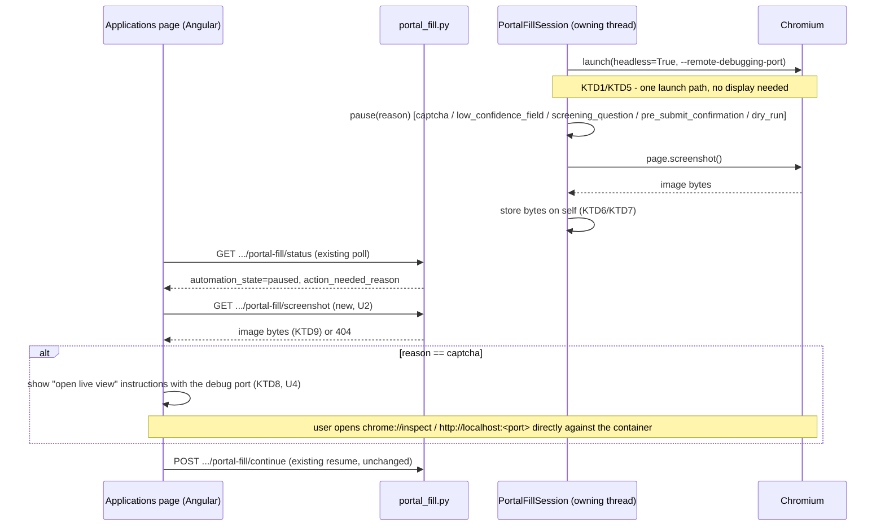

# Portal Fill Headless Docker Support - Plan

## Goal Capsule

- **Objective:** Make the portal auto-fill feature (`backend/app/services/portal_agents/`) run fully from the Dockerized backend, with no dependency on a local, non-containerized dev environment.
- **Product authority:** This plan owns the browser-launch mode and the pause-time review/interaction experience for the existing portal auto-fill feature only. It does not change the run-outcome state machine, the pause/failure vocabulary, or any other candidate area (captcha-solver providers, auto-submit policy, field-mapping quality) established in `docs/plans/2026-09-19-002-feat-portal-application-auto-fill-agent-plan.md` and `docs/plans/2026-09-20-001-feat-auto-apply-hardening-plan.md`.
- **Open blockers:** None. All forks below were resolved in dialogue.
- **Product Contract preservation:** unchanged — the Requirements/Non-Goals/Key Decisions below are exactly as written during brainstorming. This planning pass adds the Planning Contract and Implementation Units only.

## Product Contract

### Background

The portal auto-fill feature launches a headed (visible) Chromium via Playwright so the user can watch the run and act during a pause (solve a captcha, review a low-confidence field, confirm before submit, inspect a dry run). The backend also runs as a Docker container (`docker-compose.yml`, `backend/Dockerfile`), which has no display and no virtual-display server. `docs/plans/2026-09-20-001-feat-auto-apply-hardening-plan.md` (Assumptions, line 187) explicitly scoped this as out of bounds: *"Headed Playwright runs in local dev; the Docker image serves the API only."*

In practice, starting a run against the Dockerized backend fails immediately: `chromium.launch(headless=False)` throws with Playwright's own diagnostic, "Missing X server or $DISPLAY" (reproduced directly against the running `application-manager-backend-1` container). The run is persisted as `automation_state=failed`, `action_needed_reason=browser_launch_failed`, which the existing failure-classification (`outcome.py`, KTD5 in the hardening plan) marks retryable — misleadingly, since retrying a headed launch in a display-less container fails identically every time.

This plan reverses the local-dev-only assumption: the feature must work end-to-end from the Dockerized backend.

### Requirements

- R1. Starting a portal auto-fill run from the Dockerized backend succeeds — the browser launches without requiring a display, for both the local docker-compose deployment and local (non-Docker) dev. One implementation serves both; there is no separate headed/local-dev code path to maintain.
- R2. Every pause (`captcha`, `low_confidence_field`, `screening_question`, `pre_submit_confirmation`, `dry_run`) gives the user a way to see the current state of the page, replacing "look at the visible browser window." A screenshot of the paused page is shown in the existing Applications page review UI.
- R3. For a `captcha` pause specifically, the user can interact live with the actual page (click, type, solve the challenge) — a screenshot alone is not sufficient for an interactive widget. This uses Chromium's built-in remote-debugging protocol (the same mechanism `chrome://inspect` uses): the container exposes the debugging endpoint, and the user opens it from their own machine to get a live, fully interactive rendered view of the paused page, then resumes the run the same way they do today once satisfied.
- R4. The existing resume action (used today after manually solving a captcha in the headed window) is unchanged in shape — the user still triggers "Resume" once they've solved/reviewed/confirmed; only how they observe and interact with the page during the pause changes.
- R5. The misleading "retryable" `browser_launch_failed` message for a no-display headed launch is resolved as a consequence of R1, not as a separate fix — once headed launches no longer occur, that failure cause cannot recur. Other causes of `browser_launch_failed` (e.g. resource contention, launch timeout per KTD7 in the hardening plan) are unaffected and keep their existing retryable classification.

### Non-Goals

- Multi-user or concurrent-session support for the remote-debugging/review experience. This deployment is single local user, at most one active run at a time in practice; no session isolation or routing is in scope.
- Any virtual-display or screen-recording infrastructure (Xvfb, VNC/noVNC, or similar). R3 is served entirely by Chromium's own remote-debugging protocol.
- Any change to `outcome.py`'s `RunState`/`PauseReason`/`FailureReason`/`FailureClass` vocabulary, or to the pause/resume/cancel state machine itself.
- Any change to captcha-solving policy (KTD2 in the hardening plan — the solver seam ships unconfigured by default). This plan changes how a human *manually* solves a captcha, not whether an automated solver is used.

### Key Decisions

- KTD1. **Headless everywhere, one implementation.** The browser always launches headless; there is no headed/local-dev variant to keep in sync. *(session-settled: user-directed — chosen over keeping headed for local dev and headless only in Docker: avoids maintaining two launch paths and two review experiences, and removes the local-vs-Docker split the prior hardening plan flagged as a wrinkle.)* Governs R1, R5.
- KTD2. **Screenshots, not a live view, for non-interactive pauses.** `dry_run`, `pre_submit_confirmation`, `low_confidence_field`, and `screening_question` pauses are reviewed via a screenshot surfaced in the existing Applications UI — no live browser view is needed since these pauses only require reading the page, not acting on it. *(session-settled: user-directed.)* Governs R2.
- KTD3. **Captcha solving uses Chromium's native remote-debugging protocol, not a custom relay.** Rather than building an in-app click/type relay on top of a screenshot (coordinate mapping, input replay), the container exposes Chromium's remote-debugging endpoint; the user connects from their own machine (e.g. via `chrome://inspect`) for a live, natively interactive view during a `captcha` pause only. *(session-settled: user-directed — chosen over a custom in-app relay: reuses an existing browser capability instead of building and maintaining bespoke remote-input code for a rarely-hit pause reason.)* Governs R3.
- KTD4. **Deployment scope is single local user.** No concurrent-session isolation, routing, or multi-viewer support is built. *(session-settled: user-directed.)* Governs R3, and the Non-Goals above.

### Assumptions

- Chromium's remote-debugging protocol, when exposed from the container to the host, gives a live rendered and interactive view of a specific page/target sufficient for solving a captcha widget by hand — this is standard, well-established Chromium/CDP behavior (the same mechanism `chrome://inspect/#devices` relies on), not something this plan needs to validate from scratch. Exact exposure mechanism (port mapping, addressing scheme) is left to planning.
- Headless Chromium renders and behaves identically to headed Chromium for this feature's purposes (form filling, field detection, captcha widget presence). Some captcha providers apply extra scrutiny to headless browsers via fingerprinting; if this causes a measurable increase in captcha frequency or difficulty, that is a follow-up concern, not a blocker for this plan.
- Screenshot capture timing (e.g., taken at the moment a pause begins vs. refreshed on demand) is left to planning; the requirement is that the user can see a reasonably current view of the paused page, not that it live-updates.

### Success Criteria

- A portal auto-fill run started against the Dockerized backend (`docker-compose up`) launches successfully — no `browser_launch_failed` from a missing display.
- A dry-run or pre-submit-confirmation pause shows the user a screenshot of the filled form in the Applications UI before they decide to resume or cancel.
- A captcha pause lets the user open a live, interactive view of the actual paused page from their own machine, solve the challenge, and resume the run — with the same resulting behavior as today's headed-browser manual-solve flow.
- Running the feature no longer requires a non-containerized local backend process.

### Risks & Dependencies

- **Headless captcha detection.** Some captcha providers detect and penalize headless browsers. If this becomes a practical problem (more frequent or harder challenges), it is a separate follow-up, not addressed here.
- **Remote-debugging exposure is a local trust boundary, with a known gap.** Exposing Chromium's debugging endpoint from the container to the host gives full control over the automation browser; this plan assumes the existing single-local-user trust model already in place for the rest of the app (per KTD4) and does not add new authentication around it. Binding the host-side port mapping to `127.0.0.1` (U4) restricts access from outside the Docker host, but **does not** restrict access from sibling containers on the same docker-compose network (`db`, `ollama`, `frontend`) — Chromium itself still listens on `0.0.0.0` inside the container (required for Docker's port-publish DNAT to reach it at all), so any of those containers can reach the debug port directly, bypassing the host-side restriction. *(Found in independent code review, 2026-09-20; accepted as-is rather than fixed — those sibling containers are the user's own trusted official images (Postgres, Ollama) in a single-local-user deployment, not an internet/LAN exposure, and proper isolation would need docker-compose network segmentation or an authenticating proxy, disproportionate engineering for this tool's actual threat model.)* Revisit if the deployment model ever changes to shared/multi-user or untrusted sibling services (explicitly out of scope here).
- **A single forgotten pause blocks every other application for up to an hour.** KTD10's process-wide concurrent-run guard means a captcha/low-confidence/pre-submit pause left unattended (the user steps away) makes every other application's start attempt return 409 until that run is resumed, cancelled, or hits `PAUSE_TIMEOUT_SECONDS` (3600s). *(Found in independent code review; accepted as the direct, already-chosen consequence of KTD10 — the alternative was per-session port allocation, a larger change for a single-local-user tool where one run at a time is already the practical norm.)* The 409 does name the blocking `application_id` so the user can find and cancel it.
- **Depends on:** `outcome.py`'s `RunState`/`PauseReason`/`FailureReason` vocabulary and `session.py`'s pause/resume wait-and-timeout mechanics, both already shipped in `docs/plans/2026-09-20-001-feat-auto-apply-hardening-plan.md` and unchanged by this plan. This plan directly modifies `session.py`'s `launch()` and `pause()` methods (KTD5-KTD8) but not the wait/resume-event logic itself.

### Sources / Research

- Live reproduction: `docker exec application-manager-backend-1 python3 -c "..."` — headed `chromium.launch()` fails with "Missing X server or $DISPLAY" inside the running backend container (2026-09-20).
- `backend/Dockerfile` — `playwright install --with-deps chromium` installs headless-capable dependencies only; no Xvfb or display server.
- `backend/app/services/portal_agents/session.py:225-246` — `PortalFillSession.launch()`, defaults `headed=True`.
- `backend/app/api/portal_fill.py:100-131` — `start_portal_fill()`, never overrides `headed`.
- `backend/app/services/portal_agents/outcome.py` — `FailureReason.BROWSER_LAUNCH_FAILED` classified retryable (KTD5 in the hardening plan).
- `docs/plans/2026-09-20-001-feat-auto-apply-hardening-plan.md` — prior plan's Assumptions (line 187) and System-Wide Impact (line 227) explicitly scoped headed/local-dev vs. Docker/API-only as unchanged; this plan reverses that.

---

## Planning Contract

### Key Technical Decisions

- KTD5. **`headed` is deleted, not defaulted.** `PortalFillSession.launch()`, `start_session()`, and every call site drop the `headed` parameter entirely rather than keeping it and defaulting it to `False` — there is exactly one launch path (KTD1), so a parameter nothing ever sets again is dead weight. `chromium.launch()` always passes `headless=True`. *(session-settled: user-approved — chosen over keeping a dormant `headed` flag: nothing in this plan or KTD1's scope ever needs to flip it back.)* Governs R1.
- KTD6. **`pause()` is the single screenshot capture point.** `PortalFillSession.pause()` (`backend/app/services/portal_agents/session.py:263-296`) already sits on the owning thread for every pause reason (`captcha`, `low_confidence_field`, `screening_question`, `pre_submit_confirmation`, `dry_run` — see `personio.py`'s calls into it) — one `self.page.screenshot()` call here covers every pause type without touching each call site individually. Governs R2.
- KTD7. **Screenshot bytes live in-memory on the session, not on disk.** Stored as a plain attribute (e.g. `self._last_screenshot: bytes | None`) set by the owning thread inside `pause()` and read by the API thread when serving it — safe cross-thread because it's a plain immutable value, not a Playwright object (same class of access already used for `cancel_requested`/`abandoned`, per the module's R9 threading invariant). No file, no cleanup, lost on process restart exactly like the rest of the in-memory run registry (`_active_sessions`) already is. *(session-settled: user-approved — chosen over writing to `PROFILE_FILES_DIR` or similar: nothing here needs to survive a restart, so a file adds cleanup responsibility for no benefit.)* Governs R2.
- KTD8. **The remote-debugging port opens for the life of the browser process, not per-pause.** Chromium's CDP endpoint is a launch-time flag (`--remote-debugging-port`, `--remote-debugging-address=0.0.0.0`); it can't be toggled on only during a `captcha` pause without relaunching the browser mid-run. It stays open for the whole run; the frontend only surfaces the connection instructions when a `captcha` pause is active. *(session-settled: user-approved.)* Governs R3.
- KTD9. **Reuses the existing binary-response pattern for serving the screenshot.** A new `GET /applications/{id}/portal-fill/screenshot` endpoint mirrors `download_photo()` (`backend/app/api/profile.py:320-340`) — a `StreamingResponse`/plain `Response` with the stored bytes and an image media type, 404 when nothing is available. No new dependency, no new response pattern. Governs R2.
- KTD10. **`start_session()` rejects a second concurrent run process-wide, not just per-application.** Today's `_active_sessions` registry only blocks a second run for the *same* `application_id` (`SessionAlreadyActiveError`); nothing stops two different applications from running concurrently. KTD8's single fixed debug port means two simultaneous browser launches would collide trying to bind it. Since the Non-Goals already assume "at most one active run at a time in practice," this makes that assumption an enforced guard rather than an unenforced hope: `start_session()` rejects a start attempt while *any* session is active, regardless of `application_id`, surfaced the same way `SessionAlreadyActiveError` is today (409). *(session-settled: user-approved — chosen over per-session port allocation: the Non-Goals already scope this to single-run-in-practice, so enforcing that directly is the smaller change.)* Governs R3, KTD8.

### Assumptions Carried Forward

- All Assumptions from the Product Contract above hold unchanged. No new assumptions beyond KTD5-KTD9's stated rationale.

---

## High-Level Technical Design

---

## Implementation Units

### U1. Remove headed launch mode; always launch headless

- **Goal:** Delete the `headed` parameter throughout the launch path so Chromium always launches headless, resolving the no-display launch failure and the misleading retryable classification it produced.
- **Requirements:** R1, R5; KTD1, KTD5
- **Dependencies:** None
- **Files:**
  - `backend/app/services/portal_agents/session.py` (`PortalFillSession.launch()` lines 225-246, `start_session()` signature and its call to `session.launch(...)` around lines 345-372)
  - `backend/app/api/portal_fill.py` (`start_portal_fill()` docstring at line 104 — drop the "headed Browser" phrasing)
  - `backend/tests/services/portal_agents/test_session.py` (line 590 passes `headed=False` explicitly — update to match the new signature)
  - `backend/tests/services/portal_agents/test_personio.py` (21 call sites pass `headed=False` to `start_session()` — lines 231, 258, 284, 306, 338, 376, 505, 590, 622, 655, 682, 712, 840, 865, 886, 920, 945, 981, 1008, 1042 — plus a docstring reference at line 7; all must drop the `headed=` argument or `start_session()`'s new signature breaks the entire file)
- **Approach:**
  1. Remove the `headed` keyword argument from `PortalFillSession.launch()`; call `self.playwright.chromium.launch(headless=True, timeout=settings.BROWSER_LAUNCH_TIMEOUT_MS)` unconditionally.
  2. Remove the `headed` keyword argument from `start_session()` and its internal call to `session.launch(...)`.
  3. Update the module docstring's "headed-Playwright-Browser-Lebenszyklus" framing and `start_portal_fill()`'s docstring to reflect headless-only operation.
  4. Update every `start_session(..., headed=False)` call site in `test_personio.py` to drop the argument (a bulk find/replace, since the value was always `False`).
- **Patterns to follow:** The existing module-level `try/except ImportError` around `sync_playwright` (session.py:61-64) — leave untouched, this unit only changes the `launch()` call's arguments and signature.
- **Test scenarios:**
  - Happy path: `PortalFillSession.launch()` calls `chromium.launch` with `headless=True` (update the existing timeout-passthrough test at `test_launch_passes_configured_timeout_to_chromium`, line ~580, to also assert `headless=True`).
  - Regression: the existing `test_launch_failure_surfaces_synchronously_from_start_session` (line 378) and `test_launch_backstop_marks_failed_and_never_writes_running` (line 600) still pass unchanged in behavior — only their `launch()`/`start_session()` call sites drop `headed=`.
  - Removed coverage: delete or repurpose any test whose sole purpose was asserting `headless=not headed` inversion, since there is no longer a `headed` input to invert.
- **Verification:** `backend/tests/services/portal_agents/test_session.py` passes; a manual `docker compose up` + start a run against the live container no longer produces `browser_launch_failed` from a missing display (re-run the same reproduction command used during debugging).

### U2. Capture and serve a pause-time screenshot

- **Goal:** Every pause captures a screenshot of the page and exposes it through a new endpoint the frontend can fetch.
- **Requirements:** R2; KTD6, KTD7, KTD9
- **Dependencies:** U1 (screenshots only matter once launches succeed in Docker, though this unit has no hard code dependency on U1's changes)
- **Files:**
  - `backend/app/services/portal_agents/session.py` (`PortalFillSession.__init__` — add `self._last_screenshot: bytes | None = None`; `pause()` lines 263-296 — capture before `_set_state`; add a small accessor, e.g. `screenshot_bytes() -> bytes | None`)
  - `backend/app/api/portal_fill.py` (new `GET /{application_id}/portal-fill/screenshot` endpoint, reusing `_get_active_session()` at line ~90)
  - `backend/tests/services/portal_agents/test_session.py` (new test: `pause()` stores screenshot bytes)
  - `backend/tests/api/test_portal_fill.py` (new tests: screenshot endpoint behavior)
- **Approach:**
  1. In `pause()`, immediately before `self._set_state(RunState.PAUSED, ...)`, call `self.page.screenshot()` (PNG bytes) and assign to `self._last_screenshot`. Wrap in a narrow `try/except` that logs and leaves the previous value on failure — a screenshot failure must never block the pause/resume flow itself (mirrors the existing "cleanup must survive its own failure" pattern already used in `_abort()`, session.py:210-220).
  2. Add `screenshot_bytes(self) -> bytes | None` returning `self._last_screenshot` — read-only, safe from any thread per KTD7.
  3. In `portal_fill.py`, add `GET /{application_id}/portal-fill/screenshot`: look up the active session via `_get_active_session()`; if none or `screenshot_bytes()` is `None`, `404`; otherwise return the bytes as `image/png` via `StreamingResponse`/`Response`, mirroring `download_photo()` (`backend/app/api/profile.py:320-340`).
- **Patterns to follow:** `backend/app/api/profile.py:320-340` (`download_photo`) for the response shape; `backend/app/services/portal_agents/session.py:210-220` (`_abort`'s own-failure-tolerant cleanup) for the screenshot capture's error handling.
- **Test scenarios:**
  - Happy path: calling `pause()` on a session with a mocked `page.screenshot()` returning known bytes results in `screenshot_bytes()` returning those bytes.
  - Happy path: `GET .../portal-fill/screenshot` on a paused application with an active session returns `200` with the stored bytes and `image/png` content type.
  - Edge case: `GET .../portal-fill/screenshot` when no session is active for that `application_id` returns `404`.
  - Edge case: `GET .../portal-fill/screenshot` when a session is active but no pause has happened yet (`screenshot_bytes()` is `None`) returns `404`.
  - Error path: `page.screenshot()` raising inside `pause()` does not prevent the pause from persisting `RunState.PAUSED` and waiting on resume as normal (the pause/resume contract KTD1 established is unaffected by a screenshot failure).
- **Verification:** New tests pass; manually triggering a dry-run pause against the Dockerized backend and hitting the new endpoint returns a viewable PNG of the filled form.

### U3. Frontend: show the pause-time screenshot

- **Goal:** The Applications page shows the current pause's screenshot instead of relying on a visible browser window.
- **Requirements:** R2, R4
- **Dependencies:** U2
- **Files:**
  - `frontend/src/app/pages/applications/applications.component.ts` (render logic keyed on `automation_state === 'paused'`, alongside the existing `failureCopy()`/pause-reason rendering around lines 320-390)
  - `frontend/src/app/pages/applications/applications.component.spec.ts` (new test for the screenshot image)
- **Approach:**
  1. When an application's live `PortalFillStatus.automation_state` is `'paused'`, render an `` pointing at `GET /api/applications/{id}/portal-fill/screenshot` (a plain `src` binding is sufficient — no new `ApplicationService` method needed, matching how other binary content is already just linked/embedded by URL in this codebase's simpler cases; if a service wrapper is preferred for consistency with `getPortalFillStatus()`'s pattern in `frontend/src/app/core/services/application.service.ts:67-68`, add a thin one there). Size it to actually be legible for reviewing a filled form (e.g. near-full-width of the card, not a small thumbnail) — R2's purpose is letting the user read field values and confirm content, which a decorative-sized image would defeat.
  2. Add a manual "Refresh" affordance next to the image, since it's a point-in-time capture (KTD6) rather than a live feed — clicking it just re-fetches the same URL (cache-bust with a query param or timestamp).
  3. Hide the image on any fetch failure (404, 500, network error alike) rather than showing a broken-image icon — one uniform "no image available" state, not a special case for 404 only.
- **Patterns to follow:** The existing pause-reason rendering block (`failureCopy()`/`failureRetryabilityCopy()`, lines 377-390) for where pause-time UI already lives on this page.
- **Test scenarios:**
  - Happy path: a `paused` status renders the screenshot `` with the expected `src`, sized to be legible (not a small thumbnail).
  - Happy path: clicking "Refresh" re-requests the image (cache-busted).
  - Edge case: any fetch failure (404, 500, network error) hides the image instead of showing a broken-image icon.
  - Edge case: a non-`paused` status (running/submitted/failed) does not render the screenshot image at all.
- **Verification:** `applications.component.spec.ts` passes; manually starting a dry-run against the Dockerized backend shows the filled-form screenshot in the UI at the dry-run pause.

### U4. Expose Chromium's remote-debugging port for live captcha interaction

- **Goal:** During a `captcha` pause, the user can open a live, interactive view of the real page from their own machine and solve the challenge by hand — with a guard preventing the fixed debug port from colliding across concurrent runs.
- **Requirements:** R3; KTD3 (Product Contract), KTD8, KTD10
- **Dependencies:** U1 (only meaningful once the browser reliably launches in Docker)
- **Files:**
  - `backend/app/core/config.py` (new setting, e.g. `PORTAL_FILL_DEBUG_PORT: int = 9222`, alongside the existing Portal-Auto-Fill settings block at lines ~140-160)
  - `backend/app/services/portal_agents/session.py` (`launch()` passes `args=["--remote-debugging-port=...", "--remote-debugging-address=0.0.0.0"]` to `chromium.launch()`; `start_session()` — widen the existing per-`application_id` `SessionAlreadyActiveError` check to a process-wide check across `_active_sessions` regardless of key, per KTD10)
  - `docker-compose.yml` (`backend` service — map the debug port to the host loopback interface only, e.g. `"127.0.0.1:9222:9222"`, alongside the existing `"8000:8000"` mapping at line 78)
  - `backend/.env.example` (document the new setting, following the existing documentation style for `BROWSER_LAUNCH_TIMEOUT_MS`)
  - `frontend/src/app/pages/applications/applications.component.ts` (when `action_needed_reason === 'captcha'` during a pause, show the connection instructions/link)
- **Approach:**
  1. Add `PORTAL_FILL_DEBUG_PORT` to `Settings` with a sensible default; pass it into `chromium.launch(args=[f"--remote-debugging-port={settings.PORTAL_FILL_DEBUG_PORT}", "--remote-debugging-address=0.0.0.0"], ...)`. The `0.0.0.0` bind is only for the container-internal hop the Docker port mapping needs — see step 2 for keeping the host-side exposure to localhost.
  2. Map the port in `docker-compose.yml`'s `backend` service bound to `127.0.0.1` on the host side (`"127.0.0.1:9222:9222"`), not the Compose short-syntax default (`"9222:9222"`, which publishes on all host interfaces, `0.0.0.0`). R3 and KTD4 frame this as reachable "from their own machine" only — an unqualified port mapping would expose full, unauthenticated control of the automation browser (arbitrary navigation, JS execution, in-page data) to anything on the same network, not just localhost.
  3. In the frontend, when the pause reason is `captcha`, render a short instruction (e.g. "Open `http://localhost:9222` — or `chrome://inspect` configured with that address — to solve the captcha directly, then resume") next to the existing pause UI. The exact copy/link target is a minor UI detail left to implementation; the requirement is that the port and a way to reach it are surfaced.
  4. Widen `start_session()`'s existing `if application_id in _active_sessions: raise SessionAlreadyActiveError` check (session.py:~360) to check whether `_active_sessions` is non-empty at all, regardless of key — a start attempt while any session is active anywhere raises the same `SessionAlreadyActiveError`/409 as today's per-application check.
- **Patterns to follow:** `backend/app/core/config.py`'s existing "Portal-Auto-Fill (KTD2/KTD3/KTD7)" settings block for where/how to add the new setting with a comment explaining its purpose. The existing `SessionAlreadyActiveError` (session.py:87-95) and its 409 mapping in `portal_fill.py` for the widened concurrency guard.
- **Test scenarios:**
  - Happy path: `launch()` calls `chromium.launch` with `args` containing the configured `--remote-debugging-port` value (mirrors the existing `test_launch_passes_configured_timeout_to_chromium` style).
  - Happy path: a `captcha` pause in the frontend renders the connection instructions; a non-captcha pause does not.
  - Happy path: starting a run for application A while a run for a *different* application B is already active raises `SessionAlreadyActiveError` (previously this only guarded the same `application_id`).
  - Regression: `SessionAlreadyActiveError` still fires for the same-`application_id` case as today.
  - Test expectation: none for the `docker-compose.yml` port mapping — infrastructure config, verified by the manual check below, not unit tests.
- **Verification:** New backend tests pass; manually triggering a captcha pause against the Dockerized backend, opening the mapped debug port from `127.0.0.1` on the host, and confirming the live page is visible and clickable; confirming it is not reachable from another device on the same network.

---

## Verification Contract

- All existing `backend/tests/services/portal_agents/` and `backend/tests/api/test_portal_fill.py` tests pass after U1's signature changes.
- New tests from U2 (screenshot capture and endpoint) and U4 (debug-port launch args) pass.
- `frontend/src/app/pages/applications/applications.component.spec.ts` passes, including the new screenshot-rendering and captcha-instructions tests from U3/U4.
- Manual end-to-end check (not automatable without a live Docker environment): `docker compose up`, start a dry-run against a real or test Personio-style form, confirm the run reaches `paused`/`dry_run` without a `browser_launch_failed`, confirm the screenshot endpoint returns a viewable image, and — if a captcha is reachable — confirm the debug port gives a live interactive view.

## Definition of Done

- [ ] U1: `headed` parameter removed; all launches are headless; existing tests updated and passing.
- [ ] U2: pause-time screenshot captured, stored, and servable via the new endpoint; tests passing.
- [ ] U3: Applications page shows the screenshot during a pause; tests passing.
- [ ] U4: remote-debugging port configurable, passed to Chromium, mapped to `127.0.0.1` in `docker-compose.yml`; a process-wide concurrent-run guard prevents port collisions (KTD10); captcha-pause UI surfaces the connection instructions; tests passing.
- [ ] Manual verification against a live `docker compose up` backend confirms a run no longer fails with `browser_launch_failed` from a missing display.
