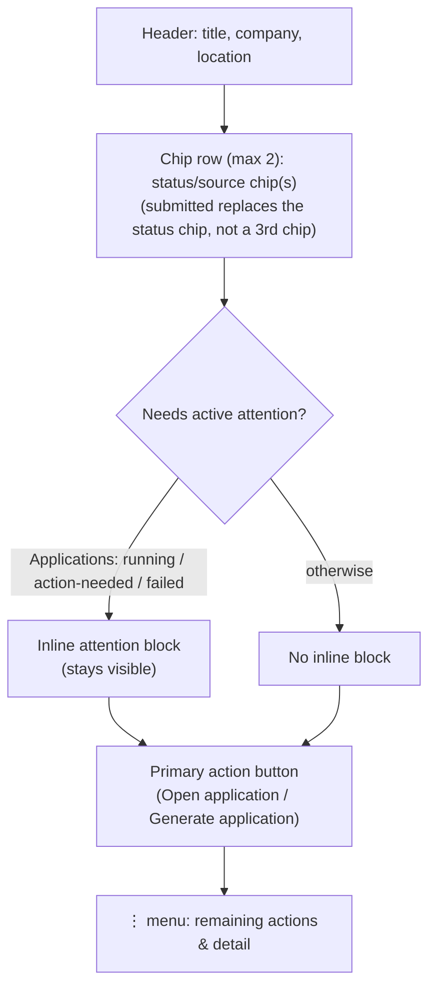
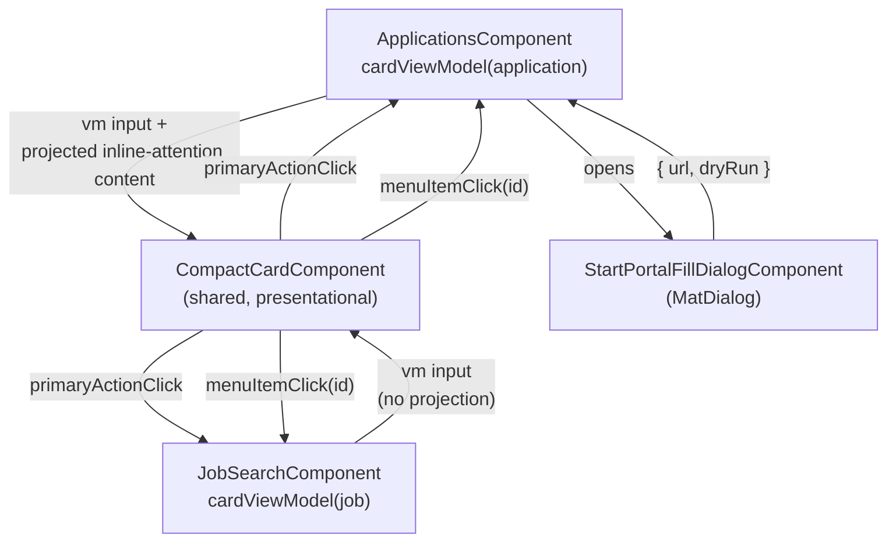

# Applications & Job Search Compact Cards - Plan

## Goal Capsule

- **Objective:** Redesign the Applications and Job search list cards into a compact layout that consolidates today's scattered fields and action buttons behind a single primary action and a per-card `⋮` menu.
- **Product authority:** This plan owns the card-redesign area only. The broader "improve the app" request that started this brainstorm also named structure/architecture, performance/speed, and general redundant-code reduction — none of those are active scope here; see [How This Work Fits Together](#how-this-work-fits-together).
- **Open blockers:** None — ready for planning.

---

## Product Contract

### Summary

Compact-card redesign for the Applications and Job search list pages: each card shrinks to a header (title/company/location), a two-chip status row, and one primary action button, with every other current action and detail consolidated behind a per-card `⋮` menu. States that need the user's active attention (auto-fill running, action-needed) stay visible inline rather than moving into the menu.

### Problem Frame

Today's `application-card` and `job-card` (`frontend/src/app/pages/applications/applications.component.html`, `frontend/src/app/pages/job-search/job-search.component.html`) each render most of their state inline: status and source chips, an always-visible outcome accept/reject toggle, a sent-to-email line, up to five different portal-fill state blocks (submitted, running, action-needed banner with screenshot, failure notice, trigger form), a full description paragraph, and three to four action buttons in a row. Scanning a list of these cards to find one application or job offer means reading through content that is only relevant in specific states, which is the "too big, too much unstructured information" problem driving this redesign.

### Key Decisions

- **Option A (aggressive consolidation) chosen over a hybrid or expand-in-place layout** (session-settled: user-directed — chosen after reviewing a visual mockup of all three options: consolidation gave the cleanest default card, accepting one extra click for frequent actions like outcome accept/reject). Governs R2, R6.
- **Auto-fill `running` and `action-needed` states stay inline; everything else collapses into the menu** (session-settled: user-directed — chosen over collapsing these into the menu as well: these states need proactive attention, unlike passive status info). Governs R3.
- **Applications and Job search share one compact-card pattern** (session-settled: user-approved — chosen over two separate per-page implementations: ties back to the original reduce-redundant-code goal that started this brainstorm). Governs R7.
- **Sent-to email address lives in the menu, not a separate visible chip** (session-settled: user-approved — chosen over a dedicated visible chip: keeps the chip row to at most two items). Governs R2.
- **Job search keeps a 1-line, truncated description snippet** (session-settled: user-directed — chosen over dropping the description entirely: gives enough context to judge fit without opening the ad). Governs R5.

### Requirements

**Product Contract preservation:** changed R2 (dropped "continue" from the menu-action list — it only ever applies while R3's inline action-needed block is showing, so it can never also be a menu item), R4 (submitted replaces the status chip instead of implying a third chip), and R6 (recipient email address/link placement, now covered by R11). Added R9-R13. All corrections and gap-fills found during Phase 1.5 flow analysis and the Phase 5.3.8 document review, not scope changes — see Planning Contract KTD1 (R2, R6, R11, R12), KTD2 (R10), KTD4 (R13) for the how-level decisions.

**Applications card**
- R1. The card header shows only title, company, and location, plus a chip row of no more than two chips (status, e.g. Sent/Draft/Accepted/Rejected; source).
- R2. The card shows exactly one primary action button ("Open application"); every other current action (mark accepted, mark rejected, start auto-fill, delete, view sent-to email) moves into a per-card `⋮` menu. Continue/cancel auto-fill stay inline per R3 — they are never menu items (R3's inline block already covers the only state they apply to).
- R3. When the application's auto-fill run is `running`, or paused with `action-needed` (captcha, screenshot, blocked-with-a-reason), that state stays visible inline on the card by default — it is not hidden behind the `⋮` menu.
- R4. The auto-fill `submitted` confirmation replaces the status chip's content within R1's existing 2-chip cap (not a third chip), replacing the current full banner.
- R9. While the application's auto-fill run is active (`running` or paused with `action-needed`), the "Mark accepted", "Mark rejected", "Delete", and "Start auto-fill" menu items remain visible but disabled, matching today's locked state (existing `isPortalFillActive()` and `showPortalFillTrigger()` guards).
- R10. Starting auto-fill (no active run, or the last run failed) opens a small dialog collecting the application form URL and a dry-run checkbox, submitting to the existing start-portal-fill flow — replacing today's inline trigger form, since a `⋮` menu item is a single click, not a form.
- R13. When the application's last auto-fill run `failed`, the failure notice (copy, retryability detail, dismiss control) stays visible inline on the card by default, mirroring R3's treatment for running/action-needed — it is not hidden behind the `⋮` menu.

**Job search card**
- R5. The card header shows title, company, location, a chip row (source; recipient-lookup status once known), and a single-line truncated description snippet.
- R6. The card shows exactly one primary action button ("Generate application"); every other current action (open ad, save job, find email / find email again) moves into a per-card `⋮` menu.
- R11. The recipient email address and its "Source of this address" link render as detail rows in the `⋮` menu, mirroring the Applications sent-to-email placement (R2).

**Shared**
- R7. Applications and Job search cards use the same compact-card composition (header with title/company/location each truncated to one line, chip row, optional inline attention state, primary action + `⋮` menu) defined once and applied to both pages.
- R8. No action's underlying behavior changes — only its visual placement (inline vs `⋮` menu) changes.
- R12. While the primary action or any menu-triggered action for a card is in flight (open/generate application, delete, mark accepted/rejected, start auto-fill, save job, find email), the card shows a small busy indicator near its header, disables its primary action button, and disables its `⋮` trigger, preserving today's per-action loading feedback that would otherwise be hidden behind a closed menu or an un-disabled button.

### Card Composition



Job search additionally renders its 1-line description snippet between the chip row and the primary action (R5); it has no inline attention block since it has no auto-fill state.

### Acceptance Examples

- AE1. **Covers R3.** Given an application's auto-fill run is `running`, When the Applications list renders, Then the running indicator stays visible on the card, not only reachable via the `⋮` menu.
- AE2. **Covers R3.** Given an application's auto-fill run is paused with `action-needed` (e.g. a captcha), When the card renders, Then the action-needed detail, including the screenshot when available, stays visible inline rather than moving into the menu.
- AE3. **Covers R2, R4.** Given an application has status `sent` and no active auto-fill run, When the card renders, Then only the header, chip row, and "Open application" button show by default — outcome, delete, and sent-to-email detail sit in the `⋮` menu.
- AE4. **Covers R6.** Given a job offer has no known recipient email, When the Job search card renders, Then "Find email" appears in the `⋮` menu, reading "Find email again" once a lookup has already run.
- AE5. **Covers R9.** Given an application's auto-fill run is `running`, When the user opens the `⋮` menu, Then "Mark accepted", "Mark rejected", "Delete", and "Start auto-fill" appear but are disabled.
- AE6. **Covers R10.** Given an application has no active auto-fill run, When the user selects "Start auto-fill" in the `⋮` menu, Then a dialog opens collecting the application form URL and a dry-run checkbox before any request fires.
- AE7. **Covers R11.** Given a job offer has a known recipient email, When the user opens the `⋮` menu, Then the recipient email address and its source link appear as detail rows.
- AE8. **Covers R12.** Given the user selects "Save job" (or any other menu-triggered action) from the `⋮` menu, When the request is in flight, Then the card shows a busy indicator near its header and the `⋮` trigger is disabled until the request resolves — success follows today's existing outcome (e.g. the card is removed for a successful save), failure clears the indicator and shows today's existing error feedback.
- AE9. **Covers R13.** Given an application's last auto-fill run `failed`, When the card renders, Then the failure notice (copy, retryability detail, dismiss control) stays visible inline rather than moving into the menu.

### Scope Boundaries

- Backend structure/architecture, general redundant-code reduction beyond the shared card pattern (R7), and performance/speed work — deferred. This plan narrowed from "improve the app broadly" down to the card redesign only.
- No new card actions or functional changes (R8) — this is a reorganization of existing actions and information, not new capability. The locked-but-visible menu items (R9), the failure-notice placement (R13), the auto-fill start dialog (R10), and the busy indicator (R12) are UI relocations of existing capability and feedback, not new functionality.
- Visual styling specifics (colors, exact icons, spacing, typography) are left to implementation, not specified here.

<!-- ce-section: work-relationships -->
### How This Work Fits Together

This plan owns the compact-card redesign for the Applications and Job search pages. The broader breakdown below is the current understanding of the surrounding "improve the app" request, not a committed roadmap — a later brainstorm may revise, split, merge, or discard any of it.

- Redundant code reduction
  - Shares: the shared compact-card pattern (R7) is one concrete step toward this goal but doesn't complete it — other duplication across the codebase is untouched.
- Performance & speed
  - Can proceed independently of this plan.
  - Still to decide: scope and whether it touches these same components.
- Structure / architecture
  - Can proceed independently of this plan.
  - Still to decide: scope; this plan makes no backend or module-layout changes.

### Sources / Research

- `frontend/src/app/pages/applications/applications.component.html` — current Applications card markup: header, status/source chips, always-visible outcome toggle, sent-to-email line, five portal-fill state blocks, actions row.
- `frontend/src/app/pages/job-search/job-search.component.html` — current Job search card markup: header, description paragraph, source chip, recipient/lookup status, actions row.
- `frontend/src/app/pages/applications/applications.component.ts` — per-application state signals (`deletingId`, `updatingStatusId`, `portalFillStartingId`, `dismissedFailureIds`, `screenshotRefreshTokens`, `screenshotLoadFailedIds`, `portalFillStatuses`) and handlers (`onStatusChange`, `onDelete`, `onStartPortalFill`, `onContinuePortalFill`, `onCancelPortalFill`, `onDismissFailure`, `onRefreshScreenshot`) that a `cardViewModel()` method must read from. `isPortalFillActive()` is the existing lock behind R9.
- `frontend/src/app/pages/job-search/job-search.component.ts` — per-job state (`isSaved`, `isSaving`, `isGenerating`, `isLookingUp`, `lookupResult`, `recipientEmail`, `displayedRecipient`, `applicationEmailSourceUrl`) and handlers (`onSaveJob`, `onFindApplicationEmail`, `onGenerateApplication`).
- `frontend/src/app/pages/job-search/job-search-state.service.ts:82-93` — `removeResult` fires on successful save/generate, removing the card from the list immediately; this is existing behavior R8/AE8 preserve, not something to "fix" into a visible "Saved" state.
- `frontend/src/app/pages/job-search/job-search.component.scss:94-101` — existing `-webkit-line-clamp: 3` truncation block; R5's 1-line snippet reuses this pattern with `-webkit-line-clamp: 1`.
- `frontend/src/app/pages/applications/add-job-offer-dialog/` — existing standalone `MatDialog` component to mirror for R10's start-auto-fill dialog.
- `frontend/package.json:15-27` — Angular 17.3.0 / Angular Material 17.3.10; `MatMenuModule` has zero prior usage in this codebase (net-new import). Test runner is Vitest (`vitest run`), not Karma, despite both being listed as devDependencies.

---

## Planning Contract

### Key Technical Decisions

- KTD1. **Shared `CompactCardComponent` takes a flattened per-card view-model `@Input()`, not content projection, for its scalar fields.** Both host components already expose per-card state as id-keyed signals and methods (not on the data model), so a host-side `cardViewModel()` method that assembles a plain object keeps the shared component presentational and unit-testable without `TestBed` HTTP/router providers. The primary action and menu items each carry an optional link (`routerLink`, or `href`/`target`/`rel`) alongside their click-emit id, so "Open application", "Open ad", and R11's source link keep native anchor behavior (ctrl/middle-click, right-click) instead of being reduced to synthetic click handlers; a separate non-interactive "detail row" item type (no click emission) covers sent-to-email (R2) and the recipient email address (R11). Each host memoizes its `cardViewModel()` per id (e.g. a keyed `computed()` signal) rather than calling it as a raw template-bound method, so the object reference stays stable across unrelated change-detection ticks and `CompactCardComponent`'s `OnPush` actually skips re-checks for cards whose data didn't change — this matters because `applications.component.ts` already runs a 5s poll for active auto-fill runs that would otherwise force every card to re-render on every tick. Governs R1, R2, R5, R6, R7, R11, R12.
- KTD2. **The auto-fill start form (R10) opens in a `MatDialog`, mirroring `add-job-offer-dialog`, instead of living inside a `mat-menu-item`.** A menu item is a single click; starting auto-fill needs a URL and a dry-run checkbox first, and Angular Material menus close on item click, so the form cannot render inline in the menu. Opening a dialog from inside a menu item has no existing precedent in this codebase (MatMenu is net-new) — verify overlay/focus handoff behaves cleanly during implementation. Governs R10.
- KTD3. **The inline attention block (R3) is `<ng-content>`-projected into `CompactCardComponent`, not modeled as flattened view-model fields.** Its markup (running spinner + cancel; action-needed banner with screenshot, captcha instructions, continue/cancel) is Applications-only and non-uniform; forcing it into the same DTO shape as chips/primary-action/menu would either genericize Job search unnecessarily or leak Applications-specific fields into a shared type. Governs R3, R7.
- KTD4. **The auto-fill `failed` state (R13) also renders in the projected inline-attention slot, extending the settled running/action-needed inline treatment to the third "needs attention" state the Problem Frame named but the original R3 left unplaced.** The failure notice (copy, retryability detail, dismiss control) has the same "needs proactive attention, unlike passive status info" shape as running/action-needed, so it follows the same placement rather than becoming a fourth card state with its own rules. Governs R13.

### High-Level Technical Design



`CompactCardComponent` owns no business logic and calls no services — it renders its view-model input and emits `primaryActionClick` / `menuItemClick(id)` outputs. Each host component keeps its existing handlers (`onStatusChange`, `onDelete`, `onStartPortalFill`, `onSaveJob`, `onFindApplicationEmail`, `onGenerateApplication`) unchanged and routes menu-item ids to them.

### Assumptions

- The `⋮` trigger icon is Material Icons ligature `more_vert` (existing icon convention; no new icon set).
- `MatMenuModule` is added to whichever component(s) render the menu (`CompactCardComponent` only, per KTD1) — no other component needs it.
- No new validation is added to the auto-fill start dialog (KTD2) beyond what the current inline form has today (none), per R8.
- Selecting "Mark accepted"/"Mark rejected" from the menu requires no confirmation dialog — same as today's zero-friction toggle, per R8. Only "Delete" keeps its existing `window.confirm`.
- Disabled menu items (R9) carry a tooltip (e.g. `matTooltip`) explaining why they're unavailable, since a visibly-present-but-inert item with no explanation is harder to understand once tucked in a menu than it was as an always-visible greyed-out control.
- `CompactCardComponent`'s `⋮` trigger carries an `aria-label` (e.g. "More actions"), and its busy indicator (R12) is announced via `aria-live="polite"` or `aria-busy`, since the icon-only trigger and the indicator have no accessible text otherwise.

---

## Implementation Units

### U1. Shared compact-card component

- **Goal:** Build the standalone, presentational `CompactCardComponent` implementing the Card Composition (header, chip row, optional projected inline-attention content, optional 1-line snippet, primary action, `⋮` menu, busy indicator).
- **Requirements:** R1, R2, R3, R4, R5, R6, R7, R9, R11, R12. KTD1, KTD3.
- **Dependencies:** none.
- **Files:**
  - `frontend/src/app/shared/compact-card/compact-card.component.ts`
  - `frontend/src/app/shared/compact-card/compact-card.component.html`
  - `frontend/src/app/shared/compact-card/compact-card.component.scss`
  - `frontend/src/app/shared/compact-card/compact-card.component.spec.ts`
- **Approach:**
  1. Define a view-model input shape: title, company, location (each truncated to one line), up to 2 chips, an optional snippet string, a primary action (label, disabled, optional link), menu items (id, label, icon, disabled, optional link), and detail-row items (label, non-interactive, no click emission) — per KTD1.
  2. Add a `busy` boolean input (R12): while true, disable the primary action button and the `⋮` trigger, and show a small inline indicator near the header with `aria-live="polite"` or `aria-busy`.
  3. Project inline-attention content via `<ng-content select="[inlineAttention]">` (KTD3, KTD4) — render it above the primary action row when projected content is present, omit the slot entirely otherwise.
  4. Render the `⋮` menu with `MatMenuModule` (`more_vert` trigger icon, `aria-label="More actions"`); disabled menu items render visible-but-inert with a `matTooltip` explaining why (R9), matching Angular Material's native `disabled` handling on `mat-menu-item`.
  5. Render the primary action and any menu item carrying a link as a native anchor (`routerLink` or `href`/`target`/`rel`); render link-less items as buttons/`mat-menu-item`s that emit `(primaryActionClick)` / `(menuItemClick)="id"`. A disabled item does not emit. Detail-row items render as plain content, never emitting a click.
  6. Use `standalone: true`, `ChangeDetectionStrategy.OnPush`, and `@if`/`@for` — matching the codebase's universal component convention.
- **Patterns to follow:** `frontend/src/app/pages/job-search/job-search.component.ts` and `applications.component.ts` for the `standalone`/`OnPush`/signals shape; `job-search.component.scss:94-101` for the snippet's `-webkit-line-clamp` (changed to `1`).
- **Test scenarios:**
  - Renders header fields (title, company, location) from the view-model input.
  - Renders at most 2 chips; renders the snippet only when provided.
  - Renders the primary action with the given label and emits `primaryActionClick` when clicked; renders as a native anchor (not a synthetic click) when the view-model supplies a link.
  - Opens the `⋮` menu on trigger click and emits `menuItemClick(id)` when an enabled item is selected.
  - A disabled menu item does not emit `menuItemClick` when clicked, and renders a tooltip.
  - A detail-row item renders as non-interactive content and never emits `menuItemClick`.
  - `busy: true` disables the primary action and the `⋮` trigger and shows the busy indicator; absent/`false` shows neither.
  - Projected inline-attention content renders when provided and is omitted entirely when not (no inline block for Job search).
- **Verification:** `compact-card.component.spec.ts` passes covering the scenarios above, run in isolation (no HTTP/router providers needed).

### U2. Applications card integration

- **Goal:** Replace the inline `mat-card` markup in `applications.component.html` with `<app-compact-card>`, wiring a new `cardViewModel(application)` method and routing menu actions to the existing handlers.
- **Requirements:** R1, R2, R3, R4, R9, R10 (trigger only — dialog is U3), R12, R13. KTD1, KTD3, KTD4. Covers AE1, AE2, AE3, AE5, AE8, AE9.
- **Dependencies:** U1, U3.
- **Files:**
  - `frontend/src/app/pages/applications/applications.component.ts`
  - `frontend/src/app/pages/applications/applications.component.html`
  - `frontend/src/app/pages/applications/applications.component.scss`
  - `frontend/src/app/pages/applications/applications.component.spec.ts`
- **Approach:**
  1. Add a memoized `cardViewModel(application)` (a keyed `computed()` signal, not a raw template-bound method — KTD1): header, chips (status per R1, `submitted` replacing the status chip per R4), primary action ("Open application" as a native `routerLink`), menu items (mark accepted, mark rejected, start auto-fill, delete, view sent-to email per R2), with mark-accepted/mark-rejected/delete/start-auto-fill disabled while `isPortalFillActive()` (R9), and a `busy` flag derived from `deletingId`/`updatingStatusId`/`portalFillStartingId` matching the current application (R12).
  2. Move the existing running/action-needed markup (screenshot, captcha instructions, continue/cancel buttons) and the existing failed-run markup (`failureCopy`, `failureRetryabilityCopy`, dismiss control) into the `[inlineAttention]`-projected content, unchanged in behavior (R3, R13).
  3. Replace the card's `mat-card` block in the `@for` loop with `<app-compact-card [vm]="cardViewModel(application)" (menuItemClick)="onMenuAction(application, $event)">`; keep `track application.id`.
  4. Route `onMenuAction` by item id to `onStatusChange`, `onDelete`, or opening the U3 dialog (start auto-fill).
  5. Remove the now-unused always-visible outcome-toggle and actions-row markup; trim unused SCSS rules.
- **Patterns to follow:** existing `showActionNeededBanner`/`isCaptchaPause`/`screenshotAvailable`/`showFailureNotice`/`failureCopy` methods stay as-is; only their markup's location moves.
- **Test scenarios:**
  - A `sent` application with no active run shows only header, chips, and the primary action by default. Covers AE3.
  - Clicking "Open application" navigates via the existing `[routerLink]`, rendered as a native anchor, unchanged.
  - Selecting "Mark accepted" / "Mark rejected" from the menu calls `onStatusChange` with the same arguments as today.
  - Selecting "Delete" calls `onDelete` (still behind the existing `window.confirm`).
  - A `running` or `action-needed` application shows the inline attention content regardless of menu state. Covers AE1, AE2.
  - A `failed` automation state shows the failure notice, retryability copy, and dismiss control inline, matching today's behavior. Covers AE9.
  - While `isPortalFillActive()` is true, "Mark accepted"/"Mark rejected"/"Delete"/"Start auto-fill" render disabled in the menu. Covers AE5.
  - A `submitted` automation state replaces the status chip's content, not the old banner. Covers R4.
  - Selecting "Delete" or "Mark accepted" sets the busy indicator until the request resolves, then clears it (success) or leaves the existing error snackbar as the only additional feedback (failure). Covers AE8.
- **Verification:** `applications.component.spec.ts` passes covering the scenarios above; manual check that the portal-fill screenshot/captcha instructions render identically inside the projected inline block.

### U3. Applications start-auto-fill dialog

- **Goal:** New standalone `MatDialog` component collecting the application form URL and a dry-run checkbox, replacing today's inline trigger form.
- **Requirements:** R8, R10. KTD2.
- **Dependencies:** none.
- **Files:**
  - `frontend/src/app/pages/applications/start-portal-fill-dialog/start-portal-fill-dialog.component.ts`
  - `frontend/src/app/pages/applications/start-portal-fill-dialog/start-portal-fill-dialog.component.html`
  - `frontend/src/app/pages/applications/start-portal-fill-dialog/start-portal-fill-dialog.component.scss`
  - `frontend/src/app/pages/applications/start-portal-fill-dialog/start-portal-fill-dialog.component.spec.ts`
- **Approach:**
  1. Mirror `frontend/src/app/pages/applications/add-job-offer-dialog/` for structure: standalone component, `MatDialogRef` injection, form fields for URL (`matInput`) and dry-run (`mat-checkbox`) matching today's inline form exactly.
  2. On submit, close the dialog with `{ url, dryRun }`; on cancel, close with no data.
  3. Do not add new input validation beyond what the current inline form has (none) — per R8.
  4. This unit builds only the dialog component itself — opening it from the "Start auto-fill" menu item and calling `onStartPortalFill` with its result is U2's responsibility (U2 already owns `applications.component.ts`).
- **Patterns to follow:** `frontend/src/app/pages/applications/add-job-offer-dialog/add-job-offer-dialog.component.ts`.
- **Test scenarios:**
  - Submitting a URL and dry-run value closes the dialog with that data.
  - Submitting an empty URL behaves the same as today's inline form (no added validation). Covers R8.
  - Canceling the dialog closes it without emitting data.
- **Verification:** `start-portal-fill-dialog.component.spec.ts` passes; manual check that `onStartPortalFill` receives the same argument shape as today.

### U4. Job search card integration

- **Goal:** Replace the inline `mat-card` markup in `job-search.component.html` with `<app-compact-card>`, wiring a new `cardViewModel(job)` method.
- **Requirements:** R5, R6, R11, R12. KTD1. Covers AE4, AE7, AE8.
- **Dependencies:** U1.
- **Files:**
  - `frontend/src/app/pages/job-search/job-search.component.ts`
  - `frontend/src/app/pages/job-search/job-search.component.html`
  - `frontend/src/app/pages/job-search/job-search.component.scss`
  - `frontend/src/app/pages/job-search/job-search.component.spec.ts`
- **Approach:**
  1. Add a memoized `cardViewModel(job)` (a keyed `computed()` signal, not a raw template-bound method — KTD1): header, chips (source, recipient-lookup status), a 1-line snippet (R5, reusing `job-search.component.scss:94-101` with `-webkit-line-clamp: 1`), primary action ("Generate application", disabled while `isGenerating`), a link-carrying "Open ad" menu item (native `href`/`target="_blank"`), "Save job"/"Find email" menu items per the existing `recipientEmail()`/`lookupResult()` gating (unchanged), and recipient email address + "Source of this address" link as detail-row items per R11.
  2. Derive `busy` from `isSaving`/`isGenerating`/`isLookingUp` for the matching job (R12); `busy` also disables the primary action button, not just the `⋮` trigger.
  3. Replace the card's `mat-card` block with `<app-compact-card [vm]="cardViewModel(job)" (primaryActionClick)="onGenerateApplication(job)" (menuItemClick)="onMenuAction(job, $event)">`.
  4. Route `onMenuAction` to `onSaveJob` or `onFindApplicationEmail` by item id (open-ad navigates natively via the vm's link, no handler needed).
  5. Remove the now-unused description paragraph, chip-set, recipient line, and actions-row markup; trim unused SCSS rules (keep the line-clamp block).
- **Patterns to follow:** keep `recipientEmail()`'s existing `extractEmail(description_text)` gating unchanged — do not key "Find email again" visibility off lookup state instead, per R8.
- **Test scenarios:**
  - A job with a known recipient shows the snippet, source/lookup chips, and "Generate application" as the primary action.
  - Clicking "Generate application" calls `onGenerateApplication`, unchanged; the button disables while `isGenerating`.
  - Selecting "Save job" from the menu calls `onSaveJob`; on success the card is removed from the list via the existing `removeResult` behavior, unchanged. Covers AE8.
  - A job with no `extractEmail` match shows "Find email" in the menu; after a lookup runs it reads "Find email again," even though a successful lookup doesn't remove the item (existing gating, preserved). Covers AE4.
  - A job with a known recipient shows the recipient email and "Source of this address" link as menu detail rows. Covers AE7.
  - "Open ad" renders as a native anchor to `job.source_url` with `target="_blank"`, unchanged.
- **Verification:** `job-search.component.spec.ts` passes covering the scenarios above; manual check that the snippet truncates to exactly one line at typical card widths.

---

## Output Structure

```text
frontend/src/app/
  shared/
    compact-card/
      compact-card.component.ts
      compact-card.component.html
      compact-card.component.scss
      compact-card.component.spec.ts
  pages/
    applications/
      start-portal-fill-dialog/
        start-portal-fill-dialog.component.ts
        start-portal-fill-dialog.component.html
        start-portal-fill-dialog.component.scss
        start-portal-fill-dialog.component.spec.ts
```

---

## Verification Contract

| Command | Applicability | Gate |
|---|---|---|
| `cd frontend && npm run test:vitest` | All units (U1-U4) | Every listed test scenario passes; no existing `applications.component.spec.ts` / `job-search.component.spec.ts` assertion regresses. |
| `cd frontend && npm run build` | All units | Production build succeeds with the new `shared/compact-card` and `start-portal-fill-dialog` components. |
| Manual check | U1, U2, U4 | Visually confirm the Card Composition states (default; running/action-needed/failed inline attention; busy) at typical card widths (~320-400px), matching the plan's visual mockup intent from the requirements-only phase. |

---

## Definition of Done

- All Implementation Units (U1-U4) are complete and their test scenarios pass under `cd frontend && npm run test:vitest`.
- `cd frontend && npm run build` succeeds.
- Every Requirement (R1-R13) and Acceptance Example (AE1-AE9) is satisfied and traceable to a unit's test scenarios or manual verification step.
- The old inline `mat-card` markup, always-visible outcome toggle, actions row, and inline portal-fill trigger form are fully removed from `applications.component.html` and `job-search.component.html` — no dead markup or unused SCSS left behind from the migration.
- No behavior change beyond R9, R10, R12, and R13 (all four are feedback/entry-point preservation, not new capability) — R8 holds for every other action.
