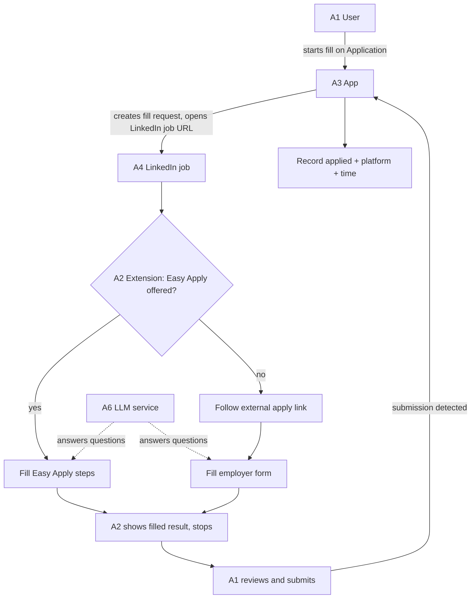
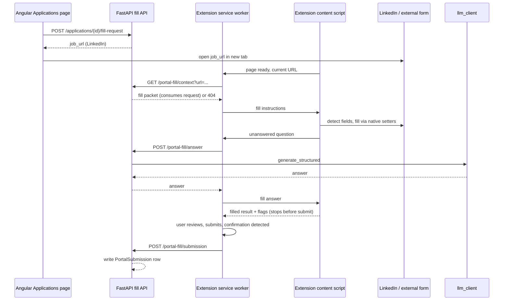

# Browser Extension Application Autofill - Plan

## Goal Capsule

- **Objective:** Replace the server-side portal auto-fill agent with a Manifest V3 browser extension that fills job-application forms in the user's own logged-in browser — LinkedIn Easy Apply first, the employer's external form as fallback — stops before submit so the user sends it, and records the submission on the Application.
- **Product authority:** This plan owns the application-filling capability end to end: how a fill starts, how fields are filled, what the user confirms, how the submission is recorded, and the removal of the server-side agent it replaces. Job discovery and the LinkedIn job source are unchanged and out of scope.
- **Open blockers:** None. All planning-time forks are resolved below or deferred explicitly.
- **Execution profile:** Single-user local tool. Backend (FastAPI) + Angular frontend via Docker Compose; the extension is loaded unpacked from this repo into the user's own browser.

---

## Product Contract

*Product Contract preserved: no R/F/AE ID changed meaning. Planning added acceptance examples AE6–AE7 and two assumptions (LinkedIn Terms-of-Service constraint; the app cannot detect whether the extension is installed). R17 was completed to name the fourth portal-automation column (`automation_started_at`), which the original wording omitted; R11 was completed to require an idempotent submission record. Neither changes the requirement's meaning.*

### Summary

Move application autofill out of the backend and into a browser extension running in the user's own logged-in browser. From a saved Application, the extension opens the LinkedIn job, fills the application — Easy Apply when offered, the employer's external form otherwise — stops before submit for the user to review and send, and reports the completed submission back to the app.

### Problem Frame

Portal auto-fill launches a headless Chromium in the backend. Every run attempted against a real URL failed at start with `browser_launch_failed` — the browser process never came up. Even when it did launch, the agent understood only Personio-hosted iframes reached by a manually pasted URL, so a LinkedIn job — where the user's applications actually happen — was never a supported target.

The user's jobs arrive from LinkedIn: `JobOffer.source_url` is `https://www.linkedin.com/jobs/view/{id}` and `source_platform` is `linkedin` (`backend/app/services/job_sources/linkedin.py`). LinkedIn Easy Apply is the common path, and its form renders only for a logged-in LinkedIn session — which a server-side browser does not have and cannot easily obtain. Running the fill in the user's own browser removes the launch problem and supplies the session at the same time.

### Requirements

**Trigger**

- R1. From the Applications page, starting a fill on a LinkedIn-sourced Application opens that job's LinkedIn URL in a new browser tab; the extension fills the application there. The user no longer pastes a URL.
- R2. Only LinkedIn-sourced Applications can start a fill in this version.

**Form filling**

- R3. On the LinkedIn job page, the extension fills LinkedIn Easy Apply when the posting offers it.
- R4. When the posting offers no Easy Apply, the extension follows the employer's external application link and fills that form instead.
- R5. Field filling is site-agnostic: the extension identifies standard fields (text, email, tel, select, file, radio/checkbox) by label, ARIA, placeholder, name, and autocomplete. LinkedIn Easy Apply is one adapter; the external-form path uses the same generic detection.
- R6. Filled values come from the Application's existing profile, documents, and generated cover letter; the extension stores no separate profile copy.
- R7. Freetext and screening questions the profile does not answer are answered through the app's existing LLM service, grounded in the profile, job description, and cover letter.
- R8. File uploads use the Application's existing documents.

**Review and submit**

- R9. The extension fills the form and stops before the submit action; it never submits on its own.
- R10. Before submitting, the user can see what was filled and which fields the extension could not fill confidently.

**Recording**

- R11. When the submission completes, the extension reports it to the app, which records the Application as applied with the platform and submission time, using the same audit-survives-deletion shape as the existing sent-email log. A repeated report records once.

**Delivery and safety**

- R12. The extension is built and loaded from this repository; no browser-store distribution is required.
- R13. The app never receives or stores the user's LinkedIn credentials; the fill uses the browser's existing LinkedIn session.
- R14. The extension acts only on a page for which the user started a fill from the app; it fills no other page.

**Removal of the server-side agent**

- R15. The server-side portal auto-fill subsystem is removed — the headless session manager, Personio parser, generic field-detection module, freetext answering module, captcha module, and outcome vocabulary, with their tests.
- R16. The portal-fill API endpoints (start/status/continue/cancel/screenshot), the Chromium remote-debugging port setting and its Docker port mapping, and the browser-launch timeout setting are removed.
- R17. `Application.automation_state`, `action_needed_reason`, `action_needed_detail`, and `automation_started_at` are removed; the Applications page's portal-fill UI (URL entry, action-needed banner, failure notice, pause screenshot, captcha instructions) is replaced by the R1 trigger and a submitted indicator.

### Key Decisions

- KD1. **Filling happens in the user's own logged-in browser, not the app's headless Chromium.** *(session-settled: user-directed — chosen over having the app's browser log in with stored LinkedIn credentials: you are already logged into LinkedIn, and the server-side launch is what kept failing.)* Governs R1, R3, R13.
- KD2. **Stop before submit; the user sends.** *(session-settled: user-directed — chosen over auto-submit and over confirming inside the helper: keeps the final click with the user.)* Governs R9.
- KD3. **The server-side agent is removed outright, not kept as a fallback.** *(session-settled: user-directed — chosen over keeping it for external/Personio forms: one filling path.)* Governs R15, R16, R17.
- KD4. **LinkedIn first, Easy Apply preferred with the external form as fallback.** *(session-settled: user-directed — chosen over LinkedIn-only and over external-forms-only: matches where the user's jobs come from.)* Governs R2, R3, R4.
- KD5. **Manifest V3 browser extension.** *(session-settled: user-directed — chosen over a userscript and a bookmarklet: better review UI and file handling.)* Governs R12.
- KD6. **One generic filling engine with LinkedIn Easy Apply as one adapter, rather than per-portal scripts.** *(session-settled: user-approved — the generic engine was part of the selected approach: the external fallback then needs no new code per portal.)* Governs R4, R5.
- KD7. **The app is the source of fill data and the record of the outcome; the extension holds no credentials and no profile copy.** Governs R6, R11, R13.
- KD8. **Removing the server-side agent removes its state columns and UI rather than keeping a lighter status model.** *(session-settled: user-directed — confirmed in the scope synthesis: no second status model.)* Governs R17.

**Conflict call-out — KD4/KD1 (LinkedIn Terms of Service).** LinkedIn's User Agreement §8.2 and its "Prohibited software and extensions" help article prohibit browser extensions that automate activity on LinkedIn, and state such tools may stop working without notice. This risk was not surfaced when the user chose the LinkedIn-first direction, so KD4 is treated as a directive with one research-backed challenge rather than a settled choice. KTD12 advances Easy Apply's intermediate steps, which is squarely the automation §8.2 names, so the posture is still an automation posture. The plan proceeds with the most defensible available posture (KTD9: user-triggered, human-confirmed per step, no scraping, no UI modification, stop before submit), requires a one-time explicit acknowledgement before the first fill, documents the response if the account is restricted, and records the residual account-restriction risk in Risks & Dependencies. Revisit KD4 if the user wants to drop Easy Apply and keep only the external-form fallback.

### Actors

- A1. **User** — the job seeker, logged into LinkedIn in their own browser.
- A2. **Browser extension** — the client-side helper that fills the form and reports the outcome.
- A3. **Application-Manager app** — supplies fill data, starts the fill, and records the submission.
- A4. **LinkedIn** — the job posting and its Easy Apply flow.
- A5. **Employer's external application site** — the fallback form.
- A6. **LLM service** — answers freetext and screening questions.

### Key Flows

- F1. Fill an application
  - **Trigger:** The user starts a fill from a LinkedIn-sourced Application on the Applications page.
  - **Actors:** A1, A2, A3, A4 (or A5), A6
  - **Steps:** The app creates a fill request and opens the job's LinkedIn URL in a new tab (R1); the extension matches the page and requests the fill data for that job (R6); it fills Easy Apply when offered, otherwise follows the external link and fills that form (R3–R5, R8); unanswered questions are answered through the app's LLM (R7); it stops before submit and shows what was filled (R9, R10); the user reviews and submits; the extension detects completion and reports it; the app records the Application as applied (R11).
  - **Outcome:** The user has submitted the application and the app records it, or the user abandons the fill with nothing sent.

### Acceptance Examples

- AE1. **Covers R3, R9.** Given a LinkedIn job that offers Easy Apply, when the user starts a fill, then the extension fills the Easy Apply steps and stops before the submit button; nothing is sent until the user clicks Submit.
- AE2. **Covers R4.** Given a LinkedIn job whose only apply option is an external link, when the user starts a fill, then the extension follows the link and fills the employer's form, still stopping before submit.
- AE3. **Covers R9, R14.** Given the user is browsing a page for which no fill was started from the app, when the extension is installed, then it fills nothing on that page.
- AE4. **Covers R10.** Given a field the extension cannot fill confidently, when it stops before submit, then the field is visibly flagged for the user rather than silently skipped or guessed.
- AE5. **Covers R11.** Given the user submits the filled application, when LinkedIn (or the external site) confirms the submission, then the app records the Application as applied with the platform and submission time.
- AE6. **Covers R3, R4, R9.** Given the user is logged out of LinkedIn, or the posting has no Easy Apply and no reachable external apply link, when a fill starts, then the extension fills nothing and tells the user why, and the app records nothing.
- AE7. **Covers R14, R9.** Given a fill request already exists for an Application, when a second fill starts before the first is consumed, then the app does not create a duplicate request and the extension fills the page once.

### Success Criteria

- SC1. The user completes one real LinkedIn Easy Apply end-to-end without retyping any field the extension could fill; the only manual actions are reviewing and clicking Submit.
- SC2. The external-form fallback fills a real employer form from the same data without per-portal code changes.
- SC3. No fill fails at start for environmental reasons, because nothing launches server-side.

### Scope Boundaries

- Firefox build, browser-store distribution, and sources other than LinkedIn as the fill trigger.
- Auto-submit.
- Captcha or anti-bot handling — the user's own browser session handles any challenge naturally.

### Dependencies / Assumptions

- LinkedIn's job pages and Easy Apply flow are reachable and stable enough for client-side filling; LinkedIn's DOM can change and break field detection.
- LinkedIn's User Agreement prohibits browser extensions that automate activity on LinkedIn; this plan proceeds under KTD9's constrained posture and accepts the residual account-restriction risk.
- The user is logged into LinkedIn in the browser where the extension is installed.
- The app has no authentication (`backend/app/main.py` registers routers with no auth dependency), so the extension can call its API; the extension's service worker reaches the API through `host_permissions` rather than a `CORS_ORIGINS` change (KTD1).
- The extension is loaded unpacked from this repository in a Chromium-based browser.
- The app cannot detect whether the extension is installed; the trigger shows a one-time install instruction (KTD9).
- The app's existing profile, document, and cover-letter endpoints (`backend/app/api/profile.py`) and LLM service (`backend/app/services/llm_client.py`) supply all fill data.
- The `Portal Auto-Fill` entries in `CONCEPTS.md` ("Action needed", "Run outcome", "Auto-submit policy") describe the removed subsystem and retire with it; "Sent Mail outcome" cross-references "Run outcome" and must be re-anchored so it does not dangle.
- Detecting a completed submission is straightforward for Easy Apply and portal-specific for external forms; when detection is uncertain the extension asks the user to confirm (KTD4). A missed detection leaves the Application unmarked until the user sets it.

### Outstanding Questions

Deferred to Planning (all resolved in the Planning Contract below):

- Field-mapping coverage per external portal.
- How the extension identifies itself to the app and how the app associates a fill with an Application.
- Whether the submission log reuses `PortalSubmission`.
- How the extension presents the review result.

### Sources / Research

- `backend/app/services/portal_agents/` — the subsystem removed by this plan.
- `backend/app/api/portal_fill.py` — the endpoints removed by R16.
- `backend/app/models/application.py` — `automation_state`/`action_needed_reason`/`action_needed_detail` (removed); `cover_letter_text`, `job_offer_id`, `ApplicationStatus`.
- `backend/app/models/portal_submission.py` — the existing submission log R11 reuses.
- `backend/app/services/job_sources/linkedin.py` — `source_platform = "linkedin"` and the `source_url` shape the trigger keys on.
- `backend/app/api/profile.py` — existing profile and document endpoints the extension reuses.
- `backend/app/services/llm_client.py` — `generate_structured`, reused for freetext and screening answers.
- `frontend/src/app/pages/applications/applications.component.ts`, `.html` — the current URL-entry trigger and pause UI replaced by R17.
- `docs/plans/2026-09-19-002-feat-portal-application-auto-fill-agent-plan.md`, `docs/plans/2026-09-20-001-feat-auto-apply-hardening-plan.md`, `docs/plans/2026-09-20-002-feat-portal-fill-headless-docker-plan.md` — the plans this supersedes.
- `CONCEPTS.md` — the Portal Auto-Fill vocabulary that retires with the subsystem.
- LinkedIn prohibited-software help article (`https://www.linkedin.com/help/linkedin/answer/a1341387`) and User Agreement §8.2 — the ToS constraint behind KTD9.
- Chrome MV3 docs: service-worker lifecycle, `host_permissions` CORS behavior, messaging, load-unpacked (`https://developer.chrome.com/docs/extensions/`).
- WHATWG autofill tokens (`https://html.spec.whatwg.org/multipage/form-control-infrastructure.html#autofill`) and MDN `DataTransfer` / `HTMLInputElement.files` — the field-matching and file-upload mechanics behind KTD6.

---

## Planning Contract

### Key Technical Decisions

- KTD1. **Extension API calls run in the service worker, authorized by `host_permissions` for `http://localhost:8000/*`, not by adding the extension origin to `CORS_ORIGINS`.** MV3 content-script `fetch` is CORS-bound even with host permissions; service-worker `fetch` is not. Routing every call through the worker keeps `backend/app/core/config.py`'s exact-match `CORS_ORIGINS` (`["http://localhost:4200"]`, with `allow_credentials=True`) unchanged, avoiding a wildcard that `allow_credentials` forbids. The content script talks to the worker by message only. Governs R6, R7, R11.
- KTD2. **A fill is associated with an Application through a short-lived, single-use server-side fill request, and the extension caches the returned fill packet per tab.** The app creates the request when the user starts a fill and opens the tab. The registry is keyed by Application id and maps the normalized LinkedIn job id to the request. Normalization strips query and fragment and matches `linkedin.com/jobs/view/{id}`. The extension asks the app for context with its current page URL; the app returns the fill packet and consumes the request; the worker stores the packet in tab-scoped `chrome.storage.session`. On reload, or after the LinkedIn-to-external navigation, the content script reads the cached packet for its tab instead of re-requesting, which is what makes the external fallback (R4) and reload survivable. A restart of the backend invalidates unconsumed requests: the extension's 404 path tells the user to start again from the app. Unconsumed requests expire. The registry is in-memory and therefore assumes a single uvicorn worker, as the current deployment already uses. This makes R14/AE3 testable: a page with no matching request gets no data. Governs R1, R4, R6, R14.
- KTD3. **Recording reuses the existing `PortalSubmission` row, made idempotent, with server-derived fields; no new `ApplicationStatus` value is added.** `ApplicationStatus` has no "applied" value (`draft`/`sent`/`rejected`/`accepted`/`interview`), and `sent_at`/`sent_to_email` carry email-send semantics. The row keeps its `application_id` FK with `ondelete=SET NULL` plus `company`/`job_title`/`platform`/`portal_url`/`submitted_at` snapshots. `portal_url` is the URL of the form actually submitted — the LinkedIn job URL for Easy Apply, the employer's form URL for the external fallback. A new nullable `report_id` column carries a unique client-generated idempotency key, so a repeated report returns the existing row instead of inserting a second. `submitted_at` is stamped server-side, and `company`/`job_title` are derived server-side from the `JobOffer` named by the report's `job_offer_id`, never trusted from the extension payload, so the snapshot is populated even after the Application is deleted. A report arriving after the Application is deleted is still accepted with a null `application_id`, so the audit survives. The Applications page derives an "applied via `<platform>` on `<date>`" indicator from the row, mirroring the live-derived "Sent Mail outcome" pattern. Governs R11.
- KTD4. **Submission detection is adapter-specific and never silent on uncertainty.** Each adapter combines a URL transition, confirmation text, and disappearance or disabling of the submit control. When the signals disagree, the extension asks the user to confirm in its panel and reports only on confirmation; a false positive would record a non-submission. Governs R9, R11.
- KTD5. **Legal-consent controls are never auto-checked.** Terms, privacy, and "I agree" checkboxes are flagged for the user (R10), never set by the extension. Governs R5, R9.
- KTD6. **Filling writes through native property setters and dispatches `input` and `change`.** Framework-controlled inputs (React on LinkedIn, Angular on other ATS pages) ignore a plain `.value` assignment. `<select>` values set `value` then dispatch `change`; checkboxes and radios use the native `checked` setter then dispatch `click`/`change`; file inputs are built from fetched document blobs with `DataTransfer` and `HTMLInputElement.files`. Governs R5, R8.
- KTD7. **All LLM answering goes through the existing `llm_client.generate_structured` via a new endpoint; no parallel Ollama client.** This preserves the process-wide `_ollama_lock` and `keep_alive=0` behavior and the structural-failure fallback. A failed or timed-out call flags that field for the user (R10) instead of failing the fill. Governs R7.
- KTD8. **The extension is a Manifest V3 package under `extension/`, built to `extension/dist` and loaded unpacked.** A small bundler is used because content scripts cannot use ES module imports while the service worker can, so shared modules must be bundled for both. The build is reproducible from the repo; no store packaging. Governs R12.
- KTD9. **LinkedIn automation runs under a constrained, human-in-the-loop posture with an explicit one-time acknowledgement.** The extension acts only on a fill the user started, advances steps, and stops at the final submit; it never runs unattended, never scrapes or copies profile data, never modifies LinkedIn's UI, and never bypasses rate limits. Before the first fill the user acknowledges that LinkedIn's User Agreement prohibits this class of extension and that the account may be restricted; the plan documents the response to a restriction (stop using Easy Apply, fall back to external forms). This is the most defensible posture available, but it does not remove the residual risk (Risks & Dependencies). Governs R3, R9, R13.
- KTD10. **The column drop is a new Alembic migration whose `down_revision` is pinned to the verified head, merge-aware.** At implementation time verify `alembic heads`; the head is currently `9c1d2e3f4a5b`. Never repoint an existing revision's `down_revision`; if the head has split, join branches with `alembic merge`. Mirror the idempotent column-existence guards of the existing drop migrations. `init_db()` runs `upgrade head` on container start, so the drop applies automatically in Docker with no review window: audit and back up any rows whose automation state is non-null before the drop. Downgrade restores the columns but not their data. Governs R17.
- KTD11. **The frontend's portal-fill signals, copy maps, polling loop, start dialog, and service methods are removed with the UI.** The new trigger reuses the existing per-row busy-id signal pattern and adds one service call for the fill request. Governs R1, R17.
- KTD12. **The LinkedIn adapter advances intermediate Easy Apply steps (Continue/Next/Review) but never clicks the final submit control.** The stop point is the last step's submit button; a post-submit confirmation state is the detection signal (KTD4). Governs R3, R9.
- KTD13. **The local API is treated as a trust boundary, not as implicitly private.** Both published ports are bound to loopback in `docker-compose.yml` (`127.0.0.1:8000:8000` and `127.0.0.1:8080:80`), because the frontend's nginx `/api/` proxy otherwise exposes the same unauthenticated endpoints as the backend port. Every extension-facing `/portal-fill/*` route requires a high-entropy shared secret header; the extension stores the secret in extension-private storage and sends it on each call. The backend generates the secret on first run and the user provisions it to the extension once by pasting it into the extension's options page from the app's settings — no endpoint serves the secret, so there is no circular or self-defeating provisioning path. `TrustedHostMiddleware` allows only `localhost` and `127.0.0.1`. The secret is rotatable by regenerating it and re-pasting. The app-called `POST /applications/{id}/fill-request` is deliberately not secret-gated: it is a same-origin, JSON-bodied POST, which is not a CORS simple request, so a foreign origin cannot invoke it. Document bytes are fetched only by the service worker from the app's origin and passed to the content script as a blob; they are never logged or written to extension storage. Governs R6, R7, R11, R13.

### Assumptions

- The fill packet the app returns contains only what the extension needs: Application id, job title, company, job description, the profile's standard fields, document descriptors (id, filename, download URL) for the CV and attachments, and the generated cover letter text. It contains no credentials.
- A single-user, one-fill-at-a-time workflow is assumed; the extension keys per-tab state and the app allows one unconsumed request per Application (KTD2).
- The backend runs a single uvicorn worker (the current `backend/Dockerfile` CMD passes no `--workers`). The in-memory fill registry (KTD2) depends on that; a future multi-worker deployment would break request matching and must move the registry to shared storage.
- The extension's review panel renders page-derived labels and filenames with DOM text APIs, never `innerHTML`.
- LLM-generated answers are never written into legal-consent or identity fields, and every generated answer is visible to the user before submit (KTD5, KTD7).
- KTD13's controls are hardening required by the personal data the extension moves (R6, R7, R11) and by R13's no-credential rule, not new product scope.
- If the user's browser is not Chromium-based, or the extension is disabled, the app cannot detect it and the fill simply does not run; the trigger shows install instructions.
- External ATS forms that require account creation or email verification are out of reach for a client-side fill and are expected to fail into the R10 flagged state rather than being specially supported.

### High-Level Technical Design

The non-obvious part is that no server-side browser exists anymore: the app only brokers data, and the extension is the actor. The sequence below is the fill contract KTD2 and KTD3 implement.

### System-Wide Impact

- **Removal is API- and schema-visible.** R16/R17 drop routes, settings, a Docker port mapping, four `Application` columns, and the frontend vocabulary built on them; `ApplicationRead` and the Angular `Application` model change together.
- **The extension is a new build artifact.** It adds an `extension/` package with its own build and test runner; nothing else consumes it.
- **CORS is deliberately unchanged.** KTD1 keeps the extension off the CORS allowlist; if any call is ever made from a content script, that assumption breaks and must be revisited.
- **CONCEPTS.md retires three entries** ("Action needed", "Run outcome", "Auto-submit policy") and may gain terms for the fill request and the submission record.

### Risks & Dependencies

- **Risk (high): LinkedIn prohibits this class of extension.** User Agreement §8.2 and LinkedIn's prohibited-software article name browser extensions that automate activity; the account may be restricted and the tool may break without notice. **Mitigation:** KTD9's human-in-the-loop posture plus the one-time acknowledgement; the user reviews and submits every application. Residual risk is accepted and disclosed.
- **Risk (high): the local API was LAN-reachable and unauthenticated.** `docker-compose.yml` publishes `8000:8000` and `8080:80`, the frontend's nginx `/api/` proxy exposes the same endpoints, and the app has no auth, so the new fill endpoints would expose profile data and accept fake submissions from any device on the network. **Mitigation:** KTD13 (loopback bind for both published ports, shared secret on every extension-facing `/portal-fill/*` route, `TrustedHostMiddleware`).
- **Risk: CSRF or DNS-rebinding against `localhost`.** A visited page could call the fill endpoints directly. **Mitigation:** the secret header forces a preflight, and `TrustedHostMiddleware` rejects a rebound host.
- **Risk: fill-packet enumeration by LinkedIn job id.** Job ids are public, so a URL-keyed lookup could be guessed. **Mitigation:** the shared secret gates every call; the request is single-use and expiring.
- **Risk: duplicate submission rows from a repeated report.** **Mitigation:** the `report_id` idempotency key (KTD3).
- **Risk: a hostile page injects decoy labeled fields to harvest profile values.** **Mitigation:** an explicit host allowlist for content scripts, and no auto-advance on page-supplied signals.
- **Risk: LinkedIn's Easy Apply DOM is undocumented and changes without notice.** Community selectors are lore. **Mitigation:** a versioned adapter, generic detection as the base (R5), and an explicit unknown outcome rather than a silent guess (R10, AE6).
- **Risk: external-form submission detection is portal-specific.** A false positive records a non-submission. **Mitigation:** KTD4's user-confirm fallback.
- **Risk: a column-drop migration developed alongside other schema work can split the Alembic graph.** **Mitigation:** KTD10 (pin the verified head, merge, never rebase), per `docs/solutions/database-issues/alembic-migration-rebase-silently-skips-sibling-branch.md`.
- **Dependency: LinkedIn's DOM and the user's LinkedIn session.** The fill cannot work without either.
- **Dependency: `llm_client`'s shared lock.** Question answering can queue behind unrelated LLM work; on timeout the field is flagged, not failed.
- **Dependency: a Chromium-based browser** where the extension is loaded unpacked.

---

## Implementation Units

### U1. Remove the server-side portal agent subsystem

- **Goal:** Delete the headless agent and its tests, leaving no import references.
- **Requirements:** R15; KD3
- **Dependencies:** None
- **Files:**
  - `backend/app/services/portal_agents/` (delete the whole package: `session.py`, `personio.py`, `base.py`, `answering.py`, `captcha.py`, `outcome.py`, `__init__.py`)
  - `backend/app/schemas/portal_fill.py` (delete — its importers are all removed by this unit and U2)
  - `backend/tests/services/portal_agents/` (delete)
  - `backend/tests/api/test_portal_fill.py` (delete — it imports the removed modules; U3 recreates it)
- **Approach:** Delete the package, its tests, the shared schemas module, and the old API test. Deleting the test in this unit is required: it imports `app.services.portal_agents` at collection time, so U1's own verification cannot pass while it remains. U6 ports `base.py`'s detection logic from git history; U3 creates a fresh `backend/app/schemas/portal_fill.py`. Leave `backend/app/api/portal_fill.py` and `backend/app/main.py` wiring to U2.
- **Patterns to follow:** None — pure deletion.
- **Test scenarios:** Test expectation: none — deletion only; correctness is proven by `pytest` collecting and passing without the package.
- **Verification:** No reference to `app.services.portal_agents` or `app.schemas.portal_fill` remains outside files removed by U1/U2; `pytest` collection succeeds.

### U2. Remove the portal-fill API, settings, Docker port, lifecycle hooks, and automation columns

- **Goal:** Remove every remaining server-side portal-fill surface, drop the four automation-state columns, and add the submission idempotency column.
- **Requirements:** R16, R17; KD3, KD8, KTD10, KTD13
- **Dependencies:** U1
- **Files:**
  - `backend/app/api/portal_fill.py` (delete)
  - `backend/app/main.py` (remove the router import/include and the `reset_stale_automation_state` / `shutdown_all_sessions` lifespan hooks; add `TrustedHostMiddleware`)
  - `backend/app/core/config.py` (remove `PORTAL_FILL_DEBUG_PORT`, `BROWSER_LAUNCH_TIMEOUT_MS`, `CAPTCHA_SOLVER_PROVIDER`, `CAPTCHA_SOLVE_TIMEOUT_SECONDS`, `AUTO_SUBMIT_ENABLED`; add the fill shared secret setting)
  - `backend/app/models/application.py` (remove `automation_state`, `action_needed_reason`, `action_needed_detail`, `automation_started_at`)
  - `backend/app/schemas/application.py` (remove the matching `ApplicationRead` fields)
  - `backend/app/models/portal_submission.py` (add nullable unique `report_id`)
  - `backend/app/api/applications.py` (remove the delete guard that reads `automation_state`)
  - `backend/alembic/versions/` (new migration: drop four columns, add `report_id`)
  - `docker-compose.yml` (remove the `127.0.0.1:9222:9222` mapping and its comment; bind both the backend and frontend published ports to loopback)
  - `backend/.env.example` (remove the deleted settings, document the secret)
  - `backend/tests/api/test_applications.py`, `backend/tests/test_migrations.py` (update references to removed columns and the new head)
  - `CONCEPTS.md` (retire the Portal Auto-Fill entries; re-anchor the "Sent Mail outcome" cross-reference)
- **Approach:**
  1. Delete the router and its registration; delete both lifespan hooks and their imports.
  2. Remove the settings and their `.env.example` documentation; add the shared-secret setting (KTD13), generated on first run when unset.
  3. Audit and back up any `Application` rows whose automation state is non-null before the drop; `init_db()` applies the migration automatically at container start.
  4. Add one Alembic migration pinned to the verified head (`9c1d2e3f4a5b` today) that drops the four columns and adds `PortalSubmission.report_id`. Verify `alembic heads` first; if the graph has split, `alembic merge` rather than rebasing.
  5. Remove the four fields from the SQLAlchemy model and the Pydantic `ApplicationRead` in the same unit so no backend code reads a dropped column. The Angular model change belongs to U4, which also removes the last consumer.
  6. Remove the `automation_state` read in the `applications.py` delete guard.
- **Patterns to follow:** Existing drop migrations under `backend/alembic/versions/` and their idempotent column-existence guards; `docs/solutions/database-issues/alembic-migration-rebase-silently-skips-sibling-branch.md` for the merge rule.
- **Test scenarios:**
  - Happy path: `alembic upgrade head` from the pre-existing head drops the four columns and adds `report_id`; a fresh `Application` round-trips through the API without them.
  - Happy path: `ApplicationRead` no longer serializes any of the four fields.
  - Integration: the running app's OpenAPI document lists no `/portal-fill/*` route.
  - Edge case: `alembic downgrade` restores the columns on a round-trip test targeting an explicit revision, not `-1` at a merge point.
  - Edge case: a `PortalSubmission` with a duplicate `report_id` is rejected by the unique constraint.
  - Integration: the Applications delete path no longer reads `automation_state`.
- **Verification:** `alembic upgrade head` is clean from the real head; `pytest` passes; the backend starts without the removed hooks; the rebuilt container's OpenAPI document has no portal-fill routes.

### U3. Backend fill API for the extension

- **Goal:** Expose fill-request, context, answer, and submission endpoints that broker data between the app and the extension, behind the local trust boundary.
- **Requirements:** R1, R2, R6, R7, R11; KD7, KTD1–KTD4, KTD7, KTD13
- **Dependencies:** U2
- **Files:**
  - `backend/app/api/portal_fill.py` (new router)
  - `backend/app/schemas/portal_fill.py` (new schemas)
  - `backend/app/services/portal_fill_requests.py` (new: in-memory, expiring, single-use fill-request registry)
  - `backend/app/schemas/application.py` (expose the submission summary U4 consumes)
  - `backend/app/main.py` (register the router)
  - `backend/tests/api/test_portal_fill.py` (rewrite)
- **Approach:**
  1. Require the shared secret header on every extension-facing `/portal-fill/*` route (KTD13). The app-called `fill-request` route stays un-gated but requires a JSON body so it is not a CORS simple request. Add `TrustedHostMiddleware` in U2's `main.py` change.
  2. `POST /applications/{application_id}/fill-request` — reject a non-LinkedIn `source_platform` (R2); return the existing request when one is already unconsumed (AE7); create an expiring, single-use request keyed by Application id and mapped from the normalized LinkedIn job id; return the job URL.
  3. `GET /portal-fill/context?url=` — normalize the URL, match an unexpired request, consume it, and return the fill packet (KTD2); 404 when nothing matches (R14/AE3).
  4. `POST /portal-fill/answer` — take the Application id and question, call `llm_client.generate_structured` (KTD7), return the answer; return a clear failure the extension maps to a flagged field.
  5. `POST /portal-fill/submission` — accept a `report_id` idempotency key and the `job_offer_id`; derive `company`/`job_title` server-side from the `JobOffer` (which outlives the Application) so the snapshot is populated even when the report arrives after the Application is deleted; stamp `submitted_at` server-side; validate the reported `portal_url` against the consumed fill request's normalized URL rather than trusting the payload (KTD3). Insert idempotently in one commit and return the existing row when `report_id` is already present. Accept the report when the Application no longer exists, with a null `application_id`.
  6. Expose the submission summary on `ApplicationRead` so U4 can render the applied indicator without a second request.
  7. Fail loudly at startup when the in-memory fill registry is in use and more than one worker is configured, so a multi-worker deployment cannot silently break request matching (KTD2).
- **Patterns to follow:** Router/response conventions in `backend/app/api/profile.py`; the success-only single-commit logging shape of `send_application` in `backend/app/api/applications.py`; the in-memory registry locking pattern removed in U1 (mirror its locking, not its Playwright lifecycle).
- **Test scenarios:**
  - Happy path: `fill-request` on a LinkedIn Application returns the job URL and `context` returns the fill packet once.
  - Covers AE7. Edge case: a second `fill-request` for the same Application while one is unconsumed does not create a duplicate.
  - Covers AE3. Edge case: `context` for a URL with no matching request returns 404 and no data.
  - Edge case: `fill-request` for a non-LinkedIn Application is rejected.
  - Edge case: an expired request returns 404 from `context`.
  - Error path: `answer` propagates an LLM failure as a mapped error, not a 500 stack.
  - Happy path: `submission` writes one `PortalSubmission` row and `ApplicationRead` exposes the summary.
  - Edge case: the same `report_id` reported twice returns the existing row and leaves one row in the table.
  - Edge case: a report after the Application is deleted is accepted with a null `application_id` and the snapshot stays readable.
  - Error path: a request with no secret to a secret-gated route is rejected before any data is returned.
  - Error path: startup fails loudly when more than one worker is configured with the in-memory registry.
  - Edge case: URL normalization matches `linkedin.com/jobs/view/{id}` with tracking query parameters stripped.
- **Verification:** `pytest backend/tests/api/test_portal_fill.py` passes with the `StaticPool` + non-context-manager `TestClient` fixture from `backend/tests/api/test_jobs.py` and `llm_client.generate_structured` mocked.

### U4. Applications page: replace the portal-fill trigger and UI

- **Goal:** Replace the URL-entry trigger and pause UI with an "Apply via LinkedIn" action and a derived applied indicator.
- **Requirements:** R1, R11, R17; KD3, KTD3, KTD11
- **Dependencies:** U3
- **Files:**
  - `frontend/src/app/pages/applications/applications.component.ts` (remove portal-fill signals, copy maps, polling, dialog wiring; add the trigger and applied indicator)
  - `frontend/src/app/pages/applications/applications.component.html` (remove the banner, screenshot, failure notice, captcha instructions; add the trigger and indicator)
  - `frontend/src/app/pages/applications/applications.component.scss` (remove `application-card__portal-fill-*` styles)
  - `frontend/src/app/pages/applications/start-portal-fill-dialog/` (delete)
  - `frontend/src/app/core/services/application.service.ts` (remove `start`/`getPortalFillStatus`/`portalFillScreenshotUrl`/`continuePortalFill`/`cancelPortalFill`; add the fill-request call)
  - `frontend/src/app/core/models/application.model.ts` (remove portal-fill types; add the submission summary)
  - `frontend/src/app/pages/applications/applications.component.spec.ts` (rewrite the portal-fill specs)
- **Approach:**
  1. Show the "Apply via LinkedIn" action only for LinkedIn-sourced Applications with no recorded submission (R2, R11).
  2. On click, call the fill-request endpoint, then open the returned URL in a new tab; reuse the existing per-row busy-id pattern for the in-flight state.
  3. Derive the applied indicator from the submission summary on `ApplicationRead` (KTD3), mirroring the existing `sent_to_email` display; drop the `automation_started_at`-based date label with the removed fields.
  4. Remove the portal-fill fields from the Angular `Application` model and every remaining consumer, then show a one-time install hint, since the app cannot detect the extension.
- **Patterns to follow:** The existing per-row busy-id signals (`deletingId`/`updatingStatusId`); the `sent_to_email` persistent-indicator display; the compact-card action layout from `docs/plans/2026-09-22-002-refactor-applications-job-search-compact-cards-plan.md`.
- **Test scenarios:**
  - Happy path: a LinkedIn Application shows the trigger; clicking it calls the fill-request endpoint and opens the returned URL.
  - Covers R11. Happy path: an Application with a submission shows the applied indicator and hides the trigger.
  - Edge case: a non-LinkedIn Application never shows the trigger.
  - Edge case: a failed fill-request shows an error notice and re-enables the trigger.
  - Integration: the removed portal-fill copy maps and types are no longer exported or imported anywhere.
- **Verification:** `cd frontend && npx vitest run` passes, including the rewritten `applications.component.spec.ts`.

### U5. Extension scaffold: manifest, service worker, messaging, build

- **Goal:** Stand up the Manifest V3 package that talks to the app and injects the content script.
- **Requirements:** R12, R13, R14; KD5, KTD1, KTD8, KTD9
- **Dependencies:** U3
- **Files:**
  - `extension/manifest.json` (new)
  - `extension/src/background.js` (new: service worker; all app API calls live here)
  - `extension/src/content.js` (new: page entry point, messages the worker)
  - `extension/src/lib/api.js` (new: API client used only by the worker)
  - `extension/src/options.js`, `extension/src/options.html` (new: one-time secret entry)
  - `extension/build.mjs` or an equivalent build config (new)
  - `extension/package.json` (new)
  - `extension/tests/` (new)
- **Approach:**
  1. Declare `manifest_version: 3`, a service worker, required `host_permissions` for the app origin and `linkedin.com`, `optional_host_permissions` for `https://*/*`, an options page for the secret, and a `content_security_policy.extension_pages` that allows only the app origin.
  2. Keep every API call in the service worker (KTD1, KTD13); the content script only sends and receives messages. The shared secret is pasted once by the user into the options page and stored in extension-private storage, never synced — there is no externally-connectable handoff and no pinned extension ID to maintain.
  3. Register the content script for `linkedin.com` statically, and for an employer origin at runtime with `chrome.scripting.registerContentScripts()` after requesting that origin through `chrome.permissions.request()` from the fill's user gesture. This is what lets R4/SC2's generic external fallback reach arbitrary ATS hosts without per-portal manifest edits, while keeping injection limited to granted origins.
  4. On a page load, the content script sends the current URL to the worker; the worker asks the app for context (KTD2), caches the returned packet in tab-scoped `chrome.storage.session`, and only proceeds when a packet is available (R14). On reload or cross-origin navigation, the worker serves the cached packet instead of re-requesting.
  5. Bundle shared modules for both the worker and the content script (KTD8); output to `extension/dist`.
- **Patterns to follow:** None in-repo — no extension precedent. Follow Chrome MV3 documented patterns.
- **Test scenarios:**
  - Happy path: the worker requests context for a page URL and forwards the packet to the content script.
  - Covers AE3. Edge case: a 404 context response means the content script fills nothing.
  - Edge case: the worker retries or reports cleanly when the app is unreachable.
  - Edge case: the worker refuses to call the app when no secret is configured in the options page.
  - Edge case: a runtime origin grant registers the content script for that origin only.
  - Integration: the built `extension/dist/manifest.json` matches the source manifest and the bundle loads unpacked without errors.
- **Verification:** `cd extension && npx vitest run` passes; loading `extension/dist` unpacked in Chromium shows no manifest or service-worker errors.

### U6. Extension filling engine

- **Goal:** Provide site-agnostic field detection and filling that adapters compose.
- **Requirements:** R5, R6, R8, R10; KD6, KTD5, KTD6
- **Dependencies:** U5
- **Files:**
  - `extension/src/lib/detect.js` (new: field detection by label, ARIA, placeholder, name, autocomplete)
  - `extension/src/lib/fill.js` (new: native-setter filling, select, checkbox, file upload)
  - `extension/src/lib/flags.js` (new: unmapped/uncertain field flags)
  - `extension/tests/detect.test.js`, `extension/tests/fill.test.js` (new)
- **Approach:**
  1. Detect fields in the accessible-first order of R5 and return a per-field descriptor with a confidence result.
  2. Fill through native property setters and dispatch `input`/`change` (KTD6); set `<select>`, checkbox/radio, and file inputs per KTD6.
  3. Never set legal-consent controls; flag them (KTD5). Never write an LLM-generated answer into a consent or identity field; generated answers are always visible in the review panel before submit.
  4. Fetch document bytes only in the service worker, only from the app origin, and pass them to the content script as a blob (KTD13); render page-derived labels in the review panel with DOM text APIs, never `innerHTML`.
  5. Return the filled result plus flags for the review panel (R10).
- **Patterns to follow:** The detection order and fuzzy-match intent of the removed `backend/app/services/portal_agents/base.py` — port the logic from git history; U1 deletes the Python module.
- **Test scenarios:**
  - Happy path: a labeled text input is detected and filled so a framework listener observes the change.
  - Happy path: a `<select>` is set to a matched option; a checkbox is set to its matched state.
  - Edge case: a consent checkbox is flagged, never set.
  - Edge case: a field with no confident match is flagged, not guessed.
  - Happy path: a file input receives a `File` built from fetched bytes with the correct name and type.
  - Error path: a document fetch failure flags the upload field instead of throwing.
  - Edge case: document bytes are never written to extension storage and never logged.
  - Edge case: a page-derived label is inserted into the review panel as text, not markup.
- **Verification:** `cd extension && npx vitest run` exercises detection and filling against jsdom fixtures.

### U7. LinkedIn Easy Apply adapter

- **Goal:** Drive LinkedIn's Easy Apply flow end to end and stop before submit.
- **Requirements:** R3, R9, R11; KD4, KTD4, KTD9, KTD12
- **Dependencies:** U6
- **Files:**
  - `extension/src/adapters/linkedin.js` (new)
  - `extension/tests/linkedin.test.js` (new)
  - `extension/tests/fixtures/linkedin-easy-apply.html` (new: recorded real-DOM capture)
- **Approach:**
  1. Detect whether the posting offers Easy Apply; when it does, fill the modal steps using U6 (R3).
  2. Drive LinkedIn's resume upload through its own control and observe the upload-complete state; when the widget does not accept a synthesized `File`, flag the field rather than reporting it filled (R8, R10).
  3. Advance intermediate steps (Continue/Next/Review). On an unrecognized interstitial — an email/SMS verification or challenge — stop, surface it to the user, and resume from the same step once the user clears it; never auto-advance past it (R9, R10).
  4. Stop at the final submit control (KTD12, R9).
  5. Detect completion with KTD4's signals; on uncertainty ask the user to confirm.
  6. Report the submission to the app (R11).
  7. When the posting has no Easy Apply, signal the service worker's dispatcher to route to the external adapter (U8); when neither exists, tell the user (AE6).
- **Patterns to follow:** Keep the adapter thin — it composes U6's detection and filling, mirroring how the removed Personio parser composed its base module.
- **Test scenarios:**
  - Covers AE1. Happy path: an Easy Apply modal from the recorded fixture is filled step by step and the final submit is not clicked.
  - Covers AE6. Edge case: logged out, with no Easy Apply control, fills nothing and reports the reason.
  - Covers AE5. Happy path: a confirmation state is detected and a submission is reported.
  - Edge case: ambiguous completion signals prompt the user instead of reporting.
  - Edge case: a multi-step modal's intermediate steps advance without touching the final submit.
  - Edge case: an unrecognized interstitial stops the fill and waits for the user instead of advancing.
  - Edge case: a resume widget that rejects the synthesized `File` flags the field.
- **Verification:** `cd extension && npx vitest run` exercises the adapter against the recorded real-DOM fixture, not only hand-authored nodes.

### U8. External-form fallback adapter

- **Goal:** When Easy Apply is absent, follow the employer's apply link and fill that form with the same engine.
- **Requirements:** R4, R9, R10, R11; KD6, KTD4, KTD6, KTD12
- **Dependencies:** U6
- **Files:**
  - `extension/src/adapters/external.js` (new)
  - `extension/tests/external.test.js` (new)
  - `extension/tests/fixtures/external-form.html` (new: recorded real-DOM capture)
- **Approach:**
  1. The service worker's dispatcher routes here when the LinkedIn adapter reports no Easy Apply (U7); the worker requests the destination origin's permission and registers the content script for it (U5).
  2. Follow the external apply link; after the origin changes, read the tab-scoped cached fill packet rather than re-requesting it (KTD2).
  3. Fill the form with U6; flag unmapped fields (R10); never submit (R9).
  4. Detect completion per KTD4, including multi-page wizards where the submit sits on a later URL; report on success (R11).
  5. When no apply path exists or the link is dead, tell the user and record nothing (AE6).
- **Patterns to follow:** Keep the adapter thin; all detection and filling live in U6.
- **Test scenarios:**
  - Covers AE2. Happy path: an external form is filled from the same data and stops before submit.
  - Covers AE6. Edge case: a dead or absent external link fills nothing and reports why.
  - Edge case: a multi-page wizard's final submit on a later URL is not clicked.
  - Covers AE4. Edge case: an unmapped field is flagged visibly.
  - Error path: the app is unreachable at submit time; the extension surfaces the failure and does not fabricate a record.
- **Verification:** `cd extension && npx vitest run` exercises the adapter against the recorded real-DOM fixture.

---

## Verification Contract

- Backend: `cd backend && pytest` (`backend/pytest.ini` sets `testpaths = tests`). Rewritten: `tests/api/test_portal_fill.py`; deleted: `tests/services/portal_agents/`.
- Migration: `cd backend && alembic upgrade head` runs cleanly from the actual pre-existing head (verify with `alembic heads`); a downgrade round-trip targets an explicit revision.
- Frontend: `cd frontend && npx vitest run` (the repo has no `karma.conf.js`; `test:vitest` is canonical). Rewritten: `applications.component.spec.ts`.
- Extension: `cd extension && npx vitest run`; adapter tests (U7, U8) run against recorded, versioned real-DOM captures committed as fixtures, not only hand-authored jsdom nodes; plus a manual unpacked-load smoke check with no manifest or service-worker errors.
- Manual end-to-end smoke (not automatable): load the extension unpacked, start a fill on a real LinkedIn-sourced Application, confirm Easy Apply is filled and not submitted, submit by hand, and confirm the app records the submission. Then repeat on a posting whose only apply path is external.
- Post-removal check: rebuild the backend container (no hot reload) and confirm the dropped routes are absent from the running server's OpenAPI document, not just from source.
- Security boundary: a request to any secret-gated `/portal-fill/*` route without the shared secret is rejected; the published backend and frontend ports are loopback-only; a duplicate `report_id` leaves exactly one row; the service worker's fetch and the content script's message are the only document-bytes path.

## Definition of Done

- U1–U8 complete with their test scenarios passing.
- The `portal_agents` package, its tests, the portal-fill API routes, the remote-debugging port and Docker mapping, the deleted settings, and the four `Application` columns are gone, with a clean migration from the real head.
- `cd backend && pytest`, `cd frontend && npx vitest run`, and `cd extension && npx vitest run` all pass.
- A manual smoke run fills a real LinkedIn Easy Apply without submitting, and the app records the submission after the user sends it.
- No dead-end or experimental code remains from the removed approach (no orphaned imports, no unused copy maps, no leftover Playwright lifecycle hooks).
- `CONCEPTS.md`'s Portal Auto-Fill entries are retired and any new fill terms are recorded.
- The LinkedIn Terms-of-Service risk and the constrained posture (KTD9) are documented where the user will see them, with the one-time acknowledgement and the restricted-account response in place.
